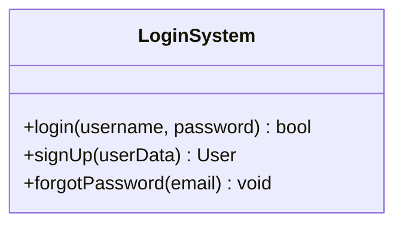
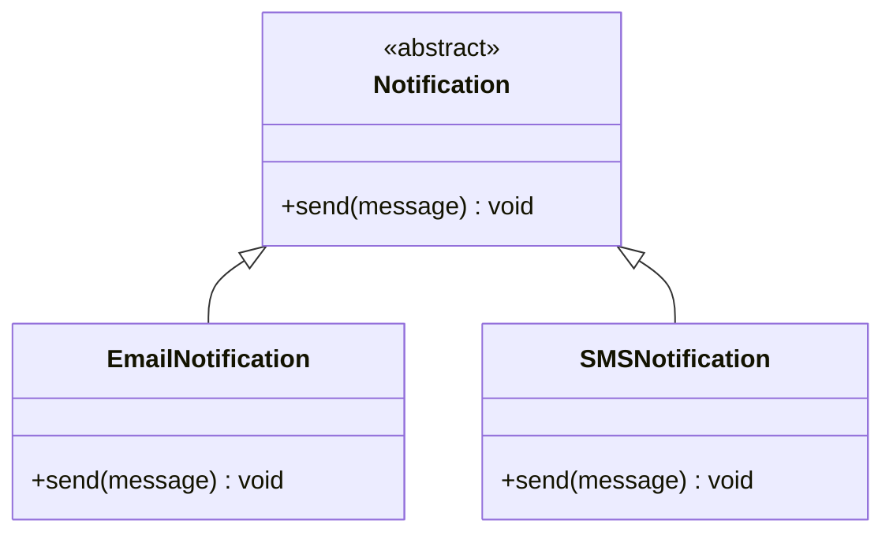

# Introduction to Low-Level Design

## The house analogy

Let us understand this with a simple real-life example. Think of building a house:

- **High-Level Design (HLD)** is like the architect's blueprint — it says where the rooms will be, how big they are, and how they're connected.
- **Low-Level Design (LLD)** is like deciding where the switches go, how the plumbing is laid out, what materials to use, and so on.

So LLD is all about the small, detailed planning you do before actually building the house (or writing code).

## What LLD actually means

A formal definition of Low-Level Design (LLD) goes like this:

LLD is where your code starts to take shape. It's a crucial phase in the software development lifecycle that focuses on the detailed design of individual components or modules of a system.

It involves specifying the internal structure, algorithms, and data structures that will be used to implement the system's functionality. It also acts as a bridge between high-level design and actual coding.

<div style="border-left:4px solid #15448e;background:rgba(21,68,142,0.08);padding:0.6rem 1rem;border-radius:0 0.5rem 0.5rem 0;margin:1.25rem 0">

📘 **The bridge.** HLD decides *what* the modules are and how they connect; LLD decides *how* each module is built — the classes, methods, and data structures. LLD is the step that turns an architecture into something you can actually code.

</div>

```d2
hld: "High-Level Design (HLD)\nmodules · architecture · how they connect" { shape: rectangle }
lld: "Low-Level Design (LLD)\nclasses · methods · data structures · algorithms" { shape: rectangle }
code: "Code\nthe actual implementation" { shape: rectangle }
hld -> lld: "refines into"
lld -> code: "guides"
```

## A concrete example

A simple example of LLD would be a basic login system for a website. Here, LLD would involve designing the individual components — like `login()`, `signUp()`, and `forgotPassword()` — along with their internal behavior.



That class-with-methods view is exactly what LLD produces: not "we need authentication," but *which* class handles it and *what* each method does.

## Key characteristics of LLD

### Granular and code-level

LLD dives deep into the fine details of how each component will function. It defines classes, functions, variables, and data structures.

For example, instead of just saying "we need user authentication," LLD shows how it's built — what classes handle it, what methods validate login, and what happens on failure.

### Implementation-focused

LLD is directly linked to how the actual code will be written. It acts as a blueprint for developers, guiding the logic, flow, and structure of modules. It often includes pseudocode, flow diagrams, and sequence diagrams that show real-time data flow between functions.

### Applies OOP principles

LLD makes heavy use of Object-Oriented Programming (OOP) concepts like classes, inheritance, abstraction, encapsulation, and polymorphism. This helps build modular, reusable, and maintainable systems.

For example, a base `Notification` class might have subclasses like `EmailNotification` and `SMSNotification`, using inheritance and polymorphism so each subtype defines its own way to `send()`.



Note that in LLD, the stakeholders are primarily the people directly involved in the actual implementation of the system — senior software developers, technical leads, managers, and the like.

## HLD vs. LLD

| Aspect | High-Level Design (HLD) | Low-Level Design (LLD) |
| --- | --- | --- |
| Purpose | System overview & modules | Detailed implementation & logic |
| Level of detail | Abstract | Highly detailed |
| Focus | Architecture, modules, interfaces | Class diagrams, methods, details |
| Outcome | Modules, system diagrams | Detailed class/method diagrams |

## Why LLD matters

Beyond its role in the software development lifecycle and its high demand for senior roles, Low-Level Design is crucial for several reasons:

- **Avoids rework:** Clearly defined logic and structure help catch design issues early, reducing costly changes during development.
- **Improves collaboration:** Acts as a shared reference for teams, ensuring everyone understands component behavior and integration points.
- **Promotes scalability:** Well-designed, modular components can handle growth and new features without major redesign.
- **Encourages best practices:** Enforces clean code, design patterns, and OOP principles, leading to maintainable and robust systems.

## Software design principles

Software design principles are guidelines that help developers build systems that are easy to understand, maintain, and extend. They apply at both the high-level and low-level design stages. Three of them are the cornerstone:

- **DRY — Don't Repeat Yourself:** give every piece of knowledge one authoritative home, so a change is one edit.
- **KISS — Keep It Simple, Stupid:** prefer the simplest design that is correct.
- **YAGNI — You Aren't Gonna Need It:** build what is needed now, not what you guess will be needed.

<div style="border-left:4px solid #195045;background:rgba(25,80,69,0.08);padding:0.6rem 1rem;border-radius:0 0.5rem 0.5rem 0;margin:1.25rem 0">

💡 **Insight.** DRY, KISS, and YAGNI all push in the same direction — less duplication, less complexity, and less speculative code — so the system stays easy to change. Each also has a point past which applying it *hurts*.

</div>

The next lesson, [Software Design Principles](/synapse/low-level-design/basics/design-principles), covers each principle in depth, with runnable examples, the cases where it does harm, and how the three principles conflict with each other.

## Summary

- **LLD** is the detailed, code-level design that bridges high-level architecture and actual implementation — it defines the classes, methods, data structures, and algorithms.
- It differs from **HLD**: HLD is the abstract, module-level view of a system; LLD is the concrete, class-and-method-level view.
- It matters because it catches design issues early, gives teams a shared reference, and keeps systems modular and scalable.
- Three principles keep LLD clean: **DRY** (one authoritative representation for each piece of logic), **KISS** (the simplest solution that works), and **YAGNI** (build only what you need now) — each with real exceptions, covered in [Software Design Principles](/synapse/low-level-design/basics/design-principles).
