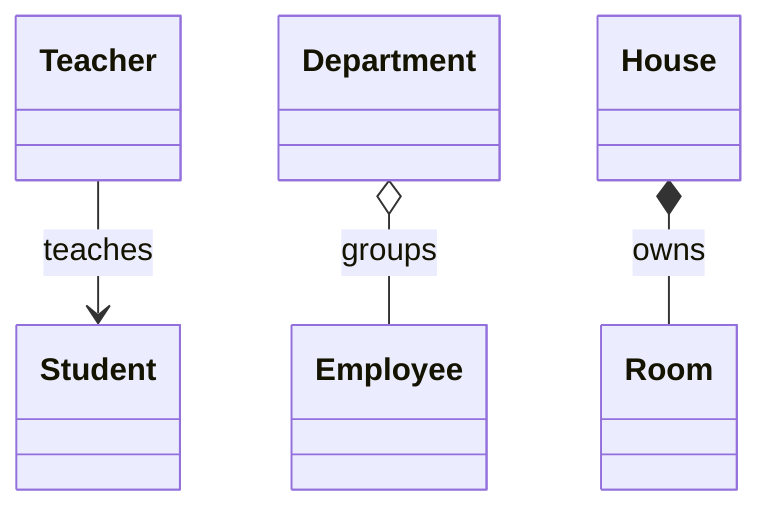

# Relationships & Object Behaviour — Who Owns Whom

Close a customer's account, and their saved addresses should go with it. Close a department, and its employees should certainly not disappear. Both are "one object holds others", yet they need opposite behaviour. Which one you mean decides who creates the held objects, who may change them, whether anyone else can hold them, and what a copy of the holder should contain.

Object-oriented design names three kinds of link between classes. **Association** is any link: one object holds a reference to another and uses it. **Aggregation** is a whole–part association where the parts have their own life: the whole groups them but does not own them. **Composition** is a whole–part association where the whole owns its parts: it creates them, and they end when it ends. These are the lines and diamonds of a [UML class diagram](/synapse/low-level-design/uml/uml), and the reason [composition is often preferred over inheritance](/synapse/low-level-design/oop/encapsulation-access-modifiers-inheritance-polymorphism). The second half of the lesson covers copying an object, which is where those ownership decisions turn into bugs or into correct code.

<div style="border-left:4px solid #195045;background:rgba(25,80,69,0.08);padding:0.6rem 1rem;border-radius:0 0.5rem 0.5rem 0;margin:1.25rem 0">

💡 **The core idea.**

- A field that holds an object holds a **reference** to it. Two objects that hold the same reference share one object, and a change made through either is seen by both.
- **Association** and **aggregation** share on purpose: the held objects were created elsewhere and live on without the holder. **Composition** must *not* share: the whole creates its parts and never lets a reference to them escape.
- A **shallow copy** copies the references, so the copy and the original share everything they point to. A **deep copy** also copies the objects those references point to, as far down as you need.

</div>

This builds on [Abstraction & Interfaces](/synapse/low-level-design/oop/abstraction-interfaces-static-members-inner-classes). Copying only makes sense once you know that a variable holds a *reference* to an object, not the object itself; if that is new, read the Java guide's [References, Equality & the Object Model](/synapse/programming-languages/java/classes-and-objects/references-equality-and-the-object-model) first. Every output below was produced by running the code on Java 21 and Python 3.11.

**You'll be able to:** tell association, aggregation and composition apart by asking who creates the held object and whether it outlives the holder; decide whether a class should keep the collection it is given or take its own copy; keep a composite's parts from escaping through a getter; predict what a shallow copy shares, in Java's `clone()` and Python's `copy.copy`; write a deep copy with a copy constructor, and explain why `clone()` is the weaker tool.

<div style="border-left:4px solid #15448e;background:rgba(21,68,142,0.08);padding:0.6rem 1rem;border-radius:0 0.5rem 0.5rem 0;margin:1.25rem 0">

📘 **How to read the Intuition boxes.** Each one is built in three moves:

1. **The mechanism** — which references exist, and who can reach the object through them.
2. **A concrete bite** — a specific, runnable program where a shared reference produces a surprise.
3. **The earned rule** — the decision heuristic, now justified rather than asserted, plus its cost.

</div>

---

## Table of contents

1. [Association: objects that know each other](#1-association-objects-that-know-each-other)
2. [Aggregation: a whole that groups parts it did not create](#2-aggregation-a-whole-that-groups-parts-it-did-not-create)
3. [Composition: a whole that owns its parts](#3-composition-a-whole-that-owns-its-parts)
4. [Shallow copy: copying the references](#4-shallow-copy-copying-the-references)
5. [Deep copy: copying what the references point to](#5-deep-copy-copying-what-the-references-point-to)
6. [Mental-model summary](#6-mental-model-summary)
7. [Gotcha checklist](#7-gotcha-checklist)
8. [Check yourself](#-check-yourself)
9. [Sources](#-sources)

---

## 1. Association: objects that know each other

An **association** exists when objects of one class hold references to objects of another and use them. Neither object owns the other: each was created on its own, and each can outlive the link. Associations are described by how many objects sit at each end, called their **multiplicity**:

- **One-to-one.** One object is linked to exactly one other. A `Person` holds one `Passport`.
- **One-to-many.** One object is linked to many. A `Teacher` teaches many `Student`s.
- **Many-to-many.** Many objects on each side. A `Course` has many `Student`s, and a `Student` takes many `Course`s.

In code, an association is a field: a single reference for "one", and a collection of references for "many".

```java run
import java.util.ArrayList;
import java.util.List;

// One-to-one: a Person holds a reference to one Passport.
class Passport {
    private final String number;

    Passport(String number) {
        this.number = number;
    }

    String getNumber() {
        return number;
    }
}

class Person {
    private final String name;
    private final Passport passport; // a link: the Passport was created elsewhere

    Person(String name, Passport passport) {
        this.name = name;
        this.passport = passport;
    }

    String describe() {
        return name + " holds passport " + passport.getNumber();
    }
}

class Student {
    private final String name;

    Student(String name) {
        this.name = name;
    }

    String getName() {
        return name;
    }
}

// One-to-many: a Teacher holds references to many Students.
class Teacher {
    private final String name;
    private final List<Student> students;

    Teacher(String name, List<Student> students) {
        this.name = name;
        this.students = students;
    }

    void teach() {
        for (Student s : students) {
            System.out.println(name + " teaches " + s.getName());
        }
    }
}

// Many-to-many: a Course lists many Students, and one Student can be on many Courses.
class Course {
    private final String title;
    private final List<Student> enrolled = new ArrayList<>();

    Course(String title) {
        this.title = title;
    }

    void enrol(Student s) {
        enrolled.add(s);
    }

    String roster() {
        List<String> names = new ArrayList<>();
        for (Student s : enrolled) {
            names.add(s.getName());
        }
        return title + ": " + String.join(", ", names);
    }
}

public class Main {
    public static void main(String[] args) {
        Person alex = new Person("Alex", new Passport("P-4417"));
        System.out.println(alex.describe());

        Student sam = new Student("Sam");
        Student riya = new Student("Riya");
        new Teacher("Mrs. Rao", List.of(sam, riya)).teach();

        Course maths = new Course("Maths");
        Course physics = new Course("Physics");
        maths.enrol(sam);
        maths.enrol(riya);
        physics.enrol(sam); // the same Sam object, on a second course
        System.out.println(maths.roster());
        System.out.println(physics.roster());
    }
}
```

```python run
# One-to-one: a Person holds a reference to one Passport.
class Passport:
    def __init__(self, number: str) -> None:
        self._number = number

    @property
    def number(self) -> str:
        return self._number


class Person:
    def __init__(self, name: str, passport: Passport) -> None:
        self._name = name
        self._passport = passport  # a link: the Passport was created elsewhere

    def describe(self) -> str:
        return f"{self._name} holds passport {self._passport.number}"


class Student:
    def __init__(self, name: str) -> None:
        self.name = name


# One-to-many: a Teacher holds references to many Students.
class Teacher:
    def __init__(self, name: str, students: list[Student]) -> None:
        self._name = name
        self._students = students

    def teach(self) -> None:
        for s in self._students:
            print(f"{self._name} teaches {s.name}")


# Many-to-many: a Course lists many Students, and one Student can be on many Courses.
class Course:
    def __init__(self, title: str) -> None:
        self._title = title
        self._enrolled: list[Student] = []

    def enrol(self, s: Student) -> None:
        self._enrolled.append(s)

    def roster(self) -> str:
        return f"{self._title}: " + ", ".join(s.name for s in self._enrolled)


alex = Person("Alex", Passport("P-4417"))
print(alex.describe())

sam = Student("Sam")
riya = Student("Riya")
Teacher("Mrs. Rao", [sam, riya]).teach()

maths = Course("Maths")
physics = Course("Physics")
maths.enrol(sam)
maths.enrol(riya)
physics.enrol(sam)  # the same Sam object, on a second course
print(maths.roster())
print(physics.roster())
```

**Output:**
```
Alex holds passport P-4417
Mrs. Rao teaches Sam
Mrs. Rao teaches Riya
Maths: Sam, Riya
Physics: Sam
```

**Analysis.** Every link here is a field holding a reference to an object that was created somewhere else. Sam is one object, referred to by two courses and by the teacher's list. Nothing in `Course` or `Teacher` creates a `Student`, and dropping a course would not affect any student. That independence is what makes these links associations rather than ownership.

**Intuition.**
*Mechanism.* A field that holds an object holds a *reference* to it, never a private copy. When a constructor stores a parameter in a field, the new object and the caller both hold references to the same object. For a single immutable object like a `Passport` with a `final` number, that sharing is harmless. For a mutable collection, it means the caller can still change what your object sees.

*Concrete bite.* `Teacher` stores the list it is given. If the caller reuses that list afterwards, for example to build next term's group, the teacher silently starts teaching the new students too:

```java run
import java.util.ArrayList;
import java.util.List;

class Student {
    private final String name;

    Student(String name) {
        this.name = name;
    }

    String getName() {
        return name;
    }
}

// ⚠️ ANTI-PATTERN — keeps the caller's list, so the caller can still change it. Do not copy it.
class SharingTeacher {
    private final List<Student> students;

    SharingTeacher(List<Student> students) {
        this.students = students;
    }

    String names() {
        List<String> out = new ArrayList<>();
        for (Student s : students) out.add(s.getName());
        return String.join(", ", out);
    }
}

// Takes its own copy, so later changes to the caller's list don't reach it.
class CopyingTeacher {
    private final List<Student> students;

    CopyingTeacher(List<Student> students) {
        this.students = List.copyOf(students); // defensive copy
    }

    String names() {
        List<String> out = new ArrayList<>();
        for (Student s : students) out.add(s.getName());
        return String.join(", ", out);
    }
}

public class Main {
    public static void main(String[] args) {
        List<Student> group = new ArrayList<>();
        group.add(new Student("Sam"));
        group.add(new Student("Riya"));

        SharingTeacher rao = new SharingTeacher(group);
        CopyingTeacher iyer = new CopyingTeacher(group);

        // The caller reuses its list to build next term's group.
        group.add(new Student("Jo"));
        group.add(new Student("Kim"));

        System.out.println("sharing teacher teaches: " + rao.names());
        System.out.println("copying teacher teaches: " + iyer.names());
    }
}
```

```python run
class Student:
    def __init__(self, name: str) -> None:
        self.name = name


# ⚠️ ANTI-PATTERN — keeps the caller's list, so the caller can still change it. Do not copy it.
class SharingTeacher:
    def __init__(self, students: list[Student]) -> None:
        self._students = students

    def names(self) -> str:
        return ", ".join(s.name for s in self._students)


# Takes its own copy, so later changes to the caller's list don't reach it.
class CopyingTeacher:
    def __init__(self, students: list[Student]) -> None:
        self._students = tuple(students)  # defensive copy

    def names(self) -> str:
        return ", ".join(s.name for s in self._students)


group = [Student("Sam"), Student("Riya")]

rao = SharingTeacher(group)
iyer = CopyingTeacher(group)

# The caller reuses its list to build next term's group.
group.append(Student("Jo"))
group.append(Student("Kim"))

print("sharing teacher teaches:", rao.names())
print("copying teacher teaches:", iyer.names())
```

**Output:**
```
sharing teacher teaches: Sam, Riya, Jo, Kim
copying teacher teaches: Sam, Riya
```

Nobody called a method on `rao`, yet its class doubled. A copy made when the object is constructed is called a **defensive copy**: `List.copyOf` in Java and `tuple(...)` in Python give the teacher a collection that the caller cannot reach. Both copy only the list. The `Student` objects inside are still shared, which section 4 explains.

<div style="border-left:4px solid #195045;background:rgba(25,80,69,0.08);padding:0.6rem 1rem;border-radius:0 0.5rem 0.5rem 0;margin:1.25rem 0">

💡 **Earned rule.** When a constructor or setter receives a mutable collection, decide on purpose whether your object should see the caller's later changes. Usually it should not, so store a copy (`List.copyOf`, `tuple(...)`). Keep the caller's collection only when sharing is the point, and say so in the documentation.

The cost is one copy per call, which takes time and memory in proportion to the collection's size. And the caller can no longer change your object through its own list; it has to call one of your methods, which is usually what you want.

</div>

---

## 2. Aggregation: a whole that groups parts it did not create

**Aggregation** is a whole–part association in which the parts have their own life. The whole groups them, but it did not create them, and it does not end them. A `Department` groups `Employee`s: the employees were hired by the company, they exist before the department is formed, and they still exist after it is dissolved. Because the department doesn't own them, nothing stops an employee from being in two departments at once.

```java run
import java.util.ArrayList;
import java.util.List;

class Employee {
    private final String name;
    private String title;

    Employee(String name, String title) {
        this.name = name;
        this.title = title;
    }

    void promote(String newTitle) {
        this.title = newTitle;
    }

    @Override
    public String toString() {
        return name + " (" + title + ")";
    }
}

// Aggregation: the Department groups Employees that were created elsewhere.
class Department {
    private final String name;
    private final List<Employee> members = new ArrayList<>();

    Department(String name) {
        this.name = name;
    }

    void add(Employee e) {
        members.add(e);
    }

    String describe() {
        return name + ": " + Main.names(members);
    }
}

public class Main {
    static String names(List<Employee> people) {
        List<String> out = new ArrayList<>();
        for (Employee e : people) out.add(e.toString());
        return String.join(", ", out);
    }

    public static void main(String[] args) {
        // The company's staff list, not any department, keeps the employees alive.
        Employee alex = new Employee("Alex", "Engineer");
        Employee sam = new Employee("Sam", "Engineer");
        List<Employee> staff = List.of(alex, sam);

        Department engineering = new Department("Engineering");
        engineering.add(alex);
        engineering.add(sam);
        Department guild = new Department("Security guild");
        guild.add(alex); // the same Alex, in a second department

        alex.promote("Lead");
        System.out.println(engineering.describe());
        System.out.println(guild.describe());

        engineering = null; // dissolve the department
        System.out.println("Engineering dissolved. Staff: " + names(staff));
    }
}
```

```python run
class Employee:
    def __init__(self, name: str, title: str) -> None:
        self._name = name
        self._title = title

    def promote(self, new_title: str) -> None:
        self._title = new_title

    def __str__(self) -> str:
        return f"{self._name} ({self._title})"


def names(people: list[Employee]) -> str:
    return ", ".join(str(e) for e in people)


# Aggregation: the Department groups Employees that were created elsewhere.
class Department:
    def __init__(self, name: str) -> None:
        self._name = name
        self._members: list[Employee] = []

    def add(self, e: Employee) -> None:
        self._members.append(e)

    def describe(self) -> str:
        return f"{self._name}: {names(self._members)}"


# The company's staff list, not any department, keeps the employees alive.
alex = Employee("Alex", "Engineer")
sam = Employee("Sam", "Engineer")
staff = [alex, sam]

engineering = Department("Engineering")
engineering.add(alex)
engineering.add(sam)
guild = Department("Security guild")
guild.add(alex)  # the same Alex, in a second department

alex.promote("Lead")
print(engineering.describe())
print(guild.describe())

engineering = None  # dissolve the department
print("Engineering dissolved. Staff:", names(staff))
```

**Output:**
```
Engineering: Alex (Lead), Sam (Engineer)
Security guild: Alex (Lead)
Engineering dissolved. Staff: Alex (Lead), Sam (Engineer)
```

**Analysis.** One `promote` call changed what both departments print, because both hold a reference to the same `Alex` object. Setting `engineering` to `null` (or `None`) removed the only reference to the department, but the employees are still reachable through `staff`, so they live on. Neither Java nor Python has a statement that destroys an object: an object stays alive for as long as something can reach it, and the garbage collector reclaims it only after nothing can.

**Intuition.**
*Mechanism.* In aggregation the parts are created outside the whole and passed in, so other objects can hold references to them too. The whole is one of possibly several holders, and the part's life is decided by whoever else still refers to it. UML deliberately leaves the precise meaning of this "shared" aggregation to the modeller and the application area <abbr title="OMG Unified Modeling Language 2.5.1, §9.9.1 AggregationKind, literal shared">[1]</abbr>, so treat the hollow diamond as a statement of intent: "groups, does not own".

*Concrete bite.* Alex is in Engineering and in the Security guild at once, and promoting Alex once changes both listings. That sharing is exactly what aggregation allows and composition forbids. If the departments had each made their own `Employee` for Alex, the promotion would have shown up in only one of them, and the company would have two disagreeing records of one person.

<div style="border-left:4px solid #195045;background:rgba(25,80,69,0.08);padding:0.6rem 1rem;border-radius:0 0.5rem 0.5rem 0;margin:1.25rem 0">

💡 **Earned rule.** If a part has its own identity and life (an employee, a book in a library, a player in a team), let the whole *receive* it rather than create it, and expect it to be shared and changed by others. Keep the part's own rules inside the part (here, `promote`), because the whole cannot police changes made through other references.

The cost is that the whole cannot guarantee anything about its parts' state: any holder of a reference can change them. When the whole needs that guarantee, you want composition instead.

</div>

---

## 3. Composition: a whole that owns its parts

**Composition** is a whole–part relationship in which the whole owns its parts. UML calls it *composite aggregation*: a part belongs to at most one composite at a time, and when the composite is deleted, its parts are deleted with it <abbr title="OMG Unified Modeling Language 2.5.1, §9.5.3 Semantics (composite aggregation)">[1]</abbr>. A `House` and its `Room`s are the classic example: the house creates its rooms, a room is in only one house, and a room without its house makes no sense.

In a garbage-collected language that last guarantee has a catch. Nothing deletes the rooms when the house goes; they disappear only when *nothing* refers to them any more. Here is a `House` that hands out its own list:

```java run
import java.util.ArrayList;
import java.util.List;

class Room {
    private final String name;

    Room(String name) {
        this.name = name;
    }

    String getName() {
        return name;
    }
}

// ⚠️ ANTI-PATTERN — getRooms() returns the House's own list. Do not copy it.
class House {
    private final List<Room> rooms = new ArrayList<>();

    House() {
        rooms.add(new Room("Living Room")); // the House creates its parts
        rooms.add(new Room("Bedroom"));
    }

    List<Room> getRooms() {
        return rooms;
    }
}

public class Main {
    public static void main(String[] args) {
        House house = new House();

        // Outside code changes the house without asking it.
        house.getRooms().add(new Room("Neighbour's garage"));
        System.out.println("rooms: " + house.getRooms().size());

        // Outside code keeps a part, then the whole goes away.
        Room kept = house.getRooms().get(0);
        house = null;
        System.out.println("house dropped, still holding: " + kept.getName());
    }
}
```

```python run
class Room:
    def __init__(self, name: str) -> None:
        self.name = name


# ⚠️ ANTI-PATTERN — the rooms property returns the House's own list. Do not copy it.
class House:
    def __init__(self) -> None:
        self._rooms = [Room("Living Room"), Room("Bedroom")]  # the House creates its parts

    @property
    def rooms(self) -> list[Room]:
        return self._rooms


house = House()

# Outside code changes the house without asking it.
house.rooms.append(Room("Neighbour's garage"))
print("rooms:", len(house.rooms))

# Outside code keeps a part, then the whole goes away.
kept = house.rooms[0]
house = None
print("house dropped, still holding:", kept.name)
```

**Output:**
```
rooms: 3
house dropped, still holding: Living Room
```

The house now has a room it never created, and a room has outlived its house. Both happened because the getter returned a reference to the house's own list. The fix keeps every change inside the `House`: rooms are added only through a method that creates the `Room` and checks the house's rule, and the getter returns a read-only view.

```java run
import java.util.ArrayList;
import java.util.Collections;
import java.util.List;

// Immutable, so a Room reference that escapes cannot change the house.
class Room {
    private final String name;

    Room(String name) {
        this.name = name;
    }

    String getName() {
        return name;
    }
}

class House {
    private static final int MAX_ROOMS = 4; // a rule only the House can enforce
    private final List<Room> rooms = new ArrayList<>();

    House() {
        addRoom("Living Room");
        addRoom("Bedroom");
    }

    // The only way in: the House creates the Room itself and checks its rule.
    void addRoom(String name) {
        if (rooms.size() == MAX_ROOMS) {
            throw new IllegalStateException("a house has at most " + MAX_ROOMS + " rooms");
        }
        rooms.add(new Room(name));
    }

    // A read-only view: callers can look, but cannot add or remove.
    List<Room> getRooms() {
        return Collections.unmodifiableList(rooms);
    }
}

public class Main {
    public static void main(String[] args) {
        House house = new House();
        try {
            house.getRooms().add(new Room("Neighbour's garage"));
        } catch (UnsupportedOperationException e) {
            System.out.println("add through getRooms() refused: " + e.getClass().getSimpleName());
        }

        house.addRoom("Study");
        house.addRoom("Kitchen");
        try {
            house.addRoom("Attic");
        } catch (IllegalStateException e) {
            System.out.println("addRoom refused: " + e.getMessage());
        }
        System.out.println("rooms: " + house.getRooms().size());
    }
}
```

```python run
from dataclasses import dataclass


# Immutable, so a Room reference that escapes cannot change the house.
@dataclass(frozen=True)
class Room:
    name: str


class House:
    MAX_ROOMS = 4  # a rule only the House can enforce

    def __init__(self) -> None:
        self._rooms: list[Room] = []
        self.add_room("Living Room")
        self.add_room("Bedroom")

    # The only way in: the House creates the Room itself and checks its rule.
    def add_room(self, name: str) -> None:
        if len(self._rooms) == self.MAX_ROOMS:
            raise ValueError(f"a house has at most {self.MAX_ROOMS} rooms")
        self._rooms.append(Room(name))

    # A read-only snapshot: callers can look, but cannot add or remove.
    @property
    def rooms(self) -> tuple[Room, ...]:
        return tuple(self._rooms)


house = House()
try:
    house.rooms.append(Room("Neighbour's garage"))
except AttributeError as e:
    print("add through rooms refused:", type(e).__name__)

house.add_room("Study")
house.add_room("Kitchen")
try:
    house.add_room("Attic")
except ValueError as e:
    print("add_room refused:", e)
print("rooms:", len(house.rooms))
```

**Output (Java):**
```
add through getRooms() refused: UnsupportedOperationException
addRoom refused: a house has at most 4 rooms
rooms: 4
```

**Output (Python):**
```
add through rooms refused: AttributeError
add_room refused: a house has at most 4 rooms
rooms: 4
```

**Analysis.** The outside `add` now fails, and the only way to add a room is through `addRoom`, which enforces the four-room rule. Java's `Collections.unmodifiableList` returns a *view*: reads go through to the house's real list, so the view shows rooms added later, and every attempt to modify it throws `UnsupportedOperationException` <abbr title="Java SE 21 API, java.util.Collections.unmodifiableList">[6]</abbr>. Python's `tuple(...)` is a *snapshot*: a tuple has no `append`, so the attempt raises `AttributeError`, and a tuple fetched before `add_room("Study")` would not show the study.

**Intuition.**
*Mechanism.* Composition is a promise about references: the whole creates its parts, and no reference to a part, or to the collection holding them, is handed out in a form that lets someone else change or keep it. Keep that promise and the part really does live and die with the whole, because the whole holds the only reference. Break it, as the first program did, and the part becomes shared, which is aggregation whatever the class diagram says.

*Concrete bite.* In the first program, `kept` still printed `Living Room` after the house was dropped. In a garbage-collected language, "the part dies with the whole" is only true if no reference to the part escapes. The fixed version still lets a `Room` reference escape through the view, and that is safe only because `Room` is immutable: a caller can hold it, but cannot change the house through it. If `Room` were mutable (say, with a `setArea`), the getter would have to return copies, or only the data the caller needs, such as the room names.

<div style="border-left:4px solid #195045;background:rgba(25,80,69,0.08);padding:0.6rem 1rem;border-radius:0 0.5rem 0.5rem 0;margin:1.25rem 0">

💡 **Earned rule.** For a composite, create the parts inside the whole, add them only through the whole's own methods, and never return the internal collection. Return a read-only view (`Collections.unmodifiableList`), a copy (`List.copyOf`, `tuple(...)`), or only the data callers need. Make the parts immutable where you can, so a reference that does escape is harmless.

The cost is more methods on the whole (`addRoom`, `removeRoom`, and so on) instead of one getter, and a copy per call if you return copies. That is the price of being able to enforce a rule like "at most four rooms".

</div>

### One class, several relationships

A real class usually takes part in several kinds of relationship at once. A `Library` *aggregates* `Book`s: a book exists before it is catalogued and can be moved to another library. A `Book` is *composed* of `Chapter`s: a chapter is created as part of one book and makes no sense without it. The same `Book` class is a part in one relationship and a whole in another, and its code should follow both decisions: receive books in `Library.add(Book)`, but create chapters inside `Book`.

### Comparing the three

| Aspect | Association | Aggregation | Composition |
| --- | --- | --- | --- |
| Meaning | one object uses another | a whole groups parts | a whole owns its parts |
| Who creates the held object | someone else | someone else | the whole |
| Can the held object be shared? | yes | yes | no: at most one whole at a time |
| Does it outlive the holder? | yes | yes | no, provided no reference escapes |
| UML notation | plain line or arrow | line with a hollow diamond at the whole | line with a filled diamond at the whole |
| Example | Teacher and Student | Department and Employee | House and Room, Car and Engine |

In a UML class diagram the three look like this; the [UML lesson](/synapse/low-level-design/uml/uml) covers the notation in full.



### Your Turn — Practice: Composition

A `University` owns its `College`s: it creates each one inside `addCollege`, so no caller ever holds a `College` that the university doesn't know about.

````problem
Design a composition relationship between a `University` and its `College`s.

**Class `College`**

- Attributes: `name` (`String`), `id` (`String`).

**Class `University`**

- Attributes: `name` (`String`), `colleges` (a list of `College` objects).
- `addCollege(String collegeName, String collegeId)` — creates a `College` and adds it to the university. The caller passes the college's details, never a `College` object.
- `displayDetails()` — prints `University Name : <name>`, then, for each college in the order it was added, `College Name : <name>` and `College ID : <id>` on separate lines.

**Input format.** Three lines on standard input: the university's name, a comma-separated list of college names, and a comma-separated list of college ids (matched by position). The provided `Main` creates the university, adds each college, and calls `displayDetails()`.

**Example 1** — name `Global_University` · colleges `COEP, PICT` · ids `CO8543, PI9514`

```text
University Name : Global_University
College Name : COEP
College ID : CO8543
College Name : PICT
College ID : PI9514
```
````

```java run
import java.util.*;

class College {
    private final String name;
    private final String id;

    College(String name, String id) {
        this.name = name;
        this.id = id;
    }

    String getName() {
        return name;
    }

    String getId() {
        return id;
    }
}

class University {
    private final String name;
    private final List<College> colleges = new ArrayList<>();

    University(String name) {
        this.name = name;
    }

    void addCollege(String collegeName, String collegeId) {
        // TODO: create the College here, so the University owns it, and add it to the list
    }

    void displayDetails() {
        // TODO: print "University Name : <name>",
        // then "College Name : <name>" and "College ID : <id>" for each college
    }
}

// The driver is complete — implement addCollege() and displayDetails() above.
class Main {
    public static void main(String[] args) {
        Scanner sc = new Scanner(System.in);
        String name = sc.nextLine().trim();
        String[] names = sc.nextLine().split(",");
        String[] ids = sc.nextLine().split(",");

        University university = new University(name);
        for (int i = 0; i < names.length; i++) {
            university.addCollege(names[i].trim(), ids[i].trim());
        }
        university.displayDetails();
    }
}
```

```testcases
{
  "args": [
    { "id": "name", "label": "University name", "type": "string" },
    { "id": "collegeNames", "label": "College names (comma-separated)", "type": "string" },
    { "id": "collegeIds", "label": "College ids (comma-separated)", "type": "string" }
  ],
  "cases": [
    { "args": { "name": "Global_University", "collegeNames": "COEP,PICT,VJTI,WCE,PCCOE", "collegeIds": "CO8543,PI9514,VJ8643,VF569,PC9246" }, "expected": "University Name : Global_University\nCollege Name : COEP\nCollege ID : CO8543\nCollege Name : PICT\nCollege ID : PI9514\nCollege Name : VJTI\nCollege ID : VJ8643\nCollege Name : WCE\nCollege ID : VF569\nCollege Name : PCCOE\nCollege ID : PC9246" },
    { "args": { "name": "City_University", "collegeNames": "Arts", "collegeIds": "AR001" }, "expected": "University Name : City_University\nCollege Name : Arts\nCollege ID : AR001" }
  ]
}
```

````editorial
The composition shows in the signature of `addCollege`: it takes a name and an id, not a `College`, so the `College` object is created inside the `University` and the only reference to it is in the university's private list. No caller can share a college between two universities or keep one after the university is gone. `displayDetails()` walks the list in insertion order, which `ArrayList` preserves.

```java solution
import java.util.*;

class College {
    private final String name;
    private final String id;

    College(String name, String id) {
        this.name = name;
        this.id = id;
    }

    String getName() {
        return name;
    }

    String getId() {
        return id;
    }
}

class University {
    private final String name;
    private final List<College> colleges = new ArrayList<>();

    University(String name) {
        this.name = name;
    }

    void addCollege(String collegeName, String collegeId) {
        colleges.add(new College(collegeName, collegeId));
    }

    void displayDetails() {
        System.out.println("University Name : " + name);
        for (College c : colleges) {
            System.out.println("College Name : " + c.getName());
            System.out.println("College ID : " + c.getId());
        }
    }
}

class Main {
    public static void main(String[] args) {
        Scanner sc = new Scanner(System.in);
        String name = sc.nextLine().trim();
        String[] names = sc.nextLine().split(",");
        String[] ids = sc.nextLine().split(",");

        University university = new University(name);
        for (int i = 0; i < names.length; i++) {
            university.addCollege(names[i].trim(), ids[i].trim());
        }
        university.displayDetails();
    }
}
```
````

---

## 4. Shallow copy: copying the references

**Object cloning** means creating a new object with the same state as an existing one. The new object is a separate object, at a different place in memory, so changing one of its *fields* does not change the original's. Whether changing an object *that a field refers to* affects the original depends on how deep the copy went.

There are a few good reasons to copy an object:

- **Independence.** You need a version you can change without affecting the original, as the defensive copy in section 1 did.
- **Preserving state.** You keep a snapshot of an object's current state, to restore later for undo, or to compare against.
- **Prototyping.** You make new objects by copying a configured example, which is the Prototype pattern in [Creational Design Patterns](/synapse/low-level-design/design-patterns/creational-design-patterns).

To get a modifiable version of an unmodifiable collection, you don't clone it; you copy its elements into a new mutable collection, such as `new ArrayList<>(list)` in Java or `list(t)` in Python.

### How Java's `clone()` works

Java's built-in copying has two parts.

- **`Cloneable`** is a *marker interface*: it has no methods. Implementing it tells `Object.clone()` that it is legal to make a field-for-field copy of objects of this class. If a class doesn't implement it, `Object.clone()` throws `CloneNotSupportedException` instead <abbr title="Java SE 21 API, java.lang.Cloneable">[3]</abbr>.
- **`Object.clone()`** creates a new object of the same class and sets each of its fields to the same value as the original's, as if by assignment. A primitive field gets the same number. A reference field gets the same reference, so the copy refers to the *same* object as the original. The Javadoc calls this a "shallow copy" of the object, not a "deep copy" <abbr title="Java SE 21 API, java.lang.Object.clone()">[2]</abbr>. It does this without running any constructor.

A **shallow copy** is a new object whose fields hold the same values as the original's. For a reference field, that means the same reference: the copy and the original point at one shared object.

```java run
class Address {
    String city;

    Address(String city) {
        this.city = city;
    }
}

// Implementing Cloneable allows Object.clone() to copy a Person.
class Person implements Cloneable {
    String name;     // refers to an immutable String
    Address address; // refers to a mutable Address

    Person(String name, Address address) {
        this.name = name;
        this.address = address;
    }

    @Override
    public Person clone() {
        try {
            return (Person) super.clone(); // field-for-field copy: a shallow copy
        } catch (CloneNotSupportedException e) {
            throw new AssertionError(e); // cannot happen: Person implements Cloneable
        }
    }
}

// Does not implement Cloneable, so Object.clone() refuses to copy it.
class Ticket {
    Ticket tryClone() throws CloneNotSupportedException {
        return (Ticket) super.clone();
    }
}

public class Main {
    public static void main(String[] args) {
        Person rahul = new Person("Rahul", new Address("Mumbai"));
        Person copy = rahul.clone();

        System.out.println("same Person object? " + (copy == rahul));
        System.out.println("same Address object? " + (copy.address == rahul.address));

        copy.address.city = "New Delhi"; // change the copy's address...
        System.out.println(rahul.name + " lives in " + rahul.address.city); // ...and the original moves too
        System.out.println(copy.name + " lives in " + copy.address.city);

        try {
            new Ticket().tryClone();
        } catch (CloneNotSupportedException e) {
            System.out.println("Ticket: " + e.getClass().getSimpleName());
        }
    }
}
```

```python run
import copy


class Address:
    def __init__(self, city: str) -> None:
        self.city = city


class Person:
    def __init__(self, name: str, address: Address) -> None:
        self.name = name        # refers to an immutable str
        self.address = address  # refers to a mutable Address


rahul = Person("Rahul", Address("Mumbai"))
dup = copy.copy(rahul)  # shallow: a new Person, the same Address

print("same Person object?", dup is rahul)
print("same Address object?", dup.address is rahul.address)

dup.address.city = "New Delhi"  # change the copy's address...
print(f"{rahul.name} lives in {rahul.address.city}")  # ...and the original moves too
print(f"{dup.name} lives in {dup.address.city}")
```

**Output (Java):**
```
same Person object? false
same Address object? true
Rahul lives in New Delhi
Rahul lives in New Delhi
Ticket: CloneNotSupportedException
```

**Output (Python):**
```
same Person object? False
same Address object? True
Rahul lives in New Delhi
Rahul lives in New Delhi
```

**Analysis.** The copy is a different `Person`, but its `address` field holds the same reference as the original's, so moving the copy to New Delhi moved Rahul too. `Ticket` doesn't implement `Cloneable`, so `Object.clone()` threw `CloneNotSupportedException`. Python needs no opt-in: `copy.copy` makes a shallow copy of any object. The documentation describes it as constructing a new object and then inserting into it references to the objects found in the original <abbr title="Python 3 documentation, copy — Shallow and deep copy operations">[5]</abbr>.

Reading the Java `clone()` line by line:

- **`implements Cloneable`** is what makes `super.clone()` succeed. Without it, the same call throws, as `Ticket` showed.
- **`public Person clone()`** overrides `Object.clone()`, which is `protected` and returns `Object`. Making the override `public` lets other classes call it, and returning `Person` (a *covariant return type*) spares every caller a cast. Bloch recommends exactly this form <abbr title="Joshua Bloch, Effective Java, 3rd ed., Item 13: Override clone judiciously">[4]</abbr>. Older code often declares `protected Object clone() throws CloneNotSupportedException` instead, which forces a cast and a `try` on every caller.
- **The `try`/`catch`** is needed because `Object.clone()` declares the checked `CloneNotSupportedException`. Since `Person` implements `Cloneable`, it can't actually be thrown, so the handler turns it into an `AssertionError`.
- **`super.clone()`** does the copying. `name` refers to the same `String` as before, which is harmless because a `String` cannot be changed. `address` refers to the same `Address`, which is the problem, because an `Address` can be changed.

**Intuition.**
*Mechanism.* A shallow copy duplicates exactly one object, the one you copied. Everything its fields refer to is shared between the copy and the original. A shared object that cannot change (a `String`, an `Integer`, a `LocalDate`) can never cause a surprise. A shared object that can change makes the two copies one object as far as that state is concerned.

*Concrete bite.* Someone takes a copy of a customer record to try out a change of address, intending to throw the copy away if the customer cancels. With a shallow copy, the "trial" move to New Delhi has already moved the real customer. Nothing threw an error, and the copy and the original look like two separate records until you change something they share.

<div style="border-left:4px solid #195045;background:rgba(25,80,69,0.08);padding:0.6rem 1rem;border-radius:0 0.5rem 0.5rem 0;margin:1.25rem 0">

💡 **Earned rule.** A shallow copy is enough when every field is a primitive or refers to an immutable object. As soon as a field refers to something mutable (an `Address`, a `List`, an array, a `Date`), a shallow copy shares it, and you need to copy that field too.

The cost of copying more is time, memory, and the code that does it. The cost of copying less is a bug that appears only when someone changes the shared object, often far from where the copy was made.

</div>

---

## 5. Deep copy: copying what the references point to

A **deep copy** also copies the objects that the fields refer to, so the copy shares no mutable state with the original. Java's `Object.clone()` never does this for you; each mutable field has to be copied by hand. There are two ways to write it in Java. A recursive `clone()` makes a shallow copy and then replaces each mutable field with a copy of its own. A **copy constructor** is an ordinary constructor that takes an object of the same class and builds the copy field by field. Python's `copy.deepcopy` copies the whole object graph for you, and you can also write the copy by hand.

```java run
class Address implements Cloneable {
    String city;

    Address(String city) {
        this.city = city;
    }

    // Copy constructor.
    Address(Address other) {
        this(other.city);
    }

    @Override
    public Address clone() {
        try {
            return (Address) super.clone(); // enough: the only field is an immutable String
        } catch (CloneNotSupportedException e) {
            throw new AssertionError(e);
        }
    }
}

class Person implements Cloneable {
    String name;
    Address address;

    Person(String name, Address address) {
        this.name = name;
        this.address = address;
    }

    // Copy constructor: builds the copy through an ordinary constructor.
    Person(Person other) {
        this(other.name, new Address(other.address));
    }

    // Recursive clone(): shallow copy first, then replace the mutable field.
    @Override
    public Person clone() {
        try {
            Person copy = (Person) super.clone();
            copy.address = address.clone();
            return copy;
        } catch (CloneNotSupportedException e) {
            throw new AssertionError(e);
        }
    }
}

public class Main {
    public static void main(String[] args) {
        Person rahul = new Person("Rahul", new Address("Mumbai"));
        Person cloned = rahul.clone();
        Person constructed = new Person(rahul);

        cloned.address.city = "New Delhi";
        constructed.address.city = "Pune";

        System.out.println(rahul.name + " lives in " + rahul.address.city);
        System.out.println(cloned.name + " lives in " + cloned.address.city);
        System.out.println(constructed.name + " lives in " + constructed.address.city);
    }
}
```

```python run
import copy


class Address:
    def __init__(self, city: str) -> None:
        self.city = city


class Person:
    def __init__(self, name: str, address: Address) -> None:
        self.name = name
        self.address = address

    # The hand-written equivalent of a copy constructor.
    @classmethod
    def copy_of(cls, other: "Person") -> "Person":
        return cls(other.name, Address(other.address.city))


rahul = Person("Rahul", Address("Mumbai"))
deep = copy.deepcopy(rahul)
constructed = Person.copy_of(rahul)

deep.address.city = "New Delhi"
constructed.address.city = "Pune"

print(f"{rahul.name} lives in {rahul.address.city}")
print(f"{deep.name} lives in {deep.address.city}")
print(f"{constructed.name} lives in {constructed.address.city}")
```

**Output:**
```
Rahul lives in Mumbai
Rahul lives in New Delhi
Rahul lives in Pune
```

**Analysis.** All three objects now have their own `Address`, so each city change stayed where it was made. `Address.clone()` can simply call `super.clone()`, because its only field refers to an immutable `String`; a shallow copy of an `Address` is already a complete copy. `copy.deepcopy` needed no code at all: it copies recursively, and it keeps a memo of the objects it has already copied, so an object referred to twice is copied once, and cycles don't loop forever <abbr title="Python 3 documentation, copy — Shallow and deep copy operations">[5]</abbr>.

**Intuition.**
*Mechanism.* A deep copy is only as deep as the code that makes it. `super.clone()` copies the top level, and each mutable field is then copied by an explicit line of code. A copy constructor is the same idea written as a constructor: it assigns every field, which means it runs the class's normal construction rules and works with `final` fields. Bloch concludes that a copy constructor or a static copy factory is usually the better approach, because `Cloneable` relies on a method the interface doesn't declare, creates objects without a constructor, and conflicts with `final` fields that refer to mutable objects <abbr title="Joshua Bloch, Effective Java, 3rd ed., Item 13: Override clone judiciously">[4]</abbr>.

*Concrete bite.* A deep copy that was correct when it was written goes wrong when someone adds a field. Here `phones` was added to `Person` after `clone()` was written, and nobody updated `clone()`:

```java run
import java.util.ArrayList;
import java.util.List;

class Address implements Cloneable {
    String city;

    Address(String city) {
        this.city = city;
    }

    @Override
    public Address clone() {
        try {
            return (Address) super.clone();
        } catch (CloneNotSupportedException e) {
            throw new AssertionError(e);
        }
    }
}

// ⚠️ ANTI-PATTERN — clone() was written before `phones` existed and never updated. Do not copy it.
class Person implements Cloneable {
    String name;
    Address address;
    List<String> phones = new ArrayList<>(); // added later

    Person(String name, Address address) {
        this.name = name;
        this.address = address;
    }

    @Override
    public Person clone() {
        try {
            Person copy = (Person) super.clone();
            copy.address = address.clone(); // phones is still shared
            return copy;
        } catch (CloneNotSupportedException e) {
            throw new AssertionError(e);
        }
    }
}

public class Main {
    public static void main(String[] args) {
        Person rahul = new Person("Rahul", new Address("Mumbai"));
        rahul.phones.add("+91 98200 00001");

        Person copy = rahul.clone();
        copy.address.city = "New Delhi";
        copy.phones.add("+91 98100 00002");

        System.out.println("original city:   " + rahul.address.city);
        System.out.println("original phones: " + rahul.phones);
    }
}
```

```python run
import copy


class Address:
    def __init__(self, city: str) -> None:
        self.city = city


# ⚠️ ANTI-PATTERN — copy_of() was written before `phones` existed and never updated. Do not copy it.
class Person:
    def __init__(self, name: str, address: Address) -> None:
        self.name = name
        self.address = address
        self.phones: list[str] = []  # added later

    def copy_of(self) -> "Person":
        dup = copy.copy(self)
        dup.address = Address(self.address.city)  # phones is still shared
        return dup


rahul = Person("Rahul", Address("Mumbai"))
rahul.phones.append("+91 98200 00001")

dup = rahul.copy_of()
dup.address.city = "New Delhi"
dup.phones.append("+91 98100 00002")

print("original city:  ", rahul.address.city)
print("original phones:", "[" + ", ".join(rahul.phones) + "]")
```

**Output:**
```
original city:   Mumbai
original phones: [+91 98200 00001, +91 98100 00002]
```

The address was copied, so the city is safe, but the phone list is shared, and the original has gained the copy's number. Nothing warned anyone: `clone()` compiled, and every field was set to *something*. A copy constructor fails more loudly here. If `phones` is a `final` field with no initializer, Java requires every constructor to assign it, so a copy constructor that forgets it does not compile ("variable phones might not have been initialized").

<div style="border-left:4px solid #195045;background:rgba(25,80,69,0.08);padding:0.6rem 1rem;border-radius:0 0.5rem 0.5rem 0;margin:1.25rem 0">

💡 **Earned rule.** In new Java code, write a copy constructor (`new Person(other)`) or a static copy factory (`Person.copyOf(other)`), and copy every mutable field inside it. Use `clone()` only where existing code or an API requires it, and arrays, whose `clone()` is simple and correct for one level. In Python, use `copy.deepcopy` for plain data objects, and a hand-written copy method when some fields must stay shared (a database connection, a logger).

The cost of a copy constructor is that it must be updated whenever a field is added, just like `clone()`. The difference is that with `final` fields the compiler checks it for you. The cost of `copy.deepcopy` is that it copies *everything* it can reach, which can be slow, and wrong for fields that were meant to be shared.

</div>

### Shallow copy vs deep copy

| Aspect | Shallow copy | Deep copy |
| --- | --- | --- |
| Primitive fields | copied | copied |
| Reference fields | the reference is copied, so the copy points at the same object | the referred-to object is copied too, so the copy points at its own object |
| Nested objects shared with the original? | yes | no |
| Extra code needed in nested classes (Java)? | no | yes: each mutable nested class needs its own copy method |
| How to make one | `super.clone()`, `copy.copy` | a copy constructor, a recursive `clone()`, `copy.deepcopy` |
| Enough when… | every field is a primitive or refers to an immutable object | any field refers to a mutable object |

### Your Turn — Practice: Object Cloning

A `Library` holds a list of `Book`s. Implement a shallow clone and a deep clone, then watch which one follows a change made to the original's books.

````problem
Implement shallow and deep cloning for a library system.

**Class `Book`**

- Attributes: `title` (`String`), `author` (`String`).

**Class `Library`**

- Attributes: `name` (`String`), `books` (a list of `Book` objects).
- `addBook(Book book)` — adds one book to the list.
- `shallowClone()` — returns a copy that **shares** the original's list of books.
- `deepClone()` — returns a copy with its own list and its own `Book` objects.
- `display()` — prints `Library : <name>`, then `Book : <title>, Author : <author>` for each book.

**Input format.** Six lines on standard input: the library's name; a comma-separated list of titles; a comma-separated list of authors (matched by position); the index of the book to change; the new title; the new author. The provided `Main` builds the library, prints it, takes both clones, changes the book at that index **in the original**, and then prints the original, the shallow clone and the deep clone, separated by blank lines.

**Example 1** — name `Central_Library` · titles `Frankenstein, King_Arthur_and_the_Round_Table` · authors `Mary_Shelley, Rosemary_Sutcliff` · index `1` · new title `Treasure_Island` · new author `Robert_Louis_Stevenson`

```text
Original Library :
Library : Central_Library
Book : Frankenstein, Author : Mary_Shelley
Book : King_Arthur_and_the_Round_Table, Author : Rosemary_Sutcliff

After Modifications :
Library : Central_Library
Book : Frankenstein, Author : Mary_Shelley
Book : Treasure_Island, Author : Robert_Louis_Stevenson

Shallow Clone :
Library : Central_Library
Book : Frankenstein, Author : Mary_Shelley
Book : Treasure_Island, Author : Robert_Louis_Stevenson

Deep Clone :
Library : Central_Library
Book : Frankenstein, Author : Mary_Shelley
Book : King_Arthur_and_the_Round_Table, Author : Rosemary_Sutcliff
```

The changed book shows up in the original and in the shallow clone, which share the list, but not in the deep clone.

**Constraints.** 1 ≤ number of books ≤ 10⁴; the title and author lists have the same length; 0 ≤ index < number of books.
````

```java run
import java.util.*;

class Book implements Cloneable {
    String title;
    String author;

    Book(String title, String author) {
        this.title = title;
        this.author = author;
    }

    @Override
    public Book clone() {
        // TODO: return a copy of this Book (both fields refer to immutable Strings)
        return null;
    }
}

class Library implements Cloneable {
    String name;
    List<Book> books = new ArrayList<>();

    Library(String name) {
        this.name = name;
    }

    void addBook(Book book) {
        books.add(book);
    }

    Library shallowClone() {
        // TODO: return a copy that shares this library's list of books
        return null;
    }

    Library deepClone() {
        // TODO: return a copy with a new list holding a copy of every Book
        return null;
    }

    void display() {
        System.out.println("Library : " + name);
        for (Book book : books) {
            System.out.println("Book : " + book.title + ", Author : " + book.author);
        }
    }
}

// The driver is complete — implement Book.clone(), shallowClone() and deepClone() above.
class Main {
    public static void main(String[] args) {
        Scanner sc = new Scanner(System.in);
        String name = sc.nextLine().trim();
        String[] titles = sc.nextLine().split(",");
        String[] authors = sc.nextLine().split(",");
        int changeIndex = Integer.parseInt(sc.nextLine().trim());
        String newTitle = sc.nextLine().trim();
        String newAuthor = sc.nextLine().trim();

        Library library = new Library(name);
        for (int i = 0; i < titles.length; i++) {
            library.addBook(new Book(titles[i].trim(), authors[i].trim()));
        }

        System.out.println("Original Library :");
        library.display();

        // Take both clones BEFORE the change, so the deep clone keeps the original data.
        Library shallow = library.shallowClone();
        Library deep = library.deepClone();

        library.books.get(changeIndex).title = newTitle;
        library.books.get(changeIndex).author = newAuthor;

        System.out.println("\nAfter Modifications :");
        library.display();
        System.out.println("\nShallow Clone :");
        shallow.display();
        System.out.println("\nDeep Clone :");
        deep.display();
    }
}
```

```testcases
{
  "args": [
    { "id": "name", "label": "Library name", "type": "string" },
    { "id": "titles", "label": "Titles (comma-separated)", "type": "string" },
    { "id": "authors", "label": "Authors (comma-separated)", "type": "string" },
    { "id": "changeIndex", "label": "Index of the book to change", "type": "string" },
    { "id": "newTitle", "label": "New title", "type": "string" },
    { "id": "newAuthor", "label": "New author", "type": "string" }
  ],
  "cases": [
    { "args": { "name": "Central_Library", "titles": "Frankenstein,King_Arthur_and_the_Round_Table", "authors": "Mary_Shelley,Rosemary_Sutcliff", "changeIndex": "1", "newTitle": "Treasure_Island", "newAuthor": "Robert_Louis_Stevenson" }, "expected": "Original Library :\nLibrary : Central_Library\nBook : Frankenstein, Author : Mary_Shelley\nBook : King_Arthur_and_the_Round_Table, Author : Rosemary_Sutcliff\n\nAfter Modifications :\nLibrary : Central_Library\nBook : Frankenstein, Author : Mary_Shelley\nBook : Treasure_Island, Author : Robert_Louis_Stevenson\n\nShallow Clone :\nLibrary : Central_Library\nBook : Frankenstein, Author : Mary_Shelley\nBook : Treasure_Island, Author : Robert_Louis_Stevenson\n\nDeep Clone :\nLibrary : Central_Library\nBook : Frankenstein, Author : Mary_Shelley\nBook : King_Arthur_and_the_Round_Table, Author : Rosemary_Sutcliff" },
    { "args": { "name": "Town_Library", "titles": "Dune", "authors": "Frank_Herbert", "changeIndex": "0", "newTitle": "Emma", "newAuthor": "Jane_Austen" }, "expected": "Original Library :\nLibrary : Town_Library\nBook : Dune, Author : Frank_Herbert\n\nAfter Modifications :\nLibrary : Town_Library\nBook : Emma, Author : Jane_Austen\n\nShallow Clone :\nLibrary : Town_Library\nBook : Emma, Author : Jane_Austen\n\nDeep Clone :\nLibrary : Town_Library\nBook : Dune, Author : Frank_Herbert" }
  ]
}
```

````editorial
`shallowClone()` is just `super.clone()`: the copy's `books` field holds the same reference as the original's, so both libraries read one list of the same `Book` objects. `deepClone()` starts the same way, then gives the copy a new `ArrayList` and fills it with a clone of every book. Both steps matter. A new list alone (`new ArrayList<>(books)`) would still hold the *same* `Book` objects, and because the driver changes a book's fields rather than replacing it in the list, that "deep" clone would show the change too. `Book.clone()` can stop at `super.clone()`, because `title` and `author` refer to immutable `String`s. In new code, copy constructors (`new Book(other)`, `new Library(other)`) would do the same job without `Cloneable`.

```java solution
import java.util.*;

class Book implements Cloneable {
    String title;
    String author;

    Book(String title, String author) {
        this.title = title;
        this.author = author;
    }

    @Override
    public Book clone() {
        try {
            return (Book) super.clone(); // enough: both fields are immutable Strings
        } catch (CloneNotSupportedException e) {
            throw new AssertionError(e);
        }
    }
}

class Library implements Cloneable {
    String name;
    List<Book> books = new ArrayList<>();

    Library(String name) {
        this.name = name;
    }

    void addBook(Book book) {
        books.add(book);
    }

    Library shallowClone() {
        try {
            return (Library) super.clone(); // the list reference is copied, not the list
        } catch (CloneNotSupportedException e) {
            throw new AssertionError(e);
        }
    }

    Library deepClone() {
        Library copy = shallowClone();
        copy.books = new ArrayList<>(); // its own list...
        for (Book book : books) {
            copy.books.add(book.clone()); // ...holding its own books
        }
        return copy;
    }

    void display() {
        System.out.println("Library : " + name);
        for (Book book : books) {
            System.out.println("Book : " + book.title + ", Author : " + book.author);
        }
    }
}

class Main {
    public static void main(String[] args) {
        Scanner sc = new Scanner(System.in);
        String name = sc.nextLine().trim();
        String[] titles = sc.nextLine().split(",");
        String[] authors = sc.nextLine().split(",");
        int changeIndex = Integer.parseInt(sc.nextLine().trim());
        String newTitle = sc.nextLine().trim();
        String newAuthor = sc.nextLine().trim();

        Library library = new Library(name);
        for (int i = 0; i < titles.length; i++) {
            library.addBook(new Book(titles[i].trim(), authors[i].trim()));
        }

        System.out.println("Original Library :");
        library.display();

        Library shallow = library.shallowClone();
        Library deep = library.deepClone();

        library.books.get(changeIndex).title = newTitle;
        library.books.get(changeIndex).author = newAuthor;

        System.out.println("\nAfter Modifications :");
        library.display();
        System.out.println("\nShallow Clone :");
        shallow.display();
        System.out.println("\nDeep Clone :");
        deep.display();
    }
}
```
````

---

## 6. Mental-model summary

| Principle | Consequence |
|---|---|
| A field that holds an object holds a reference to it | Two holders of one reference share one object, and see each other's changes |
| Association: objects linked, created separately | Either can outlive the link; decide whether to copy collections you receive |
| Aggregation: a whole groups parts it did not create | Parts can be shared and changed by others; keep their rules inside the parts |
| Composition: the whole creates and owns its parts | Only true if no reference to a part or to the internal collection escapes |
| A shallow copy copies references | Copy and original share every object their fields point to |
| A deep copy also copies the referred-to objects | Only as deep as the code that makes it; prefer a copy constructor to `clone()` |

## 7. Gotcha checklist

<div style="border-left:4px solid #da5233;background:rgba(218,82,51,0.08);padding:0.6rem 1rem;border-radius:0 0.5rem 0.5rem 0;margin:1.25rem 0">

| Symptom | Likely cause | Fix |
|---|---|---|
| An object's contents change though no one called its methods | it stored a collection the caller still holds | store a defensive copy (`List.copyOf`, `tuple(...)`) |
| A composite gains parts it never created | a getter returns the internal collection | return an unmodifiable view or a copy; add parts through the whole's methods |
| A "deleted" part is still in use | a reference to the part escaped | make parts immutable, or return copies or plain data |
| Changing a copy changes the original | a shallow copy shares a mutable field | copy that field too (deep copy) |
| A deep copy worked, then stopped working | a mutable field was added and the copy code wasn't updated | use a copy constructor with `final` fields, so the compiler checks it |
| `CloneNotSupportedException` at run time | the class doesn't implement `Cloneable` | implement it, or use a copy constructor instead |
| `clone() has protected access in Object` | the nested class doesn't override `clone()` | override it as `public`, or use a copy constructor |
| `cannot assign a value to final variable` in `clone()` | `clone()` tries to replace a `final` field | use a copy constructor |

</div>

---

## ✅ Check yourself

One check per objective. Answer before you open anything.

```quiz
{"prompt": "An Order creates its OrderLine objects inside its own methods, and never hands them out. Which relationship is this?", "options": ["Composition", "Aggregation", "Association"], "answer": "Composition"}
```

```quiz
{"prompt": "A Teacher stores the List<Student> passed to its constructor. Afterwards the caller adds a student to that same List. What does the Teacher see?", "options": ["The new student, because both hold a reference to the same list", "The original students only, because the constructor copied the list", "An exception, because the list was changed after construction"], "answer": "The new student, because both hold a reference to the same list"}
```

```quiz
{"prompt": "House.getRooms() returns Collections.unmodifiableList(rooms). What can outside code still do?", "options": ["Keep a reference to a Room after the House is gone", "Add a Room to the House", "Remove a Room from the House"], "answer": "Keep a reference to a Room after the House is gone"}
```

```quiz
{"prompt": "Person.clone() just returns super.clone(). After copy.address.city = \"Pune\", what is original.address.city?", "options": ["Pune", "Its old value", "null"], "answer": "Pune"}
```

```quiz
{"prompt": "Why is a copy constructor usually a better way to make a deep copy than clone() in Java?", "options": ["It is an ordinary constructor, so it works with final fields and needs no Cloneable, cast or checked exception", "It copies every field automatically, including fields added later", "It is faster, because it skips the constructor"], "answer": "It is an ordinary constructor, so it works with final fields and needs no Cloneable, cast or checked exception"}
```

<details>
<summary>A <code>Playlist</code> holds a <code>List&lt;Song&gt;</code>, and each <code>Song</code> has a mutable <code>rating</code>. Users can duplicate a playlist and then reorder the copy and re-rate its songs, without affecting the original. What kind of copy do you need, and how would you write it?</summary>

The duplicate must not share the list, because reordering it would reorder the original, and it must not share the `Song` objects, because re-rating a song would change the original's rating. So it needs a deep copy, two levels down. Write a copy constructor `Playlist(Playlist other)` that creates a new `ArrayList` and adds `new Song(s)` for every song, with `Song(Song other)` copying its fields. If ratings were stored per playlist instead, `Song` could be made immutable, and copying the list alone (`new ArrayList<>(other.songs)`) would be enough: the songs could then be shared safely.

</details>

---

## 📚 Sources

1. Object Management Group, *OMG Unified Modeling Language (UML)*, version 2.5.1 (2017), §9.5.3 "Semantics" (composite aggregation) and §9.9.1 "AggregationKind" — <https://www.omg.org/spec/UML/2.5.1/PDF>
2. `java.lang.Object.clone()`, Java SE 21 API — <https://docs.oracle.com/en/java/javase/21/docs/api/java.base/java/lang/Object.html#clone()>
3. `java.lang.Cloneable`, Java SE 21 API — <https://docs.oracle.com/en/java/javase/21/docs/api/java.base/java/lang/Cloneable.html>
4. Joshua Bloch, *Effective Java*, 3rd edition (Addison-Wesley, 2018), Item 13 "Override `clone` judiciously".
5. Python 3 documentation, `copy` — Shallow and deep copy operations — <https://docs.python.org/3/library/copy.html>
6. `java.util.Collections.unmodifiableList`, Java SE 21 API — <https://docs.oracle.com/en/java/javase/21/docs/api/java.base/java/util/Collections.html#unmodifiableList(java.util.List)>

---

<div style="border-left:4px solid #6d28d9;background:rgba(109,40,217,0.08);padding:0.6rem 1rem;border-radius:0 0.5rem 0.5rem 0;margin:1.25rem 0">

🧪 **Predict, then check.**

1. In section 2, delete the line `guild.add(alex)`. Predict what the Security guild line prints now, and whether the Engineering line changes.
2. In the first program in section 5, make the field `final Address address;` in `Person`. Predict which of the two copy methods still compiles, then compile it.
3. In the same program, delete the `clone()` method from `Address`, but keep `implements Cloneable`. Predict whether `Person` still compiles.
4. In the Python program in section 4, add `print(dup.name is rahul.name)`. Predict what it prints, and why that sharing is harmless.

</div>

## Your Turn

Before you move on, check your understanding with the coach — explain the idea, apply it, weigh the trade-offs, then defend your reasoning.

<div class="concept-coach"></div>
