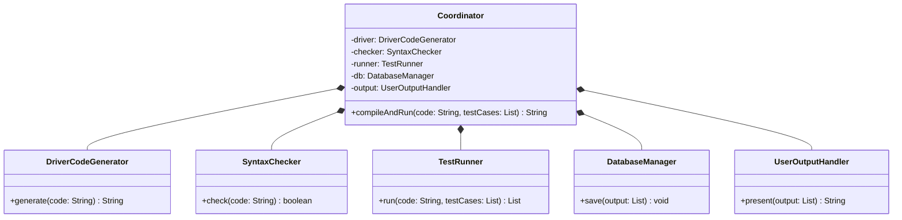
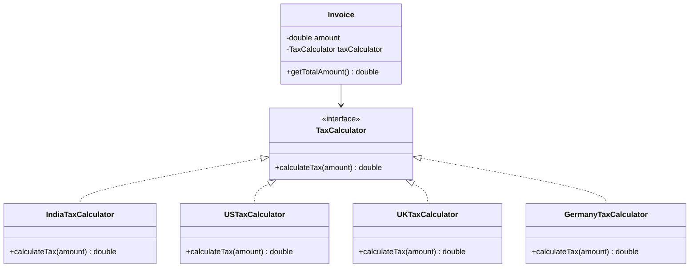
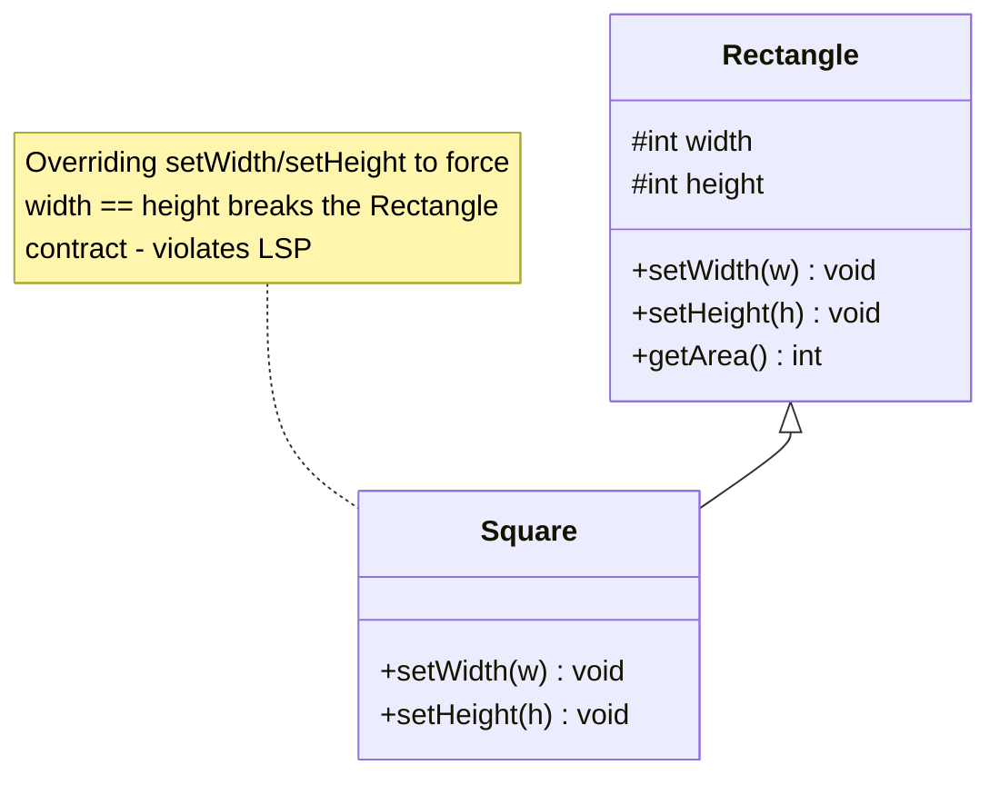
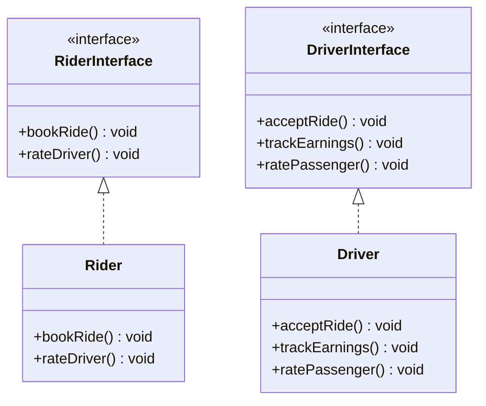
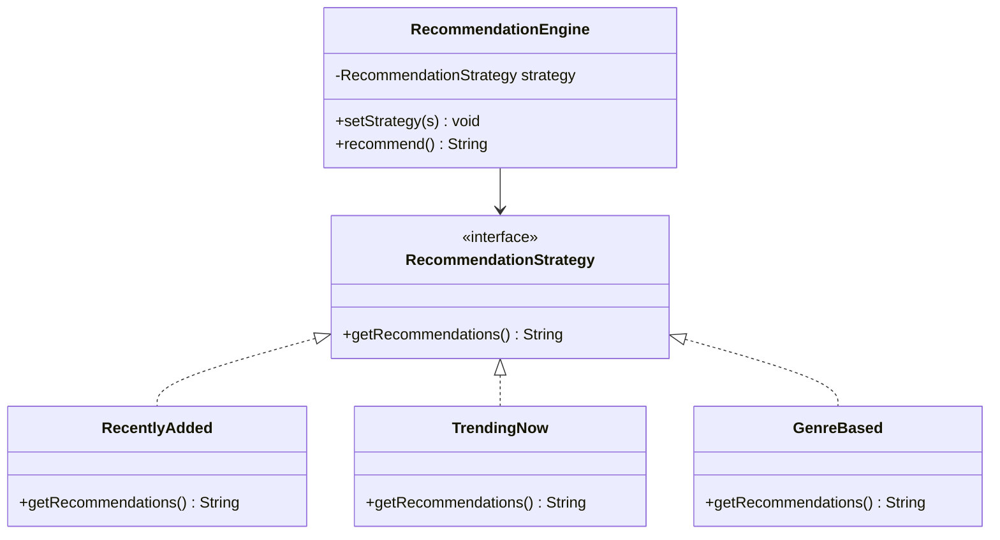

# SOLID Principles — Five Rules for Containing Change

A requirement changes: a new tax region, a new kind of notification, a new department's rule about overtime. In a well-designed system that change lands in one small place, and nothing else needs to be touched or retested. In a badly designed one it spreads through classes that had nothing to do with it, and something that used to work breaks.

**SOLID** is the name for five principles that keep changes contained. Robert C. Martin collected and described them: in magazine articles from the mid-1990s, in his 2000 paper "Design Principles and Design Patterns" <abbr title="Robert C. Martin, Design Principles and Design Patterns, 2000">[1]</abbr>, and in his 2002 book, which presents all five <abbr title="Robert C. Martin, Agile Software Development: Principles, Patterns, and Practices, 2002">[2]</abbr>. He did not invent all of them. He credits the Single Responsibility Principle to earlier work on *cohesion* by Tom DeMarco and Meilir Page-Jones; the Open/Closed Principle comes from Bertrand Meyer in 1988 <abbr title="Bertrand Meyer, Object-Oriented Software Construction, 1988">[4]</abbr>; and the Liskov Substitution Principle from Barbara Liskov in 1987 <abbr title="Barbara Liskov, Data Abstraction and Hierarchy, OOPSLA '87 keynote">[5]</abbr>, made precise with Jeannette Wing in 1994 <abbr title="Barbara Liskov and Jeannette Wing, A Behavioral Notion of Subtyping, 1994">[6]</abbr>. The acronym itself came later still: around 2004, Michael Feathers pointed out that the principles' initials could be rearranged to spell SOLID <abbr title="Robert C. Martin, Clean Architecture, 2017, Part III introduction">[3]</abbr>.

<div style="border-left:4px solid #195045;background:rgba(25,80,69,0.08);padding:0.6rem 1rem;border-radius:0 0.5rem 0.5rem 0;margin:1.25rem 0">

💡 **The core idea.**

- **S**ingle Responsibility: a class should answer to one group of people, so that one group's change can't break another's feature.
- **O**pen/Closed: add new behaviour by adding new code (a new class), not by editing code that already works.
- **L**iskov Substitution: a subclass must keep every promise its parent makes, so code written for the parent works with it unchanged.
- **I**nterface Segregation: give each kind of client a small interface with only the methods it needs.
- **D**ependency Inversion: high-level policy should depend on an abstraction it owns, and the low-level details should implement it.

</div>

This lesson builds on [Software Design Principles](/synapse/low-level-design/basics/design-principles) and on [Abstraction & Interfaces](/synapse/low-level-design/oop/abstraction-interfaces-static-members-inner-classes), whose interface-based design is what most of these principles rely on. Every output below was produced by running the code on Java 21 and Python 3.11.

**You'll be able to:** split a class by the people who ask for its changes, and explain the bug that splitting prevents; add a new variant (a tax region, a strategy) without editing tested code, and say where the remaining choice lives; spot a subclass that breaks its parent's promises, including the Rectangle–Square trap and strengthened preconditions; split a fat interface so that the compiler, not a runtime surprise, stops a class being used in a role it can't play; invert a dependency so high-level code can be reconfigured and tested with a fake.

<div style="border-left:4px solid #15448e;background:rgba(21,68,142,0.08);padding:0.6rem 1rem;border-radius:0 0.5rem 0.5rem 0;margin:1.25rem 0">

📘 **How to read the Intuition boxes.** Each one is built in three moves:

1. **The mechanism** — where a change has to land, and what else it touches on the way.
2. **A concrete bite** — a specific, runnable program where ignoring the principle gives a wrong result.
3. **The earned rule** — the decision heuristic, now justified rather than asserted, plus its cost.

</div>

---

## Table of contents

1. [SRP: one reason to change](#1-srp-one-reason-to-change)
2. [OCP: extend without editing](#2-ocp-extend-without-editing)
3. [LSP: subclasses keep their parent's promises](#3-lsp-subclasses-keep-their-parents-promises)
4. [ISP: small interfaces for each client](#4-isp-small-interfaces-for-each-client)
5. [DIP: depend on abstractions you own](#5-dip-depend-on-abstractions-you-own)
6. [Applying SOLID without overdoing it](#6-applying-solid-without-overdoing-it)
7. [Mental-model summary](#7-mental-model-summary)
8. [Gotcha checklist](#8-gotcha-checklist)
9. [Check yourself](#-check-yourself)
10. [Sources](#-sources)

---

## 1. SRP: one reason to change

The S in SOLID stands for the **Single Responsibility Principle**.

<div style="border-left:4px solid #15448e;background:rgba(21,68,142,0.08);padding:0.6rem 1rem;border-radius:0 0.5rem 0.5rem 0;margin:1.25rem 0">

📘 **Definition.** "A class should have only one reason to change" <abbr title="Robert C. Martin, Agile Software Development, 2002, ch. 8 SRP">[2]</abbr>. Martin later sharpened what a "reason" is: a module should be responsible to one, and only one, *actor*, meaning one group of people who ask for changes <abbr title="Robert C. Martin, Clean Architecture, 2017, ch. 7 SRP">[3]</abbr>.

</div>

"One job" is a useful first reading, but the actor version is the one that predicts bugs. If two groups of people, say accounting and operations, can each ask for changes to the same class, then a change made for one of them can break what the other relies on, and neither group will expect it.

**Real-life analogy.** Imagine a chef who is responsible for cooking, cleaning, serving food and ordering groceries. While the chef is cleaning, nobody is cooking, and the food suffers. In a restaurant, different people handle each task: a chef cooks, a cleaner cleans, a waiter serves, and a manager orders groceries. Each can do their job well, and a change to how groceries are ordered doesn't disturb the cooking.

**The online compiler.** An online compiler does five things: it adds driver code around the user's code, checks the syntax, runs the code against stored test cases, stores the output in a database, and returns the output to the user. Putting all five into one `OnlineCompiler` class would mean that a change to the database schema, the test format or the output layout all land in the same file. Instead, give each its own class, and add a `Coordinator` that only calls them in order:

- `DriverCodeGenerator` adds the driver code.
- `SyntaxChecker` checks the syntax.
- `TestRunner` runs the code against the test cases.
- `DatabaseManager` stores the output.
- `UserOutputHandler` formats the output for the user.

```java run
import java.util.ArrayList;
import java.util.List;

class DriverCodeGenerator {
    String generate(String code) {
        return "// driver\n" + code + "\n// end driver";
    }
}

class SyntaxChecker {
    boolean check(String code) {
        return !code.isBlank();
    }
}

class TestRunner {
    List<String> run(String code, List<String> testCases) {
        List<String> results = new ArrayList<>();
        for (String t : testCases) {
            results.add("input=" + t + " -> ok");
        }
        return results;
    }
}

class DatabaseManager {
    private final List<List<String>> saved = new ArrayList<>(); // stands in for a real database

    void save(List<String> output) {
        saved.add(output);
    }
}

class UserOutputHandler {
    String present(List<String> output) {
        return String.join("\n", output);
    }
}

// Each collaborator has one job; the Coordinator only calls them in order.
class Coordinator {
    private final DriverCodeGenerator driver = new DriverCodeGenerator();
    private final SyntaxChecker checker = new SyntaxChecker();
    private final TestRunner runner = new TestRunner();
    private final DatabaseManager db = new DatabaseManager();
    private final UserOutputHandler output = new UserOutputHandler();

    String compileAndRun(String code, List<String> testCases) {
        if (!checker.check(code)) {
            return "Syntax error";
        }
        String wrapped = driver.generate(code);
        List<String> results = runner.run(wrapped, testCases);
        db.save(results);
        return output.present(results);
    }
}

public class Main {
    public static void main(String[] args) {
        Coordinator coordinator = new Coordinator();
        System.out.println(coordinator.compileAndRun("print('hello')", List.of("case1", "case2")));
        System.out.println(coordinator.compileAndRun("   ", List.of("case1")));
    }
}
```

```python run
class DriverCodeGenerator:
    def generate(self, code: str) -> str:
        return f"// driver\n{code}\n// end driver"


class SyntaxChecker:
    def check(self, code: str) -> bool:
        return code.strip() != ""


class TestRunner:
    def run(self, code: str, test_cases: list[str]) -> list[str]:
        return [f"input={t} -> ok" for t in test_cases]


class DatabaseManager:
    def __init__(self) -> None:
        self._saved: list[list[str]] = []  # stands in for a real database

    def save(self, output: list[str]) -> None:
        self._saved.append(output)


class UserOutputHandler:
    def present(self, output: list[str]) -> str:
        return "\n".join(output)


# Each collaborator has one job; the Coordinator only calls them in order.
class Coordinator:
    def __init__(self) -> None:
        self._driver = DriverCodeGenerator()
        self._checker = SyntaxChecker()
        self._runner = TestRunner()
        self._db = DatabaseManager()
        self._output = UserOutputHandler()

    def compile_and_run(self, code: str, test_cases: list[str]) -> str:
        if not self._checker.check(code):
            return "Syntax error"
        wrapped = self._driver.generate(code)
        results = self._runner.run(wrapped, test_cases)
        self._db.save(results)
        return self._output.present(results)


coordinator = Coordinator()
print(coordinator.compile_and_run("print('hello')", ["case1", "case2"]))
print(coordinator.compile_and_run("   ", ["case1"]))
```

**Output:**
```
input=case1 -> ok
input=case2 -> ok
Syntax error
```

The refactored design as a class diagram: five single-purpose collaborators, each with one reason to change, called in order by `Coordinator`.



**Analysis.** Each class can now change for one reason. A new database means editing `DatabaseManager` only; a new output layout means editing `UserOutputHandler` only. `Coordinator` contains no logic of its own beyond the order of the steps and the early return on a syntax error, so it changes only when that order changes. The syntax is checked on the user's code, before the driver code is added: checking the wrapped code would never find it empty.

**Intuition.**
*Mechanism.* Code that two features share couples those features: a change to the shared code affects both. When the two features belong to different actors, the person making the change usually knows only one of them, tests only that one, and the other breaks silently.

*Concrete bite.* This is Martin's own example <abbr title="Robert C. Martin, Clean Architecture, 2017, ch. 7 SRP">[3]</abbr>, made runnable. One `Employee` class computes pay for accounting and an hours report for operations, and both use a shared `regularHours()` helper. Accounting's new contract says regular time is at most 7 hours a day, so a developer changes the helper. Operations still counts 8 hours a day as regular, and asked for nothing:

```java run
// ⚠️ ANTI-PATTERN — one class answers to two departments through one shared helper. Do not copy it.
class Employee {
    private final int[] hours; // hours worked on each day of the week

    Employee(int... hours) {
        this.hours = hours;
    }

    // Changed for accounting: regular time is now at most 7 hours a day.
    private int regularHours() {
        int total = 0;
        for (int h : hours) total += Math.min(h, 7);
        return total;
    }

    private int totalHours() {
        int total = 0;
        for (int h : hours) total += h;
        return total;
    }

    // Accounting's feature.
    int pay(int rate) {
        int overtime = totalHours() - regularHours();
        return regularHours() * rate + overtime * rate * 3 / 2;
    }

    // Operations' feature, which nobody meant to change.
    String hoursReport() {
        return "regular " + regularHours() + ", overtime " + (totalHours() - regularHours());
    }
}

// One class per actor: each owns its own definition of "regular".
class PayCalculator {
    private static final int REGULAR_PER_DAY = 7; // accounting's rule

    int pay(int[] hours, int rate) {
        int regular = 0, total = 0;
        for (int h : hours) {
            regular += Math.min(h, REGULAR_PER_DAY);
            total += h;
        }
        return regular * rate + (total - regular) * rate * 3 / 2;
    }
}

class HoursReporter {
    private static final int REGULAR_PER_DAY = 8; // operations' rule

    String report(int[] hours) {
        int regular = 0, total = 0;
        for (int h : hours) {
            regular += Math.min(h, REGULAR_PER_DAY);
            total += h;
        }
        return "regular " + regular + ", overtime " + (total - regular);
    }
}

public class Main {
    public static void main(String[] args) {
        int[] week = {9, 9, 8, 8, 8};

        Employee shared = new Employee(week);
        System.out.println("shared class, pay: " + shared.pay(20));
        System.out.println("shared class, report: " + shared.hoursReport());

        System.out.println("split classes, pay: " + new PayCalculator().pay(week, 20));
        System.out.println("split classes, report: " + new HoursReporter().report(week));
    }
}
```

```python run
# ⚠️ ANTI-PATTERN — one class answers to two departments through one shared helper. Do not copy it.
class Employee:
    def __init__(self, *hours: int) -> None:
        self._hours = hours  # hours worked on each day of the week

    # Changed for accounting: regular time is now at most 7 hours a day.
    def _regular_hours(self) -> int:
        return sum(min(h, 7) for h in self._hours)

    # Accounting's feature.
    def pay(self, rate: int) -> int:
        overtime = sum(self._hours) - self._regular_hours()
        return self._regular_hours() * rate + overtime * rate * 3 // 2

    # Operations' feature, which nobody meant to change.
    def hours_report(self) -> str:
        regular = self._regular_hours()
        return f"regular {regular}, overtime {sum(self._hours) - regular}"


# One class per actor: each owns its own definition of "regular".
class PayCalculator:
    REGULAR_PER_DAY = 7  # accounting's rule

    def pay(self, hours: list[int], rate: int) -> int:
        regular = sum(min(h, self.REGULAR_PER_DAY) for h in hours)
        return regular * rate + (sum(hours) - regular) * rate * 3 // 2


class HoursReporter:
    REGULAR_PER_DAY = 8  # operations' rule

    def report(self, hours: list[int]) -> str:
        regular = sum(min(h, self.REGULAR_PER_DAY) for h in hours)
        return f"regular {regular}, overtime {sum(hours) - regular}"


week = [9, 9, 8, 8, 8]

shared = Employee(*week)
print("shared class, pay:", shared.pay(20))
print("shared class, report:", shared.hours_report())

print("split classes, pay:", PayCalculator().pay(week, 20))
print("split classes, report:", HoursReporter().report(week))
```

**Output:**
```
shared class, pay: 910
shared class, report: regular 35, overtime 7
split classes, pay: 910
split classes, report: regular 40, overtime 2
```

Pay is right in both versions. But the shared class now tells operations that this employee worked 7 hours of overtime, when by operations' rule it was 2. The split version contains a little duplicated-looking code, and that is correct: the two loops encode two different rules, owned by two different departments, as the DRY lesson's non-example explained.

<div style="border-left:4px solid #195045;background:rgba(25,80,69,0.08);padding:0.6rem 1rem;border-radius:0 0.5rem 0.5rem 0;margin:1.25rem 0">

💡 **Earned rule.** For each class, ask *who* will ask for it to change. If the answer is more than one group (finance and operations, the UI team and the database team), split the class so each group's code lives in its own class, even if that leaves some similar-looking code in both.

The cost is more classes, and something (like the `Coordinator`) to connect them. Don't split a class whose parts always change together for the same people: that adds files without preventing any bug.

</div>

**Advantages of SRP.**

- **Easier maintenance:** a change usually lands in one small class, so less unrelated code is touched.
- **Better readability:** smaller, focused classes are quicker to read and understand.
- **Better reuse:** a class with one responsibility can be reused without dragging in unrelated dependencies.
- **Easier testing:** a small class has fewer dependencies to set up in a test.
- **Lower risk:** a change to one concern is less likely to have side effects in another.

**Common SRP violations.**

- **Database code mixed with business rules.** SQL and business logic in the same class means the database layer can't change without touching the business rules.
- **UI code mixed with business logic.** Application rules embedded in the UI layer make every UI change risky for the logic, and the logic impossible to reuse elsewhere.

**Is SRP just for classes?** No. The same question, "who asks for this to change?", applies to methods, modules, services and whole systems.

---

## 2. OCP: extend without editing

The O in SOLID stands for the **Open/Closed Principle**.

<div style="border-left:4px solid #15448e;background:rgba(21,68,142,0.08);padding:0.6rem 1rem;border-radius:0 0.5rem 0.5rem 0;margin:1.25rem 0">

📘 **Definition.** "Software entities (classes, modules, functions, etc.) should be open for extension, but closed for modification" <abbr title="Robert C. Martin, Agile Software Development, 2002, ch. 9 OCP">[2]</abbr>. Bertrand Meyer introduced the idea in 1988: a module should be *open*, so it can still be extended, and at the same time *closed*, so that other code can rely on it without it changing under them <abbr title="Bertrand Meyer, Object-Oriented Software Construction, 1988">[4]</abbr>. Meyer used inheritance to achieve this; Martin's version uses interfaces and polymorphism.

</div>

The goal is to lower the risk of breaking working code when requirements change: a new variant becomes a new class, and the classes that were already tested stay as they are.

**Real-life analogy.** You travel from India to the UK, and your Indian charger doesn't fit UK sockets. Instead of buying a new charger or rewiring it, you use a travel adapter. The adapter extends what your charger can do, and you didn't modify the charger. (In code, this exact trick is the Adapter pattern, covered in [Structural Design Patterns](/synapse/low-level-design/design-patterns/structural-design-patterns).)

**Example: tax by region.** An invoicing system must add tax that depends on the region. The rates below are for illustration only:

- India: GST 18%
- US: sales tax 8%
- UK: VAT 12%

New regions will be added over time. Here is the first version:

```java run
// ⚠️ ANTI-PATTERN — every new region means editing this method. Do not copy it.
class InvoiceProcessor {
    public double calculateTotal(String region, double amount) {
        if (region.equalsIgnoreCase("India")) {
            return amount + amount * 0.18;
        } else if (region.equalsIgnoreCase("US")) {
            return amount + amount * 0.08;
        } else if (region.equalsIgnoreCase("UK")) {
            return amount + amount * 0.12;
        } else {
            return amount; // no tax for an unknown region
        }
    }
}

public class Main {
    public static void main(String[] args) {
        InvoiceProcessor processor = new InvoiceProcessor();
        System.out.println("Total (India): " + processor.calculateTotal("India", 1000.0));
        System.out.println("Total (Germany): " + processor.calculateTotal("Germany", 1000.0));
    }
}
```

```python run
# ⚠️ ANTI-PATTERN — every new region means editing this method. Do not copy it.
class InvoiceProcessor:
    def calculate_total(self, region: str, amount: float) -> float:
        region = region.lower()
        if region == "india":
            return amount + amount * 0.18
        elif region == "us":
            return amount + amount * 0.08
        elif region == "uk":
            return amount + amount * 0.12
        else:
            return amount  # no tax for an unknown region


processor = InvoiceProcessor()
print("Total (India):", processor.calculate_total("India", 1000.0))
print("Total (Germany):", processor.calculate_total("Germany", 1000.0))
```

**Output:**
```
Total (India): 1180.0
Total (Germany): 1000.0
```

This design causes several problems:

- Adding a region, such as Germany, means editing `calculateTotal`, a method every invoice already depends on.
- Each edit risks breaking the regions that already work, so all of them need retesting.
- The method grows with every region, and becomes hard to read and to test on its own.
- Germany, which nobody has added yet, silently gets no tax at all.

The fix gives each region's rule its own class behind a `TaxCalculator` interface, and the `Invoice` receives the calculator from outside. That is called **dependency injection**, and section 5 explains why it matters. Germany is then added later as a new class, without changing a line of the existing ones:

```java run
// The contract every region's rule follows.
interface TaxCalculator {
    double calculateTax(double amount);
}

class IndiaTaxCalculator implements TaxCalculator {
    public double calculateTax(double amount) {
        return amount * 0.18; // GST
    }
}

class USTaxCalculator implements TaxCalculator {
    public double calculateTax(double amount) {
        return amount * 0.08; // sales tax
    }
}

class UKTaxCalculator implements TaxCalculator {
    public double calculateTax(double amount) {
        return amount * 0.12; // VAT
    }
}

// Added later for Germany: a new class, and no edits to anything above or below.
class GermanyTaxCalculator implements TaxCalculator {
    public double calculateTax(double amount) {
        return amount * 0.15;
    }
}

// Closed for modification: Invoice never mentions a region.
class Invoice {
    private final double amount;
    private final TaxCalculator taxCalculator;

    Invoice(double amount, TaxCalculator taxCalculator) {
        this.amount = amount;
        this.taxCalculator = taxCalculator;
    }

    double getTotalAmount() {
        return amount + taxCalculator.calculateTax(amount);
    }
}

public class Main {
    public static void main(String[] args) {
        double amount = 1000.0;
        System.out.println("Total (India): ₹" + new Invoice(amount, new IndiaTaxCalculator()).getTotalAmount());
        System.out.println("Total (US): $" + new Invoice(amount, new USTaxCalculator()).getTotalAmount());
        System.out.println("Total (UK): £" + new Invoice(amount, new UKTaxCalculator()).getTotalAmount());
        System.out.println("Total (Germany): €" + new Invoice(amount, new GermanyTaxCalculator()).getTotalAmount());
    }
}
```

```python run
from abc import ABC, abstractmethod


# The contract every region's rule follows.
class TaxCalculator(ABC):
    @abstractmethod
    def calculate_tax(self, amount: float) -> float: ...


class IndiaTaxCalculator(TaxCalculator):
    def calculate_tax(self, amount: float) -> float:
        return amount * 0.18  # GST


class USTaxCalculator(TaxCalculator):
    def calculate_tax(self, amount: float) -> float:
        return amount * 0.08  # sales tax


class UKTaxCalculator(TaxCalculator):
    def calculate_tax(self, amount: float) -> float:
        return amount * 0.12  # VAT


# Added later for Germany: a new class, and no edits to anything above or below.
class GermanyTaxCalculator(TaxCalculator):
    def calculate_tax(self, amount: float) -> float:
        return amount * 0.15


# Closed for modification: Invoice never mentions a region.
class Invoice:
    def __init__(self, amount: float, tax_calculator: TaxCalculator) -> None:
        self._amount = amount
        self._tax_calculator = tax_calculator

    @property
    def total_amount(self) -> float:
        return self._amount + self._tax_calculator.calculate_tax(self._amount)


amount = 1000.0
print(f"Total (India): ₹{Invoice(amount, IndiaTaxCalculator()).total_amount}")
print(f"Total (US): ${Invoice(amount, USTaxCalculator()).total_amount}")
print(f"Total (UK): £{Invoice(amount, UKTaxCalculator()).total_amount}")
print(f"Total (Germany): €{Invoice(amount, GermanyTaxCalculator()).total_amount}")
```

**Output:**
```
Total (India): ₹1180.0
Total (US): $1080.0
Total (UK): £1120.0
Total (Germany): €1150.0
```



**Analysis.** The steps of the design:

- **Define a contract.** `TaxCalculator` declares what every region's rule must provide.
- **One class per region.** `IndiaTaxCalculator`, `USTaxCalculator`, `UKTaxCalculator` and later `GermanyTaxCalculator` each hold one rule.
- **Inject the rule.** `Invoice` receives a `TaxCalculator` and never names a region, so it is closed: adding Germany didn't touch it.
- **Choose at the edge.** `main` decides which calculator each invoice gets.

That last step is the honest part. *Something* still has to map "Germany" to `GermanyTaxCalculator`, so a choice by region still exists. OCP moves it out of the business logic into one place at the edge of the system, typically a factory or a map from region to calculator, which the [creational patterns](/synapse/low-level-design/design-patterns/creational-design-patterns) cover. (Real invoicing would also use `BigDecimal` rather than `double` for money; `double` keeps this example short.)

**Intuition.**
*Mechanism.* The parts of a system that change for a new variant are isolated behind an interface. Code that uses the interface is compiled, tested and deployed once; each new variant is a new class that doesn't touch it. The `if`/`else` chain does the opposite: every variant lives inside the one method that everything depends on.

*Concrete bite.* The first program charged Germany no tax at all, and printed a perfectly normal-looking total. The final `else` was written as a convenient default, and it turned a missing case into an under-charging invoice that no test failed on. With one class per region, a region that has no class simply has no calculator to pass in, so the gap can't hide in a default branch.

<div style="border-left:4px solid #195045;background:rgba(25,80,69,0.08);padding:0.6rem 1rem;border-radius:0 0.5rem 0.5rem 0;margin:1.25rem 0">

💡 **Earned rule.** When the same `if`/`else` or `switch` on a type or region has had to grow more than once, replace it with an interface and one class per case, and keep the one remaining choice in a single factory or map.

The cost is more classes, and an indirection that makes the code a little harder to follow. If a list of cases is short and has never changed, a `switch` is simpler, and YAGNI says to leave it alone until the second new case arrives.

</div>

**When to apply OCP.**

- A module keeps changing because of shifting business or technical requirements.
- You need to add behaviour without modifying code that is already tested and in production.
- You are building something designed to be extended: a framework, a plugin system, a billing engine, a set of UI components.
- A class is becoming a *god class*, with too many responsibilities or ever-growing branching logic, which signals that behaviours should be extracted into separate classes.

Applied in advance, without a real need to extend, OCP adds abstraction and complexity that nobody uses. It works best as a response to a pattern of change you have actually seen.

**Common misconceptions about OCP.**

- **"Closed means the code is never changed again."** Bugs still get fixed and code still gets refactored. The principle is about not having to edit working code *to add a new variant*.
- **"OCP leads to too many classes, so it's overkill."** It does add classes. Whether that pays off depends on how often new variants arrive; in a system that keeps growing them, it usually does.
- **"OCP makes code harder to read."** In a small, short-lived project the extra layer can feel unnecessary. In a system with many variants, one small class per case is easier to read than one long conditional.
- **"OCP should always be applied upfront."** Applying it before any change has appeared often builds the wrong extension point.
- **"Refactoring contradicts OCP."** Refactoring is usually how code *becomes* open for extension, for example by replacing a conditional with polymorphism.
- **"OCP means extensions don't need testing."** Existing code needs less retesting, but each new extension still needs its own tests.

---

## 3. LSP: subclasses keep their parent's promises

The L in SOLID stands for the **Liskov Substitution Principle**.

<div style="border-left:4px solid #15448e;background:rgba(21,68,142,0.08);padding:0.6rem 1rem;border-radius:0 0.5rem 0.5rem 0;margin:1.25rem 0">

📘 **Definition.** Barbara Liskov's 1987 statement: if for each object o1 of type S there is an object o2 of type T such that, for all programs P defined in terms of T, the behaviour of P is unchanged when o1 is substituted for o2, then S is a subtype of T <abbr title="Barbara Liskov, Data Abstraction and Hierarchy, OOPSLA '87 keynote, SIGPLAN Notices 23(5), 1988">[5]</abbr>. Liskov and Wing later put it in terms of properties: anything you can prove about objects of type T should also be true of objects of a subtype S <abbr title="Barbara Liskov and Jeannette Wing, A Behavioral Notion of Subtyping, ACM TOPLAS 16(6), 1994">[6]</abbr>. Martin's short form is "Subtypes must be substitutable for their base types" <abbr title="Robert C. Martin, Agile Software Development, 2002, ch. 10 LSP">[2]</abbr>.

</div>

In practice:

- If you write code against a parent class, say `Shape`, and later pass in a child class such as `Circle`, the code must still work, without errors or surprising results.
- If the subclass changes behaviour in a way that breaks what callers of the parent expect, it violates LSP, even if it compiles.

**Real-life analogy.** You run a pet hotel with a simple policy: "Any pet staying here must be able to be fed, walked and groomed." You've hosted dogs, cats and rabbits, and everything has worked. Then someone brings in a pet snake. You can't walk it, grooming makes no sense, and it won't eat pet food; it needs live mice. Your process assumed every pet behaves like a dog or a cat, and the snake breaks those assumptions. That is an LSP violation. A hamster, on the other hand, eats food and needs care; you put it in a wheel instead of walking it, a small adjustment within the expected "pet" behaviour. The hotel has to be able to trust that any "pet" will behave in the expected ways, and LSP is what gives code that same trust.

### The Rectangle–Square trap

In geometry a square *is a* rectangle, so `Square extends Rectangle` looks natural. Here is what happens:

```java run
class Rectangle {
    int width, height;

    void setWidth(int w) { width = w; }
    void setHeight(int h) { height = h; }
    int getArea() { return width * height; }
}

// ⚠️ ANTI-PATTERN — Square changes what setWidth and setHeight promise. Do not copy it.
class Square extends Rectangle {
    @Override
    void setWidth(int w) {
        width = w;
        height = w; // keep it square
    }

    @Override
    void setHeight(int h) {
        height = h;
        width = h; // keep it square
    }
}

public class Main {
    // Written for any Rectangle: set the sides, then read the area.
    static void printArea(Rectangle r) {
        r.setWidth(5);
        r.setHeight(10);
        System.out.println("area: " + r.getArea() + " (caller expects 50)");
    }

    public static void main(String[] args) {
        printArea(new Square()); // a Square passed where a Rectangle is expected
    }
}
```

```python run
class Rectangle:
    def __init__(self) -> None:
        self.width = 0
        self.height = 0

    def set_width(self, w: int) -> None:
        self.width = w

    def set_height(self, h: int) -> None:
        self.height = h

    def get_area(self) -> int:
        return self.width * self.height


# ⚠️ ANTI-PATTERN — Square changes what set_width and set_height promise. Do not copy it.
class Square(Rectangle):
    def set_width(self, w: int) -> None:
        self.width = w
        self.height = w  # keep it square

    def set_height(self, h: int) -> None:
        self.height = h
        self.width = h  # keep it square


# Written for any Rectangle: set the sides, then read the area.
def print_area(r: Rectangle) -> None:
    r.set_width(5)
    r.set_height(10)
    print(f"area: {r.get_area()} (caller expects 50)")


print_area(Square())  # a Square passed where a Rectangle is expected
```

**Output:**
```
area: 100 (caller expects 50)
```



<div style="border-left:4px solid #da5233;background:rgba(218,82,51,0.08);padding:0.6rem 1rem;border-radius:0 0.5rem 0.5rem 0;margin:1.25rem 0">

⚠️ **Watch out.** `printArea` expected 50 and got 100, because `setHeight(10)` on a `Square` also set the width to 10. The code compiled, ran without an exception, and was wrong.

</div>

**Analysis.** A `Rectangle` makes an unwritten promise: `setWidth` changes the width and leaves the height alone. Every caller of `Rectangle` is entitled to rely on that. `Square` can't keep the promise without stopping being a square, so it isn't a valid substitute, whatever geometry says. The fix is to stop pretending one is the other. Make both implement a common interface that promises only what both can keep, such as computing an area, and give each its own way of being built:

```java run
interface Shape {
    int area();
}

// Each shape is immutable, so there are no setters whose promises could differ.
record Rectangle(int width, int height) implements Shape {
    public int area() { return width * height; }
}

record Square(int side) implements Shape {
    public int area() { return side * side; }
}

public class Main {
    static void printArea(Shape s) {
        System.out.println(s + " area: " + s.area());
    }

    public static void main(String[] args) {
        printArea(new Rectangle(5, 10));
        printArea(new Square(5));
    }
}
```

```python run
from dataclasses import dataclass
from typing import Protocol


class Shape(Protocol):
    def area(self) -> int: ...


# Each shape is immutable, so there are no setters whose promises could differ.
@dataclass(frozen=True)
class Rectangle:
    width: int
    height: int

    def area(self) -> int:
        return self.width * self.height


@dataclass(frozen=True)
class Square:
    side: int

    def area(self) -> int:
        return self.side * self.side


def print_area(s: Shape) -> None:
    print(f"{s} area: {s.area()}")


print_area(Rectangle(5, 10))
print_area(Square(5))
```

**Output (Java):**
```
Rectangle[width=5, height=10] area: 50
Square[side=5] area: 25
```

**Output (Python):**
```
Rectangle(width=5, height=10) area: 50
Square(side=5) area: 25
```

`Shape` promises only `area()`, and both classes keep that promise. Nothing can set a square's width, so there is no promise left to break.

### Why LSP matters: substitution you can trust

A notification system starts with one `Notification` class. New kinds of notification are added as subclasses, and the code that sends notifications doesn't change, because it only knows about `Notification`. That works only if every subclass accepts everything the parent accepted. Here a `TextNotification` adds a limit that the parent never had:

```java run
import java.util.List;

class Notification {
    // The contract: any message can be sent.
    public void send(String message) {
        System.out.println("Notification sent: " + message);
    }
}

class EmailNotification extends Notification {
    @Override
    public void send(String message) {
        System.out.println("Email sent: " + message);
    }
}

// ⚠️ ANTI-PATTERN — demands more of the caller than Notification does. Do not copy it.
class TextNotification extends Notification {
    @Override
    public void send(String message) {
        if (message.length() > 160) {
            throw new IllegalArgumentException("SMS is limited to 160 characters");
        }
        System.out.println("Text sent: " + message);
    }
}

public class Main {
    public static void main(String[] args) {
        String notice = "Your order has shipped. " + "Track it in the app. ".repeat(8);
        List<Notification> channels = List.of(new Notification(), new EmailNotification(), new TextNotification());

        for (Notification n : channels) {
            try {
                n.send(notice.substring(0, 24) + "... (" + notice.length() + " chars)");
                n.send(notice);
            } catch (IllegalArgumentException e) {
                System.out.println("FAILED in " + n.getClass().getSimpleName() + ": " + e.getMessage());
            }
        }
    }
}
```

```python run
class Notification:
    # The contract: any message can be sent.
    def send(self, message: str) -> None:
        print(f"Notification sent: {message}")


class EmailNotification(Notification):
    def send(self, message: str) -> None:
        print(f"Email sent: {message}")


# ⚠️ ANTI-PATTERN — demands more of the caller than Notification does. Do not copy it.
class TextNotification(Notification):
    def send(self, message: str) -> None:
        if len(message) > 160:
            raise ValueError("SMS is limited to 160 characters")
        print(f"Text sent: {message}")


notice = "Your order has shipped. " + "Track it in the app. " * 8
channels = [Notification(), EmailNotification(), TextNotification()]

for n in channels:
    try:
        n.send(f"{notice[:24]}... ({len(notice)} chars)")
        n.send(notice)
    except ValueError as e:
        print(f"FAILED in {type(n).__name__}: {e}")
```

**Output** *(the long message is shown in full; it is the same 192-character string each time)*:
```
Notification sent: Your order has shipped. ... (192 chars)
Notification sent: Your order has shipped. Track it in the app. Track it in the app. Track it in the app. Track it in the app. Track it in the app. Track it in the app. Track it in the app. Track it in the app. 
Email sent: Your order has shipped. ... (192 chars)
Email sent: Your order has shipped. Track it in the app. Track it in the app. Track it in the app. Track it in the app. Track it in the app. Track it in the app. Track it in the app. Track it in the app. 
Text sent: Your order has shipped. ... (192 chars)
FAILED in TextNotification: SMS is limited to 160 characters
```

**Analysis.** `EmailNotification` is a good substitute: the sending loop didn't change, and it worked. `TextNotification` compiled, passed any test that used short messages, and failed the first time a real notice was longer than 160 characters. The sending code was written against `Notification`, whose contract allows any message, and it had no reason to expect a limit.

**Intuition.**
*Mechanism.* Every method has a contract, whether written down or not: what the caller must provide (its **preconditions**) and what the method guarantees in return (its **postconditions**). A subclass may *accept more* and *guarantee more*. It must not *demand more* (strengthen a precondition, as the 160-character limit does) or *guarantee less* (weaken a postcondition, as `Square.setHeight` does by also changing the width). This rule comes from Meyer's Design by Contract, and Martin uses it to explain LSP <abbr title="Robert C. Martin, Agile Software Development, 2002, ch. 10 LSP (citing Meyer's Design by Contract)">[2]</abbr>.

*Concrete bite.* Both programs above failed only for some inputs: the square only when the caller set the sides to different values, the text channel only for long messages. LSP violations hide from tests written by the subclass's author, who tests the cases they had in mind, and appear in code written for the parent, by someone else, later.

<div style="border-left:4px solid #195045;background:rgba(25,80,69,0.08);padding:0.6rem 1rem;border-radius:0 0.5rem 0.5rem 0;margin:1.25rem 0">

💡 **Earned rule.** Before writing `B extends A`, check every public method of `A`: can `B` accept everything `A` accepts, and guarantee everything `A` guarantees? If not, `B` is not a subtype, even if it "is a" `A` in everyday language. Give both a smaller common interface that promises only what both can keep, or put the limit into the parent's contract (for example a `maxLength()` that callers check), or make `B` honour the contract (split long texts into several messages).

The cost is a less "natural" hierarchy, and sometimes more types. That is cheaper than a subclass that breaks code nobody thought to retest.

</div>

**What LSP violations do to code.**

- **Unpredictable:** code relying on the parent's behaviour breaks with certain subclasses.
- **Hard to maintain:** every new subclass means rechecking every place the parent is used.
- **Bug-prone:** runtime errors, wrong results and inconsistent behaviour.
- **Less reusable:** substituting subclasses becomes dangerous.
- **Tightly coupled:** callers start checking `instanceof` to work around specific subclasses, and so depend on them.

**How to spot LSP violations.** Ask:

- Does the subclass override a method in a way that changes its meaning?
- Can I replace the parent with the subclass everywhere, without changing expected behaviour?
- Does the subclass throw exceptions, or return values, that the parent's callers wouldn't expect?
- Does the subclass *strengthen* a precondition (accept less) or *weaken* a postcondition (guarantee less)?

If any answer is yes, there is probably an LSP violation.

**Principles to follow.**

- Subclasses must honour the contract of the parent class.
- Don't override a method in a way that changes what it means.
- Prefer composition over inheritance when the "is a" relationship is doubtful.
- Think in terms of interfaces and behavioural compatibility, not everyday categories.
- Subclasses may extend behaviour, but must not restrict it.

---

## 4. ISP: small interfaces for each client

The I in SOLID stands for the **Interface Segregation Principle**.

<div style="border-left:4px solid #15448e;background:rgba(21,68,142,0.08);padding:0.6rem 1rem;border-radius:0 0.5rem 0.5rem 0;margin:1.25rem 0">

📘 **Definition.** "Clients should not be forced to depend on methods that they do not use" <abbr title="Robert C. Martin, Agile Software Development, 2002, ch. 12 ISP">[2]</abbr>.

</div>

**Understanding.** When you order a ride, you are a rider. You care about booking rides, tracking the driver and paying. You don't care about accepting passengers, verifying licences or tracking earnings; those are for drivers. An app that showed you one huge screen with every rider and driver feature would be confusing and easy to misuse. ISP prevents the same problem in code.

**Example: a ride-hailing app.** The first design gives riders and drivers one shared `UberUser` interface, so each class must implement every method, including the ones that make no sense for it:

```java run
import java.util.List;

// ⚠️ ANTI-PATTERN — one fat interface for two different roles. Do not copy it.
interface UberUser {
    String name();
    void bookRide();
    void acceptRide();
    void trackEarnings();
    void ratePassenger();
    void rateDriver();
}

class Rider implements UberUser {
    private final String name;

    Rider(String name) {
        this.name = name;
    }

    public String name() { return name; }
    public void bookRide() { System.out.println(name + " is booking a ride..."); }
    public void acceptRide() { /* not needed for a rider */ }
    public void trackEarnings() { /* not needed for a rider */ }
    public void ratePassenger() { /* not needed for a rider */ }
    public void rateDriver() { System.out.println(name + " is rating the driver..."); }
}

class Driver implements UberUser {
    private final String name;

    Driver(String name) {
        this.name = name;
    }

    public String name() { return name; }
    public void bookRide() { /* not needed for a driver */ }
    public void acceptRide() { System.out.println(name + " accepts the ride"); }
    public void trackEarnings() { System.out.println(name + " is tracking earnings..."); }
    public void ratePassenger() { System.out.println(name + " is rating the passenger..."); }
    public void rateDriver() { /* not needed for a driver */ }
}

public class Main {
    public static void main(String[] args) {
        Rider asha = new Rider("Asha");
        asha.bookRide();

        // Offer the ride to the first user nearby. A rider is in the list by mistake.
        List<UberUser> nearby = List.of(asha, new Driver("Ravi"));
        UberUser first = nearby.get(0);
        first.acceptRide();
        System.out.println("ride assigned to " + first.name());
    }
}
```

```python run
from abc import ABC, abstractmethod


# ⚠️ ANTI-PATTERN — one fat interface for two different roles. Do not copy it.
class UberUser(ABC):
    @abstractmethod
    def name(self) -> str: ...
    @abstractmethod
    def book_ride(self) -> None: ...
    @abstractmethod
    def accept_ride(self) -> None: ...
    @abstractmethod
    def track_earnings(self) -> None: ...
    @abstractmethod
    def rate_passenger(self) -> None: ...
    @abstractmethod
    def rate_driver(self) -> None: ...


class Rider(UberUser):
    def __init__(self, name: str) -> None:
        self._name = name

    def name(self) -> str: return self._name
    def book_ride(self) -> None: print(f"{self._name} is booking a ride...")
    def accept_ride(self) -> None: pass  # not needed for a rider
    def track_earnings(self) -> None: pass  # not needed for a rider
    def rate_passenger(self) -> None: pass  # not needed for a rider
    def rate_driver(self) -> None: print(f"{self._name} is rating the driver...")


class Driver(UberUser):
    def __init__(self, name: str) -> None:
        self._name = name

    def name(self) -> str: return self._name
    def book_ride(self) -> None: pass  # not needed for a driver
    def accept_ride(self) -> None: print(f"{self._name} accepts the ride")
    def track_earnings(self) -> None: print(f"{self._name} is tracking earnings...")
    def rate_passenger(self) -> None: print(f"{self._name} is rating the passenger...")
    def rate_driver(self) -> None: pass  # not needed for a driver


asha = Rider("Asha")
asha.book_ride()

# Offer the ride to the first user nearby. A rider is in the list by mistake.
nearby: list[UberUser] = [asha, Driver("Ravi")]
first = nearby[0]
first.accept_ride()
print("ride assigned to", first.name())
```

**Output:**
```
Asha is booking a ride...
ride assigned to Asha
```

The ride was assigned to the passenger who booked it. `Rider.acceptRide()` is an empty stub, so it "accepted" without a word, and the code that offered the ride had no way to know that this `UberUser` couldn't drive. The better design gives each role its own interface:

```java run
import java.util.List;

interface RiderInterface {
    void bookRide();
    void rateDriver();
}

interface DriverInterface {
    String name();
    void acceptRide();
    void trackEarnings();
    void ratePassenger();
}

class Rider implements RiderInterface {
    public void bookRide() { System.out.println("Booking a ride..."); }
    public void rateDriver() { System.out.println("Rating the driver..."); }
}

class Driver implements DriverInterface {
    private final String name;

    Driver(String name) {
        this.name = name;
    }

    public String name() { return name; }
    public void acceptRide() { System.out.println(name + " accepts the ride"); }
    public void trackEarnings() { System.out.println(name + " is tracking earnings..."); }
    public void ratePassenger() { System.out.println(name + " is rating the passenger..."); }
}

public class Main {
    public static void main(String[] args) {
        Rider rider = new Rider();
        rider.bookRide();

        // Only drivers can be in this list: a Rider would not compile here.
        List<DriverInterface> nearby = List.of(new Driver("Ravi"), new Driver("Meena"));
        DriverInterface first = nearby.get(0);
        first.acceptRide();
        System.out.println("ride assigned to " + first.name());

        rider.rateDriver();
        first.ratePassenger();
        first.trackEarnings();
    }
}
```

```python run
from abc import ABC, abstractmethod


class RiderInterface(ABC):
    @abstractmethod
    def book_ride(self) -> None: ...
    @abstractmethod
    def rate_driver(self) -> None: ...


class DriverInterface(ABC):
    @abstractmethod
    def name(self) -> str: ...
    @abstractmethod
    def accept_ride(self) -> None: ...
    @abstractmethod
    def track_earnings(self) -> None: ...
    @abstractmethod
    def rate_passenger(self) -> None: ...


class Rider(RiderInterface):
    def book_ride(self) -> None: print("Booking a ride...")
    def rate_driver(self) -> None: print("Rating the driver...")


class Driver(DriverInterface):
    def __init__(self, name: str) -> None:
        self._name = name

    def name(self) -> str: return self._name
    def accept_ride(self) -> None: print(f"{self._name} accepts the ride")
    def track_earnings(self) -> None: print(f"{self._name} is tracking earnings...")
    def rate_passenger(self) -> None: print(f"{self._name} is rating the passenger...")


rider = Rider()
rider.book_ride()

# Only drivers belong in this list; a type checker would flag a Rider here.
nearby: list[DriverInterface] = [Driver("Ravi"), Driver("Meena")]
first = nearby[0]
first.accept_ride()
print("ride assigned to", first.name())

rider.rate_driver()
first.rate_passenger()
first.track_earnings()
```

**Output:**
```
Booking a ride...
Ravi accepts the ride
ride assigned to Ravi
Rating the driver...
Ravi is rating the passenger...
Ravi is tracking earnings...
```

The segregated interfaces as a class diagram: `Rider` and `Driver` each implement only the interface built for their role.



**Analysis.** Each class now has exactly the methods it can honour, with no empty stubs. The dispatching code asks for a `List<DriverInterface>`, so in Java the mistake from the first program becomes a compile error: a `Rider` is not a `DriverInterface`. Python checks nothing when the program runs, but the type annotation states the intent, and a static type checker can report the mistake before the program is run.

**Intuition.**
*Mechanism.* A fat interface forces every implementer to say *something* for every method. When a method doesn't apply, the implementer writes an empty stub or throws `UnsupportedOperationException`, and both turn a type error the compiler could have caught into a runtime surprise. Small, role-based interfaces let the type system say exactly which objects can play which role.

*Concrete bite.* In the first program, Asha's empty `acceptRide()` meant the dispatcher assigned a ride to its own passenger, and nothing failed. A stub that throws would at least have failed loudly, but only at run time, in production, when a rider happened to be first in the list.

<div style="border-left:4px solid #195045;background:rgba(25,80,69,0.08);padding:0.6rem 1rem;border-radius:0 0.5rem 0.5rem 0;margin:1.25rem 0">

💡 **Earned rule.** If an implementation needs an empty method or an `UnsupportedOperationException`, the interface is too big: split it by the roles of the code that *calls* it, and let a class implement several small interfaces when it really plays several roles.

The cost is more interfaces to name and find. Don't split an interface whose methods are always used together by the same clients; that just scatters one role across several types.

</div>

**Benefits of ISP.**

- **Cleaner code:** classes aren't bloated with methods they can't honour.
- **More flexibility:** changing one role's interface doesn't affect classes in another role.
- **Easier maintenance and testing:** small interfaces are easy to understand and to fake in tests.
- **Fewer bugs:** there are no stub methods for someone to call by accident.
- **Room to grow:** adding a new role, such as a delivery partner, means a new small interface, not a change to everyone's.

**When to apply ISP.**

- A class implements methods it doesn't use.
- An interface keeps growing and is used by several unrelated kinds of class.
- Adding a feature for one kind of client means modifying classes that serve other clients.
- You are designing an API or plugin interface, where exposing only the relevant methods makes it easier to use correctly.

<div style="border-left:4px solid #195045;background:rgba(25,80,69,0.08);padding:0.6rem 1rem;border-radius:0 0.5rem 0.5rem 0;margin:1.25rem 0">

💡 **Insight.** Design each interface for the clients that use it, the way a ride app shows riders and drivers different screens. Fat interfaces force stubs; slim, role-specific interfaces let the compiler check roles.

</div>

---

## 5. DIP: depend on abstractions you own

The D in SOLID stands for the **Dependency Inversion Principle**. Two terms first:

- **High-level modules** contain the policy: the core business logic that makes decisions and coordinates features. In a company, this is the role of the people who decide the strategy.
- **Low-level modules** handle the details: talking to a database, calling an API, reading files. They support the policy by doing the concrete work, like the staff who carry out the plan.

<div style="border-left:4px solid #15448e;background:rgba(21,68,142,0.08);padding:0.6rem 1rem;border-radius:0 0.5rem 0.5rem 0;margin:1.25rem 0">

📘 **Definition.** "High-level modules should not depend on low-level modules. Both should depend on abstractions. Abstractions should not depend on details. Details should depend on abstractions" <abbr title="Robert C. Martin, Agile Software Development, 2002, ch. 11 DIP">[2]</abbr>.

</div>

Normally, high-level code calls low-level code, so it also depends on it: change the database class and the business logic may have to change too. DIP *inverts* that dependency. The high-level module defines the interface it needs, in its own terms, and the low-level module implements it. Both now depend on the interface, and the arrow from the detail points up towards the policy.

**Real-life analogy.** You want pizza, so you open a food delivery app instead of phoning a particular chef. You don't care which chef makes it or which rider brings it; you care that the app delivers from the restaurant you chose. You are the high-level module, the app's ordering service is the abstraction, and the restaurant is the low-level module. You depend only on the abstraction, and restaurants can come and go without you changing how you order.

**Example: a recommendation engine.** A streaming service recommends content in several ways:

- **Recently added:** shows and films recently added to the catalogue.
- **Trending now:** what is currently popular.
- **Genre-based:** based on what you've watched and liked.

The first version creates its strategy itself:

```java run
// ⚠️ ANTI-PATTERN — the high-level engine creates its own low-level strategy. Do not copy it.
class RecentlyAdded {
    String getRecommendations() {
        System.out.println("(querying the catalogue database...)");
        return "Showing recently added content...";
    }
}

class RecommendationEngine {
    private final RecentlyAdded recommender = new RecentlyAdded();

    String recommend() {
        return recommender.getRecommendations();
    }
}

public class Main {
    public static void main(String[] args) {
        RecommendationEngine engine = new RecommendationEngine();
        System.out.println(engine.recommend());

        // A unit test of the engine has no way to avoid the database.
        System.out.println("test: " + new RecommendationEngine().recommend());
    }
}
```

```python run
# ⚠️ ANTI-PATTERN — the high-level engine creates its own low-level strategy. Do not copy it.
class RecentlyAdded:
    def get_recommendations(self) -> str:
        print("(querying the catalogue database...)")
        return "Showing recently added content..."


class RecommendationEngine:
    def __init__(self) -> None:
        self._recommender = RecentlyAdded()

    def recommend(self) -> str:
        return self._recommender.get_recommendations()


engine = RecommendationEngine()
print(engine.recommend())

# A unit test of the engine has no way to avoid the database.
print("test:", RecommendationEngine().recommend())
```

**Output:**
```
(querying the catalogue database...)
Showing recently added content...
(querying the catalogue database...)
test: Showing recently added content...
```

This design has two problems:

- `RecommendationEngine` is tightly coupled to `RecentlyAdded`. Switching to trending or genre-based recommendations means editing the engine.
- Every use of the engine, including every test, runs the real `RecentlyAdded` and its database query.

The fix defines a `RecommendationStrategy` interface for the engine, and passes the strategy in:

```java run
// The abstraction the high-level engine needs, defined in its own terms.
interface RecommendationStrategy {
    String getRecommendations();
}

class RecentlyAdded implements RecommendationStrategy {
    public String getRecommendations() {
        System.out.println("(querying the catalogue database...)");
        return "Showing recently added content...";
    }
}

class TrendingNow implements RecommendationStrategy {
    public String getRecommendations() {
        return "Showing trending content...";
    }
}

class GenreBased implements RecommendationStrategy {
    public String getRecommendations() {
        return "Showing content based on your favorite genres...";
    }
}

// High-level module: depends only on the abstraction.
class RecommendationEngine {
    private RecommendationStrategy strategy;

    RecommendationEngine(RecommendationStrategy strategy) {
        this.strategy = strategy;
    }

    void setStrategy(RecommendationStrategy strategy) {
        this.strategy = strategy;
    }

    String recommend() {
        return strategy.getRecommendations();
    }
}

public class Main {
    public static void main(String[] args) {
        RecommendationEngine engine = new RecommendationEngine(new TrendingNow());
        System.out.println(engine.recommend());

        // The user switches to genre-based recommendations while the app is running.
        engine.setStrategy(new GenreBased());
        System.out.println(engine.recommend());

        // A unit test passes a fake: no database, and a known answer to check.
        RecommendationEngine tested = new RecommendationEngine(() -> "FAKE: title-1, title-2");
        System.out.println("test: " + tested.recommend());
    }
}
```

```python run
from abc import ABC, abstractmethod


# The abstraction the high-level engine needs, defined in its own terms.
class RecommendationStrategy(ABC):
    @abstractmethod
    def get_recommendations(self) -> str: ...


class RecentlyAdded(RecommendationStrategy):
    def get_recommendations(self) -> str:
        print("(querying the catalogue database...)")
        return "Showing recently added content..."


class TrendingNow(RecommendationStrategy):
    def get_recommendations(self) -> str:
        return "Showing trending content..."


class GenreBased(RecommendationStrategy):
    def get_recommendations(self) -> str:
        return "Showing content based on your favorite genres..."


class FakeStrategy(RecommendationStrategy):
    def get_recommendations(self) -> str:
        return "FAKE: title-1, title-2"


# High-level module: depends only on the abstraction.
class RecommendationEngine:
    def __init__(self, strategy: RecommendationStrategy) -> None:
        self._strategy = strategy

    def set_strategy(self, strategy: RecommendationStrategy) -> None:
        self._strategy = strategy

    def recommend(self) -> str:
        return self._strategy.get_recommendations()


engine = RecommendationEngine(TrendingNow())
print(engine.recommend())

# The user switches to genre-based recommendations while the app is running.
engine.set_strategy(GenreBased())
print(engine.recommend())

# A unit test passes a fake: no database, and a known answer to check.
tested = RecommendationEngine(FakeStrategy())
print("test:", tested.recommend())
```

**Output:**
```
Showing trending content...
Showing content based on your favorite genres...
test: FAKE: title-1, title-2
```



**Analysis.** `RecommendationEngine` no longer knows how recommendations are made. The strategies can be switched, at start-up or while running, and upgraded, without changing the engine. The test line ran the engine with a fake strategy, so no database query happened. In Java the fake is a lambda, because `RecommendationStrategy` has a single abstract method; in Python it is a small class. This way of building a class around an interchangeable algorithm is the **Strategy** pattern, covered in [Behavioural Design Patterns](/synapse/low-level-design/design-patterns/behavioural-design-patterns).

**Intuition.**
*Mechanism.* Without DIP, the engine's source code names `RecentlyAdded`, so compiling, changing or testing the engine drags `RecentlyAdded` and everything it uses along with it. With DIP, the engine names only `RecommendationStrategy`, an interface written for the engine's needs. The concrete strategies depend on that interface, so the dependency arrows point from the details towards the policy, the opposite of the call direction. Which strategy is used is decided by the code that creates the engine, which is dependency injection, covered in [Dependency Injection & Error Handling](/synapse/low-level-design/best-practices/dependency-injection-and-error-handling).

*Concrete bite.* In the first program, the line labelled "test" still printed "(querying the catalogue database...)". Every unit test of the hard-wired engine is really an integration test: it needs the catalogue to be reachable, it is slow, and it fails when the database is down, even if the engine's own logic is perfect.

<div style="border-left:4px solid #195045;background:rgba(25,80,69,0.08);padding:0.6rem 1rem;border-radius:0 0.5rem 0.5rem 0;margin:1.25rem 0">

💡 **Earned rule.** When business logic needs a detail that is slow, external or likely to change (a database, a payment provider, a clock, a recommendation algorithm), define an interface in the business logic's own terms, make the detail implement it, and pass the implementation in.

The cost is an interface and a constructor parameter for each such dependency, and some code at start-up that wires the real implementations together. For stable, fast, in-memory helpers (a `String` method, a small value class), depend on them directly.

</div>

**Benefits of DIP.**

- **Flexibility:** swap implementations without modifying high-level code.
- **Testability:** pass fakes or stubs to test the policy on its own.
- **Reusability:** the policy isn't tied to one implementation, so it can be reused with others.
- **Maintainability:** a change to a detail stays in the detail.
- **Room to grow:** parts of the system can be replaced or upgraded without a large rewrite.

---

## 6. Applying SOLID without overdoing it

Each principle adds structure: more classes, more interfaces, more indirection. That structure pays off only where change actually happens. A useful way to apply them is to wait for the signal:

| Principle | The signal that calls for it | What applying it costs |
|---|---|---|
| SRP | two groups of people ask for changes to the same class | more classes, and code to connect them |
| OCP | the same conditional has had to grow more than once | an interface, a class per case, and a factory |
| LSP | a subclass needs to refuse, ignore or reinterpret a parent method | a flatter hierarchy, or a smaller shared interface |
| ISP | an implementation needs an empty or throwing method | more, smaller interfaces |
| DIP | business logic can't be tested without a slow or external detail | an interface, constructor injection, and wiring code |

The principles also reinforce each other. In the tax example, one class per region is SRP, adding Germany without edits is OCP, `Invoice` depending on `TaxCalculator` is DIP, and every calculator being usable wherever a `TaxCalculator` is expected is LSP. Applying them where no change is expected adds complexity that nobody benefits from, which is exactly what [YAGNI](/synapse/low-level-design/basics/design-principles) warns against.

---

## 7. Mental-model summary

| Principle | Consequence |
|---|---|
| SRP: one actor per class | A change requested by one group can't break another group's feature |
| OCP: new behaviour as new classes | Tested code stays untouched; the choice of variant moves to one factory or map |
| LSP: subclasses keep the parent's contract | Accept at least as much, guarantee at least as much, or it isn't a subtype |
| ISP: one small interface per role | No stubs; the compiler stops objects being used in roles they can't play |
| DIP: policy owns the abstraction, details implement it | High-level code can be reconfigured, and tested with fakes |
| Apply each principle when its signal appears | Structure where change happens, simplicity everywhere else |

## 8. Gotcha checklist

<div style="border-left:4px solid #da5233;background:rgba(218,82,51,0.08);padding:0.6rem 1rem;border-radius:0 0.5rem 0.5rem 0;margin:1.25rem 0">

| Symptom | Likely cause | Fix |
|---|---|---|
| A change for one department breaks another's report | one class serves two actors through shared code | split the class by actor (SRP) |
| A new region silently gets the wrong behaviour | a default branch in a growing `if`/`else` | one class per case behind an interface (OCP) |
| Code works with the parent but not a subclass | the subclass demands more or guarantees less | smaller shared interface, or fix the contract (LSP) |
| `Square` breaks code written for `Rectangle` | mutable setters with promises a square can't keep | immutable shapes behind a `Shape` interface |
| A class has empty or throwing methods | it implements a fat interface | split the interface by role (ISP) |
| Unit tests need a real database or network | business logic creates its details with `new` | depend on an interface; inject the detail (DIP) |
| Dozens of one-implementation interfaces | principles applied before any change appeared | inline them until a second implementation exists |

</div>

---

## ✅ Check yourself

One check per objective. Answer before you open anything.

```quiz
{"prompt": "An Employee class computes pay for accounting and an hours report for operations, using one shared helper. Why does SRP say to split it?", "options": ["A change requested by accounting can silently break operations' report", "The class has more than one method", "Shared helper methods are slower"], "answer": "A change requested by accounting can silently break operations' report"}
```

```quiz
{"prompt": "An invoice's tax logic is an if/else on region, and a new region is added every quarter. What does OCP suggest?", "options": ["One TaxCalculator class per region behind an interface, chosen in one factory or map", "Add another else-if each quarter, and retest every region", "Move the if/else into a static utility method"], "answer": "One TaxCalculator class per region behind an interface, chosen in one factory or map"}
```

```quiz
{"prompt": "A subclass's send() throws for messages over 160 characters; the parent accepts any message. Which LSP rule does it break?", "options": ["It strengthens a precondition: it demands more of callers than the parent", "It weakens a precondition: it accepts more than the parent", "None: throwing an exception is always allowed"], "answer": "It strengthens a precondition: it demands more of callers than the parent"}
```

```quiz
{"prompt": "A Rider class implements an UberUser interface and leaves acceptRide() empty. What does ISP recommend?", "options": ["Split UberUser into RiderInterface and DriverInterface", "Make Rider.acceptRide() print a warning", "Document that riders must not call acceptRide()"], "answer": "Split UberUser into RiderInterface and DriverInterface"}
```

```quiz
{"prompt": "RecommendationEngine creates new RecentlyAdded() in a field initialiser. Which change applies DIP?", "options": ["Define a RecommendationStrategy interface and pass an implementation into the engine's constructor", "Make RecentlyAdded a static method", "Copy RecentlyAdded's code into RecommendationEngine"], "answer": "Define a RecommendationStrategy interface and pass an implementation into the engine's constructor"}
```

<details>
<summary>A <code>ReportService</code> loads sales from a MySQL database, computes totals, formats them as PDF, and emails the PDF. Finance changes the totals rules every quarter, the design team changes the PDF layout, and the tests currently need a real database and mail server. Which principles apply, and what would you change?</summary>

SRP: three actors (finance, design, operations for delivery) ask for changes, so split computing totals, formatting the PDF and sending email into separate classes. DIP: the totals logic shouldn't depend on MySQL or on a mail server, so define interfaces in its own terms, such as `SalesSource` and `ReportSender`, implement them with `MySqlSalesSource` and `EmailReportSender`, and inject them; tests then pass fakes. OCP: if new output formats (CSV, HTML) or delivery channels keep arriving, a `ReportFormatter` interface lets each be a new class. Don't add interfaces for parts that have only one implementation and no testing problem.

</details>

---

## 📚 Sources

1. Robert C. Martin, "Design Principles and Design Patterns" (Object Mentor, 2000).
2. Robert C. Martin, *Agile Software Development: Principles, Patterns, and Practices* (Prentice Hall, 2002), ch. 8 SRP, ch. 9 OCP, ch. 10 LSP, ch. 11 DIP, ch. 12 ISP.
3. Robert C. Martin, *Clean Architecture: A Craftsman's Guide to Software Structure and Design* (Prentice Hall, 2017), Part III introduction and ch. 7 "SRP: The Single Responsibility Principle".
4. Bertrand Meyer, *Object-Oriented Software Construction* (Prentice Hall, 1988), on the open–closed principle.
5. Barbara Liskov, "Data Abstraction and Hierarchy", keynote at OOPSLA '87, published in *ACM SIGPLAN Notices* 23(5), 1988.
6. Barbara H. Liskov and Jeannette M. Wing, "A Behavioral Notion of Subtyping", *ACM Transactions on Programming Languages and Systems* 16(6), 1994.

---

<div style="border-left:4px solid #6d28d9;background:rgba(109,40,217,0.08);padding:0.6rem 1rem;border-radius:0 0.5rem 0.5rem 0;margin:1.25rem 0">

🧪 **Predict, then check.**

1. In the SRP bite in section 1, change `HoursReporter`'s `REGULAR_PER_DAY` to 9. Predict which of the four output lines change, and to what.
2. In the fixed tax program in section 2, add a `FranceTaxCalculator` at 20%. Predict which existing lines you have to edit to print a French total.
3. In the Rectangle–Square program in section 3, call `printArea(new Rectangle())` instead. Predict the area.
4. In the fixed Java program in section 4, add `new Rider()` to the `List<DriverInterface>`. Predict what the compiler says.

</div>

## Your Turn

Before you move on, check your understanding with the coach — explain the idea, apply it, weigh the trade-offs, then defend your reasoning.

<div class="concept-coach"></div>
