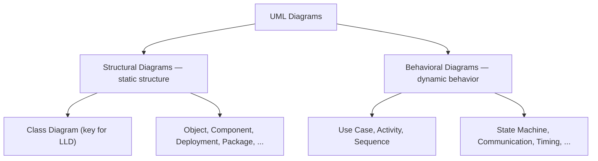
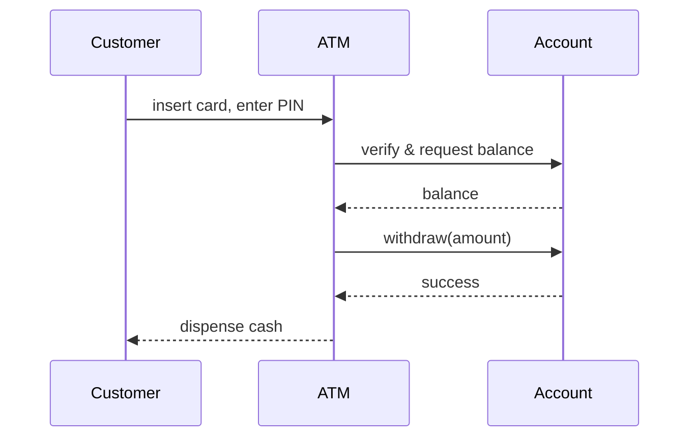
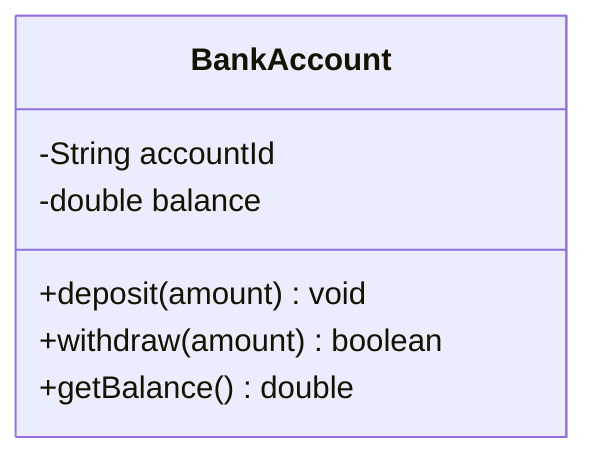
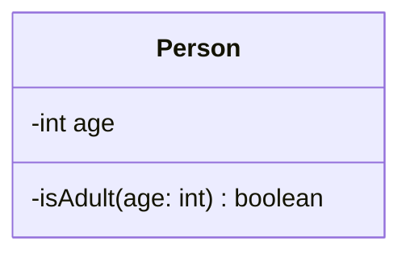
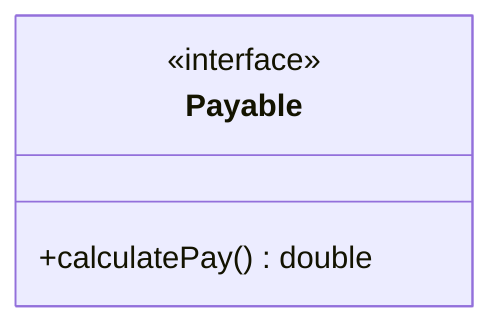
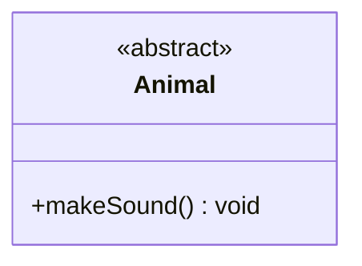
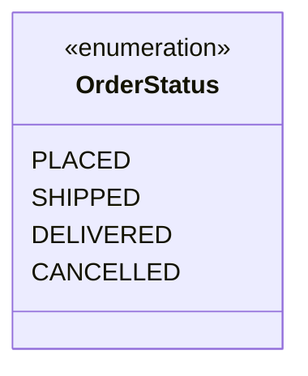
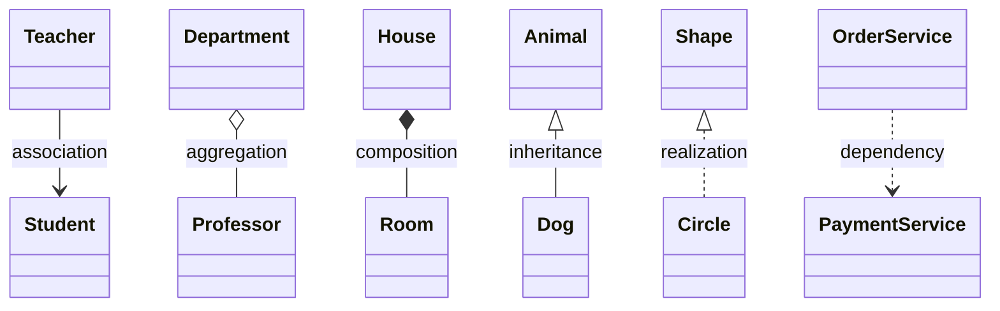

# UML — Unified Modeling Language

UML (Unified Modeling Language) is a standardized modeling language used to visualize, specify, construct, and document the structure and behaviour of software systems. It provides a set of graphic notation techniques to create abstract models of systems, covering both static and dynamic aspects.

Think of UML as a toolkit of diagrams that helps software developers and designers map out how a system works, before or alongside writing the actual code. It's like planning a journey with a map — you get a clear picture of where everything is and how it all connects.

<div style="border-left:4px solid #195045;background:rgba(25,80,69,0.08);padding:0.6rem 1rem;border-radius:0 0.5rem 0.5rem 0;margin:1.25rem 0">

💡 **The core idea.** Before laying bricks, you need blueprints showing where rooms go and how pipes connect. UML diagrams are the blueprints of software systems. They help teams design systems clearly and catch problems early — before any code is written.

</div>

**You'll be able to:**
- Categorise UML diagrams into structural and behavioral families.
- Read and write class diagram notations (attributes, methods, visibility).
- Represent interfaces, abstract classes, and enumerations in UML.
- Map code relationships (association, aggregation, composition) to UML arrows.

<div style="border-left:4px solid #15448e;background:rgba(21,68,142,0.08);padding:0.6rem 1rem;border-radius:0 0.5rem 0.5rem 0;margin:1.25rem 0">

📘 **How to read the Intuition boxes.** As you read, look for the *Mechanism* and *Concrete bite* under each code block. They map the code you just saw to the mental model you need to build.

</div>

1. [Two families of UML diagrams](#1-two-families-of-uml-diagrams)
2. [Class Diagram notations](#2-class-diagram-notations)
3. [Relationships between classes](#3-relationships-between-classes)

## 1. Two families of UML diagrams

UML diagrams are divided into two main categories, each serving a different purpose in modeling software systems.

### Structural diagrams

These describe the static structure of a system — what it contains, how different parts relate to each other, and how data is organized. They are like the architectural blueprints of the system, showing the foundation, components, and their connections. Structural diagrams focus on the elements that exist in the system (like classes, objects, and hardware), rather than what happens during execution.

Types of structural diagrams include Class, Object, Component, Composite Structure, Deployment, Package, and Profile diagrams. The **Class Diagram** is the most important for low-level design.

### Behavioral diagrams

These describe the dynamic behaviour of a system — how it behaves over time, how users interact with it, and how parts communicate during execution. They are like the scripts and animations in a movie — showing what happens, when it happens, and who is involved. Behavioral diagrams focus on actions, interactions, processes, and state changes.

Types of behavioral diagrams include Use Case, Activity, Sequence, Communication, State Machine, Interaction Overview, and Timing diagrams.

<div style="border-left:4px solid #15448e;background:rgba(21,68,142,0.08);padding:0.6rem 1rem;border-radius:0 0.5rem 0.5rem 0;margin:1.25rem 0">

📘 **The split in one line.** Structural = the parts that *exist* (classes, objects, hardware). Behavioral = what *happens* over time (actions, interactions, state changes).

</div>



For example, a **sequence diagram** — one of the most common behavioral diagrams — captures how objects talk to each other over time. Here's a customer withdrawing cash from an ATM:



## 2. Class Diagram notations

A UML Class Diagram provides a high-level overview of the system architecture. It captures the system's classes, interfaces, enumerations, their attributes and operations (methods), and the relationships among them. Looking at a class diagram, you must quickly be able to understand the system's structure regardless of understanding the underlying code.

A class in UML is depicted as a rectangle divided into three compartments:
- **Top compartment:** Contains the class name (bold and centered).
- **Middle compartment:** Lists the attributes.
- **Bottom compartment:** Lists the operations (methods).



### Visibility Markers

Visibility markers define access levels for attributes and operations:
- **Public (`+`):** Accessible from any other class.
- **Private (`-`):** Accessible only within the class itself.
- **Protected (`#`):** Accessible within the class and its subclasses.
- **Package (`~`):** Accessible within the same package.

### Attributes and Methods

Attributes follow this syntax: `visibility name: Type [multiplicity] = DefaultValue`.
Methods follow this syntax: `visibility name(parameterName1: Type1,...): ReturnType`.

```java run
class Person {
    private boolean isAdult(int age) {
        return age >= 18;
    }

    // Added only so the driver below can exercise isAdult() — the private
    // method above is the point being illustrated in the UML mapping.
    public boolean checkAdult(int age) {
        return isAdult(age);
    }
}

// ── Driver ──────────────────────────────────────────────
class Main {
    public static void main(String[] args) {
        Person person = new Person();
        System.out.println("Is 20 an adult? " + person.checkAdult(20));
        System.out.println("Is 15 an adult? " + person.checkAdult(15));
    }
}
```
```python run
class Person:
    def _is_adult(self, age: int) -> bool:  # leading underscore: convention for
        return age >= 18                     # Java's `private` — not enforced by Python

    def check_adult(self, age: int) -> bool:
        return self._is_adult(age)


# ── Driver ──────────────────────────────────────────────
if __name__ == "__main__":
    person = Person()
    print(f"Is 20 an adult? {person.check_adult(20)}")
    print(f"Is 15 an adult? {person.check_adult(15)}")
```

**Output (Java):**
```
Is 20 an adult? true
Is 15 an adult? false
```

**Output (Python):**
```
Is 20 an adult? True
Is 15 an adult? False
```

**Analysis.** In UML, the `isAdult` method is marked private using the `-` visibility marker.



### Interfaces

An interface defines a contract that other classes must follow. It contains only abstract methods (no implementation). A UML class diagram for an interface contains the `<<interface>>` stereotype above the name.

```java run
// Interface for classes that can calculate pay
interface Payable {
    double calculatePay();
}

// DemoPayable exists only to demonstrate the contract — not the canonical implementation.
class DemoPayable implements Payable {
    private final double hours;
    private final double rate;

    DemoPayable(double hours, double rate) {
        this.hours = hours;
        this.rate = rate;
    }

    @Override
    public double calculatePay() {
        return hours * rate;
    }
}

// ── Driver ──────────────────────────────────────────────
class Main {
    public static void main(String[] args) {
        Payable payable = new DemoPayable(40, 25.0);
        System.out.println("Calculated pay: " + payable.calculatePay());
    }
}
```
```python run
from abc import ABC, abstractmethod


class Payable(ABC):  # Java's `interface` -> ABC + @abstractmethod; Python duck-types,
    @abstractmethod    # so this isn't strictly required, but it makes the contract
    def calculate_pay(self) -> float:  # explicit and fails fast if unimplemented.
        ...


# DemoPayable exists only to demonstrate the contract — not the canonical implementation.
class DemoPayable(Payable):
    def __init__(self, hours: float, rate: float) -> None:
        self._hours = hours
        self._rate = rate

    def calculate_pay(self) -> float:
        return self._hours * self._rate


# ── Driver ──────────────────────────────────────────────
if __name__ == "__main__":
    payable: Payable = DemoPayable(40, 25.0)
    print(f"Calculated pay: {payable.calculate_pay()}")
```

**Output:**
```
Calculated pay: 1000.0
```

**Analysis.** By default, interfaces don't have a compartment for attributes like regular classes (unless they declare constants).



### Abstract Classes

An abstract class cannot be instantiated and may contain both implemented and unimplemented (abstract) methods. It is represented with the `<<abstract>>` stereotype above the class name.

```java run
// Abstract class representing an Animal
abstract class Animal {
    public abstract void makeSound();
}

// DemoAnimal exists only to demonstrate the contract
class DemoAnimal extends Animal {
    @Override
    public void makeSound() {
        System.out.println("Some generic animal sound");
    }
}

// ── Driver ──────────────────────────────────────────────
class Main {
    public static void main(String[] args) {
        Animal animal = new DemoAnimal();
        animal.makeSound();
    }
}
```
```python run
from abc import ABC, abstractmethod

class Animal(ABC):  # ABC gives Python a real "cannot instantiate" abstract class
    @abstractmethod   
    def make_sound(self) -> None:
        ...

# DemoAnimal exists only to demonstrate the contract
class DemoAnimal(Animal):
    def make_sound(self) -> None:
        print("Some generic animal sound")

# ── Driver ──────────────────────────────────────────────
if __name__ == "__main__":
    animal: Animal = DemoAnimal()
    animal.make_sound()
```

**Output:**
```
Some generic animal sound
```

**Analysis.** Abstract classes in UML clearly signal that subclasses are expected to provide the concrete implementations.



### Enumeration (Enum)

An enumeration is a data type consisting of a fixed set of named values. It is represented with the `<<enumeration>>` stereotype.



<div style="border-left:4px solid #195045;background:rgba(25,80,69,0.08);padding:0.6rem 1rem;border-radius:0 0.5rem 0.5rem 0;margin:1.25rem 0">

💡 **Earned rule.** Use stereotypes like `<<interface>>`, `<<abstract>>`, and `<<enumeration>>` to quickly convey the nature of a type in a class diagram without diving into the code.

</div>

## 3. Relationships between classes

The six relationship types are summarized in one diagram below, then explained individually:



1. **Association (USE-A):** Represents a general relationship where one class uses or interacts with another. Depicted as a solid line (`───`). Example: `Student` ─── `Teacher`.
2. **Aggregation (HAS-A):** A "whole-part" relationship where the parts can exist independently of the whole. Depicted as a hollow diamond at the container class (`───◇`). Example: `Department` ◇─── `Professor`.
3. **Composition (Strong HAS-A):** A stronger "whole-part" relationship where the part is dependent on the whole. Depicted as a filled diamond at the container class (`───◆`). Example: `House` ◆─── `Room`.
4. **Inheritance (IS-A):** A subclass inherits properties and behaviour from a superclass. Depicted as a solid line with a hollow triangle pointing to the parent (`───▷`). Example: `Dog` ───▷ `Animal`.
5. **Realization:** A class agrees to implement the behaviour declared by an interface. Depicted as a dashed line with a hollow triangle pointing to the interface (`╌╌╌▷`). Example: `Circle` ╌╌╌▷ `Shape`.
6. **Dependency:** A class uses another class temporarily (e.g. as a method parameter). Depicted as a dashed line with an open arrow (`╌╌╌>`). Example: `OrderService` ╌╌╌> `PaymentService`.

## Summary

| Concept | Description |
|---|---|
| **Structural Diagram** | Describes static structure (e.g. Class, Object, Component). |
| **Behavioral Diagram** | Describes dynamic behaviour over time (e.g. Sequence, Activity). |
| **Visibility** | `+` (public), `-` (private), `#` (protected), `~` (package). |
| **Stereotypes** | Tags like `<<interface>>`, `<<abstract>>`, or `<<enumeration>>`. |

## 🚨 Gotcha Checklist
| Symptom | Likely cause | Fix |
|---|---|---|
| Aggregation and composition arrows are pointing the wrong way. | **Reversed ownership.** The diamond is on the part instead of the whole. | Place the diamond on the class that contains the other (the whole). |
| Missing methods in an implementing class. | **Ignored contract.** You drew a realization arrow (`╌╌╌▷`) but didn't implement the interface. | Ensure the class provides bodies for all abstract methods. |

## ✅ Check yourself

```quiz
{
  "prompt": "Which type of UML diagram is best suited for showing the chronological order of messages exchanged between objects?",
  "options": [
    "Class Diagram",
    "Component Diagram",
    "Sequence Diagram",
    "Activity Diagram"
  ],
  "answer": "Sequence Diagram"
}
```

```quiz
{
  "prompt": "Which UML relationship represents a strict 'whole-part' ownership where the part dies with the whole?",
  "options": [
    "Association",
    "Aggregation",
    "Composition",
    "Dependency"
  ],
  "answer": "Composition"
}
```

<details>
<summary>What is the difference between the Conceptual, Specification, and Implementation perspectives of a Class Diagram?</summary>

The **Conceptual Perspective** focuses on real-world concepts without attributes or operations, useful for domain experts. The **Specification Perspective** adds interfaces and method signatures to define what the system does without implementation details, useful for architects. The **Implementation Perspective** includes full details (all attributes, visibility, return types) matching the actual code, used by developers.
</details>

## 📚 Sources
- Fowler, M. (2003). *UML Distilled: A Brief Guide to the Standard Object Modeling Language* (3rd ed.). Addison-Wesley Professional.

<div style="border-left:4px solid #8e155c;background:rgba(142,21,92,0.08);padding:0.6rem 1rem;border-radius:0 0.5rem 0.5rem 0;margin:1.25rem 0">

🧪 **Predict, then check.** 
If a method takes a parameter of type `Logger`, but the class doesn't store the logger as a field, what is the UML relationship between the class and `Logger`?

Dependency (`╌╌╌>`). Since the class only uses the logger temporarily and doesn't hold a structural link to it, it is a dependency, not an association.

</div>

## Your Turn

Pick a small module from your current project and draw its class diagram on paper or using Mermaid. Include visibility markers, types, and the correct arrows for inheritance and composition. Does drawing it out reveal any overly tight coupling?
