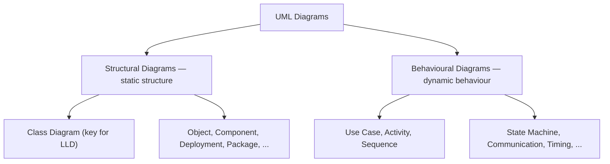
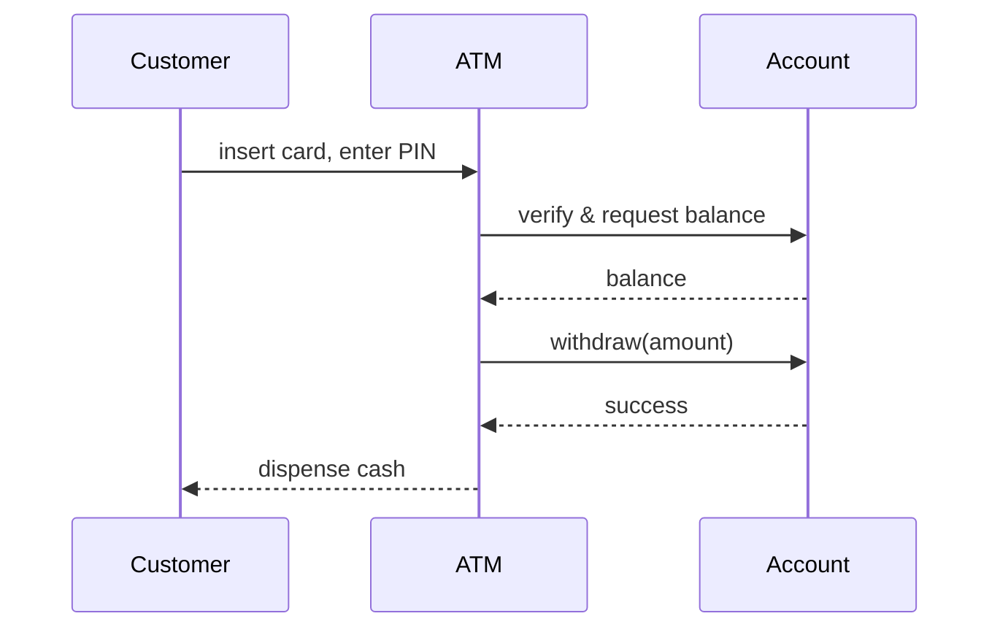
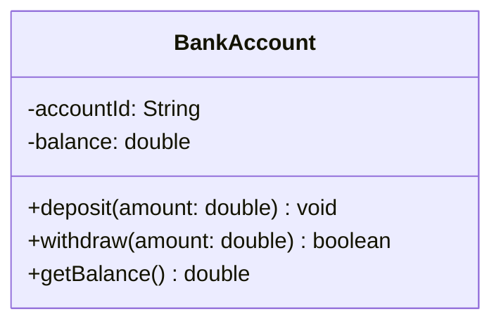
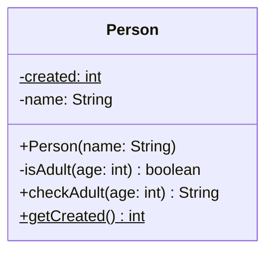
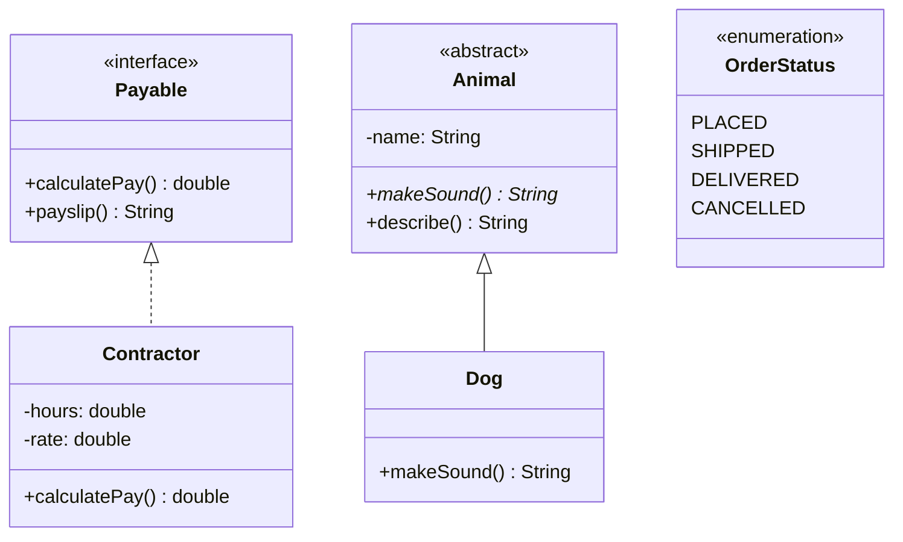
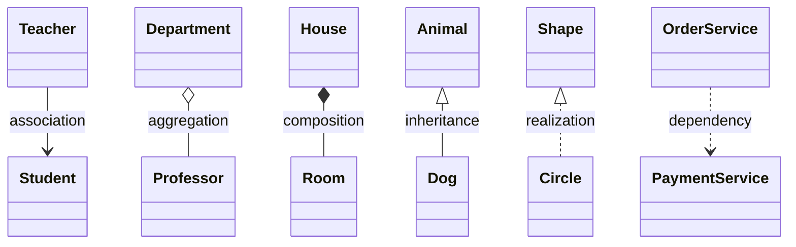
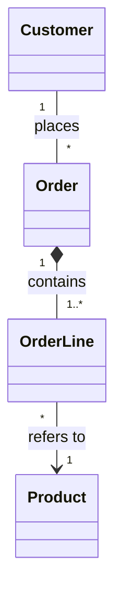
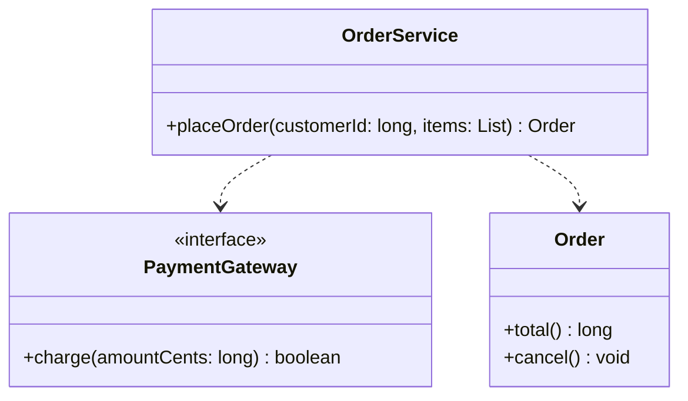
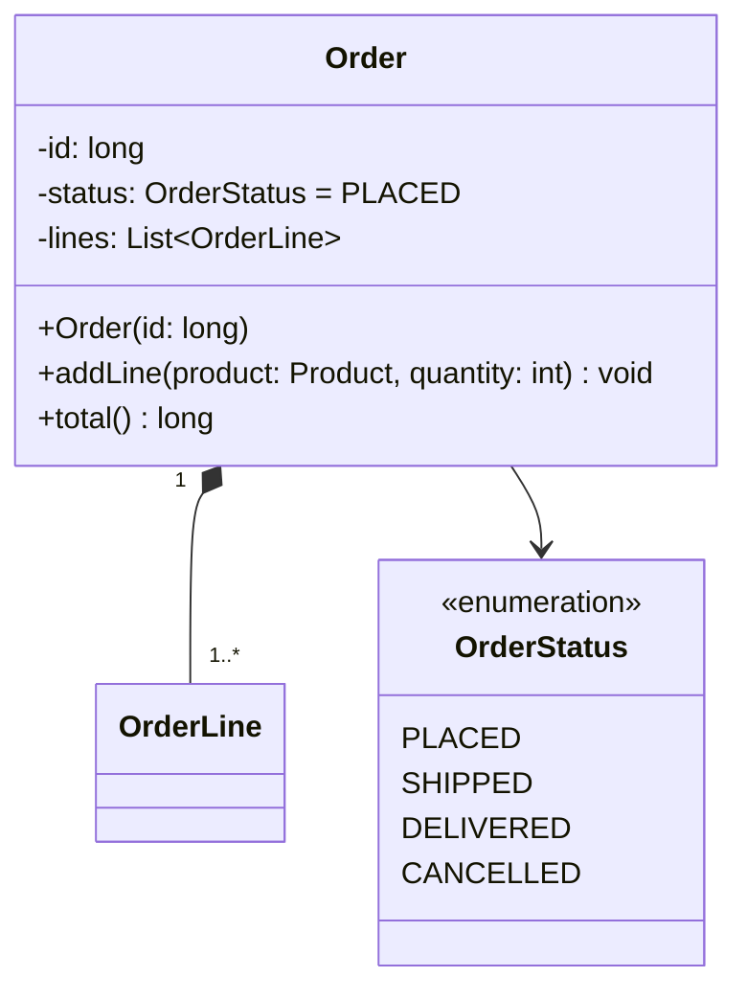

# UML — Drawing a Design Before You Build It

Three engineers discuss a payment system at a whiteboard. One draws boxes and lines, and within a minute everyone can see that `OrderService` depends on a `PaymentGateway` interface, that an `Order` owns its `OrderLine`s, and that `CardGateway` and `UpiGateway` both implement the interface. Without a shared notation, that same conversation takes paragraphs of prose, and still leaves each person with a slightly different picture.

**UML**, the *Unified Modeling Language*, is that shared notation. It grew out of the object-oriented methods of Grady Booch, James Rumbaugh and Ivar Jacobson in the mid-1990s, and the Object Management Group (OMG) adopted it as a standard in 1997 <abbr title="Martin Fowler, UML Distilled, 3rd ed., 2003, ch. 1">[4]</abbr>. The current version, UML 2.5.1, defines fourteen kinds of diagram <abbr title="OMG Unified Modeling Language 2.5.1, Annex A Diagrams">[1]</abbr>. Low-level design uses mainly one of them, the **class diagram**, plus the occasional sequence diagram, and that is where this lesson spends its time.

<div style="border-left:4px solid #195045;background:rgba(25,80,69,0.08);padding:0.6rem 1rem;border-radius:0 0.5rem 0.5rem 0;margin:1.25rem 0">

💡 **The core idea.**

- **Structural** diagrams show what a system *is made of* (classes, objects, components); **behavioural** diagrams show what *happens* over time (calls, workflows, state changes).
- A **class diagram** is a set of boxes (classes, interfaces, enumerations, with their attributes and operations) joined by lines whose ends say *how* two classes are related.
- Every line in a class diagram is a claim about the code. A diagram is only useful if those claims are true, so learn what each one means in code, and check it.

</div>

This lesson uses the relationships from [Relationships & Object Behaviour](/synapse/low-level-design/oop/relationships-and-object-behaviour) and the interfaces and abstract classes from [Abstraction & Interfaces](/synapse/low-level-design/oop/abstraction-interfaces-static-members-inner-classes). The Java language rules are in the Java guide's [Abstract Classes & Interfaces](/synapse/programming-languages/java/robust-oop/abstract-classes-and-interfaces) and [Enums & Records](/synapse/programming-languages/java/core-libraries/enums-and-records). Every output below was produced by running the code on Java 21 and Python 3.11.

**You'll be able to:** choose between a structural and a behavioural diagram for a given question; read and write a class box, including visibility markers, attribute and operation syntax and static members; draw interfaces, abstract classes and enumerations with UML's own notation; pick the right one of the six relationship lines and check it against the code; choose the conceptual, specification or implementation perspective for a given audience.

<div style="border-left:4px solid #15448e;background:rgba(21,68,142,0.08);padding:0.6rem 1rem;border-radius:0 0.5rem 0.5rem 0;margin:1.25rem 0">

📘 **How to read the Intuition boxes.** Each one is built in three moves:

1. **The mechanism** — what a piece of notation says about the code.
2. **A concrete bite** — a specific, runnable program where the code and a careless diagram disagree.
3. **The earned rule** — the decision heuristic, now justified rather than asserted, plus its cost.

</div>

---

## Table of contents

1. [What UML is, and its two families of diagrams](#1-what-uml-is-and-its-two-families-of-diagrams)
2. [Reading a class box](#2-reading-a-class-box)
3. [Interfaces, abstract classes and enumerations](#3-interfaces-abstract-classes-and-enumerations)
4. [Relationships between classes](#4-relationships-between-classes)
5. [Three perspectives on a class diagram](#5-three-perspectives-on-a-class-diagram)
6. [Mental-model summary](#6-mental-model-summary)
7. [Gotcha checklist](#7-gotcha-checklist)
8. [Check yourself](#-check-yourself)
9. [Sources](#-sources)

---

## 1. What UML is, and its two families of diagrams

<div style="border-left:4px solid #15448e;background:rgba(21,68,142,0.08);padding:0.6rem 1rem;border-radius:0 0.5rem 0.5rem 0;margin:1.25rem 0">

📘 **Definition.** UML is a standardised modelling language for specifying, visualising, constructing and documenting the structure and behaviour of software systems <abbr title="OMG Unified Modeling Language 2.5.1, clause 1 Scope">[1]</abbr>.

</div>

It provides a set of graphical notations for building abstract models of a system, covering both its static structure and its dynamic behaviour. Think of it as a toolkit of diagrams for mapping out how a system works, before or alongside writing the code, the way a map shows where everything is and how it connects before you set off.

**Real-life analogy.** Before anyone lays a brick, a house has blueprints: where each room goes, how the pipes connect, how the electricity flows. Without them, building gets messy, expensive and confusing. UML diagrams are the blueprints of software. They let a team agree on a design, avoid confusion, and catch problems while they are still cheap to fix, before the code is written.

UML diagrams fall into two families.

**Structural diagrams** describe the static structure of a system: what it contains, how its parts relate, and how data is organised. They are the architectural blueprints, showing the foundation, the components and their connections. They focus on the things that *exist* in the system (classes, objects, hardware), not on what happens while it runs.

**Behavioural diagrams** describe the dynamic behaviour of a system: how it behaves over time, how users interact with it, and how its parts communicate while it runs. They are like the script of a film, showing what happens, when, and who is involved. They focus on actions, interactions, processes and changes of state.

<div style="border-left:4px solid #15448e;background:rgba(21,68,142,0.08);padding:0.6rem 1rem;border-radius:0 0.5rem 0.5rem 0;margin:1.25rem 0">

📘 **The split in one line.** Structural = the parts that *exist* (classes, objects, hardware). Behavioural = what *happens* over time (actions, interactions, state changes).

</div>



UML 2.5.1 has seven structural diagrams <abbr title="OMG Unified Modeling Language 2.5.1, Annex A Diagrams">[1]</abbr>:

- **Class diagram:** classes, their attributes and operations, and the relationships between them; a map of the code's structure.
- **Object diagram:** a snapshot of particular objects and the links between them at one moment.
- **Component diagram:** how software components (modules) are organised and connected.
- **Composite structure diagram:** the internal parts of a class and how they work together.
- **Deployment diagram:** how software is placed onto hardware devices or servers.
- **Package diagram:** how related elements, such as classes, are grouped into packages.
- **Profile diagram:** extensions that customise UML for a particular platform or domain.

And seven behavioural diagrams:

- **Use case diagram:** what users (*actors*) can do with the system, at a high level.
- **Activity diagram:** workflows and business processes, much like a flowchart.
- **Sequence diagram:** the order of messages exchanged between objects over time.
- **Communication diagram:** the same interactions, arranged by which objects are connected rather than by time.
- **State machine diagram:** how an object moves between states in response to events.
- **Interaction overview diagram:** an activity-style flow whose steps are interactions.
- **Timing diagram:** how objects' states change against a time axis, useful for real-time systems.

A **sequence diagram** is the behavioural diagram you are most likely to draw in a design discussion. Time runs downwards, each participant has a vertical line, and each arrow is a call (solid) or a reply (dashed). Here a customer withdraws cash from an ATM:



The question decides the diagram. "What classes are there, and how are they connected?" is a class diagram. "In what order do these objects call each other to withdraw cash?" is a sequence diagram. "What states can an order be in?" is a state machine diagram.

---

## 2. Reading a class box

A UML class diagram gives an overview of a system's structure: its classes, interfaces and enumerations, their attributes and operations, and the relationships between them. It supports domain modelling, data modelling and architecture work, and it is used both for *forward engineering* (design first, then code) and *reverse engineering* (drawing the structure of code that already exists). Teams often sketch class diagrams early and refine them as the project goes on. A good class diagram lets someone new, a team member or a stakeholder, understand the structure of a system quickly, without reading the code.

A class is drawn as a rectangle with three compartments:

- **Top:** the class name, centred and in bold.
- **Middle:** the attributes (fields).
- **Bottom:** the operations (methods).



Each member starts with a **visibility marker** <abbr title="OMG Unified Modeling Language 2.5.1, clause 7, VisibilityKind">[1]</abbr>:

- **`+` public:** accessible from any class.
- **`-` private:** accessible only inside the class itself.
- **`#` protected:** accessible inside the class and its subclasses.
- **`~` package:** accessible inside the same package.

Showing these markers makes the class's encapsulation visible on the diagram: the `-` members are its internals, and the `+` members are its contract.

**Attributes** follow this syntax:

```text
visibility name: Type [multiplicity] = defaultValue
```

- **visibility:** one of `+`, `-`, `#`, `~`.
- **name:** the attribute's name.
- **Type:** its data type, such as `int` or `String`.
- **multiplicity:** optional; how many values the attribute holds, such as `[0..1]` for an optional value or `[1..*]` for at least one.
- **defaultValue:** optional; its initial value.

So the Java field `public int age = 21;` is written `+ age: int = 21`.

**Operations** follow this syntax:

```text
visibility name(parameterName: Type, ...): ReturnType
```

- **visibility:** one of `+`, `-`, `#`, `~`.
- **name:** the operation's name.
- **parameterName: Type:** each parameter, with its type.
- **ReturnType:** what the operation returns.

A **static** member, one that belongs to the class rather than to each object, is shown **underlined** <abbr title="OMG Unified Modeling Language 2.5.1, clause 9 Classification (static features)">[1]</abbr>. Constructors are often marked with a stereotype: UML's standard profile defines «Create», and many tools write «constructor» instead <abbr title="OMG Unified Modeling Language 2.5.1, clause 22 Standard Profile">[1]</abbr>. A **stereotype** is a label in guillemets, `«…»`, that gives an element a more specific meaning.

Here is a class with a private method, a public method, a private static counter and an instance field, followed by its class box:

```java run
class Person {
    private static int created = 0; // one counter for the class: underlined in UML
    private final String name;      // one value per object

    Person(String name) {
        this.name = name;
        created++;
    }

    private boolean isAdult(int age) {
        return age >= 18;
    }

    public String checkAdult(int age) {
        return name + ": is " + age + " an adult? " + (isAdult(age) ? "yes" : "no");
    }

    public static int getCreated() {
        return created;
    }
}

public class Main {
    public static void main(String[] args) {
        Person ada = new Person("Ada");
        Person sam = new Person("Sam");
        System.out.println(ada.checkAdult(20));
        System.out.println(sam.checkAdult(15));
        System.out.println("people created: " + Person.getCreated());
    }
}
```

```python run
class Person:
    _created = 0  # one counter for the class: underlined in UML

    def __init__(self, name: str) -> None:
        self._name = name  # one value per object
        Person._created += 1

    def _is_adult(self, age: int) -> bool:  # leading underscore: private by convention only
        return age >= 18

    def check_adult(self, age: int) -> str:
        return f"{self._name}: is {age} an adult? {'yes' if self._is_adult(age) else 'no'}"

    @staticmethod
    def get_created() -> int:
        return Person._created


ada = Person("Ada")
sam = Person("Sam")
print(ada.check_adult(20))
print(sam.check_adult(15))
print("people created:", Person.get_created())
```

**Output:**
```
Ada: is 20 an adult? yes
Sam: is 15 an adult? no
people created: 2
```



**Analysis.** Each line of the box maps to one member of the code. `private boolean isAdult(int age)` becomes `- isAdult(age: int): boolean`. The two static members, `created` and `getCreated()`, are underlined, so a reader knows there is one `created` counter for the whole class, not one per person. In Python, the leading underscore on `_is_adult` is only a convention: the language doesn't stop outside code from calling it. A `-` on a diagram of Python code records the intent, not something the language enforces.

**Intuition.**
*Mechanism.* A class box is a compressed declaration. The name of each member is what the code calls it; the marker before it says who may use it; the type after it says what it holds or returns; and underlining says whether it belongs to each object or to the class.

*Concrete bite.* Leave out the underline and the diagram tells a different story. Here `issued` is static and `number` is not:

```java run
class Ticket {
    private static int issued = 0; // shared by every Ticket
    private final int number;      // one per Ticket

    Ticket() {
        issued++;
        number = issued;
    }

    String describe() {
        return "ticket #" + number + " of " + issued + " issued";
    }
}

public class Main {
    public static void main(String[] args) {
        Ticket a = new Ticket();
        Ticket b = new Ticket();
        Ticket c = new Ticket();
        System.out.println(a.describe());
        System.out.println(b.describe());
        System.out.println(c.describe());
    }
}
```

```python run
class Ticket:
    issued = 0  # shared by every Ticket

    def __init__(self) -> None:
        Ticket.issued += 1
        self.number = Ticket.issued  # one per Ticket

    def describe(self) -> str:
        return f"ticket #{self.number} of {Ticket.issued} issued"


a = Ticket()
b = Ticket()
c = Ticket()
print(a.describe())
print(b.describe())
print(c.describe())
```

**Output:**
```
ticket #1 of 3 issued
ticket #2 of 3 issued
ticket #3 of 3 issued
```

The first ticket reports "of 3", because creating the later tickets changed the one shared counter. A reader who saw `- issued: int` without the underline would expect "#1 of 1", and would misunderstand both the output and the design.

<div style="border-left:4px solid #195045;background:rgba(25,80,69,0.08);padding:0.6rem 1rem;border-radius:0 0.5rem 0.5rem 0;margin:1.25rem 0">

💡 **Earned rule.** In a class box, show the visibility, the name and the type of every member you include, and underline every static member. If you leave something out to keep the diagram readable, leave out whole members, not the parts of a member that change its meaning.

The cost is a little more ink per line. It is far smaller than the cost of a reader building the wrong mental model from a member that looks like per-object state but is shared.

</div>

---

## 3. Interfaces, abstract classes and enumerations

**An interface** declares a contract that implementing classes must fulfil. In a diagram it has the stereotype `«interface»` above its name and lists its operations. Interfaces often have no attribute compartment. UML does allow an interface to have attributes; in Java, the only fields an interface can declare are constants.

A common claim is that an interface contains "only abstract methods". That has been false in Java since Java 8, which added `default` and `static` methods with bodies; Java 9 added `private` methods too <abbr title="The Java Language Specification, Java SE 21, §9.4 Method Declarations">[2]</abbr>. What an interface still cannot have is instance fields or constructors.

**An abstract class** cannot be instantiated, and may contain both implemented methods and *abstract* ones, which have no body and must be implemented by a subclass. UML's own notation for an abstract class is its name in *italics*, or the property `{abstract}` written after or below the name; abstract operations are also shown in italics <abbr title="OMG Unified Modeling Language 2.5.1, clause 9 Classification (abstract Classifiers)">[1]</abbr>. Many tools, including the Mermaid diagrams on this page, can't italicise a class name, so they write `«abstract»` instead. That is a tool convention, not a UML stereotype; when you draw by hand, use italics or `{abstract}`.

**An enumeration** is a type with a fixed set of named values, called *literals*. It has the stereotype `«enumeration»` above its name, and lists its literals in the compartment below.

```java run
import java.util.Arrays;
import java.util.Locale;

// An interface: abstract operations, plus (since Java 8) default methods with a body.
interface Payable {
    double calculatePay(); // abstract

    default String payslip() { // has a body
        return String.format(Locale.ROOT, "pay due: %.2f", calculatePay());
    }
}

class Contractor implements Payable {
    private final double hours;
    private final double rate;

    Contractor(double hours, double rate) {
        this.hours = hours;
        this.rate = rate;
    }

    public double calculatePay() {
        return hours * rate;
    }
}

// An abstract class: some operations implemented, some left to subclasses.
abstract class Animal {
    private final String name;

    protected Animal(String name) {
        this.name = name;
    }

    public abstract String makeSound(); // abstract: italic in UML

    public String describe() { // implemented
        return name + " says " + makeSound();
    }
}

class Dog extends Animal {
    Dog() {
        super("Dog");
    }

    public String makeSound() {
        return "Woof";
    }
}

enum OrderStatus { PLACED, SHIPPED, DELIVERED, CANCELLED }

public class Main {
    public static void main(String[] args) {
        Payable p = new Contractor(40, 25.0);
        System.out.println(p.payslip());
        System.out.println(new Dog().describe());
        System.out.println("statuses: " + Arrays.toString(OrderStatus.values()));
    }
}
```

```python run
from abc import ABC, abstractmethod
from enum import Enum


# Python's closest equivalent of an interface: an ABC with abstract methods.
# Like a Java default method, payslip() has a body.
class Payable(ABC):
    @abstractmethod
    def calculate_pay(self) -> float: ...

    def payslip(self) -> str:
        return f"pay due: {self.calculate_pay():.2f}"


class Contractor(Payable):
    def __init__(self, hours: float, rate: float) -> None:
        self._hours = hours
        self._rate = rate

    def calculate_pay(self) -> float:
        return self._hours * self._rate


# An abstract class: some operations implemented, some left to subclasses.
class Animal(ABC):
    def __init__(self, name: str) -> None:
        self._name = name

    @abstractmethod
    def make_sound(self) -> str: ...  # abstract: italic in UML

    def describe(self) -> str:  # implemented
        return f"{self._name} says {self.make_sound()}"


class Dog(Animal):
    def __init__(self) -> None:
        super().__init__("Dog")

    def make_sound(self) -> str:
        return "Woof"


class OrderStatus(Enum):
    PLACED = 1
    SHIPPED = 2
    DELIVERED = 3
    CANCELLED = 4


p: Payable = Contractor(40, 25.0)
print(p.payslip())
print(Dog().describe())
print("statuses: [" + ", ".join(s.name for s in OrderStatus) + "]")
```

**Output:**
```
pay due: 1000.00
Dog says Woof
statuses: [PLACED, SHIPPED, DELIVERED, CANCELLED]
```



**Analysis.** `payslip()` printed a formatted line, and its code lives in the interface, not in `Contractor`. `Animal` has one abstract operation, `makeSound()`, shown in italics, and one implemented operation, `describe()`, which calls it. In the diagram, `Payable` is labelled `«interface»`; `Animal` is labelled `«abstract»` only because Mermaid can't italicise its name; and `OrderStatus` lists its four literals. `Contractor` *realises* `Payable` (dashed line, hollow triangle), and `Dog` *inherits from* `Animal` (solid line, hollow triangle); section 4 covers both lines.

**Intuition.**
*Mechanism.* The three kinds of box say what a type is allowed to contain. An interface is a contract with no instance state. An abstract class can hold state and code, but some of its operations are left open. An enumeration is a closed set of values. Choosing the right box tells a reader, before they read any member, whether they can create an object of the type, extend it, or only use its fixed values.

*Concrete bite.* Someone who believes interfaces hold "only abstract methods" will look at `Payable` in the code, see `payslip()` with a body, and assume it must be a mistake, or an abstract class drawn with the wrong stereotype. The program above shows that it runs: `Contractor` never wrote `payslip()`, yet it has one. In the diagram, `payslip()` is not italic, because it is not abstract.

<div style="border-left:4px solid #195045;background:rgba(25,80,69,0.08);padding:0.6rem 1rem;border-radius:0 0.5rem 0.5rem 0;margin:1.25rem 0">

💡 **Earned rule.** Draw an interface with `«interface»` and show its default methods upright, since they have bodies. Draw an abstract class with an italic name or `{abstract}`, and italicise exactly the operations that are abstract. If your tool forces `«abstract»`, say so in a note, so readers don't take it for UML.

The cost is having to know which methods are abstract, which you need to know anyway to implement a subclass correctly.

</div>

---

## 4. Relationships between classes

The lines between boxes are the most informative part of a class diagram. UML has six that low-level design uses all the time, summarised here and explained one by one below:



**1. Association ("uses a").** A general, lasting relationship: one class holds a reference to another and uses it. It can be one-to-one, one-to-many or many-to-many.

- *Example:* a teacher teaches many students, and a student is taught by many teachers (many-to-many).
- *Notation:* a solid line between the two classes. An open arrowhead shows the direction of navigation, meaning which class holds the reference.

**2. Aggregation ("has a").** A whole–part relationship in which the parts can exist independently of the whole.

- *Example:* a department has professors. If the department is closed, the professors still exist.
- *Notation:* a solid line with a hollow diamond at the whole.

**3. Composition (strong "has a").** A stronger whole–part relationship in which the part belongs to at most one whole at a time, and is deleted with it <abbr title="OMG Unified Modeling Language 2.5.1, §9.5.3 Semantics (composite aggregation)">[1]</abbr>.

- *Example:* a house has rooms. If the house is demolished, so are its rooms.
- *Notation:* a solid line with a filled diamond at the whole.

**4. Inheritance (generalisation, "is a").** A subclass inherits the attributes and behaviour of a superclass, and may extend or override them.

- *Example:* a dog is an animal.
- *Notation:* a solid line with a hollow triangle pointing to the parent class.

**5. Realisation (implementation).** A class promises to provide the behaviour declared by an interface.

- *Example:* a `Circle` class implements the `Shape` interface.
- *Notation:* a dashed line with a hollow triangle pointing to the interface.

**6. Dependency.** A weaker, temporary relationship: a class uses another without holding on to it, for example as a method parameter, a local variable or a return type. A change to the used class may still force a change to the dependent one.

- *Example:* `OrderService` uses a `PaymentService` passed in to process a payment.
- *Notation:* a dashed line with an open arrow pointing to the class being used.

| Relationship | UML notation | Example | In the code |
| --- | --- | --- | --- |
| **Association** | ─── (or ──> for one direction) | Teacher ──> Student | a field holding the other object |
| **Aggregation** | ◇─── at the whole | Department ◇─── Professor | a field holding parts created elsewhere |
| **Composition** | ◆─── at the whole | House ◆─── Room | a field holding parts the whole creates and never hands out |
| **Inheritance** | ───▷ to the parent | Dog ───▷ Animal | `extends` |
| **Realisation** | ╌╌╌▷ to the interface | Circle ╌╌╌▷ Shape | `implements` |
| **Dependency** | ╌╌╌> to the used class | OrderService ╌╌╌> PaymentService | a parameter, local variable or return type, but no field |

Each line corresponds to something you can point at in the code:

```java run
import java.util.ArrayList;
import java.util.List;
import java.util.Locale;

class Student {
    final String name;
    Student(String name) { this.name = name; }
}

// Association: Teacher holds references to Students it did not create.
class Teacher {
    private final List<Student> students = new ArrayList<>();
    void teach(Student s) { students.add(s); }
    int classSize() { return students.size(); }
}

class Professor {
    final String name;
    Professor(String name) { this.name = name; }
}

// Aggregation: the Department receives Professors that exist without it.
class Department {
    private final List<Professor> staff;
    Department(List<Professor> staff) { this.staff = List.copyOf(staff); }
    int size() { return staff.size(); }
}

class Room {
    final String name;
    Room(String name) { this.name = name; }
}

// Composition: the House creates its Rooms and never hands them out.
class House {
    private final List<Room> rooms = List.of(new Room("Kitchen"), new Room("Bedroom"));
    int roomCount() { return rooms.size(); }
}

// Inheritance: a Dog is an Animal, and reuses its code.
class Animal {
    String breathe() { return "breathing"; }
}

class Dog extends Animal { }

// Realisation: Circle fulfils the Shape contract.
interface Shape {
    double area();
}

class Circle implements Shape {
    private final double radius;
    Circle(double radius) { this.radius = radius; }
    public double area() { return Math.PI * radius * radius; }
}

// Dependency: OrderService uses a PaymentService only as a parameter, and never stores it.
class PaymentService {
    String charge(int cents) { return "charged " + cents + " cents"; }
}

class OrderService {
    String checkout(int cents, PaymentService payments) { return payments.charge(cents); }
}

public class Main {
    public static void main(String[] args) {
        Teacher rao = new Teacher();
        rao.teach(new Student("Sam"));
        rao.teach(new Student("Riya"));
        System.out.println("association: teacher has " + rao.classSize() + " students");

        Department physics = new Department(List.of(new Professor("Iyer"), new Professor("Bose")));
        System.out.println("aggregation: department has " + physics.size() + " professors");

        System.out.println("composition: house has " + new House().roomCount() + " rooms");
        System.out.println("inheritance: dog is " + new Dog().breathe());
        System.out.println(String.format(Locale.ROOT, "realisation: circle area %.2f", new Circle(1).area()));
        System.out.println("dependency: " + new OrderService().checkout(1999, new PaymentService()));
    }
}
```

```python run
import math
from abc import ABC, abstractmethod


class Student:
    def __init__(self, name: str) -> None:
        self.name = name


# Association: Teacher holds references to Students it did not create.
class Teacher:
    def __init__(self) -> None:
        self._students: list[Student] = []

    def teach(self, s: Student) -> None:
        self._students.append(s)

    def class_size(self) -> int:
        return len(self._students)


class Professor:
    def __init__(self, name: str) -> None:
        self.name = name


# Aggregation: the Department receives Professors that exist without it.
class Department:
    def __init__(self, staff: list[Professor]) -> None:
        self._staff = tuple(staff)

    def size(self) -> int:
        return len(self._staff)


class Room:
    def __init__(self, name: str) -> None:
        self.name = name


# Composition: the House creates its Rooms and never hands them out.
class House:
    def __init__(self) -> None:
        self._rooms = (Room("Kitchen"), Room("Bedroom"))

    def room_count(self) -> int:
        return len(self._rooms)


# Inheritance: a Dog is an Animal, and reuses its code.
class Animal:
    def breathe(self) -> str:
        return "breathing"


class Dog(Animal):
    pass


# Realisation: Circle fulfils the Shape contract.
class Shape(ABC):
    @abstractmethod
    def area(self) -> float: ...


class Circle(Shape):
    def __init__(self, radius: float) -> None:
        self._radius = radius

    def area(self) -> float:
        return math.pi * self._radius * self._radius


# Dependency: OrderService uses a PaymentService only as a parameter, and never stores it.
class PaymentService:
    def charge(self, cents: int) -> str:
        return f"charged {cents} cents"


class OrderService:
    def checkout(self, cents: int, payments: PaymentService) -> str:
        return payments.charge(cents)


rao = Teacher()
rao.teach(Student("Sam"))
rao.teach(Student("Riya"))
print(f"association: teacher has {rao.class_size()} students")

physics = Department([Professor("Iyer"), Professor("Bose")])
print(f"aggregation: department has {physics.size()} professors")

print(f"composition: house has {House().room_count()} rooms")
print(f"inheritance: dog is {Dog().breathe()}")
print(f"realisation: circle area {Circle(1).area():.2f}")
print(f"dependency: {OrderService().checkout(1999, PaymentService())}")
```

**Output:**
```
association: teacher has 2 students
aggregation: department has 2 professors
composition: house has 2 rooms
inheritance: dog is breathing
realisation: circle area 3.14
dependency: charged 1999 cents
```

**Analysis.** Association, aggregation and composition all show up as a field; what tells them apart is who creates the object in the field and whether anyone else can hold it. `Teacher` and `Department` receive objects made elsewhere, while `House` calls `new Room(...)` itself and keeps the list private. Inheritance and realisation are the keywords `extends` and `implements`. A dependency has no field at all: `OrderService` sees a `PaymentService` only for the length of one `checkout` call.

**Intuition.**
*Mechanism.* Each line is a precise claim about the code. A plain association says "holds a reference". A hollow diamond adds "as a part, possibly shared". A filled diamond adds "creates it, and nobody else holds it". A dashed arrow says "uses it, but does not keep it". The triangles say "is a kind of" (solid) or "fulfils the contract of" (dashed).

*Concrete bite.* A diagram can claim composition while the code does something else. Here the diagram shows `House ◆─── Room`, but the constructor accepts rooms created outside:

```java run
import java.util.List;

class Room {
    private final String name;
    private String colour = "white";

    Room(String name) { this.name = name; }
    void paint(String colour) { this.colour = colour; }
    String describe() { return name + " (" + colour + ")"; }
}

// ⚠️ ANTI-PATTERN — drawn as composition, but the code lets two houses share a Room. Do not copy it.
class House {
    private final List<Room> rooms;

    House(List<Room> rooms) { this.rooms = rooms; }
    Room first() { return rooms.get(0); }
}

public class Main {
    public static void main(String[] args) {
        Room kitchen = new Room("Kitchen");
        House a = new House(List.of(kitchen));
        House b = new House(List.of(kitchen));

        System.out.println("same Room in both houses? " + (a.first() == b.first() ? "yes" : "no"));
        a.first().paint("blue");
        System.out.println("house b's first room after painting house a's: " + b.first().describe());
    }
}
```

```python run
class Room:
    def __init__(self, name: str) -> None:
        self._name = name
        self._colour = "white"

    def paint(self, colour: str) -> None:
        self._colour = colour

    def describe(self) -> str:
        return f"{self._name} ({self._colour})"


# ⚠️ ANTI-PATTERN — drawn as composition, but the code lets two houses share a Room. Do not copy it.
class House:
    def __init__(self, rooms: list[Room]) -> None:
        self._rooms = rooms

    def first(self) -> Room:
        return self._rooms[0]


kitchen = Room("Kitchen")
a = House([kitchen])
b = House([kitchen])

print("same Room in both houses?", "yes" if a.first() is b.first() else "no")
a.first().paint("blue")
print("house b's first room after painting house a's:", b.first().describe())
```

**Output:**
```
same Room in both houses? yes
house b's first room after painting house a's: Kitchen (blue)
```

Painting house A's kitchen painted house B's. The filled diamond promised that a room belongs to at most one house, and the code broke that promise in its constructor. Either the diagram should show a hollow diamond (aggregation), or `House` should create its own rooms, as the composition example above does.

<div style="border-left:4px solid #195045;background:rgba(25,80,69,0.08);padding:0.6rem 1rem;border-radius:0 0.5rem 0.5rem 0;margin:1.25rem 0">

💡 **Earned rule.** Draw the line that the code actually supports, and check it with three questions. Is there a field? (If not, it's a dependency.) Who creates the object in the field? (If the whole does, and never hands it out, it's composition; otherwise association or aggregation.) Is it `extends` or `implements`? (Solid or dashed triangle.)

The cost is that a diagram must be kept in step with the code, or marked as a sketch of intent. A diagram that silently disagrees with the code is worse than no diagram, because readers trust it.

</div>

---

## 5. Three perspectives on a class diagram

The same system can be drawn at different levels of detail, for different readers. Steve Cook and John Daniels named three perspectives, and Martin Fowler's *UML Distilled* made them widely known <abbr title="Steve Cook and John Daniels, Designing Object Systems, 1994; Martin Fowler, UML Distilled">[3]</abbr>.

**1. Conceptual perspective.** It gives a high-level view of the main concepts in the problem domain and how they relate. It is used early, to build a shared understanding with business analysts and domain experts.

- Classes represent real-world concepts, such as Customer, Order and Product.
- Attributes and operations are left out unless they are essential.
- Relationships are business-level associations, not implementation details.



**2. Specification perspective.** It defines the responsibilities of the system's classes, and how they collaborate, without code-level detail. It shows what operations each class must support, so interfaces and designs can be planned. It is meant for architects and designers.

- It includes interfaces, abstract classes and the key public operations.
- It shows associations, inheritance and realisation between classes and interfaces.
- It focuses on contracts: what each class promises to do.



**3. Implementation perspective.** It shows a concrete, code-level view: complete class definitions, visibility, attributes with types and default values, and full operation signatures. It is used mainly by developers during implementation.

- It shows all attributes and operations, public and private.
- It includes visibility markers.
- It may show types, default values and constructors.
- It draws every relationship explicitly: association, aggregation, composition, inheritance, realisation and dependency.



The perspective depends on the reader. A product manager needs the conceptual diagram and would be lost in the implementation one; a developer about to write `Order` needs the implementation diagram. In an interview or a design review, start conceptual to agree on the domain, then add specification detail for the classes that matter.

---

## 6. Mental-model summary

| Principle | Consequence |
|---|---|
| Structural diagrams show what exists; behavioural ones show what happens | Pick the diagram from the question: class diagram for structure, sequence diagram for call order |
| A class box is a compressed declaration | Visibility, name and type per member; static members underlined |
| Interfaces can have default methods; abstract classes are italic or `{abstract}` | `«abstract»` is a tool convention; italicise exactly the abstract operations |
| Association, aggregation and composition are all fields | Who creates the object, and who else can hold it, decides which line to draw |
| A dependency has no field | Dashed arrow for parameters, local variables and return types |
| Every line is a claim about the code | Check it against the code, or label the diagram a sketch |
| Conceptual, specification and implementation perspectives | Choose the level of detail for the reader |

## 7. Gotcha checklist

<div style="border-left:4px solid #da5233;background:rgba(218,82,51,0.08);padding:0.6rem 1rem;border-radius:0 0.5rem 0.5rem 0;margin:1.25rem 0">

| Symptom | Likely cause | Fix |
|---|---|---|
| Readers think each object has its own counter | a static attribute drawn without an underline | underline static members |
| An interface with a method body looks wrong | belief that interfaces hold only abstract methods | show default methods upright; they are allowed since Java 8 |
| `«abstract»` taught as UML notation | a tool convention copied as the standard | italic name or `{abstract}`; note the tool's limitation |
| A filled diamond, but parts are shared | composition drawn where the code receives parts from outside | draw aggregation, or make the whole create its parts |
| A dashed arrow, but the class stores the object | dependency drawn where there is a field | draw an association |
| A diagram nobody can read | implementation detail shown to a business audience | use the conceptual perspective |
| A diagram that contradicts the code | the code changed and the diagram didn't | update it, or mark it as a sketch of intent |

</div>

---

## ✅ Check yourself

One check per objective. Answer before you open anything.

```quiz
{"prompt": "You need to show in what order an OrderService, a PaymentGateway and an Inventory call each other during checkout. Which diagram fits?", "options": ["A sequence diagram", "A class diagram", "A deployment diagram"], "answer": "A sequence diagram"}
```

```quiz
{"prompt": "How does UML write the Java field: private static int count = 0; ?", "options": ["- count: int = 0, underlined", "+ count: int = 0", "- int count «static»"], "answer": "- count: int = 0, underlined"}
```

```quiz
{"prompt": "What is UML's own notation for an abstract class?", "options": ["Its name in italics, or {abstract} after or below the name", "The stereotype «abstract» above the name", "A dashed border"], "answer": "Its name in italics, or {abstract} after or below the name"}
```

```quiz
{"prompt": "OrderService receives a PaymentService as a parameter of checkout() and never stores it. Which line do you draw?", "options": ["A dashed arrow (dependency) from OrderService to PaymentService", "A filled diamond (composition) at OrderService", "A solid line with a hollow triangle"], "answer": "A dashed arrow (dependency) from OrderService to PaymentService"}
```

```quiz
{"prompt": "You are explaining an online shop's design to a product manager in your first meeting. Which perspective should your class diagram take?", "options": ["Conceptual: domain concepts and their relationships, with few or no members", "Implementation: every field, type and private method", "Specification: interfaces and every public operation signature"], "answer": "Conceptual: domain concepts and their relationships, with few or no members"}
```

<details>
<summary>A library system has <code>Library</code>, <code>Book</code>, <code>Member</code> and <code>Loan</code>. A library catalogues books that can move between branches; a member borrows a book through a <code>Loan</code>, which records the dates and is deleted with the member's account; a <code>LateFeeCalculator</code> is passed a loan to compute a fee. Sketch the relationships, and say which perspective you used.</summary>

`Library ◇─── Book` (aggregation: books exist independently and can move branches). `Member ◆─── Loan` (composition: loans are created for, and deleted with, the member's account). `Loan ───> Book` (association: a loan refers to the book it covers). `LateFeeCalculator ╌╌╌> Loan` (dependency: the loan is only a parameter). With only classes and relationships, and no attributes or operations, this is the conceptual perspective; adding `+calculate(loan: Loan): Money` to `LateFeeCalculator` would start moving it towards a specification diagram.

</details>

---

## 📚 Sources

1. Object Management Group, *OMG Unified Modeling Language (UML)*, version 2.5.1 (2017): clause 1 "Scope", clause 7 (VisibilityKind), clause 9 "Classification" (abstract classifiers, static features, §9.5.3 composite aggregation), clause 22 "Standard Profile", Annex A "Diagrams" — <https://www.omg.org/spec/UML/2.5.1/PDF>
2. *The Java Language Specification, Java SE 21*, §9.4 "Method Declarations" (interface `default`, `static` and `private` methods) — <https://docs.oracle.com/javase/specs/jls/se21/html/jls-9.html#jls-9.4>
3. Steve Cook and John Daniels, *Designing Object Systems: Object-Oriented Modelling with Syntropy* (Prentice Hall, 1994), on conceptual, specification and implementation perspectives.
4. Martin Fowler, *UML Distilled: A Brief Guide to the Standard Object Modeling Language*, 3rd edition (Addison-Wesley, 2003), ch. 1 (history of UML and perspectives).
5. Python 3 documentation, `abc` and `enum` — <https://docs.python.org/3/library/abc.html>, <https://docs.python.org/3/library/enum.html>

---

<div style="border-left:4px solid #6d28d9;background:rgba(109,40,217,0.08);padding:0.6rem 1rem;border-radius:0 0.5rem 0.5rem 0;margin:1.25rem 0">

🧪 **Predict, then check.**

1. In the Python `Ticket` program in section 2, change every `Ticket.issued` to `self.issued`. Predict the three lines it prints, and explain what `self.issued += 1` does to the class attribute.
2. In the Python program in section 3, add `Animal("Cat")` at the end. Predict what happens, then check the exact message.
3. In the same Java program, delete the body of `payslip()` and its `default` keyword, so it reads `String payslip();`. Predict which class now fails to compile.
4. In the composition bite in section 4, change `House` so that its constructor takes room *names* and creates the `Room`s itself. Predict what "same Room in both houses?" prints.

</div>

## Your Turn

Before you move on, check your understanding with the coach — explain the idea, apply it, weigh the trade-offs, then defend your reasoning.

<div class="concept-coach"></div>
