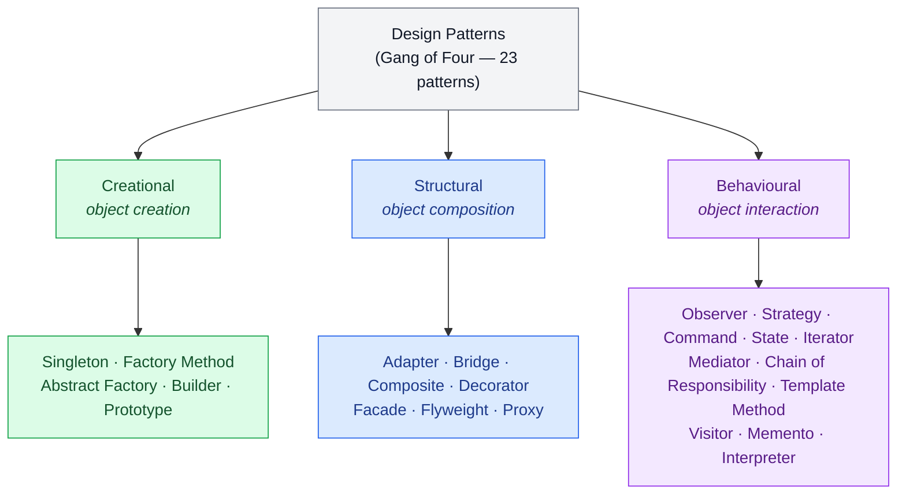

# Introduction to Design Patterns — Named Solutions to Recurring Problems

Every experienced developer has solved the same design problem more than once: "this class needs to be told when that one changes", "I need one of several algorithms, chosen at run time", "this object takes twelve optional settings". The second time, you remember roughly what worked. The tenth time, you have a name for it.

A **design pattern** is that name, together with a description of the problem it solves, the shape of the solution, and the consequences of using it. Patterns let a team say "use an Observer here" instead of describing callbacks for five minutes, and let a reader recognise a familiar structure in unfamiliar code. This chapter covers the 23 classic patterns, and this lesson explains what they are, where they came from, how they are grouped, and when to leave them out.

<div style="border-left:4px solid #195045;background:rgba(25,80,69,0.08);padding:0.6rem 1rem;border-radius:0 0.5rem 0.5rem 0;margin:1.25rem 0">

💡 **The core idea.**

- A design pattern is a *proven, named solution shape* for a design problem that keeps recurring. It is not a code template: you adapt it every time you use it.
- Every pattern comes with **consequences**, the costs and limits that come with its benefits. Knowing those is what separates using a pattern from copying one.
- The classic catalogue groups patterns by purpose: **creational** (how objects are created), **structural** (how objects are composed) and **behavioural** (how objects interact and share responsibilities).

</div>

This builds on [SOLID Principles](/synapse/low-level-design/solid-principles/solid-principles): most patterns are those principles applied to a specific, recurring situation. Every output below was produced by running the code on Java 21 and Python 3.11.

**You'll be able to:** say what a design pattern is, and name its four essential elements; recognise patterns that the Java and Python standard libraries already use; place a pattern in the right category from the problem it solves; decide when a pattern adds more complexity than it removes.

<div style="border-left:4px solid #15448e;background:rgba(21,68,142,0.08);padding:0.6rem 1rem;border-radius:0 0.5rem 0.5rem 0;margin:1.25rem 0">

📘 **How to read the Intuition boxes.** Each one is built in three moves:

1. **The mechanism** — what part of a design the pattern isolates, so that it can change on its own.
2. **A concrete bite** — a specific, runnable program where a pattern's consequence shows up.
3. **The earned rule** — the decision heuristic, now justified rather than asserted, plus its cost.

</div>

---

## Table of contents

1. [What a design pattern is](#1-what-a-design-pattern-is)
2. [Where design patterns came from](#2-where-design-patterns-came-from)
3. [The three categories of design patterns](#3-the-three-categories-of-design-patterns)
4. [When not to use a pattern](#4-when-not-to-use-a-pattern)
5. [Mental-model summary](#5-mental-model-summary)
6. [Gotcha checklist](#6-gotcha-checklist)
7. [Check yourself](#-check-yourself)
8. [Sources](#-sources)

---

## 1. What a design pattern is

<div style="border-left:4px solid #15448e;background:rgba(21,68,142,0.08);padding:0.6rem 1rem;border-radius:0 0.5rem 0.5rem 0;margin:1.25rem 0">

📘 **Definition.** A design pattern is a standard, proven solution to a design problem that recurs in software. It is not a code template but an abstract description, a blueprint, that you adapt to the code in front of you. The Gang of Four name four essential elements of every pattern: its **name**, the **problem** it applies to, the **solution** (the classes and objects involved and how they collaborate), and the **consequences**, meaning the results and trade-offs of applying it <abbr title="Gamma, Helm, Johnson and Vlissides, Design Patterns, 1994, §1.1">[1]</abbr>.

</div>

Put simply, design patterns save you from reinventing the wheel each time a familiar design problem comes back.

<div style="border-left:4px solid #195045;background:rgba(25,80,69,0.08);padding:0.6rem 1rem;border-radius:0 0.5rem 0.5rem 0;margin:1.25rem 0">

💡 **Insight.** Think of design patterns like recipes. To bake a cake, you don't experiment from scratch each time; you follow a proven recipe, and adjust it to your oven and your ingredients. Design patterns are tried-and-tested recipes for common design problems.

</div>

You already use patterns every day, because the standard libraries are built from them. Sorting with a comparator is the **Strategy** pattern: the sort algorithm stays fixed, and you pass in the part that varies. A `for` loop over a collection is the **Iterator** pattern: you walk the elements without knowing how the collection stores them.

```java run
import java.util.ArrayList;
import java.util.Comparator;
import java.util.Iterator;
import java.util.List;

public class Main {
    public static void main(String[] args) {
        List<String> words = new ArrayList<>(List.of("pear", "fig", "banana", "kiwi"));

        // Strategy: the sort is fixed; the comparison rule is passed in.
        words.sort(Comparator.comparing(String::length));
        System.out.println("by length:   " + words);
        words.sort(Comparator.reverseOrder());
        System.out.println("reverse a-z: " + words);

        // Iterator: walk the list without knowing how it is stored.
        Iterator<String> it = words.iterator();
        StringBuilder initials = new StringBuilder();
        while (it.hasNext()) {
            initials.append(it.next().charAt(0));
        }
        System.out.println("initials:    " + initials);
    }
}
```

```python run
words = ["pear", "fig", "banana", "kiwi"]

# Strategy: the sort is fixed; the comparison rule is passed in.
words.sort(key=len)
print("by length:  ", "[" + ", ".join(words) + "]")
words.sort(reverse=True)
print("reverse a-z:", "[" + ", ".join(words) + "]")

# Iterator: walk the list without knowing how it is stored.
it = iter(words)
initials = ""
while True:
    try:
        initials += next(it)[0]
    except StopIteration:
        break
print("initials:   ", initials)
```

**Output:**
```
by length:   [fig, pear, kiwi, banana]
reverse a-z: [pear, kiwi, fig, banana]
initials:    pkfb
```

**Analysis.** The same `sort` call produced two different orders, because the rule it used was a separate object (a `Comparator` in Java, a `key` function or `reverse` flag in Python) passed in from outside. The loop at the end used only `hasNext()` and `next()` (Python: `iter()`, `next()` and `StopIteration`), and would work unchanged on a set, a linked list or a file. In Python the strategy is just a function: in a language with first-class functions, several patterns shrink to a language feature. Peter Norvig made this point in 1996, finding that 16 of the 23 patterns are simpler, or invisible, in dynamic languages <abbr title="Peter Norvig, Design Patterns in Dynamic Languages, 1996">[3]</abbr>.

**Intuition.**
*Mechanism.* Each pattern isolates one thing that varies, behind a stable interface. Strategy isolates *the algorithm*; Iterator isolates *how a collection is traversed*. Code on the other side of that interface doesn't change when the varying part does.

*Concrete bite.* Consequences are part of every pattern, and Iterator's include what happens when the collection changes during a traversal. Here both programs remove even numbers from a list while looping over it:

```java run
import java.util.ArrayList;
import java.util.ConcurrentModificationException;
import java.util.List;

public class Main {
    public static void main(String[] args) {
        List<Integer> numbers = new ArrayList<>(List.of(2, 4, 6, 7));
        try {
            for (Integer n : numbers) {
                if (n % 2 == 0) numbers.remove(n); // changes the list mid-iteration
            }
        } catch (ConcurrentModificationException e) {
            System.out.println("Java stopped: " + e.getClass().getSimpleName());
        }
        System.out.println("list now: " + numbers);

        // The safe way: let the iterator do the removal.
        List<Integer> again = new ArrayList<>(List.of(2, 4, 6, 7));
        again.removeIf(n -> n % 2 == 0);
        System.out.println("removeIf: " + again);
    }
}
```

```python run
numbers = [2, 4, 6, 7]
for n in numbers:
    if n % 2 == 0:
        numbers.remove(n)  # changes the list mid-iteration
print("Python carried on")
print("list now:", "[" + ", ".join(map(str, numbers)) + "]")

# The safe way: build a new list instead of changing the one being iterated.
again = [n for n in [2, 4, 6, 7] if n % 2 != 0]
print("filtered:", "[" + ", ".join(map(str, again)) + "]")
```

**Output (Java):**
```
Java stopped: ConcurrentModificationException
list now: [4, 6, 7]
removeIf: [7]
```

**Output (Python):**
```
Python carried on
list now: [4, 7]
filtered: [7]
```

Java's `ArrayList` iterator is *fail-fast*: it noticed the list had changed under it and threw on the next step <abbr title="Java SE 21 API, java.util.ArrayList (fail-fast iterators) and ConcurrentModificationException">[4]</abbr>. Python's list iterator just moves its index forward, so removing the 2 shifted the 4 into the slot it had already visited, and the 4 was never checked. Python's documentation warns about exactly this <abbr title="Python 3 documentation, The for statement">[5]</abbr>. Both behaviours are consequences of how each library implemented the Iterator pattern, and neither is visible from the pattern's shape alone.

<div style="border-left:4px solid #195045;background:rgba(25,80,69,0.08);padding:0.6rem 1rem;border-radius:0 0.5rem 0.5rem 0;margin:1.25rem 0">

💡 **Earned rule.** When you learn a pattern, learn its consequences as well as its class diagram: what it costs, what it constrains, and how it fails. When you use one, name it in a comment or a class name (`PricingStrategy`, `OrderObserver`), so the next reader knows which consequences to expect.

The cost is study time up front. It is repaid the first time a pattern's known failure mode shows up and you recognise it instead of debugging it from scratch.

</div>

---

## 2. Where design patterns came from

The idea of a pattern language came from architecture. In *A Pattern Language* (1977), Christopher Alexander and his colleagues described recurring problems in towns and buildings, and the core of a solution to each. The Gang of Four quote his description: "Each pattern describes a problem which occurs over and over again in our environment, and then describes the core of the solution to that problem, in such a way that you can use this solution a million times over, without ever doing it the same way twice" <abbr title="Christopher Alexander et al., A Pattern Language, 1977, quoted in Gamma et al., Design Patterns, 1994, §1.1">[2]</abbr>.

Design patterns for software were formalised by the **Gang of Four (GoF)**, Erich Gamma, Richard Helm, Ralph Johnson and John Vlissides, in their 1994 book *Design Patterns: Elements of Reusable Object-Oriented Software* <abbr title="Gamma, Helm, Johnson and Vlissides, Design Patterns, 1994">[1]</abbr>. They catalogued 23 patterns that kept appearing in well-designed object-oriented software, and grouped them into three categories. The book's first chapter also gives two principles that run through almost every pattern in it: "Program to an interface, not an implementation", and "Favor object composition over class inheritance" <abbr title="Gamma, Helm, Johnson and Vlissides, Design Patterns, 1994, ch. 1">[1]</abbr>.

The catalogue was written for C++ and Smalltalk in 1994. Some patterns have since been absorbed into languages: Java's enhanced `for` loop is the Iterator pattern built into the syntax, and Python's functions make a one-method Strategy class unnecessary. The problems the patterns solve haven't gone away, which is why the names are still the shared vocabulary of design discussions and interviews.

---

## 3. The three categories of design patterns



**Creational patterns** are about how objects are created. They abstract the act of instantiation, so that the rest of the system doesn't depend on which concrete classes are created, or how.

<div style="border-left:4px solid #195045;background:rgba(25,80,69,0.08);padding:0.6rem 1rem;border-radius:0 0.5rem 0.5rem 0;margin:1.25rem 0">

💡 **Insight.** At a vending machine you press "Orange Juice", and the machine works out how to produce it: pour from a bottle, mix a concentrate, or use a fresh dispenser. You don't care how it's made; you just get your drink.

</div>

That is the idea behind the factory patterns: the creation logic is hidden from the caller, so it can change without the caller changing. The creational patterns are Singleton, Factory Method, Abstract Factory, Builder and Prototype, covered in [Creational Design Patterns](/synapse/low-level-design/design-patterns/creational-design-patterns).

**Structural patterns** are about how classes and objects are combined into larger structures, while keeping those structures flexible and efficient. Several of them let objects work together that otherwise couldn't, for example because their interfaces don't match.

<div style="border-left:4px solid #195045;background:rgba(25,80,69,0.08);padding:0.6rem 1rem;border-radius:0 0.5rem 0.5rem 0;margin:1.25rem 0">

💡 **Insight.** Your new phone charges over USB-C, but your old power adapter only has a micro-USB cable. Instead of replacing either, you plug in a small adapter that connects the two.

</div>

That adapter is the Adapter pattern: it lets incompatible components work together without changing either of them. The structural patterns are Adapter, Bridge, Composite, Decorator, Facade, Flyweight and Proxy, covered in [Structural Design Patterns](/synapse/low-level-design/design-patterns/structural-design-patterns).

**Behavioural patterns** are about how objects interact and divide responsibilities among themselves, while staying loosely coupled.

<div style="border-left:4px solid #195045;background:rgba(25,80,69,0.08);padding:0.6rem 1rem;border-radius:0 0.5rem 0.5rem 0;margin:1.25rem 0">

💡 **Insight.** In a restaurant, the waiter takes your order and passes it to the kitchen. You don't talk to the chef directly; the waiter sits between you and the kitchen.

</div>

That is the Mediator pattern: one object controls the communication between others, so they don't need to know about each other. The behavioural patterns are Observer, Strategy, Interpreter, Command, Chain of Responsibility, Mediator, State, Template Method, Visitor, Iterator and Memento. Ten of them are covered in four lessons: [Strategy, Template Method and State](/synapse/low-level-design/design-patterns/behavioural-design-patterns); [Command, Chain of Responsibility and Memento](/synapse/low-level-design/design-patterns/behavioural-requests-and-undo); [Observer and Mediator](/synapse/low-level-design/design-patterns/behavioural-object-communication); and [Iterator and Visitor](/synapse/low-level-design/design-patterns/behavioural-traversal). Interpreter, which builds a small language as a class hierarchy, is rarely needed outside parsers and is not covered.

Here is one small, real example from each category:

```java run
import java.util.ArrayList;
import java.util.List;
import java.util.function.Consumer;

// Creational: callers ask for a drink by name; only the factory knows the classes.
interface Drink { String serve(); }
class OrangeJuice implements Drink { public String serve() { return "orange juice, from concentrate"; } }
class Cola implements Drink { public String serve() { return "cola, from a can"; } }

class VendingMachine {
    static Drink make(String name) {
        return switch (name) {
            case "orange" -> new OrangeJuice();
            case "cola" -> new Cola();
            default -> throw new IllegalArgumentException("no such drink: " + name);
        };
    }
}

// Structural: an adapter lets a micro-USB cable fit a USB-C socket.
interface UsbC { String chargeViaUsbC(); }
class MicroUsbCable { String chargeViaMicroUsb() { return "power through micro-USB"; } }
class MicroUsbToUsbC implements UsbC {
    private final MicroUsbCable cable;
    MicroUsbToUsbC(MicroUsbCable cable) { this.cable = cable; }
    public String chargeViaUsbC() { return cable.chargeViaMicroUsb() + ", adapted to USB-C"; }
}

// Behavioural: an observer is told when something happens, without the sender knowing who it is.
class OrderEvents {
    private final List<Consumer<String>> listeners = new ArrayList<>();
    void subscribe(Consumer<String> listener) { listeners.add(listener); }
    void publish(String event) { listeners.forEach(l -> l.accept(event)); }
}

public class Main {
    public static void main(String[] args) {
        System.out.println("creational:  " + VendingMachine.make("orange").serve());

        UsbC socket = new MicroUsbToUsbC(new MicroUsbCable());
        System.out.println("structural:  " + socket.chargeViaUsbC());

        OrderEvents events = new OrderEvents();
        events.subscribe(e -> System.out.println("behavioural: email service saw '" + e + "'"));
        events.subscribe(e -> System.out.println("behavioural: stock service saw '" + e + "'"));
        events.publish("order 42 placed");
    }
}
```

```python run
from typing import Callable, Protocol


# Creational: callers ask for a drink by name; only the factory knows the classes.
class OrangeJuice:
    def serve(self) -> str:
        return "orange juice, from concentrate"


class Cola:
    def serve(self) -> str:
        return "cola, from a can"


def make_drink(name: str):
    drinks = {"orange": OrangeJuice, "cola": Cola}
    if name not in drinks:
        raise ValueError(f"no such drink: {name}")
    return drinks[name]()


# Structural: an adapter lets a micro-USB cable fit a USB-C socket.
class UsbC(Protocol):
    def charge_via_usb_c(self) -> str: ...


class MicroUsbCable:
    def charge_via_micro_usb(self) -> str:
        return "power through micro-USB"


class MicroUsbToUsbC:
    def __init__(self, cable: MicroUsbCable) -> None:
        self._cable = cable

    def charge_via_usb_c(self) -> str:
        return self._cable.charge_via_micro_usb() + ", adapted to USB-C"


# Behavioural: an observer is told when something happens, without the sender knowing who it is.
class OrderEvents:
    def __init__(self) -> None:
        self._listeners: list[Callable[[str], None]] = []

    def subscribe(self, listener: Callable[[str], None]) -> None:
        self._listeners.append(listener)

    def publish(self, event: str) -> None:
        for listener in self._listeners:
            listener(event)


print("creational: ", make_drink("orange").serve())

socket: UsbC = MicroUsbToUsbC(MicroUsbCable())
print("structural: ", socket.charge_via_usb_c())

events = OrderEvents()
events.subscribe(lambda e: print(f"behavioural: email service saw '{e}'"))
events.subscribe(lambda e: print(f"behavioural: stock service saw '{e}'"))
events.publish("order 42 placed")
```

**Output:**
```
creational:  orange juice, from concentrate
structural:  power through micro-USB, adapted to USB-C
behavioural: email service saw 'order 42 placed'
behavioural: stock service saw 'order 42 placed'
```

**Analysis.** The caller of `VendingMachine.make` never names `OrangeJuice`; the code that uses a `UsbC` socket never learns that a micro-USB cable is behind it; and `OrderEvents` doesn't know which services are listening. Each example hides a different thing: *which class gets created*, *how two objects are wired together*, and *who reacts to what*. Those three questions are the three categories.

**Intuition.**
*Mechanism.* The category tells you which kind of change a pattern absorbs. Creational patterns absorb changes to *which* concrete classes are created. Structural patterns absorb changes to *how* objects are assembled. Behavioural patterns absorb changes to *which object does what, and when*.

*Concrete bite.* Add an "apple" drink to the program above. Only `VendingMachine.make` changes, and the code that serves drinks is untouched. Add a third listener, say an analytics service, and only the line that subscribes it is new: `OrderEvents.publish` doesn't change. If you can't say which of the three kinds of change you expect, you can't pick the right pattern, and any pattern you add is a guess.

<div style="border-left:4px solid #195045;background:rgba(25,80,69,0.08);padding:0.6rem 1rem;border-radius:0 0.5rem 0.5rem 0;margin:1.25rem 0">

💡 **Earned rule.** Before choosing a pattern, name the change you expect: a new kind of object to create (creational), a new way to wire or wrap objects (structural), or a new behaviour or participant (behavioural). Then look in that category.

The cost is having to think about change before writing code. Without that, a pattern is decoration.

</div>

---

## 4. When not to use a pattern

Every pattern adds structure: extra interfaces, classes and indirection. That structure pays for itself only when the change it isolates actually happens. A few signs that a pattern is costing more than it saves:

- **It has one implementation, and no second one in sight.** A `ShapeFactory` that only ever makes circles, or a `Strategy` interface with a single strategy, is indirection with no benefit. [YAGNI](/synapse/low-level-design/basics/design-principles) applies to patterns too.
- **The language already does it.** In Python, a function is usually a better Strategy than a one-method class, a module is usually a better Singleton than a class with a private constructor, and keyword arguments usually make a Builder unnecessary.
- **Nobody can explain which change it absorbs.** A pattern added because it "might be useful later" is a guess, and it makes the code harder to read today.
- **The pattern is being forced to fit.** If you find yourself adding empty methods or `instanceof` checks to make the shape work, the problem is not the one the pattern was designed for.

Patterns are best discovered in your code, not imposed on it: write the simple version first, and refactor *towards* a pattern when the second or third variation arrives and the duplication or the growing conditional shows you which one fits. Each lesson in this chapter includes a "when to avoid" list for that reason.

---

## 5. Mental-model summary

| Principle | Consequence |
|---|---|
| A pattern = name + problem + solution + consequences | It is a shape to adapt, not code to paste |
| Patterns isolate one thing that varies behind a stable interface | Code on the other side doesn't change when that thing does |
| Standard libraries are full of patterns | `Comparator` and `key=` are Strategy; `for` loops use Iterator |
| Creational / structural / behavioural | Which objects are created / how they are assembled / who does what |
| Consequences matter as much as structure | Fail-fast vs silent iterators are both "Iterator" |
| Some patterns shrink to language features | Python functions, modules and keyword arguments replace several classes |
| Refactor towards a pattern when variation appears | Don't add structure for change that hasn't happened |

## 6. Gotcha checklist

<div style="border-left:4px solid #da5233;background:rgba(218,82,51,0.08);padding:0.6rem 1rem;border-radius:0 0.5rem 0.5rem 0;margin:1.25rem 0">

| Symptom | Likely cause | Fix |
|---|---|---|
| A factory, strategy or observer with exactly one implementation | pattern added before any variation existed | inline it; reintroduce it when a second variant arrives |
| `ConcurrentModificationException` in a loop | the collection was changed while being iterated | use `removeIf`, an explicit `Iterator.remove()`, or a new collection |
| Elements silently skipped in a Python loop | the list was changed while being iterated | build a new list (a comprehension) instead |
| A Python class that exists only to hold one method | a Java-style Strategy copied into Python | pass a function |
| Everyone calls the same structure by a different name | patterns used without naming them | name the pattern in class names or a comment |
| A pattern needs `instanceof` checks or empty methods to fit | the problem isn't the one the pattern solves | pick a different pattern, or none |

</div>

---

## ✅ Check yourself

One check per objective. Answer before you open anything.

```quiz
{"prompt": "Which of these is NOT one of the Gang of Four's four essential elements of a pattern?", "options": ["The exact code to copy", "The problem it applies to", "Its consequences"], "answer": "The exact code to copy"}
```

```quiz
{"prompt": "You call list.sort(Comparator.comparing(Person::age)) in Java, or people.sort(key=lambda p: p.age) in Python. Which pattern are you using?", "options": ["Strategy", "Singleton", "Adapter"], "answer": "Strategy"}
```

```quiz
{"prompt": "You need an existing class with a print(String) method to work where your code expects a Logger with log(String). Which category of pattern do you look in?", "options": ["Structural", "Creational", "Behavioural"], "answer": "Structural"}
```

```quiz
{"prompt": "A teammate adds a PaymentStrategy interface, a factory and a registry for a checkout that only ever charges cards through one provider. What is the best response?", "options": ["Use the provider directly, and introduce the interface when a second provider is actually needed", "Add two more strategies so the pattern is worth it", "Keep it: patterns always make code better"], "answer": "Use the provider directly, and introduce the interface when a second provider is actually needed"}
```

<details>
<summary>A notification service started with email only. It now sends email, SMS and push messages through a growing <code>if</code>/<code>else</code> on the channel name, and the team expects WhatsApp next. Which kind of change is this, and what would you reach for?</summary>

The change is "a new behaviour (a new channel) keeps arriving", and the place it lands, the `if`/`else`, is the code every notification goes through. Give each channel its own class behind a `Notifier` interface, which is the Strategy pattern (a behavioural pattern), and keep the choice of channel in one place, a small factory or a map from name to notifier (creational). With three channels already and a fourth on the way, the variation is real, so the extra classes pay for themselves; with only email, they would not have.

</details>

---

## 📚 Sources

1. Erich Gamma, Richard Helm, Ralph Johnson and John Vlissides, *Design Patterns: Elements of Reusable Object-Oriented Software* (Addison-Wesley, 1994), ch. 1, including §1.1 "What Is a Design Pattern?".
2. Christopher Alexander, Sara Ishikawa and Murray Silverstein, *A Pattern Language: Towns, Buildings, Construction* (Oxford University Press, 1977).
3. Peter Norvig, "Design Patterns in Dynamic Languages" (1996) — <https://norvig.com/design-patterns/>
4. `java.util.ArrayList` and `java.util.ConcurrentModificationException`, Java SE 21 API — <https://docs.oracle.com/en/java/javase/21/docs/api/java.base/java/util/ConcurrentModificationException.html>
5. Python 3 documentation, "The `for` statement" — <https://docs.python.org/3/reference/compound_stmts.html#the-for-statement>

---

<div style="border-left:4px solid #6d28d9;background:rgba(109,40,217,0.08);padding:0.6rem 1rem;border-radius:0 0.5rem 0.5rem 0;margin:1.25rem 0">

🧪 **Predict, then check.**

1. In the first program, sort the words with `Comparator.comparing(String::length).thenComparing(Comparator.naturalOrder())` (Python: `key=lambda w: (len(w), w)`). Predict the new order.
2. In the Python bite, start with `[2, 3, 4, 6, 7]` instead. Predict what the list contains after the loop.
3. In the Java bite, start with `[7, 2, 4, 6]` instead. Predict whether Java still throws, and what the list contains.
4. In the categories program, call `VendingMachine.make("tea")`. Predict what happens.

</div>

## Your Turn

Before you move on, check your understanding with the coach — explain the idea, apply it, weigh the trade-offs, then defend your reasoning.

<div class="concept-coach"></div>
