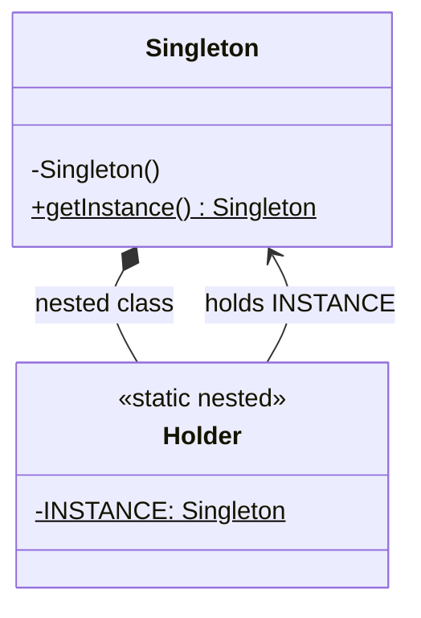
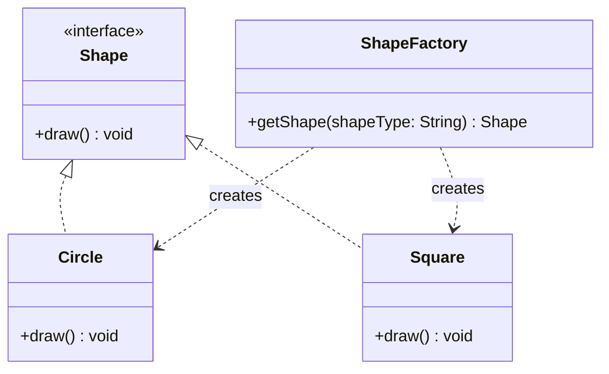
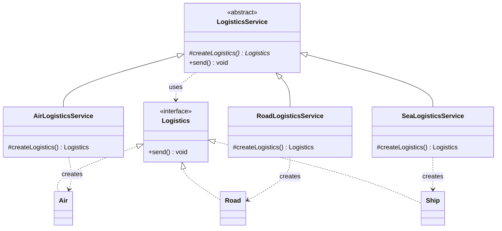
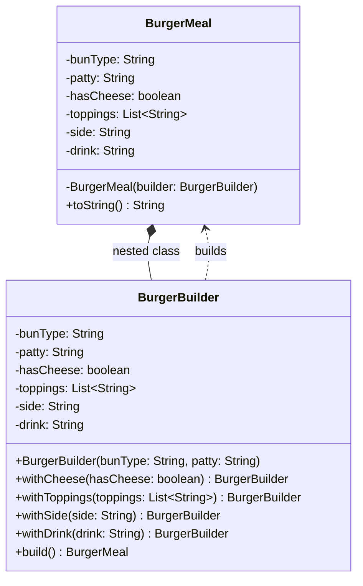
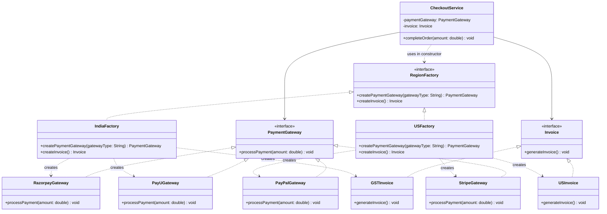
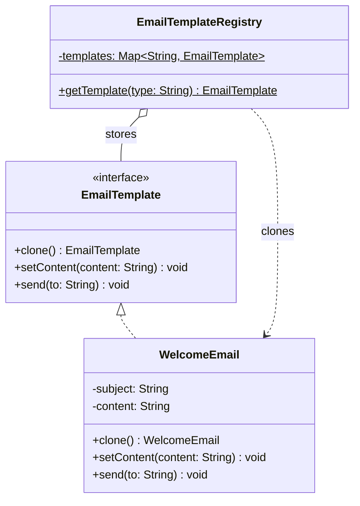

# Creational Design Patterns — Controlling How Objects Are Made

`new` is the most concrete line of code there is. Every `new EmailSender()` or `new RazorpayGateway()` fixes, at that spot, exactly which class is used, how it is configured, and when it is created. Scatter those lines through a system and every change to *what* gets created becomes a change to *the code that uses it*.

**Creational patterns** move those decisions into one place. Each one answers a different question: *how many* instances may exist (Singleton), *which class* to create (Factory), *how to assemble* an object with many optional parts (Builder), *which family* of related objects to create (Abstract Factory), and *whether to copy* an existing object instead of building one (Prototype).

<div style="border-left:4px solid #195045;background:rgba(25,80,69,0.08);padding:0.6rem 1rem;border-radius:0 0.5rem 0.5rem 0;margin:1.25rem 0">

💡 **The core idea.**

- **Singleton** guarantees one instance, but a lazy version is only correct if two threads can't both create it; it is also global state, which makes testing harder.
- **Factory** puts the choice of concrete class in one place. A *simple factory* is one method with a conditional; **Factory Method** lets subclasses decide, so a new product is a new subclass rather than an edit.
- **Builder** assembles an object step by step with named calls, so optional parts don't need telescoping constructors.
- **Abstract Factory** creates whole *families* of objects that must match, such as a region's payment gateway and its invoice.
- **Prototype** makes new objects by copying a configured one, and is only safe if the copy is deep enough.

</div>

This builds on [Introduction to Design Patterns](/synapse/low-level-design/design-patterns/introduction-design-patterns) and [SOLID Principles](/synapse/low-level-design/solid-principles/solid-principles). Prototype relies on the copying rules from [Relationships & Object Behaviour](/synapse/low-level-design/oop/relationships-and-object-behaviour). Every output below was produced by running the code on Java 21 and Python 3.11, except where a block is marked as not runnable.

**You'll be able to:** write a Singleton that stays single under concurrent access, and say when not to use one; tell a simple factory from Factory Method, and say which one keeps existing code closed to edits; replace telescoping constructors with a Builder that validates and copies its inputs; use an Abstract Factory to stop mismatched families of objects; implement Prototype with a copy that is deep enough for the template's fields.

<div style="border-left:4px solid #15448e;background:rgba(21,68,142,0.08);padding:0.6rem 1rem;border-radius:0 0.5rem 0.5rem 0;margin:1.25rem 0">

📘 **How to read the Intuition boxes.** Each one is built in three moves:

1. **The mechanism** — what decision about creation the pattern moves, and where to.
2. **A concrete bite** — a specific, runnable program where creating objects the naive way gives a wrong result.
3. **The earned rule** — the decision heuristic, now justified rather than asserted, plus its cost.

</div>

---

## Table of contents

1. [Singleton pattern](#1-singleton-pattern)
2. [Factory pattern](#2-factory-pattern)
3. [Builder pattern](#3-builder-pattern)
4. [Abstract Factory pattern](#4-abstract-factory-pattern)
5. [Prototype pattern](#5-prototype-pattern)
6. [Mental-model summary](#6-mental-model-summary)
7. [Gotcha checklist](#7-gotcha-checklist)
8. [Check yourself](#-check-yourself)
9. [Sources](#-sources)

---

## 1. Singleton pattern

<div style="border-left:4px solid #15448e;background:rgba(21,68,142,0.08);padding:0.6rem 1rem;border-radius:0 0.5rem 0.5rem 0;margin:1.25rem 0">

📘 **Definition.** "Ensure a class only has one instance, and provide a global point of access to it" <abbr title="Gamma, Helm, Johnson and Vlissides, Design Patterns, 1994, Singleton: Intent">[1]</abbr>.

</div>

**In simpler terms.** Sometimes you want exactly one shared object for the whole life of the program. Singleton restricts object creation, so that every part of the application gets the same object.

**The problem it solves.** Usually, creating several objects of a class does no harm. But for some things, such as a logger, the application's configuration, or a pool of database connections, several instances waste resources or behave inconsistently.

**Real-world analogy: the print spooler.** In an office, everyone sends documents to one shared printer. If each computer talked to the printer directly, on its own terms, the jobs would get jumbled or overlap, and the printer might crash.

<div style="border-left:4px solid #195045;background:rgba(25,80,69,0.08);padding:0.6rem 1rem;border-radius:0 0.5rem 0.5rem 0;margin:1.25rem 0">

💡 **Insight.** Instead, there's a print spooler: a background service that manages all print jobs.

</div>

Whoever starts the print, the job goes through the one spooler, which queues the jobs and handles them in order.

**Why is it a creational pattern?** Because it controls how objects are created. Instead of letting callers use `new`, it hands back an existing instance.

**Identifying the need.** Imagine a logging service that writes to a file. If every part of the application creates its own logger, you can get overwritten log lines, many open handles to the same file, and synchronisation problems. With one logger instance, every part of the program writes to the file through the same object, in a controlled way.

**How it works.** A Singleton usually has three parts:

- **A private constructor**, so no other class can call `new`.
- **A static field** that holds the single instance.
- **A public static method** that returns that instance.

However many times the method is called, it returns the same object. There are two main ways to decide *when* that object is created, each with its own trade-offs in memory, start-up time and thread safety.

**1. Eager loading (early initialisation).** The instance is created as soon as the class is loaded, whether or not it is ever used. Think of a fire extinguisher: it is always there, even if there is never a fire.

**2. Lazy loading (on-demand initialisation).** The instance is created only when it is first needed, the first time `getInstance()` is called. Think of a coffee machine that brews only when you press the button, and uses no energy until then.

```java run
// Eager: the instance is created when the class is initialised.
class EagerSingleton {
    private static final EagerSingleton INSTANCE = new EagerSingleton();

    private EagerSingleton() { // private: no one else can call new
        System.out.println("EagerSingleton constructed");
    }

    static EagerSingleton getInstance() {
        return INSTANCE; // always the same instance
    }
}

// Lazy: the instance is created on the first call. Safe only on one thread (see below).
class LazySingleton {
    private static LazySingleton instance;

    private LazySingleton() {
        System.out.println("LazySingleton constructed");
    }

    static LazySingleton getInstance() {
        if (instance == null) {
            instance = new LazySingleton();
        }
        return instance;
    }
}

public class Main {
    public static void main(String[] args) {
        System.out.println("main started");
        EagerSingleton a = EagerSingleton.getInstance();
        EagerSingleton b = EagerSingleton.getInstance();
        System.out.println("eager: same instance? " + (a == b));

        LazySingleton c = LazySingleton.getInstance();
        LazySingleton d = LazySingleton.getInstance();
        System.out.println("lazy: same instance? " + (c == d));
    }
}
```

```python run
# Eager: the instance is created when the module runs, before anyone asks for it.
class EagerSingleton:
    _instance = None

    def __new__(cls):
        # Python has no private constructor; overriding __new__ hands back the one instance.
        if cls._instance is None:
            print("EagerSingleton constructed")
            cls._instance = super().__new__(cls)
        return cls._instance

    @classmethod
    def get_instance(cls) -> "EagerSingleton":
        return cls()


EagerSingleton()  # this line is what makes it eager


# Lazy: the instance is created on the first call. Safe only on one thread (see below).
class LazySingleton:
    _instance = None

    def __new__(cls):
        if cls._instance is None:
            print("LazySingleton constructed")
            cls._instance = super().__new__(cls)
        return cls._instance

    @classmethod
    def get_instance(cls) -> "LazySingleton":
        return cls()


print("main started")
a = EagerSingleton.get_instance()
b = EagerSingleton()  # even a direct call returns the same object
print(f"eager: same instance? {'true' if a is b else 'false'}")

c = LazySingleton.get_instance()
d = LazySingleton.get_instance()
print(f"lazy: same instance? {'true' if c is d else 'false'}")
```

**Output (Java):**
```
main started
EagerSingleton constructed
eager: same instance? true
LazySingleton constructed
lazy: same instance? true
```

**Output (Python):**
```
EagerSingleton constructed
main started
eager: same instance? true
LazySingleton constructed
lazy: same instance? true
```

**Analysis.** Each class handed back one object however many times it was asked. The order of the first two lines differs, and that difference is instructive. Java initialises a class, and so runs `EagerSingleton`'s static field initialiser, only when the class is first used <abbr title="The Java Language Specification, Java SE 21, §12.4.1 When Initialization Occurs">[3]</abbr>, which here is after `main started`. Python runs `EagerSingleton()` as soon as the module reaches that line, before the rest of the program. Both lazy versions construct on the first `get_instance()` call.

Eager loading's properties: the object exists as soon as the class is initialised, it is always available, and it is thread-safe because the JVM initialises a class only once. It is very simple and needs no extra handling for threads, but it creates the instance even if it is never used, which matters for heavy objects. Lazy loading's properties: the instance starts as `null`, is created on the first call, and is returned from then on. It saves the cost of an instance nobody uses, but it is **not thread-safe** as written.

**Intuition.**
*Mechanism.* Lazy initialisation is a *check-then-act* sequence: test whether the instance exists, then create it. If two threads run the check before either runs the act, both see `null`, and both create an instance.

*Concrete bite.* Most of the time the two threads don't line up, so the bug hides. This program forces the unlucky timing on every run, by making each thread wait at a barrier after its null check, until the other has also passed it:

```java run
import java.util.concurrent.CyclicBarrier;
import java.util.concurrent.atomic.AtomicInteger;

// ⚠️ ANTI-PATTERN — lazy initialisation with no synchronisation. Do not copy it.
class LazySingleton {
    static final AtomicInteger created = new AtomicInteger();
    static final CyclicBarrier bothPastCheck = new CyclicBarrier(2); // demo only: forces the bad timing
    private static LazySingleton instance;

    private LazySingleton() {
        created.incrementAndGet();
    }

    static LazySingleton getInstance() throws Exception {
        if (instance == null) {
            bothPastCheck.await(); // wait until the other thread has also seen null
            instance = new LazySingleton();
        }
        return instance;
    }
}

public class Main {
    public static void main(String[] args) throws Exception {
        Runnable task = () -> {
            try {
                LazySingleton.getInstance();
            } catch (Exception e) {
                throw new RuntimeException(e);
            }
        };
        Thread t1 = new Thread(task);
        Thread t2 = new Thread(task);
        t1.start();
        t2.start();
        t1.join();
        t2.join();
        System.out.println("instances created: " + LazySingleton.created.get());
    }
}
```

```python run
import threading


# ⚠️ ANTI-PATTERN — lazy initialisation with no lock. Do not copy it.
class LazySingleton:
    created = 0
    both_past_check = threading.Barrier(2)  # demo only: forces the bad timing
    _instance = None

    def __init__(self) -> None:
        LazySingleton.created += 1

    @classmethod
    def get_instance(cls) -> "LazySingleton":
        if cls._instance is None:
            cls.both_past_check.wait()  # wait until the other thread has also seen None
            cls._instance = cls()
        return cls._instance


threads = [threading.Thread(target=LazySingleton.get_instance) for _ in range(2)]
for t in threads:
    t.start()
for t in threads:
    t.join()
print("instances created:", LazySingleton.created)
```

**Output:**
```
instances created: 2
```

The barrier only makes the timing reliable; without it the same thing happens occasionally, under load, in production. A bug like this is hard to reproduce, severe (it defeats the whole point of the pattern), and costly when the Singleton guards something like a connection pool or a configuration that must not be loaded twice.

There are several ways to make a lazy Singleton thread-safe:

- **Synchronized method.** Mark `getInstance()` as `synchronized`, so only one thread at a time can run it. It is simple and obviously correct, but every call takes the lock, even long after the instance exists, which can slow down code that calls it often from many threads.
- **Double-checked locking.** Check for `null` without the lock; only if it is `null`, take the lock and check again before creating. The lock is taken only around the first creation. The field must be `volatile`. Without it, the Java memory model allows another thread to see the reference to the new object before the object's constructor has finished, and so use a half-built Singleton; `volatile` guarantees that the write of a fully constructed object *happens before* any thread reads it <abbr title="The Java Language Specification, Java SE 21, §17.4 Memory Model">[3]</abbr>. This works from Java 5 onwards, when the memory model was revised. It is efficient, but slightly more complex.
- **Initialisation-on-demand holder ("Bill Pugh").** Put the instance in a static nested `Holder` class. The JVM initialises `Holder` only the first time `getInstance()` touches it, and class initialisation is guaranteed to happen exactly once, even with many threads <abbr title="The Java Language Specification, Java SE 21, §12.4.2 Detailed Initialization Procedure">[3]</abbr>. It is lazy and thread-safe with no `synchronized` or `volatile`, though the nested class is less obvious to beginners.
- **Eager loading**, as above, avoids the problem by creating the instance up front, at the cost of creating it even when it isn't used.
- **A single-element enum.** Bloch recommends it: "a single-element enum type is often the best way to implement a singleton" <abbr title="Joshua Bloch, Effective Java, 3rd ed., Item 3">[2]</abbr>. The JVM guarantees one instance, and it also survives serialisation and reflection attacks that can create second instances of the other forms.

Here all four thread-safe Java forms, and the two idiomatic Python ones, are hammered by eight threads at once:

```java run
import java.util.concurrent.CountDownLatch;
import java.util.concurrent.atomic.AtomicInteger;
import java.util.function.Supplier;

class SyncSingleton {
    static final AtomicInteger created = new AtomicInteger();
    private static SyncSingleton instance;

    private SyncSingleton() { created.incrementAndGet(); }

    static synchronized SyncSingleton getInstance() {
        if (instance == null) instance = new SyncSingleton();
        return instance;
    }
}

class DclSingleton {
    static final AtomicInteger created = new AtomicInteger();
    private static volatile DclSingleton instance;

    private DclSingleton() { created.incrementAndGet(); }

    static DclSingleton getInstance() {
        if (instance == null) {                    // first check, no lock
            synchronized (DclSingleton.class) {
                if (instance == null) {            // second check, under the lock
                    instance = new DclSingleton();
                }
            }
        }
        return instance;
    }
}

class HolderSingleton {
    static final AtomicInteger created = new AtomicInteger();

    private HolderSingleton() { created.incrementAndGet(); }

    private static class Holder { // initialised on first use, exactly once
        static final HolderSingleton INSTANCE = new HolderSingleton();
    }

    static HolderSingleton getInstance() { return Holder.INSTANCE; }
}

enum EnumSingleton {
    INSTANCE;

    EnumSingleton() { Counter.enumCreated.incrementAndGet(); } // an enum constructor can't touch its own statics
}

class Counter {
    static final AtomicInteger enumCreated = new AtomicInteger();
}

public class Main {
    static void hammer(String name, Supplier<Object> get, AtomicInteger created) throws InterruptedException {
        CountDownLatch start = new CountDownLatch(1);
        Thread[] threads = new Thread[8];
        for (int i = 0; i < threads.length; i++) {
            threads[i] = new Thread(() -> {
                try {
                    start.await();
                } catch (InterruptedException e) {
                    return;
                }
                get.get();
            });
            threads[i].start();
        }
        start.countDown(); // release all eight threads together
        for (Thread t : threads) t.join();
        System.out.println(name + ": instances created = " + created.get());
    }

    public static void main(String[] args) throws InterruptedException {
        hammer("synchronized method", SyncSingleton::getInstance, SyncSingleton.created);
        hammer("double-checked locking", DclSingleton::getInstance, DclSingleton.created);
        hammer("holder class", HolderSingleton::getInstance, HolderSingleton.created);
        hammer("enum", () -> EnumSingleton.INSTANCE, Counter.enumCreated);
    }
}
```

```python run
import threading


# Idiomatic Python: a module-level object. A module is imported once per process
# (it is cached in sys.modules), so everyone who imports `config` shares this object.
class _Config:
    created = 0

    def __init__(self) -> None:
        _Config.created += 1
        self.value = "default"


config = _Config()


# A structural mirror of the Java pattern, with a lock for double-checked locking.
class Singleton:
    created = 0
    _instance = None
    _lock = threading.Lock()

    def __new__(cls) -> "Singleton":
        if cls._instance is None:              # first check, no lock
            with cls._lock:
                if cls._instance is None:      # second check, under the lock
                    Singleton.created += 1
                    cls._instance = super().__new__(cls)
        return cls._instance


def hammer(name: str, get, created) -> None:
    start = threading.Event()

    def worker() -> None:
        start.wait()
        get()

    threads = [threading.Thread(target=worker) for _ in range(8)]
    for t in threads:
        t.start()
    start.set()  # release all eight threads together
    for t in threads:
        t.join()
    print(f"{name}: instances created = {created()}")


hammer("double-checked locking", Singleton, lambda: Singleton.created)
hammer("module-level object", lambda: config, lambda: _Config.created)
```

**Output (Java):**
```
synchronized method: instances created = 1
double-checked locking: instances created = 1
holder class: instances created = 1
enum: instances created = 1
```

**Output (Python):**
```
double-checked locking: instances created = 1
module-level object: instances created = 1
```

Python doesn't need five answers to this, because the Java variants are really about one problem: JVM class loading and thread visibility. In Python, a module-level object is the idiomatic Singleton, and a lock covers the cases where you need a class.

<div style="border-left:4px solid #195045;background:rgba(25,80,69,0.08);padding:0.6rem 1rem;border-radius:0 0.5rem 0.5rem 0;margin:1.25rem 0">

💡 **Earned rule.** If you truly need one instance in Java, use an enum or the holder class: both are lazy enough, thread-safe, and have no locking code to get wrong. In Python, use a module-level object. Never write an unsynchronised lazy `getInstance()` in code that might run on more than one thread.

The bigger cost is the pattern itself: a Singleton is global state that every caller reaches by name. Prefer creating one instance at start-up and *passing it in* (dependency injection), which gives you "one instance" without the global access point, and lets tests pass a fake.

</div>

**Pros of the Singleton pattern.**

- **Simple to use:** a clear, tidy way to manage a single shared instance, especially in a thread-safe form.
- **Guarantees one instance:** only one object of the class can exist, which suits shared resources.
- **One global access point:** centralised access to an application-wide resource, such as configuration.
- **Supports lazy loading:** many implementations create the instance only when it is first used, saving memory and start-up time.

**Cons of the Singleton pattern.**

- **Confused with Factory when it takes parameters:** if creating the instance needs arguments, which call's arguments win? That blurs the line with the Factory pattern and confuses the design.
- **Hard to unit test:** it holds global state that tests share and can't easily replace with a fake.
- **Callers are tightly coupled to it:** every class that calls `getInstance()` depends on that concrete class, which makes the code harder to change.
- **Race conditions:** in multithreaded code, creation must be guarded, which complicates the implementation, as shown above.
- **Two jobs in one class:** a Singleton controls its own instance count *and* does its real work, which goes against the Single Responsibility Principle.

**Conclusion.** Singleton is useful for genuinely shared resources, but its global state hurts testing and maintenance. Consider creating one instance and injecting it instead, which [Dependency Injection & Error Handling](/synapse/low-level-design/best-practices/dependency-injection-and-error-handling) covers.

The class diagram below shows the holder-class Singleton: the private constructor, and the static nested `Holder` class that lazily provides the single instance.



---

## 2. Factory pattern

There are two related ideas under the name "factory", and it matters which one you mean.

<div style="border-left:4px solid #15448e;background:rgba(21,68,142,0.08);padding:0.6rem 1rem;border-radius:0 0.5rem 0.5rem 0;margin:1.25rem 0">

📘 **Definition.** A **simple factory** is a method, often static, that takes some input and returns one of several concrete classes behind a common interface. It is a common idiom, but not one of the 23 GoF patterns. The GoF pattern is **Factory Method**: "Define an interface for creating an object, but let subclasses decide which class to instantiate. Factory Method lets a class defer instantiation to subclasses" <abbr title="Gamma, Helm, Johnson and Vlissides, Design Patterns, 1994, Factory Method: Intent">[1]</abbr>.

</div>

**In simpler terms.** Rather than calling a constructor directly, the code that needs an object asks a factory for one, based on some input or condition, and works only with the interface it gets back.

**When should you use it?**

- The client code needs to work with several types of object through one interface.
- Which class to create must be decided at run time.
- Creating the object is complex, or needs to be controlled in one place.

**Real-world analogy: ordering pizza.** In a pizza shop you say "I'd like a pizza", and the shop asks "Which type? Margherita, pepperoni or veggie?" The kitchen, the factory, makes the pizza you chose and hands it over. You, the client, don't care how it's made or which ingredients went into it.

<div style="border-left:4px solid #195045;background:rgba(25,80,69,0.08);padding:0.6rem 1rem;border-radius:0 0.5rem 0.5rem 0;margin:1.25rem 0">

💡 **Insight.** That is what a factory does in code: it creates an object based on some input, without exposing the instantiation logic to the client.

</div>

**Basic structure.** A factory has three parts:

- **Product:** an interface or abstract class that every product implements.
- **Concrete products:** the classes that implement it.
- **Factory:** a method that returns one of the concrete products, based on its input.

```java run
interface Shape {
    void draw();
}

class Circle implements Shape {
    @Override
    public void draw() {
        System.out.println("Drawing Circle");
    }
}

class Square implements Shape {
    @Override
    public void draw() {
        System.out.println("Drawing Square");
    }
}

// Simple factory: returns the right Shape for the input.
class ShapeFactory {
    public Shape getShape(String shapeType) {
        if (shapeType.equalsIgnoreCase("CIRCLE")) {
            return new Circle();
        } else if (shapeType.equalsIgnoreCase("SQUARE")) {
            return new Square();
        }
        throw new IllegalArgumentException("Unknown shape type: " + shapeType);
    }
}

public class Main {
    public static void main(String[] args) {
        ShapeFactory shapeFactory = new ShapeFactory();
        shapeFactory.getShape("CIRCLE").draw();
        shapeFactory.getShape("square").draw();
    }
}
```

```python run
from abc import ABC, abstractmethod


class Shape(ABC):
    @abstractmethod
    def draw(self) -> None: ...


class Circle(Shape):
    def draw(self) -> None:
        print("Drawing Circle")


class Square(Shape):
    def draw(self) -> None:
        print("Drawing Square")


# Simple factory: returns the right Shape for the input.
class ShapeFactory:
    def get_shape(self, shape_type: str) -> Shape:
        shape_type = shape_type.upper()
        if shape_type == "CIRCLE":
            return Circle()
        elif shape_type == "SQUARE":
            return Square()
        raise ValueError(f"Unknown shape type: {shape_type}")


shape_factory = ShapeFactory()
shape_factory.get_shape("CIRCLE").draw()
shape_factory.get_shape("square").draw()
```

**Output:**
```
Drawing Circle
Drawing Square
```

`ShapeFactory` returns different objects (`Circle`, `Square`) based on its input, and the caller only ever sees `Shape`. An unknown type throws an exception rather than returning `null`, so a typo fails at once instead of as a `NullPointerException` somewhere later.



### Real-life example: logistics services

A logistics application sends parcels by different modes of transport: by road, by air, and so on. Here is a first version, with the creation logic mixed into the business logic:

```java run
interface Logistics {
    void send();
}

class Road implements Logistics {
    @Override
    public void send() {
        System.out.println("Sending by road logic");
    }
}

class Air implements Logistics {
    @Override
    public void send() {
        System.out.println("Sending by air logic");
    }
}

// ⚠️ ANTI-PATTERN — object creation is buried in the business logic. Do not copy it.
class LogisticsService {
    public void send(String mode) {
        if (mode.equals("Air")) {
            Logistics logistics = new Air();
            logistics.send();
        } else if (mode.equals("Road")) {
            Logistics logistics = new Road();
            logistics.send();
        }
    }
}

public class Main {
    public static void main(String[] args) {
        LogisticsService service = new LogisticsService();
        service.send("Air");
        service.send("Road");
        service.send("Ship"); // not supported yet
        System.out.println("all three parcels handed over");
    }
}
```

```python run
from abc import ABC, abstractmethod


class Logistics(ABC):
    @abstractmethod
    def send(self) -> None: ...


class Road(Logistics):
    def send(self) -> None:
        print("Sending by road logic")


class Air(Logistics):
    def send(self) -> None:
        print("Sending by air logic")


# ⚠️ ANTI-PATTERN — object creation is buried in the business logic. Do not copy it.
class LogisticsService:
    def send(self, mode: str) -> None:
        if mode == "Air":
            logistics = Air()
            logistics.send()
        elif mode == "Road":
            logistics = Road()
            logistics.send()


service = LogisticsService()
service.send("Air")
service.send("Road")
service.send("Ship")  # not supported yet
print("all three parcels handed over")
```

**Output:**
```
Sending by air logic
Sending by road logic
all three parcels handed over
```

**The issue.** In `LogisticsService`, the `Air` or `Road` object is created directly, based on a string comparison, inside the `send` method. That causes several problems:

- **Tight coupling:** `LogisticsService` depends directly on the `Air` and `Road` classes.
- **Hard to extend:** adding a mode, such as `Ship` or `Drone`, means modifying `send`, which violates the Open/Closed Principle.
- **No separation of concerns:** creating objects and using them are mixed together.
- **Duplication:** the create-then-send code is repeated in each branch.
- **Hard to test and maintain:** you can't test the service with a fake transport.

**A simple factory.** Moving the creation into a factory separates the two concerns:

```java run
interface Logistics {
    void send();
}

class Road implements Logistics {
    @Override
    public void send() {
        System.out.println("Sending by road logic");
    }
}

class Air implements Logistics {
    @Override
    public void send() {
        System.out.println("Sending by air logic");
    }
}

// Simple factory: the one place that knows the concrete classes.
class LogisticsFactory {
    public static Logistics getLogistics(String mode) {
        if (mode.equalsIgnoreCase("Air")) {
            return new Air();
        } else if (mode.equalsIgnoreCase("Road")) {
            return new Road();
        }
        throw new IllegalArgumentException("Unknown logistics mode: " + mode);
    }
}

class LogisticsService {
    public void send(String mode) {
        Logistics logistics = LogisticsFactory.getLogistics(mode);
        logistics.send();
    }
}

public class Main {
    public static void main(String[] args) {
        LogisticsService service = new LogisticsService();
        service.send("Air");
        service.send("Road");
        try {
            service.send("Ship");
        } catch (IllegalArgumentException e) {
            System.out.println("refused: " + e.getMessage());
        }
    }
}
```

```python run
from abc import ABC, abstractmethod


class Logistics(ABC):
    @abstractmethod
    def send(self) -> None: ...


class Road(Logistics):
    def send(self) -> None:
        print("Sending by road logic")


class Air(Logistics):
    def send(self) -> None:
        print("Sending by air logic")


# Simple factory: the one place that knows the concrete classes.
class LogisticsFactory:
    @staticmethod
    def get_logistics(mode: str) -> Logistics:
        if mode.lower() == "air":
            return Air()
        elif mode.lower() == "road":
            return Road()
        raise ValueError(f"Unknown logistics mode: {mode}")


class LogisticsService:
    def send(self, mode: str) -> None:
        logistics = LogisticsFactory.get_logistics(mode)
        logistics.send()


service = LogisticsService()
service.send("Air")
service.send("Road")
try:
    service.send("Ship")
except ValueError as e:
    print("refused:", e)
```

**Output:**
```
Sending by air logic
Sending by road logic
refused: Unknown logistics mode: Ship
```

Creation now lives in `LogisticsFactory`, and `LogisticsService` deals only with sending. That brings real benefits: the service is decoupled from the concrete classes, creation is in one place instead of repeated, and each part can be tested on its own. But be precise about the Open/Closed Principle: adding `Ship` now leaves `LogisticsService` untouched, yet it still means **editing** `LogisticsFactory`. The service is closed for modification; the factory is not.

**Factory Method.** The GoF pattern removes that last edit. The class that uses the product declares an abstract *factory method*, and each subclass overrides it to create its own product. Adding a mode is then a new subclass, and no existing class changes:

```java run
interface Logistics {
    void send();
}

class Road implements Logistics {
    public void send() { System.out.println("Sending by road logic"); }
}

class Air implements Logistics {
    public void send() { System.out.println("Sending by air logic"); }
}

// The creator: its business logic uses a product made by an abstract factory method.
abstract class LogisticsService {
    protected abstract Logistics createLogistics(); // the factory method

    public void send() {
        Logistics logistics = createLogistics();
        logistics.send();
    }
}

class RoadLogisticsService extends LogisticsService {
    protected Logistics createLogistics() { return new Road(); }
}

class AirLogisticsService extends LogisticsService {
    protected Logistics createLogistics() { return new Air(); }
}

// Added later for ships: a new product and a new creator, and no edits to the classes above.
class Ship implements Logistics {
    public void send() { System.out.println("Sending by sea logic"); }
}

class SeaLogisticsService extends LogisticsService {
    protected Logistics createLogistics() { return new Ship(); }
}

public class Main {
    public static void main(String[] args) {
        LogisticsService[] services = {new AirLogisticsService(), new RoadLogisticsService(), new SeaLogisticsService()};
        for (LogisticsService service : services) {
            service.send();
        }
    }
}
```

```python run
from abc import ABC, abstractmethod


class Logistics(ABC):
    @abstractmethod
    def send(self) -> None: ...


class Road(Logistics):
    def send(self) -> None:
        print("Sending by road logic")


class Air(Logistics):
    def send(self) -> None:
        print("Sending by air logic")


# The creator: its business logic uses a product made by an abstract factory method.
class LogisticsService(ABC):
    @abstractmethod
    def create_logistics(self) -> Logistics: ...  # the factory method

    def send(self) -> None:
        logistics = self.create_logistics()
        logistics.send()


class RoadLogisticsService(LogisticsService):
    def create_logistics(self) -> Logistics:
        return Road()


class AirLogisticsService(LogisticsService):
    def create_logistics(self) -> Logistics:
        return Air()


# Added later for ships: a new product and a new creator, and no edits to the classes above.
class Ship(Logistics):
    def send(self) -> None:
        print("Sending by sea logic")


class SeaLogisticsService(LogisticsService):
    def create_logistics(self) -> Logistics:
        return Ship()


for service in [AirLogisticsService(), RoadLogisticsService(), SeaLogisticsService()]:
    service.send()
```

**Output:**
```
Sending by air logic
Sending by road logic
Sending by sea logic
```



**Analysis.** All three versions sent the same parcels, but they differ in where a new mode lands. In the first, `Ship` silently did nothing. In the simple factory, it was refused with a clear error, and supporting it means one edit to the factory. With Factory Method, `Ship` was added as two new classes, and `LogisticsService`, `AirLogisticsService` and `RoadLogisticsService` were not touched. The `send()` method in the abstract creator is the business logic that stays closed; `createLogistics()` is the one step each subclass opens up. (Mermaid can't italicise a class name, so `LogisticsService` is labelled `«abstract»`; the italic `createLogistics()` is the abstract operation.)

**Intuition.**
*Mechanism.* Both kinds of factory move `new` out of the business logic. A simple factory gathers every `new` into one method, which is easy to find and change, but must be edited for each new product. Factory Method distributes them across subclasses, so each new product comes with its own creator class, and existing classes stay closed. That is the trade: one place to edit, or no place to edit but a class per product.

*Concrete bite.* In the first program, `send("Ship")` printed nothing, and the program went on to report "all three parcels handed over". The `if`/`else if` chain had no final `else`, so an unsupported mode fell through silently, and a parcel was lost without an error. Moving creation into a factory gives you one natural place to refuse unknown input loudly.

<div style="border-left:4px solid #195045;background:rgba(25,80,69,0.08);padding:0.6rem 1rem;border-radius:0 0.5rem 0.5rem 0;margin:1.25rem 0">

💡 **Earned rule.** Move `new` out of business logic as soon as the choice of class depends on input. Start with a simple factory (or a map from name to constructor) that throws on unknown input. Switch to Factory Method when new products keep arriving and each one should be added without editing shared code, or when each creator subclass already exists for other reasons.

The cost of a simple factory is one class and a conditional that grows. The cost of Factory Method is a creator subclass for every product, which is a lot of classes if all they do is call `new`.

</div>

**Pros of the factory patterns.**

- **Loose coupling:** client code is decoupled from the concrete classes it uses, and works with interfaces instead.
- **Extensibility (Open/Closed Principle):** new products can be added without modifying the client code. With Factory Method, the creators that already exist don't change either.
- **Centralised creation (Single Responsibility Principle):** creating objects becomes a separate job, and business logic stays focused on what to *do* with them.
- **Flexibility:** which object to create can be decided at run time, from input, configuration or logic.
- **Reuse:** the creation logic lives in one place, instead of being repeated wherever an object is needed.

**Cons of the factory patterns.**

- **More complexity:** extra layers (factory classes, interfaces, creator subclasses) can be overkill in a small program.
- **More code:** factories and interfaces can look unnecessary in simple cases where one `new` would do.

---

## 3. Builder pattern

<div style="border-left:4px solid #15448e;background:rgba(21,68,142,0.08);padding:0.6rem 1rem;border-radius:0 0.5rem 0.5rem 0;margin:1.25rem 0">

📘 **Definition.** "Separate the construction of a complex object from its representation so that the same construction process can create different representations" <abbr title="Gamma, Helm, Johnson and Vlissides, Design Patterns, 1994, Builder: Intent">[1]</abbr>. In the GoF version, a *director* drives one of several builders through the same steps to produce different results. The form most Java code uses today, shown below, is Bloch's: a nested builder class with one method per optional part, and a final `build()` <abbr title="Joshua Bloch, Effective Java, 3rd ed., Item 2">[2]</abbr>.

</div>

**In simpler terms.** Ordering a custom burger, you choose the bun, the patty, the toppings and the sauces, and whether you want it grilled or toasted. The chef builds it step by step from your choices. The Builder pattern lets you construct a complex object the same way, by specifying its parts one at a time.

**Real-life analogy: a custom pizza order.** Ordering a pizza online, you choose the crust, the size, the toppings, the cheese and the sauce, step by step, and the shop builds the pizza from those choices. Different customers use the same process and get entirely different pizzas.

**Understanding the problem.** A `BurgerMeal` in an application has mandatory parts, a bun and a patty, and optional ones: sides, toppings and cheese. A single constructor for all of them looks like this:

```java run
import java.util.List;

class BurgerMeal {
    // Mandatory components
    private final String bun;
    private final String patty;

    // Optional components
    private final String sides;
    private final List<String> toppings;
    private final boolean cheese;

    // One constructor trying to handle every combination.
    BurgerMeal(String bun, String patty, String sides, List<String> toppings, boolean cheese) {
        this.bun = bun;
        this.patty = patty;
        this.sides = sides;
        this.toppings = toppings;
        this.cheese = cheese;
    }

    @Override
    public String toString() {
        return "BurgerMeal{bun=" + bun + ", patty=" + patty + ", sides=" + sides
                + ", toppings=" + toppings + ", cheese=" + cheese + "}";
    }
}

public class Main {
    public static void main(String[] args) {
        // Only the required details are wanted, but every argument must be passed.
        BurgerMeal burgerMeal = new BurgerMeal("wheat", "veg", null, null, false);
        System.out.println(burgerMeal);
    }
}
```

```python run
class BurgerMeal:
    # One constructor trying to handle every combination, with no defaults.
    def __init__(self, bun, patty, sides, toppings, cheese) -> None:
        self.bun = bun          # mandatory
        self.patty = patty      # mandatory
        self.sides = sides      # optional
        self.toppings = toppings  # optional
        self.cheese = cheese    # optional

    def __str__(self) -> str:
        return (f"BurgerMeal{{bun={self.bun}, patty={self.patty}, sides={self.sides}, "
                f"toppings={self.toppings}, cheese={str(self.cheese).lower()}}}")


# Only the required details are wanted, but every argument must be passed.
burger_meal = BurgerMeal("wheat", "veg", None, None, False)
print(str(burger_meal).replace("None", "null"))
```

**Output:**
```
BurgerMeal{bun=wheat, patty=veg, sides=null, toppings=null, cheese=false}
```

This works, but it causes several problems:

- **Hard to read and maintain:** callers must remember the order and type of every parameter, and it gets worse with each optional part added.
- **Needless `null`s:** a caller who wants no toppings or sides still has to pass `null` explicitly.
- **Risk of `NullPointerException`:** any code inside the class that forgets to check the optional fields for `null` can crash.
- **Too many constructor overloads:** covering the combinations (with cheese, without sides, toppings only) needs many constructors, which doesn't scale.
- **All in one go:** the whole object must be specified in a single call, which doesn't match the step-by-step way people actually order.

**The telescoping constructor anti-pattern.** A common attempt at a fix is a chain of overloaded constructors, each with one more optional parameter than the last:

```java run
// ⚠️ ANTI-PATTERN — each overload adds one more optional parameter. Do not copy it.
class BurgerMeal {
    private final String bun;
    private final String patty;
    private final boolean cheese;
    private final String side;
    private final String drink;

    BurgerMeal(String bun, String patty) {
        this(bun, patty, false, null, null);
    }

    BurgerMeal(String bun, String patty, boolean cheese) {
        this(bun, patty, cheese, null, null);
    }

    BurgerMeal(String bun, String patty, boolean cheese, String side) {
        this(bun, patty, cheese, side, null);
    }

    BurgerMeal(String bun, String patty, boolean cheese, String side, String drink) {
        this.bun = bun;
        this.patty = patty;
        this.cheese = cheese;
        this.side = side;
        this.drink = drink;
    }

    @Override
    public String toString() {
        return "BurgerMeal{bun=" + bun + ", patty=" + patty + ", cheese=" + cheese
                + ", side=" + side + ", drink=" + drink + "}";
    }
}

public class Main {
    public static void main(String[] args) {
        // The caller must remember the count and order of parameters for each overload.
        System.out.println(new BurgerMeal("wheat", "veg"));
        System.out.println(new BurgerMeal("wheat", "veg", true));
        System.out.println(new BurgerMeal("wheat", "veg", true, "fries"));
        System.out.println(new BurgerMeal("multigrain", "chicken", true, "fries", "coke"));

        // The customer wanted a coke and no side.
        System.out.println(new BurgerMeal("wheat", "veg", true, "coke"));
    }
}
```

```python run
# ⚠️ ANTI-PATTERN — positional parameters, Java-style, with no keywords. Do not copy it.
class BurgerMeal:
    def __init__(self, bun, patty, cheese=False, side=None, drink=None) -> None:
        self.bun, self.patty, self.cheese, self.side, self.drink = bun, patty, cheese, side, drink

    def __str__(self) -> str:
        return (f"BurgerMeal{{bun={self.bun}, patty={self.patty}, cheese={str(self.cheese).lower()}, "
                f"side={self.side or 'null'}, drink={self.drink or 'null'}}}")


# The caller must remember the count and order of the positional parameters.
print(BurgerMeal("wheat", "veg"))
print(BurgerMeal("wheat", "veg", True))
print(BurgerMeal("wheat", "veg", True, "fries"))
print(BurgerMeal("multigrain", "chicken", True, "fries", "coke"))

# The customer wanted a coke and no side.
print(BurgerMeal("wheat", "veg", True, "coke"))
```

**Output:**
```
BurgerMeal{bun=wheat, patty=veg, cheese=false, side=null, drink=null}
BurgerMeal{bun=wheat, patty=veg, cheese=true, side=null, drink=null}
BurgerMeal{bun=wheat, patty=veg, cheese=true, side=fries, drink=null}
BurgerMeal{bun=multigrain, patty=chicken, cheese=true, side=fries, drink=coke}
BurgerMeal{bun=wheat, patty=veg, cheese=true, side=coke, drink=null}
```

This cascade of constructors is hard to read and write, error-prone because of the parameter order, hard to maintain as fields are added, and inflexible, because callers must give parameters in one fixed order. It is most common in Java, which has no optional or default parameters (C++ and Python do), so the only way to offer combinations is overloading. That is exactly the problem the Builder pattern solves: it gives the caller full control over which parts to set, and keeps construction readable and safe.

**The solution.** The builder separates construction from the finished object. Each optional part has its own named method, and the object is created, complete and immutable, by `build()`:

```java run
import java.util.List;

class BurgerMeal {
    // Required components
    private final String bunType;
    private final String patty;

    // Optional components
    private final boolean hasCheese;
    private final List<String> toppings;
    private final String side;
    private final String drink;

    // Private: the only way to make a BurgerMeal is through the builder.
    private BurgerMeal(BurgerBuilder builder) {
        this.bunType = builder.bunType;
        this.patty = builder.patty;
        this.hasCheese = builder.hasCheese;
        this.toppings = List.copyOf(builder.toppings); // a copy the caller can't change later
        this.side = builder.side;
        this.drink = builder.drink;
    }

    @Override
    public String toString() {
        return "BurgerMeal{bunType=" + bunType + ", patty=" + patty + ", hasCheese=" + hasCheese
                + ", toppings=" + toppings + ", side=" + side + ", drink=" + drink + "}";
    }

    static class BurgerBuilder {
        // Required
        private final String bunType;
        private final String patty;

        // Optional, with defaults
        private boolean hasCheese;
        private List<String> toppings = List.of();
        private String side;
        private String drink;

        // The required parts go in the builder's constructor.
        BurgerBuilder(String bunType, String patty) {
            this.bunType = bunType;
            this.patty = patty;
        }

        BurgerBuilder withCheese(boolean hasCheese) {
            this.hasCheese = hasCheese;
            return this;
        }

        BurgerBuilder withToppings(List<String> toppings) {
            this.toppings = toppings;
            return this;
        }

        BurgerBuilder withSide(String side) {
            this.side = side;
            return this;
        }

        BurgerBuilder withDrink(String drink) {
            this.drink = drink;
            return this;
        }

        // Check the whole order once, then build an immutable meal.
        BurgerMeal build() {
            if (bunType == null || patty == null) {
                throw new IllegalStateException("a burger needs a bun and a patty");
            }
            return new BurgerMeal(this);
        }
    }
}

public class Main {
    public static void main(String[] args) {
        BurgerMeal plainBurger = new BurgerMeal.BurgerBuilder("wheat", "veg").build();

        BurgerMeal burgerWithCheese = new BurgerMeal.BurgerBuilder("wheat", "veg")
                .withCheese(true)
                .build();

        BurgerMeal loadedBurger = new BurgerMeal.BurgerBuilder("multigrain", "chicken")
                .withCheese(true)
                .withToppings(List.of("lettuce", "onion", "jalapeno"))
                .withSide("fries")
                .withDrink("coke")
                .build();

        // The coke order from before: no way to put the drink in the side by mistake.
        BurgerMeal cokeNoSide = new BurgerMeal.BurgerBuilder("wheat", "veg")
                .withCheese(true)
                .withDrink("coke")
                .build();

        System.out.println(plainBurger);
        System.out.println(burgerWithCheese);
        System.out.println(loadedBurger);
        System.out.println(cokeNoSide);
    }
}
```

```python run
from dataclasses import dataclass, field
from typing import Optional


# Idiomatic Python: keyword arguments with defaults cover most of what a Java builder is for.
@dataclass(frozen=True)
class BurgerMealPythonic:
    bun_type: str
    patty: str
    has_cheese: bool = False
    toppings: tuple[str, ...] = ()
    side: Optional[str] = None
    drink: Optional[str] = None


# A builder, for parity with Java: worth it when construction needs validation or several steps.
class BurgerMeal:
    def __init__(self, builder: "BurgerMeal.Builder") -> None:
        self.bun_type = builder._bun_type
        self.patty = builder._patty
        self.has_cheese = builder._has_cheese
        self.toppings = list(builder._toppings)  # a copy the caller can't change later
        self.side = builder._side
        self.drink = builder._drink

    def __str__(self) -> str:
        return (f"BurgerMeal{{bunType={self.bun_type}, patty={self.patty}, "
                f"hasCheese={str(self.has_cheese).lower()}, toppings=[{', '.join(self.toppings)}], "
                f"side={self.side or 'null'}, drink={self.drink or 'null'}}}")

    class Builder:
        def __init__(self, bun_type: str, patty: str) -> None:
            self._bun_type = bun_type
            self._patty = patty
            self._has_cheese = False
            self._toppings: list[str] = []
            self._side: Optional[str] = None
            self._drink: Optional[str] = None

        def with_cheese(self, has_cheese: bool) -> "BurgerMeal.Builder":
            self._has_cheese = has_cheese
            return self

        def with_toppings(self, toppings: list[str]) -> "BurgerMeal.Builder":
            self._toppings = toppings
            return self

        def with_side(self, side: str) -> "BurgerMeal.Builder":
            self._side = side
            return self

        def with_drink(self, drink: str) -> "BurgerMeal.Builder":
            self._drink = drink
            return self

        def build(self) -> "BurgerMeal":
            if not self._bun_type or not self._patty:
                raise ValueError("a burger needs a bun and a patty")
            return BurgerMeal(self)


plain_burger = BurgerMeal.Builder("wheat", "veg").build()
burger_with_cheese = BurgerMeal.Builder("wheat", "veg").with_cheese(True).build()
loaded_burger = (
    BurgerMeal.Builder("multigrain", "chicken")
    .with_cheese(True)
    .with_toppings(["lettuce", "onion", "jalapeno"])
    .with_side("fries")
    .with_drink("coke")
    .build()
)
coke_no_side = BurgerMeal.Builder("wheat", "veg").with_cheese(True).with_drink("coke").build()

print(plain_burger)
print(burger_with_cheese)
print(loaded_burger)
print(coke_no_side)

# The Pythonic version: named arguments make the coke order unambiguous too.
pythonic = BurgerMealPythonic("wheat", "veg", has_cheese=True, drink="coke")
print(pythonic.drink, pythonic.side)
```

**Output (Java):**
```
BurgerMeal{bunType=wheat, patty=veg, hasCheese=false, toppings=[], side=null, drink=null}
BurgerMeal{bunType=wheat, patty=veg, hasCheese=true, toppings=[], side=null, drink=null}
BurgerMeal{bunType=multigrain, patty=chicken, hasCheese=true, toppings=[lettuce, onion, jalapeno], side=fries, drink=coke}
BurgerMeal{bunType=wheat, patty=veg, hasCheese=true, toppings=[], side=null, drink=coke}
```

**Output (Python):**
```
BurgerMeal{bunType=wheat, patty=veg, hasCheese=false, toppings=[], side=null, drink=null}
BurgerMeal{bunType=wheat, patty=veg, hasCheese=true, toppings=[], side=null, drink=null}
BurgerMeal{bunType=multigrain, patty=chicken, hasCheese=true, toppings=[lettuce, onion, jalapeno], side=fries, drink=coke}
BurgerMeal{bunType=wheat, patty=veg, hasCheese=true, toppings=[], side=null, drink=coke}
coke None
```

**Understanding the code.**

- **Private constructor:** `BurgerMeal`'s constructor is private, so a meal can only be created through the builder.
- **Nested static `BurgerBuilder` class:** the builder holds the same fields as the meal while it is being configured; the meal itself is immutable once built.
- **Fluent API:** each `withXyz` method returns the builder itself, so calls can be chained readably.
- **Selective configuration:** only the required parts (`bunType`, `patty`) go in the builder's constructor. Everything else is optional, with a default.
- **The final step, `build()`:** it checks the whole order once, and returns the finished `BurgerMeal`. The meal copies the toppings list, so changing the caller's list afterwards can't change a meal that has already been built.

In Python, keyword arguments and `@dataclass` defaults remove most of the problem the Builder pattern solves in Java. Use a builder in Python when construction needs validation or several steps that defaults can't express.

**Analysis.** Every `withXyz` call names the part it sets, so the coke went into `drink` and nowhere else, and parts that weren't set kept safe defaults (an empty toppings list instead of `null`). In the telescoping version, the last call compiled and ran, and put the coke in the `side` field, because the four-argument constructor's fourth parameter is the side, and both are `String`s.

**Intuition.**
*Mechanism.* A constructor identifies arguments by position; a builder identifies them by method name. When several parameters share a type, position is the only thing distinguishing them, and the compiler can't tell a swapped pair from a correct one. A builder also gives you one place, `build()`, to validate the combination of parts before the object exists, and to copy anything mutable.

*Concrete bite.* `new BurgerMeal("wheat", "veg", true, "coke")` printed `side=coke, drink=null`. Nothing failed: the customer simply got a coke in place of fries and no drink. With the builder, `.withDrink("coke")` can only mean the drink.

<div style="border-left:4px solid #195045;background:rgba(25,80,69,0.08);padding:0.6rem 1rem;border-radius:0 0.5rem 0.5rem 0;margin:1.25rem 0">

💡 **Earned rule.** In Java, use a builder when a class has more than three or four constructor parameters, several of them optional, or several of the same type. Put the required parts in the builder's constructor, validate in `build()`, and copy mutable inputs there. In Python, use keyword arguments (or a dataclass) first, and a builder only when construction needs steps or validation.

The cost is a second class that mirrors the first, which must be kept in step whenever a field is added. For a class with two fields, a constructor is simpler.

</div>

**Why this is better.**

| Aspect | Constructor approach | Builder pattern |
| --- | --- | --- |
| Readability | poor: `null`s and long argument lists | good: each part is named |
| Flexibility | low: everything in one call | high: set only what you need |
| Maintainability | hard to scale as fields are added | easy to add options |
| Safety | swapped or `null` arguments compile fine | parts are named, and `build()` validates |

**When to use it.**

- An object has many fields, especially many optional ones, which makes constructors messy and error-prone.
- You want the finished object to be immutable: the builder collects the parts step by step, and the object is fixed once built.
- You want readable object creation, for example for domain models or configuration objects, where the fluent style makes the intent clear.

**When to avoid it.**

- **The class has only one or two fields:** a constructor is simpler and shorter.
- **You don't need customisation or immutability:** for a small, mutable object built in one place, a builder adds needless complexity.

**Pros of the Builder pattern.**

- **No telescoping constructors:** one builder replaces the cascade of overloads.
- **Immutability:** the finished object can be immutable, which makes it safer, including when shared between threads.
- **Readable creation:** the fluent API makes construction expressive and easy to follow.
- **Good for complex configuration:** objects with many optional or conditional parts stay organised.

**Cons of the Builder pattern.**

- **More set-up:** you have to write a separate builder class, which adds boilerplate.
- **Overkill for small classes:** for one or two fields, a builder adds needless complexity.
- **A second class to maintain:** the builder must be updated alongside the class it builds.

### Real-world products using the Builder pattern

**1. Lombok's `@Builder` annotation (Java).** Lombok is a Java library that generates boilerplate code from annotations. Its `@Builder` annotation generates a builder class for you, so instead of writing the builder by hand you annotate the class:

<div style="border-left:4px solid #da5233;background:rgba(218,82,51,0.08);padding:0.6rem 1rem;border-radius:0 0.5rem 0.5rem 0;margin:1.25rem 0">

⚠️ **Watch out.** These two snippets need Lombok on the classpath to compile, so they are not runnable here. The hand-written equivalent below them is the runnable version.

</div>

```java
// requires Lombok: not runnable without the annotation processor
import lombok.Builder;

@Builder
class User {
    private String name;
    private int age;
    private String address;
}
```

Objects are then built with a fluent API:

```java
// requires Lombok: uses the @Builder-generated User above
User user = User.builder()
            .name("John")
            .age(30)
            .address("NYC")
            .build();
```

Here is the same builder written by hand, so you can see what Lombok generates and run it without the annotation processor:

```java run
// Hand-written equivalent of the Lombok @Builder class above.
class User {
    private final String name;
    private final int age;
    private final String address;

    private User(UserBuilder builder) {
        this.name = builder.name;
        this.age = builder.age;
        this.address = builder.address;
    }

    public static UserBuilder builder() {
        return new UserBuilder();
    }

    @Override
    public String toString() {
        return "User{name=" + name + ", age=" + age + ", address=" + address + "}";
    }

    static class UserBuilder {
        private String name;
        private int age;
        private String address;

        public UserBuilder name(String name) {
            this.name = name;
            return this;
        }

        public UserBuilder age(int age) {
            this.age = age;
            return this;
        }

        public UserBuilder address(String address) {
            this.address = address;
            return this;
        }

        public User build() {
            return new User(this);
        }
    }
}

public class Main {
    public static void main(String[] args) {
        User user = User.builder()
                .name("John")
                .age(30)
                .address("NYC")
                .build();
        System.out.println(user);
    }
}
```

```python run
# The same builder in Python, written by hand.
class User:
    def __init__(self, builder: "User.Builder") -> None:
        self._name = builder._name
        self._age = builder._age
        self._address = builder._address

    @staticmethod
    def builder() -> "User.Builder":
        return User.Builder()

    def __str__(self) -> str:
        return f"User{{name={self._name}, age={self._age}, address={self._address}}}"

    class Builder:
        def __init__(self) -> None:
            self._name = None
            self._age = 0
            self._address = None

        def name(self, name: str) -> "User.Builder":
            self._name = name
            return self

        def age(self, age: int) -> "User.Builder":
            self._age = age
            return self

        def address(self, address: str) -> "User.Builder":
            self._address = address
            return self

        def build(self) -> "User":
            return User(self)


user = User.builder().name("John").age(30).address("NYC").build()
print(user)
```

**Output:**
```
User{name=John, age=30, address=NYC}
```

**2. A shopping-cart item.** Think about the item in an online shopping cart. Adding it stores more than a product ID: a quantity, a size or colour, a delivery option, gift wrapping, a "save for later" flag, a discounted price or offer tag. Each customer sets these differently. A builder suits an object like this: it is configured step by step, and should be consistent and immutable once added to the cart.

The class diagram below shows the structure of the `BurgerMeal` builder.



---

## 4. Abstract Factory pattern

<div style="border-left:4px solid #15448e;background:rgba(21,68,142,0.08);padding:0.6rem 1rem;border-radius:0 0.5rem 0.5rem 0;margin:1.25rem 0">

📘 **Definition.** "Provide an interface for creating families of related or dependent objects without specifying their concrete classes" <abbr title="Gamma, Helm, Johnson and Vlissides, Design Patterns, 1994, Abstract Factory: Intent">[1]</abbr>.

</div>

**In simpler terms.** You use it when you have several factories, each producing a set of objects that are meant to work together.

**When should you use it?**

- Several related objects must be created as one consistent set, such as a payment gateway and its matching invoice generator.
- Which objects to create depends on a context, such as country, theme or platform.
- Client code should not depend on the concrete product classes.
- The products in a family must stay consistent, for example a US payment gateway always paired with a US-style invoice.

### Real-life example: a checkout service

A checkout service takes a payment and generates an invoice. The first version creates both itself:

```java run
interface PaymentGateway {
    void processPayment(double amount);
}

class RazorpayGateway implements PaymentGateway {
    public void processPayment(double amount) {
        System.out.println("Processing INR payment via Razorpay: " + amount);
    }
}

class PayUGateway implements PaymentGateway {
    public void processPayment(double amount) {
        System.out.println("Processing INR payment via PayU: " + amount);
    }
}

interface Invoice {
    void generateInvoice();
}

class GSTInvoice implements Invoice {
    public void generateInvoice() {
        System.out.println("Generating GST Invoice for India.");
    }
}

// ⚠️ ANTI-PATTERN — the service hard-codes which gateway and invoice to create. Do not copy it.
class CheckoutService {
    private final String gatewayType;

    CheckoutService(String gatewayType) {
        this.gatewayType = gatewayType;
    }

    void checkOut(double amount) {
        PaymentGateway paymentGateway;
        if (gatewayType.equals("razorpay")) {
            paymentGateway = new RazorpayGateway();
        } else {
            paymentGateway = new PayUGateway();
        }
        paymentGateway.processPayment(amount);

        Invoice invoice = new GSTInvoice(); // always GST, whatever the country
        invoice.generateInvoice();
    }
}

public class Main {
    public static void main(String[] args) {
        new CheckoutService("razorpay").checkOut(1500.00);
        System.out.println("---");
        new CheckoutService("stripe").checkOut(49.99); // a US customer
    }
}
```

```python run
from abc import ABC, abstractmethod


class PaymentGateway(ABC):
    @abstractmethod
    def process_payment(self, amount: float) -> None: ...


class RazorpayGateway(PaymentGateway):
    def process_payment(self, amount: float) -> None:
        print(f"Processing INR payment via Razorpay: {amount}")


class PayUGateway(PaymentGateway):
    def process_payment(self, amount: float) -> None:
        print(f"Processing INR payment via PayU: {amount}")


class Invoice(ABC):
    @abstractmethod
    def generate_invoice(self) -> None: ...


class GSTInvoice(Invoice):
    def generate_invoice(self) -> None:
        print("Generating GST Invoice for India.")


# ⚠️ ANTI-PATTERN — the service hard-codes which gateway and invoice to create. Do not copy it.
class CheckoutService:
    def __init__(self, gateway_type: str) -> None:
        self._gateway_type = gateway_type

    def check_out(self, amount: float) -> None:
        if self._gateway_type == "razorpay":
            payment_gateway: PaymentGateway = RazorpayGateway()
        else:
            payment_gateway = PayUGateway()
        payment_gateway.process_payment(amount)

        invoice = GSTInvoice()  # always GST, whatever the country
        invoice.generate_invoice()


CheckoutService("razorpay").check_out(1500.00)
print("---")
CheckoutService("stripe").check_out(49.99)  # a US customer
```

**Output:**
```
Processing INR payment via Razorpay: 1500.0
Generating GST Invoice for India.
---
Processing INR payment via PayU: 49.99
Generating GST Invoice for India.
```

**Issues with this design.**

- **Tight coupling:** `CheckoutService` creates `RazorpayGateway`, `PayUGateway` and `GSTInvoice` itself, so it depends on each of them.
- **Violates the Open/Closed Principle:** every new gateway or invoice type means modifying `CheckoutService`.
- **Not extensible:** the hard-coded choices can't support other countries, or other combinations of payment method and invoice.

**The improved design.** The Abstract Factory pattern separates *creating* the gateway and the invoice from *using* them. A `RegionFactory` interface declares one creation method per product, and each region has a concrete factory that returns matching products:

```java run
interface PaymentGateway {
    void processPayment(double amount);
}

interface Invoice {
    void generateInvoice();
}

// ===== India =====
class RazorpayGateway implements PaymentGateway {
    public void processPayment(double amount) {
        System.out.println("Processing INR payment via Razorpay: " + amount);
    }
}

class PayUGateway implements PaymentGateway {
    public void processPayment(double amount) {
        System.out.println("Processing INR payment via PayU: " + amount);
    }
}

class GSTInvoice implements Invoice {
    public void generateInvoice() {
        System.out.println("Generating GST Invoice for India.");
    }
}

// ===== US =====
class PayPalGateway implements PaymentGateway {
    public void processPayment(double amount) {
        System.out.println("Processing USD payment via PayPal: " + amount);
    }
}

class StripeGateway implements PaymentGateway {
    public void processPayment(double amount) {
        System.out.println("Processing USD payment via Stripe: " + amount);
    }
}

class USInvoice implements Invoice {
    public void generateInvoice() {
        System.out.println("Generating Invoice as per US norms.");
    }
}

// ===== Abstract factory: one creation method per product in the family =====
interface RegionFactory {
    PaymentGateway createPaymentGateway(String gatewayType);
    Invoice createInvoice();
}

class IndiaFactory implements RegionFactory {
    public PaymentGateway createPaymentGateway(String gatewayType) {
        if (gatewayType.equalsIgnoreCase("razorpay")) return new RazorpayGateway();
        if (gatewayType.equalsIgnoreCase("payu")) return new PayUGateway();
        throw new IllegalArgumentException("Unsupported gateway for India: " + gatewayType);
    }

    public Invoice createInvoice() {
        return new GSTInvoice();
    }
}

class USFactory implements RegionFactory {
    public PaymentGateway createPaymentGateway(String gatewayType) {
        if (gatewayType.equalsIgnoreCase("paypal")) return new PayPalGateway();
        if (gatewayType.equalsIgnoreCase("stripe")) return new StripeGateway();
        throw new IllegalArgumentException("Unsupported gateway for US: " + gatewayType);
    }

    public Invoice createInvoice() {
        return new USInvoice();
    }
}

// ===== The service only knows the interfaces =====
class CheckoutService {
    private final PaymentGateway paymentGateway;
    private final Invoice invoice;

    CheckoutService(RegionFactory factory, String gatewayType) {
        this.paymentGateway = factory.createPaymentGateway(gatewayType);
        this.invoice = factory.createInvoice();
    }

    void completeOrder(double amount) {
        paymentGateway.processPayment(amount);
        invoice.generateInvoice();
    }
}

public class Main {
    public static void main(String[] args) {
        new CheckoutService(new IndiaFactory(), "razorpay").completeOrder(1500.00);
        System.out.println("---");
        new CheckoutService(new USFactory(), "stripe").completeOrder(49.99);
        System.out.println("---");
        try {
            new CheckoutService(new IndiaFactory(), "stripe");
        } catch (IllegalArgumentException e) {
            System.out.println("refused: " + e.getMessage());
        }
    }
}
```

```python run
from abc import ABC, abstractmethod


class PaymentGateway(ABC):
    @abstractmethod
    def process_payment(self, amount: float) -> None: ...


class Invoice(ABC):
    @abstractmethod
    def generate_invoice(self) -> None: ...


# ===== India =====
class RazorpayGateway(PaymentGateway):
    def process_payment(self, amount: float) -> None:
        print(f"Processing INR payment via Razorpay: {amount}")


class PayUGateway(PaymentGateway):
    def process_payment(self, amount: float) -> None:
        print(f"Processing INR payment via PayU: {amount}")


class GSTInvoice(Invoice):
    def generate_invoice(self) -> None:
        print("Generating GST Invoice for India.")


# ===== US =====
class PayPalGateway(PaymentGateway):
    def process_payment(self, amount: float) -> None:
        print(f"Processing USD payment via PayPal: {amount}")


class StripeGateway(PaymentGateway):
    def process_payment(self, amount: float) -> None:
        print(f"Processing USD payment via Stripe: {amount}")


class USInvoice(Invoice):
    def generate_invoice(self) -> None:
        print("Generating Invoice as per US norms.")


# ===== Abstract factory: one creation method per product in the family =====
class RegionFactory(ABC):
    @abstractmethod
    def create_payment_gateway(self, gateway_type: str) -> PaymentGateway: ...

    @abstractmethod
    def create_invoice(self) -> Invoice: ...


class IndiaFactory(RegionFactory):
    def create_payment_gateway(self, gateway_type: str) -> PaymentGateway:
        gateways = {"razorpay": RazorpayGateway, "payu": PayUGateway}
        if gateway_type.lower() not in gateways:
            raise ValueError(f"Unsupported gateway for India: {gateway_type}")
        return gateways[gateway_type.lower()]()

    def create_invoice(self) -> Invoice:
        return GSTInvoice()


class USFactory(RegionFactory):
    def create_payment_gateway(self, gateway_type: str) -> PaymentGateway:
        gateways = {"paypal": PayPalGateway, "stripe": StripeGateway}
        if gateway_type.lower() not in gateways:
            raise ValueError(f"Unsupported gateway for US: {gateway_type}")
        return gateways[gateway_type.lower()]()

    def create_invoice(self) -> Invoice:
        return USInvoice()


# ===== The service only knows the interfaces =====
class CheckoutService:
    def __init__(self, factory: RegionFactory, gateway_type: str) -> None:
        self._payment_gateway = factory.create_payment_gateway(gateway_type)
        self._invoice = factory.create_invoice()

    def complete_order(self, amount: float) -> None:
        self._payment_gateway.process_payment(amount)
        self._invoice.generate_invoice()


CheckoutService(IndiaFactory(), "razorpay").complete_order(1500.00)
print("---")
CheckoutService(USFactory(), "stripe").complete_order(49.99)
print("---")
try:
    CheckoutService(IndiaFactory(), "stripe")
except ValueError as e:
    print("refused:", e)
```

**Output:**
```
Processing INR payment via Razorpay: 1500.0
Generating GST Invoice for India.
---
Processing USD payment via Stripe: 49.99
Generating Invoice as per US norms.
---
refused: Unsupported gateway for India: stripe
```

**How this fixes the original issues.**

- **Creation was mixed with business logic:** it now lives in the factory classes, `IndiaFactory` and `USFactory`.
- **Concrete classes were hard-coded in the service:** the service now uses only the `PaymentGateway` and `Invoice` interfaces.
- **New gateways or invoices meant modifying `CheckoutService`:** a new region is now a new factory, with no changes to the service.
- **The code was hard to scale across regions:** each region's products are plugged in through its own factory.

The benefits: the design scales by adding factories; `CheckoutService` doesn't care which gateway or invoice it uses; each factory can be tested on its own; and it follows the Open/Closed and Dependency Inversion principles.

**Analysis.** The US customer is now charged in dollars through Stripe and gets a US invoice. The factory makes the *pair* of products, so the service can't end up with an Indian invoice and a US gateway. An unsupported combination, Stripe in India, is refused when the service is created, before any money moves.

**Intuition.**
*Mechanism.* An abstract factory groups the creation methods of products that must match into one object. Choosing the factory chooses the whole family at once. Code that receives a `RegionFactory` can create any product of the family, and can only get products that belong together.

*Concrete bite.* In the first program, the US customer's `"stripe"` fell into the `else` branch, so they were charged through PayU, an Indian gateway, in what the log calls INR, and then sent a GST invoice for India. Each choice was made separately, by its own line of code, so nothing checked that they matched.

<div style="border-left:4px solid #195045;background:rgba(25,80,69,0.08);padding:0.6rem 1rem;border-radius:0 0.5rem 0.5rem 0;margin:1.25rem 0">

💡 **Earned rule.** When two or more objects must always be chosen together (a region's gateway, invoice and tax rules; a UI theme's buttons and dialogs), create them through one factory per family, and pass the factory in. Then a mismatched set can't be built.

The cost shows when the family grows: adding a new *kind* of product (say a `ReceiptPrinter`) means adding a method to the interface and to every concrete factory. Use the pattern when families change more often than the list of products in them.

</div>

**Pros of the Abstract Factory pattern.**

- **Encapsulates creation:** creating related objects is centralised and hidden, which keeps client code focused on behaviour.
- **Consistency across products:** related objects, such as payment modules or UI components, are always used together correctly.
- **Scalability:** new families or regions are new factory classes, with no change to existing logic.
- **Open/Closed Principle:** open for new factories and products, closed for modification of the code that uses them.
- **Maintainability:** less coupling between components and concrete classes makes each part easier to change, test and debug.
- **A layer of abstraction:** platform- or environment-specific details are hidden from the client, which makes it more portable.

**Cons of the Abstract Factory pattern.**

- **More complexity:** interfaces, factories and product families can be overkill for small projects.
- **Hard to add a new kind of product:** adding a product to the family means updating every factory.
- **More boilerplate:** several classes and interfaces even for basic cases.
- **The family is fixed per factory:** a factory is usually chosen once, when the service is created, so switching families in the middle of an operation takes extra design.

The class diagram below shows how the parts of the Abstract Factory fit together.



---

## 5. Prototype pattern

<div style="border-left:4px solid #15448e;background:rgba(21,68,142,0.08);padding:0.6rem 1rem;border-radius:0 0.5rem 0.5rem 0;margin:1.25rem 0">

📘 **Definition.** "Specify the kinds of objects to create using a prototypical instance, and create new objects by copying this prototype" <abbr title="Gamma, Helm, Johnson and Vlissides, Design Patterns, 1994, Prototype: Intent">[1]</abbr>.

</div>

**In simpler terms.** You already have a fully set-up object, such as a well-written email template or a configured game character. Instead of building a new one from scratch every time, which can be repetitive and expensive, you copy the existing one and make small changes.

**Real-life analogy: the photocopier.** To prepare ten offer letters, you don't type the same letter ten times. You write it once, photocopy it, and change the name on each copy.

<div style="border-left:4px solid #195045;background:rgba(25,80,69,0.08);padding:0.6rem 1rem;border-radius:0 0.5rem 0.5rem 0;margin:1.25rem 0">

💡 **Insight.** That is how the Prototype pattern works: start from a base object, and produce copies with small changes.

</div>

**Understanding.** In an email notification system, setting up each email can involve loading templates, configuration, user settings and formatting. Building every email from scratch repeats that work. With a pre-configured prototype email, you clone it for each user and change a few fields, such as the name or the content. That saves time, reduces mistakes, and keeps the code simpler.

**Suitable use cases.**

- Creating the object is expensive or complex.
- You need many similar objects with small differences.
- You want to avoid repeating initialisation code.
- You need to create objects at run time without depending on their concrete classes.

### Real-life example: an email template system

The first version builds every email with `new` and then changes it:

```java run
interface EmailTemplate {
    void setContent(String content);
    void send(String to);
}

class WelcomeEmail implements EmailTemplate {
    private final String subject;
    private String content;

    WelcomeEmail() {
        this.subject = "Welcome to the platform";
        this.content = "Hi there! Thanks for joining us.";
    }

    public void setContent(String content) {
        this.content = content;
    }

    public void send(String to) {
        System.out.println("Sending to " + to + ": [" + subject + "] " + content);
    }
}

// ⚠️ ANTI-PATTERN — every variation is built from scratch with new. Do not copy it.
public class Main {
    public static void main(String[] args) {
        WelcomeEmail email1 = new WelcomeEmail();
        email1.send("user1@example.com");

        WelcomeEmail email2 = new WelcomeEmail();
        email2.setContent("Hi there! Welcome to the premium plan.");
        email2.send("user2@example.com");

        WelcomeEmail email3 = new WelcomeEmail();
        email3.setContent("Thanks for signing up. Let's get started!");
        email3.send("user3@example.com");
    }
}
```

```python run
class WelcomeEmail:
    def __init__(self) -> None:
        self.subject = "Welcome to the platform"
        self.content = "Hi there! Thanks for joining us."

    def set_content(self, content: str) -> None:
        self.content = content

    def send(self, to: str) -> None:
        print(f"Sending to {to}: [{self.subject}] {self.content}")


# ⚠️ ANTI-PATTERN — every variation is built from scratch. Do not copy it.
email1 = WelcomeEmail()
email1.send("user1@example.com")

email2 = WelcomeEmail()
email2.set_content("Hi there! Welcome to the premium plan.")
email2.send("user2@example.com")

email3 = WelcomeEmail()
email3.set_content("Thanks for signing up. Let's get started!")
email3.send("user3@example.com")
```

**Output:**
```
Sending to user1@example.com: [Welcome to the platform] Hi there! Thanks for joining us.
Sending to user2@example.com: [Welcome to the platform] Hi there! Welcome to the premium plan.
Sending to user3@example.com: [Welcome to the platform] Thanks for signing up. Let's get started!
```

**Issues in this design.**

- **Tight coupling to a concrete class:** the client uses `WelcomeEmail` directly, with `new WelcomeEmail()` everywhere, and there is no abstraction for copying.
- **Repeated initialisation:** every variation runs the constructor again, even though most of the data is the same. With a real template that loads files or settings, that work is repeated each time.
- **Repetition (DRY):** the same `new` plus `setContent` sequence is repeated for every small variation.
- **No copying mechanism:** there is no way to reuse a prepared template and change just a few parts.

**The Prototype pattern applied.** The template can clone itself, and a registry holds the configured prototypes and hands out copies:

```java run
import java.util.HashMap;
import java.util.Map;

// The prototype interface: anything that can copy itself.
interface EmailTemplate extends Cloneable {
    EmailTemplate clone();
    void setContent(String content);
    void send(String to);
}

class WelcomeEmail implements EmailTemplate {
    private String subject;
    private String content;

    WelcomeEmail() {
        this.subject = "Welcome to the platform";
        this.content = "Hi there! Thanks for joining us.";
    }

    @Override
    public WelcomeEmail clone() {
        try {
            return (WelcomeEmail) super.clone(); // enough: both fields are immutable Strings
        } catch (CloneNotSupportedException e) {
            throw new AssertionError(e);
        }
    }

    public void setContent(String content) {
        this.content = content;
    }

    public void send(String to) {
        System.out.println("Sending to " + to + ": [" + subject + "] " + content);
    }
}

// The registry stores configured prototypes and hands out copies, never the originals.
class EmailTemplateRegistry {
    private static final Map<String, EmailTemplate> templates = new HashMap<>();

    static {
        templates.put("welcome", new WelcomeEmail());
    }

    static EmailTemplate getTemplate(String type) {
        EmailTemplate prototype = templates.get(type);
        if (prototype == null) {
            throw new IllegalArgumentException("no template: " + type);
        }
        return prototype.clone();
    }
}

public class Main {
    public static void main(String[] args) {
        EmailTemplate welcomeEmail1 = EmailTemplateRegistry.getTemplate("welcome");
        welcomeEmail1.setContent("Hi Alice, welcome to the premium plan!");
        welcomeEmail1.send("alice@example.com");

        EmailTemplate welcomeEmail2 = EmailTemplateRegistry.getTemplate("welcome");
        welcomeEmail2.setContent("Hi Bob, thanks for joining!");
        welcomeEmail2.send("bob@example.com");

        EmailTemplateRegistry.getTemplate("welcome").send("carol@example.com"); // the original is untouched
    }
}
```

```python run
import copy
from abc import ABC, abstractmethod


class EmailTemplate(ABC):
    @abstractmethod
    def clone(self) -> "EmailTemplate": ...

    @abstractmethod
    def set_content(self, content: str) -> None: ...

    @abstractmethod
    def send(self, to: str) -> None: ...


class WelcomeEmail(EmailTemplate):
    def __init__(self) -> None:
        self.subject = "Welcome to the platform"
        self.content = "Hi there! Thanks for joining us."

    def clone(self) -> "WelcomeEmail":
        return copy.copy(self)  # enough: both fields are immutable strs

    def set_content(self, content: str) -> None:
        self.content = content

    def send(self, to: str) -> None:
        print(f"Sending to {to}: [{self.subject}] {self.content}")


# The registry stores configured prototypes and hands out copies, never the originals.
class EmailTemplateRegistry:
    _templates: dict[str, EmailTemplate] = {"welcome": WelcomeEmail()}

    @classmethod
    def get_template(cls, template_type: str) -> EmailTemplate:
        if template_type not in cls._templates:
            raise ValueError(f"no template: {template_type}")
        return cls._templates[template_type].clone()


welcome_email_1 = EmailTemplateRegistry.get_template("welcome")
welcome_email_1.set_content("Hi Alice, welcome to the premium plan!")
welcome_email_1.send("alice@example.com")

welcome_email_2 = EmailTemplateRegistry.get_template("welcome")
welcome_email_2.set_content("Hi Bob, thanks for joining!")
welcome_email_2.send("bob@example.com")

EmailTemplateRegistry.get_template("welcome").send("carol@example.com")  # the original is untouched
```

**Output:**
```
Sending to alice@example.com: [Welcome to the platform] Hi Alice, welcome to the premium plan!
Sending to bob@example.com: [Welcome to the platform] Hi Bob, thanks for joining!
Sending to carol@example.com: [Welcome to the platform] Hi there! Thanks for joining us.
```

The benefits of this design: `clone()` copies an object instead of recreating it; the registry, `EmailTemplateRegistry`, is one central place that holds the prototypes; client code doesn't depend on how `WelcomeEmail` is constructed; and an expensive set-up runs once, for the prototype, not for every email. Python's standard library has copying built in: `copy.copy` is the equivalent of Java's shallow `Object.clone()`, and `copy.deepcopy` is what you use instead of writing a deep clone by hand.

**Analysis.** Alice's and Bob's emails each changed only their own copy, and Carol, who got a fresh copy of the untouched prototype, received the default text. That works because `WelcomeEmail`'s only fields are immutable strings, so a shallow copy shares nothing that can change.

**Intuition.**
*Mechanism.* A prototype registry is a factory whose "recipe" is an object rather than a class. The quality of every object it hands out depends on one thing: how deep `clone()` copies. Anything the clone shares with the prototype is shared with *every* clone, past and future.

*Concrete bite.* Give the template a mutable field, a list of CC addresses, and keep the shallow `clone()`:

```java run
import java.util.ArrayList;
import java.util.List;

// ⚠️ ANTI-PATTERN — a shallow clone of a template with a mutable list. Do not copy it.
class ShallowEmail implements Cloneable {
    List<String> cc = new ArrayList<>(List.of("support@example.com"));

    @Override
    public ShallowEmail clone() {
        try {
            return (ShallowEmail) super.clone(); // the cc list is shared
        } catch (CloneNotSupportedException e) {
            throw new AssertionError(e);
        }
    }
}

class DeepEmail implements Cloneable {
    List<String> cc = new ArrayList<>(List.of("support@example.com"));

    @Override
    public DeepEmail clone() {
        try {
            DeepEmail copy = (DeepEmail) super.clone();
            copy.cc = new ArrayList<>(cc); // each clone gets its own list
            return copy;
        } catch (CloneNotSupportedException e) {
            throw new AssertionError(e);
        }
    }
}

public class Main {
    public static void main(String[] args) {
        ShallowEmail shallowPrototype = new ShallowEmail();
        shallowPrototype.clone().cc.add("alice-manager@example.com"); // Alice's email only
        System.out.println("next shallow clone cc: " + shallowPrototype.clone().cc);

        DeepEmail deepPrototype = new DeepEmail();
        deepPrototype.clone().cc.add("alice-manager@example.com"); // Alice's email only
        System.out.println("next deep clone cc:    " + deepPrototype.clone().cc);
    }
}
```

```python run
import copy


# ⚠️ ANTI-PATTERN — a shallow clone of a template with a mutable list. Do not copy it.
class ShallowEmail:
    def __init__(self) -> None:
        self.cc = ["support@example.com"]

    def clone(self) -> "ShallowEmail":
        return copy.copy(self)  # the cc list is shared


class DeepEmail:
    def __init__(self) -> None:
        self.cc = ["support@example.com"]

    def clone(self) -> "DeepEmail":
        return copy.deepcopy(self)  # each clone gets its own list


shallow_prototype = ShallowEmail()
shallow_prototype.clone().cc.append("alice-manager@example.com")  # Alice's email only
print("next shallow clone cc:", "[" + ", ".join(shallow_prototype.clone().cc) + "]")

deep_prototype = DeepEmail()
deep_prototype.clone().cc.append("alice-manager@example.com")  # Alice's email only
print("next deep clone cc:   ", "[" + ", ".join(deep_prototype.clone().cc) + "]")
```

**Output:**
```
next shallow clone cc: [support@example.com, alice-manager@example.com]
next deep clone cc:    [support@example.com]
```

Adding Alice's manager to one email's CC list added them to the *prototype*, so every email created afterwards would copy Alice's manager in. The deep clone gave each copy its own list.

<div style="border-left:4px solid #195045;background:rgba(25,80,69,0.08);padding:0.6rem 1rem;border-radius:0 0.5rem 0.5rem 0;margin:1.25rem 0">

💡 **Earned rule.** Use Prototype when configuring an object is expensive or the set of configured variants is decided at run time. Make `clone()` copy every mutable field (or use `copy.deepcopy`), keep prototypes inside a registry that only hands out copies, and prefer immutable fields so there is less to copy.

The cost is that every new mutable field must be added to `clone()`, and forgetting one creates a bug that leaks between unrelated objects. If construction is cheap, a constructor or a factory is simpler.

</div>

**Deep cloning vs shallow cloning.** For the Prototype pattern, deep cloning is usually preferred: copying the object *and* the mutable objects it refers to, so that changes to a clone never affect the prototype or other clones. It is the safer choice when templates contain internal structures such as lists or nested configuration objects. [Relationships & Object Behaviour](/synapse/low-level-design/oop/relationships-and-object-behaviour) covers shallow and deep copies, and copy constructors, in detail.

**Pros of the Prototype pattern.**

- **Cheaper creation when set-up is expensive:** a costly initialisation runs once, for the prototype.
- **Fewer subclasses:** variations can be configured prototypes instead of new subclasses.
- **Run-time configuration:** prototypes can be added to the registry, and clones adjusted, while the program runs.
- **Good for copying structures:** useful for duplicating UI component trees or screen states.

**Cons of the Prototype pattern.**

- **Deep cloning can be hard:** a correct deep copy takes extra effort, and must be kept up to date as fields are added.
- **Circular references:** objects that refer to each other are tricky to copy by hand (Python's `copy.deepcopy` handles them).
- **Subtle bugs:** a clone that shares too much leaks changes between objects, as the CC example showed.

The class diagram below shows how the parts of the Prototype pattern fit together.



---

## 6. Mental-model summary

| Principle | Consequence |
|---|---|
| Creational patterns move `new` out of business logic | Changing what gets created doesn't change the code that uses it |
| Singleton: one instance, global access | A lazy version needs a holder class, an enum or locking; prefer injecting one instance |
| Simple factory: one method chooses the class | Easy to find and change, but edited for every new product |
| Factory Method: subclasses choose the class | New products are new subclasses; existing creators stay closed |
| Builder: named steps, then `build()` | No telescoping constructors or swapped arguments; validate and copy in `build()` |
| Abstract Factory: one factory per family | Products that must match always match; adding a product kind touches every factory |
| Prototype: copy a configured object | Only as safe as `clone()` is deep |

## 7. Gotcha checklist

<div style="border-left:4px solid #da5233;background:rgba(218,82,51,0.08);padding:0.6rem 1rem;border-radius:0 0.5rem 0.5rem 0;margin:1.25rem 0">

| Symptom | Likely cause | Fix |
|---|---|---|
| Two "singletons" exist under load | unsynchronised lazy `getInstance()` | holder class, enum, or double-checked locking with `volatile` |
| Tests interfere with each other | shared Singleton state | create one instance and inject it |
| An unknown type silently does nothing, or returns `null` | a conditional with no final branch | throw on unknown input in the factory |
| "Factory Method" that is a static `if`/`else` | a simple factory mislabelled | call it a simple factory, or use subclass creators |
| A value lands in the wrong field | telescoping constructor with same-typed parameters | a builder, or named arguments in Python |
| A built object changes after `build()` | the builder stored the caller's mutable list | copy mutable inputs in `build()` or the constructor |
| A US order with an Indian invoice | each product chosen by separate code | one abstract factory per family |
| Every new clone carries an old change | shallow `clone()` with mutable fields | deep-copy mutable fields in `clone()` |

</div>

---

## ✅ Check yourself

One check per objective. Answer before you open anything.

```quiz
{"prompt": "Which Java Singleton is lazy and thread-safe without any synchronized or volatile code?", "options": ["The holder class: a static nested class whose static field holds the instance", "A static field set inside getInstance() after an if (instance == null) check", "A public constructor that callers promise to call only once"], "answer": "The holder class: a static nested class whose static field holds the instance"}
```

```quiz
{"prompt": "A static LogisticsFactory.getLogistics(mode) uses if/else to return Air or Road. Adding Ship means editing that method. What is this, strictly?", "options": ["A simple factory, not the GoF Factory Method", "Factory Method, which follows the Open/Closed Principle for the factory", "An Abstract Factory"], "answer": "A simple factory, not the GoF Factory Method"}
```

```quiz
{"prompt": "new BurgerMeal(\"wheat\", \"veg\", true, \"coke\") compiles, but the coke ends up as the side. Which change prevents this?", "options": ["A builder with withSide() and withDrink() methods", "Adding a fifth constructor overload", "Making the fields public"], "answer": "A builder with withSide() and withDrink() methods"}
```

```quiz
{"prompt": "A US checkout must always use a US gateway and a US invoice, and an Indian checkout the Indian ones. Which pattern guarantees the match?", "options": ["Abstract Factory, with one factory per region", "Singleton, with one gateway for all regions", "Prototype, cloning an Indian checkout for US customers"], "answer": "Abstract Factory, with one factory per region"}
```

```quiz
{"prompt": "A template's clone() just returns super.clone(), and the template has a List<String> cc field. One clone adds an address to its cc list. What does the next clone's cc contain?", "options": ["The added address too, because the list is shared with the prototype", "Only the original addresses", "An empty list"], "answer": "The added address too, because the list is shared with the prototype"}
```

<details>
<summary>A game creates enemies. Each level has a theme (forest, desert), and each theme has its own enemy, weapon and terrain classes that must match. Setting up an enemy loads expensive sprite data, and a level spawns hundreds of nearly identical enemies. Which creational patterns would you combine, and how?</summary>

Use an **Abstract Factory** per theme (`ForestFactory`, `DesertFactory`, each creating an enemy, a weapon and terrain), so a forest level can never get desert weapons. Inside each factory, use **Prototype** for enemies: load the sprite data once into a configured prototype enemy, and have the factory return clones, adjusting only position and health, so hundreds of enemies don't each reload sprites. Make the clone share the sprite data deliberately (it is immutable and large) and copy the mutable state (position, health). If enemies have many optional attributes (armour, speed, drops), a **Builder** can configure the prototype itself. Avoid a Singleton for the factory: pass the level's factory into the code that spawns enemies.

</details>

---

## 📚 Sources

1. Erich Gamma, Richard Helm, Ralph Johnson and John Vlissides, *Design Patterns: Elements of Reusable Object-Oriented Software* (Addison-Wesley, 1994), ch. 3 "Creational Patterns": Abstract Factory, Builder, Factory Method, Prototype, Singleton.
2. Joshua Bloch, *Effective Java*, 3rd edition (Addison-Wesley, 2018), Item 2 "Consider a builder when faced with many constructor parameters", Item 3 "Enforce the singleton property with a private constructor or an enum type", Item 13 "Override `clone` judiciously".
3. *The Java Language Specification, Java SE 21*, §12.4 "Initialization of Classes and Interfaces" (§12.4.1, §12.4.2) and §17.4 "Memory Model" — <https://docs.oracle.com/javase/specs/jls/se21/html/jls-12.html#jls-12.4>
4. Python 3 documentation, `copy` and `threading` — <https://docs.python.org/3/library/copy.html>, <https://docs.python.org/3/library/threading.html>

---

<div style="border-left:4px solid #6d28d9;background:rgba(109,40,217,0.08);padding:0.6rem 1rem;border-radius:0 0.5rem 0.5rem 0;margin:1.25rem 0">

🧪 **Predict, then check.**

1. In the Python Singleton in section 1, add an `__init__` to `LazySingleton` that sets `self.value = "default"`. Run `a = LazySingleton(); a.value = "changed"; LazySingleton()` and predict what `a.value` is afterwards.
2. In the race demo in section 1, add the `synchronized` keyword to `getInstance()` but keep the barrier. Predict what happens when you run it.
3. In the Factory Method program in section 2, add a `DroneLogisticsService`. Predict how many existing lines you have to edit.
4. In the Builder program in section 3, build a meal with `.withToppings(list)` where `list` is an `ArrayList`, then add "pickles" to `list` and print the meal. Predict whether the pickles appear.

</div>

## Your Turn

Before you move on, check your understanding with the coach — explain the idea, apply it, weigh the trade-offs, then defend your reasoning.

<div class="concept-coach"></div>
