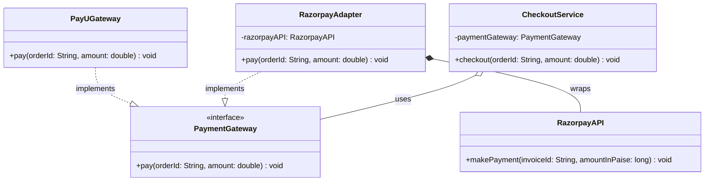
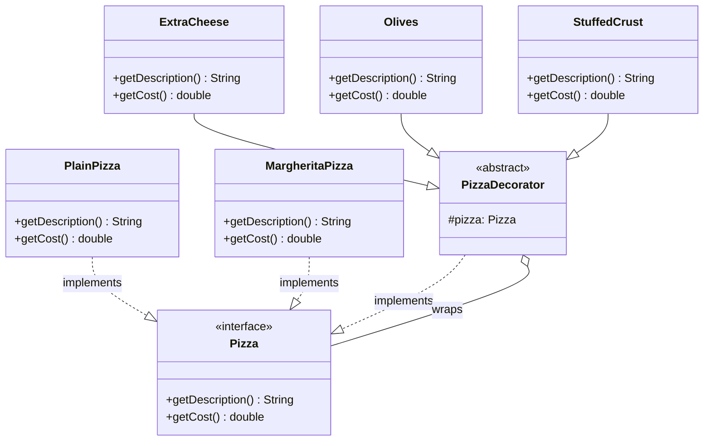
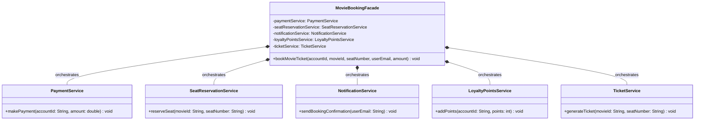
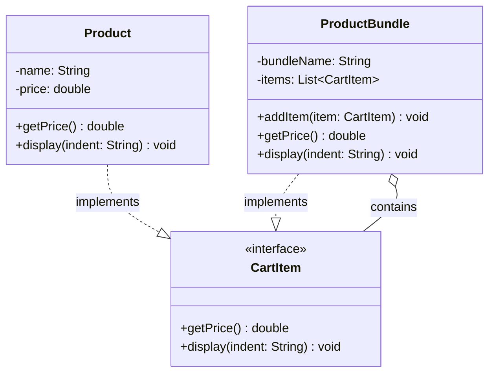
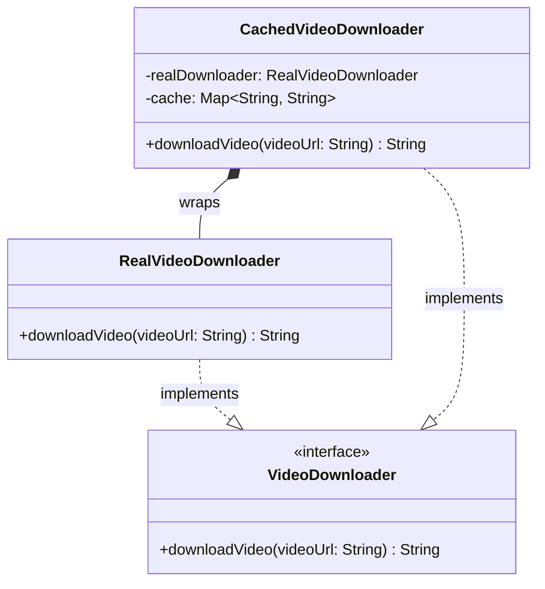
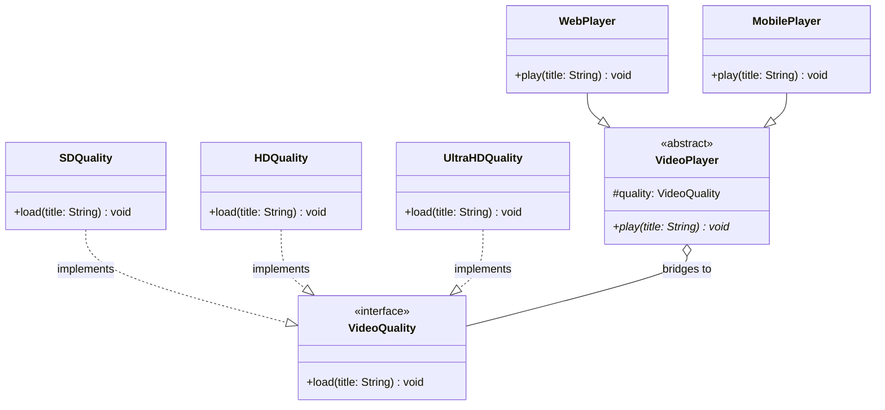
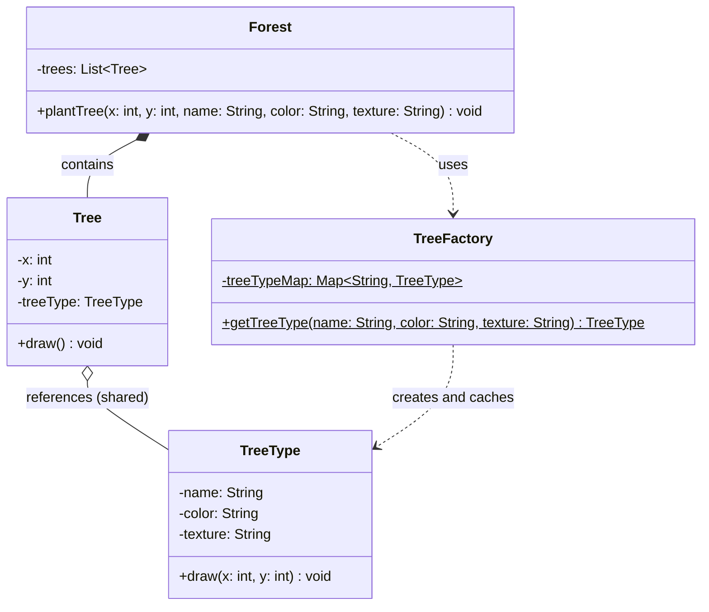

# Structural Design Patterns — Assembling Objects into Larger Structures

A payment provider whose API doesn't match yours. A pizza with any combination of five toppings. A booking that has to call five services in the right order. A shopping cart holding products *and* bundles of products. Each of these is a question about structure: how to connect objects that weren't designed for each other, or assemble small objects into bigger ones, without the number of classes or the coupling getting out of hand.

**Structural patterns** answer those questions. Most of them do it with one idea, **composition**: an object holds another object behind an interface, and adds something on the way through, whether that is a translation, a feature, a simpler entry point, a tree, a gatekeeper, a second dimension or a shared core.

<div style="border-left:4px solid #195045;background:rgba(25,80,69,0.08);padding:0.6rem 1rem;border-radius:0 0.5rem 0.5rem 0;margin:1.25rem 0">

💡 **The core idea.**

- **Adapter** makes an existing class fit the interface your code expects. **Facade** puts one simple entry point in front of a whole subsystem.
- **Decorator** and **Proxy** both wrap an object behind its own interface: a decorator *adds behaviour*, a proxy *controls access*.
- **Composite** lets single items and groups of items be treated the same way, as a tree.
- **Bridge** splits one class hierarchy that varies in two ways into two hierarchies joined by a reference.
- **Flyweight** shares the identical, immutable part of many objects instead of copying it into each one.

</div>

This builds on [Creational Design Patterns](/synapse/low-level-design/design-patterns/creational-design-patterns) and on the composition-over-inheritance argument in [Encapsulation, Inheritance & Polymorphism](/synapse/low-level-design/oop/encapsulation-access-modifiers-inheritance-polymorphism). Every output below was produced by running the code on Java 21 and Python 3.11.

**You'll be able to:** write an adapter that translates units and formats as well as method names; stack decorators and predict how their order changes the result; use a facade to put a multi-step workflow, and its order, in one place; replace `instanceof` checks with a composite that handles nested groups; place a proxy so that every caller actually goes through it; turn an M×N class explosion into M+N classes with a bridge; share flyweight state safely by keeping it immutable.

<div style="border-left:4px solid #15448e;background:rgba(21,68,142,0.08);padding:0.6rem 1rem;border-radius:0 0.5rem 0.5rem 0;margin:1.25rem 0">

📘 **How to read the Intuition boxes.** Each one is built in three moves:

1. **The mechanism** — which object holds which, and what it adds on the way through.
2. **A concrete bite** — a specific, runnable program where the structure is subtly wrong, and the output shows it.
3. **The earned rule** — the decision heuristic, now justified rather than asserted, plus its cost.

</div>

---

## Table of contents

1. [Adapter pattern](#1-adapter-pattern)
2. [Decorator pattern](#2-decorator-pattern)
3. [Facade pattern](#3-facade-pattern)
4. [Composite pattern](#4-composite-pattern)
5. [Proxy pattern](#5-proxy-pattern)
6. [Bridge pattern](#6-bridge-pattern)
7. [Flyweight pattern](#7-flyweight-pattern)
8. [Mental-model summary](#8-mental-model-summary)
9. [Gotcha checklist](#9-gotcha-checklist)
10. [Check yourself](#-check-yourself)
11. [Sources](#-sources)

---

## 1. Adapter pattern

<div style="border-left:4px solid #15448e;background:rgba(21,68,142,0.08);padding:0.6rem 1rem;border-radius:0 0.5rem 0.5rem 0;margin:1.25rem 0">

📘 **Definition.** "Convert the interface of a class into another interface clients expect. Adapter lets classes work together that couldn't otherwise because of incompatible interfaces" <abbr title="Gamma, Helm, Johnson and Vlissides, Design Patterns, 1994, Adapter: Intent">[1]</abbr>.

</div>

An adapter is a translator, or wrapper, around an existing class. It sits between the **target** interface, the one the client expects, and the **adaptee**, an existing class with a different interface, so that the two can work together without either being changed.

<div style="border-left:4px solid #195045;background:rgba(25,80,69,0.08);padding:0.6rem 1rem;border-radius:0 0.5rem 0.5rem 0;margin:1.25rem 0">

💡 **Insight.** Travelling from India to Europe, your phone charger doesn't fit European sockets. Instead of buying a new charger, you use a plug adapter. It lets your charger, with its Indian plug, fit the European socket, without modifying either the socket or the charger.

</div>

**Problems it solves.**

- Two classes have incompatible interfaces.
- You want to reuse an existing class without modifying its source code.
- Two systems should communicate, but their method signatures differ.

### Real-life example: payment gateways

A checkout system works with a `PaymentGateway` interface. The PayU gateway already implements it. Razorpay's client library has its own structure: a different method name, an invoice ID instead of an order ID, and, like many payment APIs, amounts in the smallest currency unit (paise, where 100 paise make a rupee) rather than in rupees.

```java run
// Target: the interface CheckoutService expects.
interface PaymentGateway {
    void pay(String orderId, double amount);
}

class PayUGateway implements PaymentGateway {
    @Override
    public void pay(String orderId, double amount) {
        System.out.println("Paid Rs. " + amount + " using PayU for order: " + orderId);
    }
}

// Adaptee: an existing class with an incompatible interface (amounts in paise).
class RazorpayAPI {
    public void makePayment(String invoiceId, long amountInPaise) {
        System.out.println("Paid Rs. " + amountInPaise / 100.0 + " using Razorpay for invoice: " + invoiceId);
    }
}

// Client: works with any PaymentGateway.
class CheckoutService {
    private final PaymentGateway paymentGateway;

    CheckoutService(PaymentGateway paymentGateway) {
        this.paymentGateway = paymentGateway;
    }

    void checkout(String orderId, double amount) {
        paymentGateway.pay(orderId, amount);
    }
}

// ⚠️ ANTI-PATTERN — the client has to bypass CheckoutService for one provider. Do not copy it.
public class Main {
    public static void main(String[] args) {
        new CheckoutService(new PayUGateway()).checkout("12", 1780);

        // new CheckoutService(new RazorpayAPI()) does not compile: RazorpayAPI is not a PaymentGateway.
        // So this caller skips CheckoutService and does the conversion itself.
        new RazorpayAPI().makePayment("13", 178000);
    }
}
```

```python run
from abc import ABC, abstractmethod


# Target: the interface CheckoutService expects.
class PaymentGateway(ABC):
    @abstractmethod
    def pay(self, order_id: str, amount: float) -> None: ...


class PayUGateway(PaymentGateway):
    def pay(self, order_id: str, amount: float) -> None:
        print(f"Paid Rs. {float(amount)} using PayU for order: {order_id}")


# Adaptee: an existing class with an incompatible interface (amounts in paise).
class RazorpayAPI:
    def make_payment(self, invoice_id: str, amount_in_paise: int) -> None:
        print(f"Paid Rs. {amount_in_paise / 100} using Razorpay for invoice: {invoice_id}")


# Client: works with any PaymentGateway.
class CheckoutService:
    def __init__(self, payment_gateway: PaymentGateway) -> None:
        self._payment_gateway = payment_gateway

    def checkout(self, order_id: str, amount: float) -> None:
        self._payment_gateway.pay(order_id, amount)


# ⚠️ ANTI-PATTERN — the client has to bypass CheckoutService for one provider. Do not copy it.
CheckoutService(PayUGateway()).checkout("12", 1780)

# RazorpayAPI has no pay() method, so CheckoutService can't use it.
# This caller skips CheckoutService and does the conversion itself.
RazorpayAPI().make_payment("13", 178000)
```

**Output:**
```
Paid Rs. 1780.0 using PayU for order: 12
Paid Rs. 1780.0 using Razorpay for invoice: 13
```

**Understanding the issues.**

- `CheckoutService` expects every payment provider to implement `PaymentGateway`.
- `PayUGateway` fits, and works.
- `RazorpayAPI` uses a different method, `makePayment`, takes paise, and doesn't implement `PaymentGateway`.
- Because of that mismatch, `RazorpayAPI` can't be used through `CheckoutService`, so a caller had to bypass the service and convert rupees to paise by hand.

This is interface incompatibility: two classes that do the same job but can't be used interchangeably because of how they are shaped. The fix is an adapter that implements `PaymentGateway` and translates each call for Razorpay, without changing either side:

```java run
interface PaymentGateway {
    void pay(String orderId, double amount);
}

class PayUGateway implements PaymentGateway {
    @Override
    public void pay(String orderId, double amount) {
        System.out.println("Paid Rs. " + amount + " using PayU for order: " + orderId);
    }
}

class RazorpayAPI {
    public void makePayment(String invoiceId, long amountInPaise) {
        System.out.println("Paid Rs. " + amountInPaise / 100.0 + " using Razorpay for invoice: " + invoiceId);
    }
}

// Adapter: a PaymentGateway on the outside, a RazorpayAPI client on the inside.
class RazorpayAdapter implements PaymentGateway {
    private final RazorpayAPI razorpayAPI = new RazorpayAPI();

    @Override
    public void pay(String orderId, double amount) {
        long paise = Math.round(amount * 100); // translate the units, not just the method name
        razorpayAPI.makePayment(orderId, paise);
    }
}

class CheckoutService {
    private final PaymentGateway paymentGateway;

    CheckoutService(PaymentGateway paymentGateway) {
        this.paymentGateway = paymentGateway;
    }

    void checkout(String orderId, double amount) {
        paymentGateway.pay(orderId, amount);
    }
}

public class Main {
    public static void main(String[] args) {
        new CheckoutService(new PayUGateway()).checkout("12", 1780);
        new CheckoutService(new RazorpayAdapter()).checkout("13", 1780);
    }
}
```

```python run
from abc import ABC, abstractmethod


class PaymentGateway(ABC):
    @abstractmethod
    def pay(self, order_id: str, amount: float) -> None: ...


class PayUGateway(PaymentGateway):
    def pay(self, order_id: str, amount: float) -> None:
        print(f"Paid Rs. {float(amount)} using PayU for order: {order_id}")


class RazorpayAPI:
    def make_payment(self, invoice_id: str, amount_in_paise: int) -> None:
        print(f"Paid Rs. {amount_in_paise / 100} using Razorpay for invoice: {invoice_id}")


# Adapter: a PaymentGateway on the outside, a RazorpayAPI client on the inside.
class RazorpayAdapter(PaymentGateway):
    def __init__(self) -> None:
        self._razorpay_api = RazorpayAPI()

    def pay(self, order_id: str, amount: float) -> None:
        paise = round(amount * 100)  # translate the units, not just the method name
        self._razorpay_api.make_payment(order_id, paise)


class CheckoutService:
    def __init__(self, payment_gateway: PaymentGateway) -> None:
        self._payment_gateway = payment_gateway

    def checkout(self, order_id: str, amount: float) -> None:
        self._payment_gateway.pay(order_id, amount)


CheckoutService(PayUGateway()).checkout("12", 1780)
CheckoutService(RazorpayAdapter()).checkout("13", 1780)
```

**Output:**
```
Paid Rs. 1780.0 using PayU for order: 12
Paid Rs. 1780.0 using Razorpay for invoice: 13
```

`RazorpayAdapter` implements `PaymentGateway`, holds a `RazorpayAPI`, and translates each call from the expected interface to the real one, so Razorpay works through `CheckoutService` with no change to either class. In Python, `RazorpayAdapter` doesn't strictly need to inherit from `PaymentGateway`: thanks to duck typing, any object with a matching `pay()` method would work. The ABC is used anyway to make the contract explicit, so a missing method fails when the object is created rather than at the first call.



`PaymentGateway` is the target interface and `RazorpayAPI` the adaptee. `RazorpayAdapter` sits between them, so the client can use the adaptee through the target interface.

**Analysis.** Both checkouts now go through the same `CheckoutService`, and both charge Rs. 1780. The adapter did two translations: the method (`pay` to `makePayment`) and the unit (rupees to paise). The rupee-to-paise conversion that the caller previously did by hand now lives in one place, next to the API that needs it.

**Intuition.**
*Mechanism.* An adapter implements the interface the client knows, and holds the object the client can't use. Every call through it is a translation: the method name, the order and meaning of the arguments, the units, the return value and the exceptions. Renaming the method is the easy part; the other translations are where adapters go wrong.

*Concrete bite.* Here is an adapter that only renames the method, and passes the amount straight through:

```java run
interface PaymentGateway {
    void pay(String orderId, double amount);
}

class RazorpayAPI {
    public void makePayment(String invoiceId, long amountInPaise) {
        System.out.println("Paid Rs. " + amountInPaise / 100.0 + " using Razorpay for invoice: " + invoiceId);
    }
}

// ⚠️ ANTI-PATTERN — renames the method but forgets the unit conversion. Do not copy it.
class NaiveRazorpayAdapter implements PaymentGateway {
    private final RazorpayAPI razorpayAPI = new RazorpayAPI();

    @Override
    public void pay(String orderId, double amount) {
        razorpayAPI.makePayment(orderId, (long) amount); // rupees passed as paise
    }
}

public class Main {
    public static void main(String[] args) {
        new NaiveRazorpayAdapter().pay("14", 1780);
    }
}
```

```python run
class RazorpayAPI:
    def make_payment(self, invoice_id: str, amount_in_paise: int) -> None:
        print(f"Paid Rs. {amount_in_paise / 100} using Razorpay for invoice: {invoice_id}")


# ⚠️ ANTI-PATTERN — renames the method but forgets the unit conversion. Do not copy it.
class NaiveRazorpayAdapter:
    def __init__(self) -> None:
        self._razorpay_api = RazorpayAPI()

    def pay(self, order_id: str, amount: float) -> None:
        self._razorpay_api.make_payment(order_id, int(amount))  # rupees passed as paise


NaiveRazorpayAdapter().pay("14", 1780)
```

**Output:**
```
Paid Rs. 17.8 using Razorpay for invoice: 14
```

The order was for Rs. 1780, and the customer was charged Rs. 17.80. It compiled, it ran, and every type matched: a `long` is a `long`, whether it holds rupees or paise.

<div style="border-left:4px solid #195045;background:rgba(25,80,69,0.08);padding:0.6rem 1rem;border-radius:0 0.5rem 0.5rem 0;margin:1.25rem 0">

💡 **Earned rule.** Use an adapter whenever an existing or third-party class must fit an interface you own. Write down what each side means by every argument and return value (units, formats, time zones, error signalling), make the adapter translate all of it, and test the adapter on its own with real values.

The cost is one class per adaptee, and an extra layer to read through. Don't add an adapter in front of a class you control and could simply change to implement the interface.

</div>

**When to use the Adapter pattern.** It fits whenever you integrate components that weren't designed to work together:

- You need to use an existing class, but its interface doesn't match the one your system expects.
- You want to reuse legacy code without modifying it.
- You are integrating third-party APIs or external services.

**Pros of the Adapter pattern.**

- **Reuse:** existing classes are reused without changing their implementation.
- **Extensibility:** the system can adopt new providers with little effort.
- **Minimal changes to client code:** the client keeps using its own interface.
- **Simpler third-party integration:** external services and APIs fit in behind your interface.

**Cons of the Adapter pattern.**

- **An extra layer:** it adds indirection, which is unnecessary complexity if used without need.
- **Overuse obscures the design:** many adapters can make the architecture harder to understand.

**Real product use cases.**

1. **Payment gateways.** Providers such as PayPal, Stripe, Razorpay and PayU each have their own method names, parameters and response formats. With a common `PaymentGateway` interface and one adapter per provider, a business can switch or add providers without rewriting its checkout logic.
2. **Logging frameworks.** Applications often have to work with several logging libraries, such as Log4j or `java.util.logging`. A façade such as SLF4J, with an adapter per backend, lets developers write `log.debug(...)` whichever backend is underneath.
3. **Cloud providers and SDKs.** AWS, Azure and Google Cloud offer similar services (storage, compute, databases) through different SDKs. An adapter layer behind a common interface lets an application move, say, from S3 to Google Cloud Storage without changing the rest of its code. The JDK itself has adapters too: `java.io.InputStreamReader` adapts a byte stream to the character-based `Reader` interface.

---

## 2. Decorator pattern

<div style="border-left:4px solid #15448e;background:rgba(21,68,142,0.08);padding:0.6rem 1rem;border-radius:0 0.5rem 0.5rem 0;margin:1.25rem 0">

📘 **Definition.** "Attach additional responsibilities to an object dynamically. Decorators provide a flexible alternative to subclassing for extending functionality" <abbr title="Gamma, Helm, Johnson and Vlissides, Design Patterns, 1994, Decorator: Intent">[1]</abbr>.

</div>

A decorator wraps an object inside another object that has the same interface, and adds behaviour before or after passing each call on. Because the wrapper looks exactly like the object it wraps, it can itself be wrapped, and the behaviours stack. Only the decorated object is affected, not other objects of the same class.

<div style="border-left:4px solid #195045;background:rgba(25,80,69,0.08);padding:0.6rem 1rem;border-radius:0 0.5rem 0.5rem 0;margin:1.25rem 0">

💡 **Insight.** In a coffee shop you order a plain coffee, then add milk, sugar, whipped cream and so on. There's no separate drink for every combination: each addition wraps the drink so far and adds something to it.

</div>

**The problem it solves.** Using inheritance to add combinations of behaviour leads to a *class explosion*. A pizza shop with cheese, olive and stuffed-crust options would need a `CheesePizza`, a `CheeseOlivePizza`, a `CheeseOliveStuffedPizza`, and so on, one class for every combination:

```java run
// ⚠️ ANTI-PATTERN — one subclass per combination of toppings. Do not copy it.
class PlainPizza {}
class CheesePizza extends PlainPizza {}
class OlivePizza extends PlainPizza {}
class StuffedPizza extends PlainPizza {}
class CheeseStuffedPizza extends CheesePizza {}
class CheeseOlivePizza extends CheesePizza {}
class CheeseOliveStuffedPizza extends CheeseOlivePizza {}

public class Main {
    public static void main(String[] args) {
        PlainPizza[] menu = {
            new PlainPizza(), new CheesePizza(), new OlivePizza(), new StuffedPizza(),
            new CheeseStuffedPizza(), new CheeseOlivePizza(), new CheeseOliveStuffedPizza()
        };
        for (PlainPizza p : menu) {
            System.out.println("Created: " + p.getClass().getSimpleName());
        }
        // There is still no class for olives with stuffed crust and no cheese.
    }
}
```

```python run
# ⚠️ ANTI-PATTERN — one subclass per combination of toppings. Do not copy it.
class PlainPizza: pass
class CheesePizza(PlainPizza): pass
class OlivePizza(PlainPizza): pass
class StuffedPizza(PlainPizza): pass
class CheeseStuffedPizza(CheesePizza): pass
class CheeseOlivePizza(CheesePizza): pass
class CheeseOliveStuffedPizza(CheeseOlivePizza): pass


menu = [PlainPizza(), CheesePizza(), OlivePizza(), StuffedPizza(),
        CheeseStuffedPizza(), CheeseOlivePizza(), CheeseOliveStuffedPizza()]
for p in menu:
    print("Created:", type(p).__name__)
# There is still no class for olives with stuffed crust and no cheese.
```

**Output:**
```
Created: PlainPizza
Created: CheesePizza
Created: OlivePizza
Created: StuffedPizza
Created: CheeseStuffedPizza
Created: CheeseOlivePizza
Created: CheeseOliveStuffedPizza
```

Seven classes, and the menu still isn't complete: with three toppings there are eight combinations, and each new topping doubles the count. This quickly becomes unmanageable. The Decorator pattern composes behaviour from wrappers instead: each topping becomes one class that wraps any pizza, so toppings can be added to an object at run time without changing its class.

```java run
// Component interface: what every pizza, plain or decorated, can do.
interface Pizza {
    String getDescription();
    double getCost();
}

// Concrete components: the base pizzas.
class PlainPizza implements Pizza {
    public String getDescription() { return "Plain Pizza"; }
    public double getCost() { return 150.00; }
}

class MargheritaPizza implements Pizza {
    public String getDescription() { return "Margherita Pizza"; }
    public double getCost() { return 200.00; }
}

// Abstract decorator: is a Pizza, and holds a Pizza.
abstract class PizzaDecorator implements Pizza {
    protected final Pizza pizza;

    protected PizzaDecorator(Pizza pizza) {
        this.pizza = pizza;
    }
}

// Concrete decorators: each adds one topping to whatever it wraps.
class ExtraCheese extends PizzaDecorator {
    ExtraCheese(Pizza pizza) { super(pizza); }
    public String getDescription() { return pizza.getDescription() + ", Extra Cheese"; }
    public double getCost() { return pizza.getCost() + 40.0; }
}

class Olives extends PizzaDecorator {
    Olives(Pizza pizza) { super(pizza); }
    public String getDescription() { return pizza.getDescription() + ", Olives"; }
    public double getCost() { return pizza.getCost() + 30.0; }
}

class StuffedCrust extends PizzaDecorator {
    StuffedCrust(Pizza pizza) { super(pizza); }
    public String getDescription() { return pizza.getDescription() + ", Stuffed Crust"; }
    public double getCost() { return pizza.getCost() + 50.0; }
}

public class Main {
    public static void main(String[] args) {
        Pizza myPizza = new MargheritaPizza();
        myPizza = new ExtraCheese(myPizza);
        myPizza = new Olives(myPizza);
        myPizza = new StuffedCrust(myPizza);
        System.out.println("Pizza Description: " + myPizza.getDescription());
        System.out.println("Total Cost: ₹" + myPizza.getCost());

        // The combination the subclasses never had: olives and stuffed crust, no cheese.
        Pizza another = new StuffedCrust(new Olives(new PlainPizza()));
        System.out.println("Pizza Description: " + another.getDescription());
        System.out.println("Total Cost: ₹" + another.getCost());
    }
}
```

```python run
from abc import ABC, abstractmethod


# Component interface: what every pizza, plain or decorated, can do.
class Pizza(ABC):
    @abstractmethod
    def get_description(self) -> str: ...

    @abstractmethod
    def get_cost(self) -> float: ...


# Concrete components: the base pizzas.
class PlainPizza(Pizza):
    def get_description(self) -> str: return "Plain Pizza"
    def get_cost(self) -> float: return 150.00


class MargheritaPizza(Pizza):
    def get_description(self) -> str: return "Margherita Pizza"
    def get_cost(self) -> float: return 200.00


# Abstract decorator: is a Pizza, and holds a Pizza.
class PizzaDecorator(Pizza, ABC):
    def __init__(self, pizza: Pizza) -> None:
        self._pizza = pizza


# Concrete decorators: each adds one topping to whatever it wraps.
class ExtraCheese(PizzaDecorator):
    def get_description(self) -> str: return self._pizza.get_description() + ", Extra Cheese"
    def get_cost(self) -> float: return self._pizza.get_cost() + 40.0


class Olives(PizzaDecorator):
    def get_description(self) -> str: return self._pizza.get_description() + ", Olives"
    def get_cost(self) -> float: return self._pizza.get_cost() + 30.0


class StuffedCrust(PizzaDecorator):
    def get_description(self) -> str: return self._pizza.get_description() + ", Stuffed Crust"
    def get_cost(self) -> float: return self._pizza.get_cost() + 50.0


my_pizza: Pizza = MargheritaPizza()
my_pizza = ExtraCheese(my_pizza)
my_pizza = Olives(my_pizza)
my_pizza = StuffedCrust(my_pizza)
print(f"Pizza Description: {my_pizza.get_description()}")
print(f"Total Cost: ₹{my_pizza.get_cost()}")

# The combination the subclasses never had: olives and stuffed crust, no cheese.
another = StuffedCrust(Olives(PlainPizza()))
print(f"Pizza Description: {another.get_description()}")
print(f"Total Cost: ₹{another.get_cost()}")
```

**Output:**
```
Pizza Description: Margherita Pizza, Extra Cheese, Olives, Stuffed Crust
Total Cost: ₹320.0
Pizza Description: Plain Pizza, Olives, Stuffed Crust
Total Cost: ₹230.0
```

Python also has *function* decorators, the `@decorator` syntax. That is a different mechanism, for wrapping a function or method when it is defined, not for wrapping an object at run time. The two ideas are related in spirit, but this section is about the GoF pattern only.

**Understanding the code.** The `Pizza` interface is what every pizza, base or decorated, implements. `PlainPizza` and `MargheritaPizza` are the base pizzas. The abstract `PizzaDecorator` wraps a `Pizza` and is itself a `Pizza`. `ExtraCheese`, `Olives` and `StuffedCrust` each extend a pizza's description and cost. In `main`, a Margherita is wrapped successively by three decorators, each adding to the description and the cost, and the final call works its way down through all the layers.

**How the Decorator pattern solves the problem.**

- **No class explosion:** there is one class per topping, not one per combination; new toppings are new decorators.
- **Flexible:** toppings can be added, removed or reordered at run time.
- **Open/Closed Principle:** the base pizza classes are extended by decorators, never modified.
- **Cleaner architecture:** composition instead of inheritance keeps the components loosely coupled.
- **Reuse:** each topping is a self-contained decorator that works with any pizza.

**Key takeaways.**

- **Abstract classes have constructors:** `PizzaDecorator`'s constructor runs whenever a concrete decorator is created, which is where the shared `pizza` field is set.
- **Decorators are layers:** like wrapping a gift box, each decorator adds behaviour on top of the previous one.
- **A call stack of behaviour:** a call goes in through the outermost decorator and down to the base object, and the results are combined on the way back out, which is why the order of the layers matters.
- **Loose coupling:** interfaces and composition keep the components independent, so the system is easy to test and extend.



**Analysis.** Three topping classes produced both pizzas, including the olive-and-stuffed-crust combination that the subclass hierarchy never had. Each decorator only knows that it wraps *some* `Pizza`; it doesn't know, or care, whether that pizza is a base or another decorator. The diagram shows the defining shape: `PizzaDecorator` both *is a* `Pizza` (dashed triangle) and *has a* `Pizza` (hollow diamond).

**Intuition.**
*Mechanism.* Each decorator turns a call into "do something with what the inner object returns". A stack of decorators is therefore a composition of functions, applied from the inside out, and composition depends on order whenever the steps don't commute. Adding a fixed amount commutes; taking a percentage does not.

*Concrete bite.* Add a 10% discount decorator, and apply it in two different orders:

```java run
interface Pizza {
    String getDescription();
    double getCost();
}

class MargheritaPizza implements Pizza {
    public String getDescription() { return "Margherita Pizza"; }
    public double getCost() { return 200.00; }
}

abstract class PizzaDecorator implements Pizza {
    protected final Pizza pizza;
    protected PizzaDecorator(Pizza pizza) { this.pizza = pizza; }
}

class ExtraCheese extends PizzaDecorator {
    ExtraCheese(Pizza pizza) { super(pizza); }
    public String getDescription() { return pizza.getDescription() + ", Extra Cheese"; }
    public double getCost() { return pizza.getCost() + 40.0; }
}

class TenPercentOff extends PizzaDecorator {
    TenPercentOff(Pizza pizza) { super(pizza); }
    public String getDescription() { return pizza.getDescription() + ", 10% off"; }
    public double getCost() { return pizza.getCost() * 0.9; }
}

public class Main {
    public static void main(String[] args) {
        Pizza a = new TenPercentOff(new ExtraCheese(new MargheritaPizza()));
        Pizza b = new ExtraCheese(new TenPercentOff(new MargheritaPizza()));
        System.out.println(a.getDescription() + " -> ₹" + a.getCost());
        System.out.println(b.getDescription() + " -> ₹" + b.getCost());
    }
}
```

```python run
class MargheritaPizza:
    def get_description(self) -> str: return "Margherita Pizza"
    def get_cost(self) -> float: return 200.00


class ExtraCheese:
    def __init__(self, pizza) -> None: self._pizza = pizza
    def get_description(self) -> str: return self._pizza.get_description() + ", Extra Cheese"
    def get_cost(self) -> float: return self._pizza.get_cost() + 40.0


class TenPercentOff:
    def __init__(self, pizza) -> None: self._pizza = pizza
    def get_description(self) -> str: return self._pizza.get_description() + ", 10% off"
    def get_cost(self) -> float: return self._pizza.get_cost() * 0.9


a = TenPercentOff(ExtraCheese(MargheritaPizza()))
b = ExtraCheese(TenPercentOff(MargheritaPizza()))
print(f"{a.get_description()} -> ₹{a.get_cost()}")
print(f"{b.get_description()} -> ₹{b.get_cost()}")
```

**Output:**
```
Margherita Pizza, Extra Cheese, 10% off -> ₹216.0
Margherita Pizza, 10% off, Extra Cheese -> ₹220.0
```

Same three objects, two prices. In the first, the discount wraps everything, so the cheese is discounted too; in the second, the cheese is added after the discount, at full price. Neither is wrong in itself, but if different parts of the code wrap pizzas in different orders, customers are charged differently for the same order. A decorated object also stops being an instance of its base class: `a instanceof MargheritaPizza` is `false`, because `a` is a `TenPercentOff`.

<div style="border-left:4px solid #195045;background:rgba(25,80,69,0.08);padding:0.6rem 1rem;border-radius:0 0.5rem 0.5rem 0;margin:1.25rem 0">

💡 **Earned rule.** Use decorators when optional features combine freely and should be chosen at run time. If any decorator's effect depends on order (percentages, caching, retries, encryption before or after compression), build the stack in one place, such as a factory or builder, so the order is decided once. Never test a decorated object's type with `instanceof`.

The cost is many small classes, and stack traces that pass through every layer. If the features are fixed at compile time and few, a single class with flags may be clearer.

</div>

**When to use the Decorator pattern.**

- **Add responsibilities to individual objects at run time,** instead of building every behaviour into a class.
- **Avoid an explosion of subclasses** for every combination of features.
- **Follow the Open/Closed Principle:** add behaviour without editing existing classes.
- **Reuse and compose behaviours:** the same decorator works on any component, in any combination.
- **Layer enhancements step by step,** in a controlled, traceable order.

**Advantages of the Decorator pattern.**

- **Open/Closed Principle:** new features don't require changes to existing code.
- **Run-time flexibility:** behaviours can be added or removed while the program runs.
- **No subclass explosion:** a small decorator per feature replaces a class per combination.
- **One responsibility per add-on:** each decorator does one thing, which keeps the code organised and readable.

**Disadvantages of the Decorator pattern.**

- **Many small classes:** each feature usually needs its own decorator class.
- **Harder debugging:** stack traces through several layers of decorators can be long and hard to follow.
- **Overhead of wrapping:** many layers add a little run-time cost, and make the structure harder to see.
- **Order and identity surprises:** developers must understand how the chain works, including that order can matter and that the wrapped object's type is hidden.

**Real-world use cases.**

1. **Food delivery apps.** Customers customise items with add-ons such as extra cheese, sauces or sides, and each add-on changes the description and the price. Decorators such as `CheeseDecorator` and `OliveDecorator` stacked on a base item avoid a subclass like `PizzaWithCheeseAndOlives` for every combination.
2. **Word processors.** Bold, italic and underline can be applied independently or together. Each style can be a decorator around the plain text, such as `UnderlineDecorator(BoldDecorator(ItalicDecorator(text)))`, instead of a `BoldItalicUnderlineText` class.
3. **Java I/O streams.** `new BufferedReader(new InputStreamReader(new FileInputStream(path)))` is a stack of decorators (and one adapter): each layer adds buffering or decoding to the stream it wraps.

---

## 3. Facade pattern

<div style="border-left:4px solid #15448e;background:rgba(21,68,142,0.08);padding:0.6rem 1rem;border-radius:0 0.5rem 0.5rem 0;margin:1.25rem 0">

📘 **Definition.** "Provide a unified interface to a set of interfaces in a subsystem. Facade defines a higher-level interface that makes the subsystem easier to use" <abbr title="Gamma, Helm, Johnson and Vlissides, Design Patterns, 1994, Facade: Intent">[1]</abbr>.

</div>

A facade is a single entry point to a subsystem. Clients make one high-level call, and the facade makes the many low-level calls, in the right order, hiding the subsystem's complexity.

<div style="border-left:4px solid #195045;background:rgba(25,80,69,0.08);padding:0.6rem 1rem;border-radius:0 0.5rem 0.5rem 0;margin:1.25rem 0">

💡 **Insight.** Driving a manual car means coordinating the clutch, the gear lever and the accelerator precisely to change gear. An automatic car is a facade: it offers "Drive", "Reverse" and "Park", and the transmission coordinates the gears internally.

</div>

In short, the manual car exposes the complexity, while the automatic car, the facade, hides it from the driver.

**The problem it solves.** A movie ticket booking system has a `PaymentService`, a `SeatReservationService`, a `NotificationService`, a `LoyaltyPointsService` and a `TicketService`. Instead of making every client coordinate all five, a facade such as `MovieBookingFacade` coordinates them internally.

### Real-life example: a movie booking app

Here is a booking app without a facade. The client calls each service itself, in the order its author thought of, and someone else has already booked seat A10:

```java run
import java.util.HashSet;
import java.util.Set;

class PaymentService {
    public void makePayment(String accountId, double amount) {
        System.out.println("Payment of ₹" + amount + " successful for account " + accountId);
    }
}

class SeatReservationService {
    private final Set<String> taken = new HashSet<>(Set.of("A10"));

    public void reserveSeat(String movieId, String seatNumber) {
        if (!taken.add(seatNumber)) {
            throw new IllegalStateException("seat " + seatNumber + " is already taken");
        }
        System.out.println("Seat " + seatNumber + " reserved for movie " + movieId);
    }
}

class NotificationService {
    public void sendBookingConfirmation(String userEmail) {
        System.out.println("Booking confirmation sent to " + userEmail);
    }
}

class LoyaltyPointsService {
    public void addPoints(String accountId, int points) {
        System.out.println(points + " loyalty points added to account " + accountId);
    }
}

class TicketService {
    public void generateTicket(String movieId, String seatNumber) {
        System.out.println("Ticket generated for movie " + movieId + ", Seat: " + seatNumber);
    }
}

// ⚠️ ANTI-PATTERN — the client coordinates five services itself. Do not copy it.
public class Main {
    public static void main(String[] args) {
        PaymentService paymentService = new PaymentService();
        SeatReservationService seatReservationService = new SeatReservationService();
        NotificationService notificationService = new NotificationService();
        LoyaltyPointsService loyaltyPointsService = new LoyaltyPointsService();
        TicketService ticketService = new TicketService();

        try {
            paymentService.makePayment("user123", 500);                  // Step 1: pay
            seatReservationService.reserveSeat("movie456", "A10");       // Step 2: reserve
            notificationService.sendBookingConfirmation("user@example.com");
            loyaltyPointsService.addPoints("user123", 50);
            ticketService.generateTicket("movie456", "A10");
        } catch (IllegalStateException e) {
            System.out.println("Booking failed: " + e.getMessage());
        }
    }
}
```

```python run
class PaymentService:
    def make_payment(self, account_id: str, amount: float) -> None:
        print(f"Payment of ₹{float(amount)} successful for account {account_id}")


class SeatReservationService:
    def __init__(self) -> None:
        self._taken = {"A10"}

    def reserve_seat(self, movie_id: str, seat_number: str) -> None:
        if seat_number in self._taken:
            raise ValueError(f"seat {seat_number} is already taken")
        self._taken.add(seat_number)
        print(f"Seat {seat_number} reserved for movie {movie_id}")


class NotificationService:
    def send_booking_confirmation(self, user_email: str) -> None:
        print(f"Booking confirmation sent to {user_email}")


class LoyaltyPointsService:
    def add_points(self, account_id: str, points: int) -> None:
        print(f"{points} loyalty points added to account {account_id}")


class TicketService:
    def generate_ticket(self, movie_id: str, seat_number: str) -> None:
        print(f"Ticket generated for movie {movie_id}, Seat: {seat_number}")


# ⚠️ ANTI-PATTERN — the client coordinates five services itself. Do not copy it.
payment_service = PaymentService()
seat_reservation_service = SeatReservationService()
notification_service = NotificationService()
loyalty_points_service = LoyaltyPointsService()
ticket_service = TicketService()

try:
    payment_service.make_payment("user123", 500)                 # Step 1: pay
    seat_reservation_service.reserve_seat("movie456", "A10")     # Step 2: reserve
    notification_service.send_booking_confirmation("user@example.com")
    loyalty_points_service.add_points("user123", 50)
    ticket_service.generate_ticket("movie456", "A10")
except ValueError as e:
    print("Booking failed:", e)
```

**Output:**
```
Payment of ₹500.0 successful for account user123
Booking failed: seat A10 is already taken
```

The code works when nothing goes wrong, but the client calls every service, in the right order and with the right arguments, itself. That brings:

- **High complexity for the client**, which has to know all five services.
- **Duplicated code** wherever a booking is made (the website, the mobile app, the box office).
- **A Single Responsibility Principle violation:** the client knows far too much about how booking works.

The facade puts all those steps behind one high-level method, `bookMovieTicket()`, and decides their order once:

```java run
import java.util.HashSet;
import java.util.Set;

class PaymentService {
    public void makePayment(String accountId, double amount) {
        System.out.println("Payment of ₹" + amount + " successful for account " + accountId);
    }
}

class SeatReservationService {
    private final Set<String> taken = new HashSet<>(Set.of("A10"));

    public void reserveSeat(String movieId, String seatNumber) {
        if (!taken.add(seatNumber)) {
            throw new IllegalStateException("seat " + seatNumber + " is already taken");
        }
        System.out.println("Seat " + seatNumber + " reserved for movie " + movieId);
    }
}

class NotificationService {
    public void sendBookingConfirmation(String userEmail) {
        System.out.println("Booking confirmation sent to " + userEmail);
    }
}

class LoyaltyPointsService {
    public void addPoints(String accountId, int points) {
        System.out.println(points + " loyalty points added to account " + accountId);
    }
}

class TicketService {
    public void generateTicket(String movieId, String seatNumber) {
        System.out.println("Ticket generated for movie " + movieId + ", Seat: " + seatNumber);
    }
}

// The facade: one call for clients, and one place that knows the order of the steps.
class MovieBookingFacade {
    private final PaymentService paymentService = new PaymentService();
    private final SeatReservationService seatReservationService = new SeatReservationService();
    private final NotificationService notificationService = new NotificationService();
    private final LoyaltyPointsService loyaltyPointsService = new LoyaltyPointsService();
    private final TicketService ticketService = new TicketService();

    public void bookMovieTicket(String accountId, String movieId, String seatNumber, String userEmail, double amount) {
        seatReservationService.reserveSeat(movieId, seatNumber); // can fail, so it goes first
        paymentService.makePayment(accountId, amount);
        ticketService.generateTicket(movieId, seatNumber);
        loyaltyPointsService.addPoints(accountId, 50);
        notificationService.sendBookingConfirmation(userEmail);
        System.out.println("Movie ticket booking completed successfully!");
    }
}

public class Main {
    public static void main(String[] args) {
        MovieBookingFacade facade = new MovieBookingFacade();
        facade.bookMovieTicket("user123", "movie456", "A11", "user@example.com", 500);
        System.out.println();
        try {
            facade.bookMovieTicket("user789", "movie456", "A10", "other@example.com", 500);
        } catch (IllegalStateException e) {
            System.out.println("Booking failed: " + e.getMessage());
        }
    }
}
```

```python run
class PaymentService:
    def make_payment(self, account_id: str, amount: float) -> None:
        print(f"Payment of ₹{float(amount)} successful for account {account_id}")


class SeatReservationService:
    def __init__(self) -> None:
        self._taken = {"A10"}

    def reserve_seat(self, movie_id: str, seat_number: str) -> None:
        if seat_number in self._taken:
            raise ValueError(f"seat {seat_number} is already taken")
        self._taken.add(seat_number)
        print(f"Seat {seat_number} reserved for movie {movie_id}")


class NotificationService:
    def send_booking_confirmation(self, user_email: str) -> None:
        print(f"Booking confirmation sent to {user_email}")


class LoyaltyPointsService:
    def add_points(self, account_id: str, points: int) -> None:
        print(f"{points} loyalty points added to account {account_id}")


class TicketService:
    def generate_ticket(self, movie_id: str, seat_number: str) -> None:
        print(f"Ticket generated for movie {movie_id}, Seat: {seat_number}")


# The facade: one call for clients, and one place that knows the order of the steps.
class MovieBookingFacade:
    def __init__(self) -> None:
        self._payment_service = PaymentService()
        self._seat_reservation_service = SeatReservationService()
        self._notification_service = NotificationService()
        self._loyalty_points_service = LoyaltyPointsService()
        self._ticket_service = TicketService()

    def book_movie_ticket(self, account_id: str, movie_id: str, seat_number: str,
                          user_email: str, amount: float) -> None:
        self._seat_reservation_service.reserve_seat(movie_id, seat_number)  # can fail, so it goes first
        self._payment_service.make_payment(account_id, amount)
        self._ticket_service.generate_ticket(movie_id, seat_number)
        self._loyalty_points_service.add_points(account_id, 50)
        self._notification_service.send_booking_confirmation(user_email)
        print("Movie ticket booking completed successfully!")


facade = MovieBookingFacade()
facade.book_movie_ticket("user123", "movie456", "A11", "user@example.com", 500)
print()
try:
    facade.book_movie_ticket("user789", "movie456", "A10", "other@example.com", 500)
except ValueError as e:
    print("Booking failed:", e)
```

**Output:**
```
Seat A11 reserved for movie movie456
Payment of ₹500.0 successful for account user123
Ticket generated for movie movie456, Seat: A11
50 loyalty points added to account user123
Booking confirmation sent to user@example.com
Movie ticket booking completed successfully!

Booking failed: seat A10 is already taken
```

**How the facade solves the problem.** With `MovieBookingFacade`, clients get one simple method, `bookMovieTicket()`; the internal service calls are hidden from them; changes inside the services don't affect clients; and the workflow lives in one place, where it is easy to update and reuse.



**Analysis.** The facade reserves the seat *before* taking payment, so the failed booking for A10 stopped before any money moved. The first program, written by a client who paid first, charged ₹500 for a seat it couldn't have. The facade didn't make the services smarter; it made the order of the calls a decision taken once, by the code that owns the workflow.

**Intuition.**
*Mechanism.* A facade turns a sequence of calls into a single operation with one owner. Everything about that sequence (which services, in what order, with what arguments, and what happens when a step fails) lives in one method, instead of being re-derived by every client.

*Concrete bite.* In the client-coordinated version, the payment line ran, then the reservation failed: the customer was charged ₹500 and got no seat. Every client that books tickets (the website, the app, the box office) would have to get this order right independently, and fixing it means finding and editing all of them. With the facade, it was decided once.

<div style="border-left:4px solid #195045;background:rgba(25,80,69,0.08);padding:0.6rem 1rem;border-radius:0 0.5rem 0.5rem 0;margin:1.25rem 0">

💡 **Earned rule.** When more than one client performs the same multi-step workflow across several services, put it behind a facade method, and decide the order there: steps that can fail and are easy to undo go first, irreversible steps (charging money, sending emails) go last.

The cost is one more class, which can grow into a "god object" if it collects unrelated workflows. Keep each facade to one area, and let clients that need fine control still use the services directly.

</div>

**When to use the Facade pattern.**

- **The subsystem is complex:** many classes, with many dependencies between them.
- **You want a simpler API for the outside world:** the facade is an easy entry point that hides the complexity.
- **You want to reduce coupling between the subsystem and its clients:** clients depend on the facade, not on every component.
- **You want clean layers:** a facade marks the boundary between layers, which makes the system more modular.

**Advantages of the Facade pattern.**

- **Looser coupling:** fewer dependencies between clients and the subsystem.
- **Flexibility:** the subsystem can change without affecting client code.
- **Simpler clients:** clients use one interface instead of many objects.
- **Layered architecture:** the system is organised into clear layers, which helps maintenance and growth.
- **Testability:** each service can be tested on its own, and the facade can be tested for its coordination logic.

**Disadvantages of the Facade pattern.**

- **Fragile coupling to the facade:** if the facade itself changes often, the change ripples to every client.
- **Hidden complexity:** the subsystem is just as complex as before, only hidden, which can make the full flow harder to understand for the developers who maintain it.
- **Harder diagnosis:** errors from deep inside the subsystem can be harder to understand when seen only through the facade.
- **Harder tracing:** debugging goes through one more layer of indirection.
- **Can violate SRP:** a facade that coordinates a large, varied set of operations can become a "god object".

---

## 4. Composite pattern

<div style="border-left:4px solid #15448e;background:rgba(21,68,142,0.08);padding:0.6rem 1rem;border-radius:0 0.5rem 0.5rem 0;margin:1.25rem 0">

📘 **Definition.** "Compose objects into tree structures to represent part-whole hierarchies. Composite lets clients treat individual objects and compositions of objects uniformly" <abbr title="Gamma, Helm, Johnson and Vlissides, Design Patterns, 1994, Composite: Intent">[1]</abbr>.

</div>

**The problem it solves.** Treating single objects and groups of objects in the same way. It arises when you work with a hierarchy of objects, and you want client code not to care whether it is dealing with one object or a whole collection of them.

### Understanding the problem

The checkout of an e-commerce app holds single products and bundles of products. In this first version they are unrelated types, so the cart is a `List<Object>` and every loop checks types. A gift card, a new kind of item, has just been added to the cart:

```java run
import java.util.ArrayList;
import java.util.List;

class Product {
    private final String name;
    private final double price;

    Product(String name, double price) {
        this.name = name;
        this.price = price;
    }

    double getPrice() { return price; }

    void display(String indent) {
        System.out.println(indent + "Product: " + name + " - ₹" + price);
    }
}

class ProductBundle {
    private final String bundleName;
    private final List<Product> products = new ArrayList<>();

    ProductBundle(String bundleName) { this.bundleName = bundleName; }

    void addProduct(Product product) { products.add(product); }

    double getPrice() {
        double total = 0;
        for (Product product : products) total += product.getPrice();
        return total;
    }

    void display(String indent) {
        System.out.println(indent + "Bundle: " + bundleName);
        for (Product product : products) product.display(indent + "  ");
    }
}

// Added later: a new kind of cart item.
class GiftCard {
    double getPrice() { return 1000; }
    void display(String indent) { System.out.println(indent + "Gift card - ₹1000.0"); }
}

// ⚠️ ANTI-PATTERN — List<Object> and instanceof checks for every kind of item. Do not copy it.
public class Main {
    public static void main(String[] args) {
        Product book = new Product("Book", 500);
        ProductBundle iphoneCombo = new ProductBundle("iPhone Combo Pack");
        iphoneCombo.addProduct(new Product("Headphones", 1500));
        iphoneCombo.addProduct(new Product("Charger", 800));
        ProductBundle schoolKit = new ProductBundle("School Kit");
        schoolKit.addProduct(new Product("Pen", 20));
        schoolKit.addProduct(new Product("Notebook", 60));

        List<Object> cart = new ArrayList<>(List.of(book, iphoneCombo, schoolKit, new GiftCard()));

        double total = 0;
        System.out.println("Cart Details:");
        for (Object item : cart) {
            if (item instanceof Product) {
                ((Product) item).display("  ");
                total += ((Product) item).getPrice();
            } else if (item instanceof ProductBundle) {
                ((ProductBundle) item).display("  ");
                total += ((ProductBundle) item).getPrice();
            }
        }
        System.out.println("Items in cart: " + cart.size());
        System.out.println("Total Price: ₹" + total);
    }
}
```

```python run
class Product:
    def __init__(self, name: str, price: float) -> None:
        self._name = name
        self._price = price

    def get_price(self) -> float:
        return self._price

    def display(self, indent: str) -> None:
        print(f"{indent}Product: {self._name} - ₹{float(self._price)}")


class ProductBundle:
    def __init__(self, bundle_name: str) -> None:
        self._bundle_name = bundle_name
        self._products: list[Product] = []

    def add_product(self, product: Product) -> None:
        self._products.append(product)

    def get_price(self) -> float:
        return sum(p.get_price() for p in self._products)

    def display(self, indent: str) -> None:
        print(f"{indent}Bundle: {self._bundle_name}")
        for p in self._products:
            p.display(indent + "  ")


# Added later: a new kind of cart item.
class GiftCard:
    def get_price(self) -> float: return 1000
    def display(self, indent: str) -> None: print(f"{indent}Gift card - ₹1000.0")


# ⚠️ ANTI-PATTERN — a list of anything, and isinstance checks for every kind of item. Do not copy it.
book = Product("Book", 500)
iphone_combo = ProductBundle("iPhone Combo Pack")
iphone_combo.add_product(Product("Headphones", 1500))
iphone_combo.add_product(Product("Charger", 800))
school_kit = ProductBundle("School Kit")
school_kit.add_product(Product("Pen", 20))
school_kit.add_product(Product("Notebook", 60))

cart: list[object] = [book, iphone_combo, school_kit, GiftCard()]

total = 0.0
print("Cart Details:")
for item in cart:
    if isinstance(item, Product):
        item.display("  ")
        total += item.get_price()
    elif isinstance(item, ProductBundle):
        item.display("  ")
        total += item.get_price()
print("Items in cart:", len(cart))
print(f"Total Price: ₹{total}")
```

**Output:**
```
Cart Details:
  Product: Book - ₹500.0
  Bundle: iPhone Combo Pack
    Product: Headphones - ₹1500.0
    Product: Charger - ₹800.0
  Bundle: School Kit
    Product: Pen - ₹20.0
    Product: Notebook - ₹60.0
Items in cart: 4
Total Price: ₹2880.0
```

**How the code works.** `Product` represents a single item with a name and a price, and `ProductBundle` a group of products. Both have methods to display themselves and return their price. The cart is a `List<Object>` holding products and bundles, and checkout checks each item's type with `instanceof`, casts it, and calls its methods, to display everything and compute the total.

**Problems in this code.** Products and bundles are completely separate types with no shared interface, so no code can treat them uniformly, and every loop has to check which type it has. Beyond that:

- `instanceof` is used repeatedly, instead of polymorphism.
- The cart is a `List<Object>`, which is unsafe and says nothing about what belongs in it.
- A `ProductBundle` can't contain another `ProductBundle`, so there is no nesting.
- The display and price logic is duplicated instead of unified.

**The Composite pattern.** Give products and bundles a common interface, `CartItem`, and let a bundle hold any `CartItem`, including other bundles:

```java run
import java.util.ArrayList;
import java.util.List;

// The component: what every cart item, single or group, can do.
interface CartItem {
    double getPrice();
    void display(String indent);
}

// Leaf: a single product.
class Product implements CartItem {
    private final String name;
    private final double price;

    Product(String name, double price) {
        this.name = name;
        this.price = price;
    }

    public double getPrice() { return price; }

    public void display(String indent) {
        System.out.println(indent + "Product: " + name + " - ₹" + price);
    }
}

// Composite: a bundle of any cart items, including other bundles.
class ProductBundle implements CartItem {
    private final String bundleName;
    private final List<CartItem> items = new ArrayList<>();

    ProductBundle(String bundleName) { this.bundleName = bundleName; }

    void addItem(CartItem item) { items.add(item); }

    public double getPrice() {
        double total = 0;
        for (CartItem item : items) total += item.getPrice();
        return total;
    }

    public void display(String indent) {
        System.out.println(indent + "Bundle: " + bundleName);
        for (CartItem item : items) item.display(indent + "  ");
    }
}

// Added later: it implements CartItem, so nothing else changes.
class GiftCard implements CartItem {
    public double getPrice() { return 1000; }
    public void display(String indent) { System.out.println(indent + "Gift card - ₹1000.0"); }
}

public class Main {
    public static void main(String[] args) {
        CartItem book = new Product("Atomic Habits", 499);

        ProductBundle iphoneCombo = new ProductBundle("iPhone Essentials Combo");
        iphoneCombo.addItem(new Product("iPhone 15", 79999));
        iphoneCombo.addItem(new Product("AirPods", 15999));
        iphoneCombo.addItem(new Product("20W Charger", 1999));

        ProductBundle schoolKit = new ProductBundle("Back to School Kit");
        schoolKit.addItem(new Product("Notebook Pack", 249));
        schoolKit.addItem(new Product("Pen Set", 99));
        schoolKit.addItem(new Product("Highlighter", 149));

        ProductBundle giftBox = new ProductBundle("Gift Box"); // a bundle inside a bundle
        giftBox.addItem(schoolKit);
        giftBox.addItem(new GiftCard());

        List<CartItem> cart = List.of(book, iphoneCombo, giftBox);

        System.out.println("Your Cart:");
        double total = 0;
        for (CartItem item : cart) {
            item.display("  ");
            total += item.getPrice();
        }
        System.out.println("Total: ₹" + total);
    }
}
```

```python run
from abc import ABC, abstractmethod


# The component: what every cart item, single or group, can do.
class CartItem(ABC):
    @abstractmethod
    def get_price(self) -> float: ...

    @abstractmethod
    def display(self, indent: str) -> None: ...


# Leaf: a single product.
class Product(CartItem):
    def __init__(self, name: str, price: float) -> None:
        self._name = name
        self._price = price

    def get_price(self) -> float:
        return self._price

    def display(self, indent: str) -> None:
        print(f"{indent}Product: {self._name} - ₹{float(self._price)}")


# Composite: a bundle of any cart items, including other bundles.
class ProductBundle(CartItem):
    def __init__(self, bundle_name: str) -> None:
        self._bundle_name = bundle_name
        self._items: list[CartItem] = []

    def add_item(self, item: CartItem) -> None:
        self._items.append(item)

    def get_price(self) -> float:
        return sum(item.get_price() for item in self._items)

    def display(self, indent: str) -> None:
        print(f"{indent}Bundle: {self._bundle_name}")
        for item in self._items:
            item.display(indent + "  ")


# Added later: it implements CartItem, so nothing else changes.
class GiftCard(CartItem):
    def get_price(self) -> float: return 1000
    def display(self, indent: str) -> None: print(f"{indent}Gift card - ₹1000.0")


book = Product("Atomic Habits", 499)

iphone_combo = ProductBundle("iPhone Essentials Combo")
iphone_combo.add_item(Product("iPhone 15", 79999))
iphone_combo.add_item(Product("AirPods", 15999))
iphone_combo.add_item(Product("20W Charger", 1999))

school_kit = ProductBundle("Back to School Kit")
school_kit.add_item(Product("Notebook Pack", 249))
school_kit.add_item(Product("Pen Set", 99))
school_kit.add_item(Product("Highlighter", 149))

gift_box = ProductBundle("Gift Box")  # a bundle inside a bundle
gift_box.add_item(school_kit)
gift_box.add_item(GiftCard())

cart: list[CartItem] = [book, iphone_combo, gift_box]

print("Your Cart:")
total = 0.0
for item in cart:
    item.display("  ")
    total += item.get_price()
print(f"Total: ₹{total}")
```

**Output:**
```
Your Cart:
  Product: Atomic Habits - ₹499.0
  Bundle: iPhone Essentials Combo
    Product: iPhone 15 - ₹79999.0
    Product: AirPods - ₹15999.0
    Product: 20W Charger - ₹1999.0
  Bundle: Gift Box
    Bundle: Back to School Kit
      Product: Notebook Pack - ₹249.0
      Product: Pen Set - ₹99.0
      Product: Highlighter - ₹149.0
    Gift card - ₹1000.0
Total: ₹99993.0
```

**How the refactored code works.** The `CartItem` interface declares the methods both products and bundles need. `Product` and `ProductBundle` implement it, so the cart is a `List<CartItem>` that treats both uniformly, and the display and price logic no longer checks types.

**Leaf and composite.** The Composite pattern has two roles:

- **Leaf (an individual object):** a simple object with no children. `Product` is a leaf: a single purchasable item that implements `CartItem` with its own `getPrice()` and `display()`.
- **Composite (a container of components):** an object that holds other components, leaves or composites. `ProductBundle` is a composite: it can hold products and other bundles, implements `CartItem`, and delegates `getPrice()` and `display()` to its children.

**How it solves the problems.**

- **Uniform treatment through a shared interface:** the cart holds any `CartItem` without special handling, so there is no `instanceof`.
- **Polymorphism:** `getPrice()` and `display()` are called the same way on products and bundles.
- **Recursive composition:** bundles can contain other bundles, as real combo deals and kits often do.
- **No duplication:** the cart's total and display code is written once and works for any `CartItem`.



**Analysis.** One loop handled a product, a bundle, and a bundle containing a bundle and a gift card, and the recursion in `getPrice()` added up the whole tree. The diagram shows the defining shape: `ProductBundle` is a `CartItem` *and* holds `CartItem`s, which is what lets the tree be any depth.

**Intuition.**
*Mechanism.* Every operation on the tree is written twice, once for leaves (do the work) and once for composites (ask each child, then combine). Clients only ever call the interface, so they handle a single product and a nested gift box with the same line of code.

*Concrete bite.* In the first program the cart held four items, but the total was ₹2880: the gift card's ₹1000 was silently left out. The `if`/`else if` chain only knew about `Product` and `ProductBundle`, and an unknown type fell through without a word. In the composite version, `GiftCard` implements `CartItem`, so the existing loop counted it without any change.

<div style="border-left:4px solid #195045;background:rgba(25,80,69,0.08);padding:0.6rem 1rem;border-radius:0 0.5rem 0.5rem 0;margin:1.25rem 0">

💡 **Earned rule.** When items and groups of items need the same operations (price, display, count, search), give them one interface, make the group hold that interface, and delete every `instanceof` check from the code that walks the structure.

The cost is that the interface must make sense for both leaves and composites. Operations that only groups have (`addItem`) either live only on the composite, so clients must know which they have, or on the interface, where leaves must reject them. Keep them on the composite unless clients really need to treat both identically.

</div>

**When to use the Composite pattern.**

- **You have a hierarchy:** objects form a tree, such as folders inside folders, or products inside bundles.
- **Single items and groups need the same operations:** such as calculating a total price, or displaying the structure.
- **You want to stop clients telling leaves from composites:** polymorphism handles the difference, which keeps client code clean.

**Pros of the Composite pattern.**

- **Uniformity:** single objects and composites are treated the same way.
- **Extensible:** new item types and structures are easy to add.
- **Cleaner client code:** clients don't deal with the structure's complexity.
- **Open/Closed Principle:** new components don't require changes to existing code.

**Cons of the Composite pattern.**

- **Mixed responsibilities at scale:** components manage both the hierarchy and business logic.
- **Overkill for flat structures:** a flat list doesn't need a tree.
- **Can hide important distinctions:** in regulated or sensitive systems, treating everything uniformly can blur differences that matter.

---

## 5. Proxy pattern

<div style="border-left:4px solid #15448e;background:rgba(21,68,142,0.08);padding:0.6rem 1rem;border-radius:0 0.5rem 0.5rem 0;margin:1.25rem 0">

📘 **Definition.** "Provide a surrogate or placeholder for another object to control access to it" <abbr title="Gamma, Helm, Johnson and Vlissides, Design Patterns, 1994, Proxy: Intent">[1]</abbr>.

</div>

A proxy implements the same interface as the real object, so callers can't tell them apart, and it intercepts and manages requests before passing them on.

<div style="border-left:4px solid #195045;background:rgba(25,80,69,0.08);padding:0.6rem 1rem;border-radius:0 0.5rem 0.5rem 0;margin:1.25rem 0">

💡 **Insight.** A busy CEO doesn't answer everyone directly. An assistant takes the calls, filters the emails, manages the calendar, and involves the CEO only when necessary, controlling access while still serving everyone else.

</div>

The assistant is the proxy: it controls and optimises access to the real resource, the CEO.

**The problem it solves.** Uncontrolled or expensive access to an object. You might have a heavy object, such as a video player that uses a lot of resources when it starts; you might want to delay creating it until it is needed (*lazy loading*); or the object might live on a remote server, and you want a layer that handles the network. A proxy can control access, defer initialisation, or add logging, caching or security, all without modifying the real object.

### Real-life example: video downloads

A video app lets users download videos. Several users might download the same video, or one user might repeat the request. Downloading from the internet every time wastes network calls, time and bandwidth:

```java run
class RealVideoDownloader {
    public String downloadVideo(String videoUrl) {
        System.out.println("Downloading video from URL: " + videoUrl);
        return "Video content from " + videoUrl;
    }
}

// ⚠️ ANTI-PATTERN — every caller downloads again; there is nowhere to add caching. Do not copy it.
public class Main {
    public static void main(String[] args) {
        System.out.println("User 1 tries to download the video.");
        new RealVideoDownloader().downloadVideo("https://video.com/proxy-pattern");

        System.out.println("User 2 tries to download the same video again.");
        new RealVideoDownloader().downloadVideo("https://video.com/proxy-pattern");
    }
}
```

```python run
class RealVideoDownloader:
    def download_video(self, video_url: str) -> str:
        print(f"Downloading video from URL: {video_url}")
        return f"Video content from {video_url}"


# ⚠️ ANTI-PATTERN — every caller downloads again; there is nowhere to add caching. Do not copy it.
print("User 1 tries to download the video.")
RealVideoDownloader().download_video("https://video.com/proxy-pattern")

print("User 2 tries to download the same video again.")
RealVideoDownloader().download_video("https://video.com/proxy-pattern")
```

**Output:**
```
User 1 tries to download the video.
Downloading video from URL: https://video.com/proxy-pattern
User 2 tries to download the same video again.
Downloading video from URL: https://video.com/proxy-pattern
```

**Understanding the issues.**

- There is no caching, so the same video is downloaded again and again.
- There is no access control or content filtering: any URL is downloaded.
- Clients depend directly on `RealVideoDownloader`, so there is no way to intercept, log or change downloads without editing it.
- Objects are created, and work repeated, for every request.

The fix is a proxy with the same interface that checks a cache before calling the real downloader:

```java run
import java.util.HashMap;
import java.util.Map;

interface VideoDownloader {
    String downloadVideo(String videoUrl);
}

class RealVideoDownloader implements VideoDownloader {
    public String downloadVideo(String videoUrl) {
        System.out.println("Downloading video from URL: " + videoUrl);
        return "Video content from " + videoUrl;
    }
}

// The proxy: same interface, and a cache in front of the real downloader.
class CachedVideoDownloader implements VideoDownloader {
    private final RealVideoDownloader realDownloader = new RealVideoDownloader();
    private final Map<String, String> cache = new HashMap<>();

    public String downloadVideo(String videoUrl) {
        if (cache.containsKey(videoUrl)) {
            System.out.println("Returning cached video for: " + videoUrl);
            return cache.get(videoUrl);
        }
        System.out.println("Cache miss. Downloading...");
        String video = realDownloader.downloadVideo(videoUrl);
        cache.put(videoUrl, video);
        return video;
    }
}

public class Main {
    public static void main(String[] args) {
        VideoDownloader downloader = new CachedVideoDownloader(); // one proxy, shared by both users
        System.out.println("User 1 tries to download the video.");
        downloader.downloadVideo("https://video.com/proxy-pattern");

        System.out.println("User 2 tries to download the same video again.");
        downloader.downloadVideo("https://video.com/proxy-pattern");
    }
}
```

```python run
from abc import ABC, abstractmethod


class VideoDownloader(ABC):
    @abstractmethod
    def download_video(self, video_url: str) -> str: ...


class RealVideoDownloader(VideoDownloader):
    def download_video(self, video_url: str) -> str:
        print(f"Downloading video from URL: {video_url}")
        return f"Video content from {video_url}"


# The proxy: same interface, and a cache in front of the real downloader.
class CachedVideoDownloader(VideoDownloader):
    def __init__(self) -> None:
        self._real_downloader = RealVideoDownloader()
        self._cache: dict[str, str] = {}

    def download_video(self, video_url: str) -> str:
        if video_url in self._cache:
            print(f"Returning cached video for: {video_url}")
            return self._cache[video_url]
        print("Cache miss. Downloading...")
        video = self._real_downloader.download_video(video_url)
        self._cache[video_url] = video
        return video


downloader: VideoDownloader = CachedVideoDownloader()  # one proxy, shared by both users
print("User 1 tries to download the video.")
downloader.download_video("https://video.com/proxy-pattern")

print("User 2 tries to download the same video again.")
downloader.download_video("https://video.com/proxy-pattern")
```

**Output:**
```
User 1 tries to download the video.
Cache miss. Downloading...
Downloading video from URL: https://video.com/proxy-pattern
User 2 tries to download the same video again.
Returning cached video for: https://video.com/proxy-pattern
```

**How the proxy solves the problem.** `CachedVideoDownloader` checks whether a video has already been downloaded and, if so, returns the cached copy. The real downloader runs only when it must, so repeated requests are fast and cheap. For a case this simple in Python (one function, one cache key), the `functools.lru_cache` decorator on a plain function is the idiomatic shortcut <abbr title="Python 3 documentation, functools.lru_cache">[3]</abbr>. The explicit proxy class generalises better once it needs more than caching, such as access control or logging.



**Analysis.** The second request was served from the cache, and the real download ran once. The callers only saw a `VideoDownloader`; they didn't know there was a cache in front of the real one. That is what makes a proxy useful, and also what makes it easy to bypass by accident.

**Intuition.**
*Mechanism.* A proxy is only as effective as its coverage: it controls access only for the calls that actually go through it. A caching proxy also only shares results among callers that share the *same* proxy object, because the cache is a field of that object.

*Concrete bite.* Give each user their own proxy, which is what happens when every request handler writes `new CachedVideoDownloader()`:

```java run
import java.util.HashMap;
import java.util.Map;

interface VideoDownloader {
    String downloadVideo(String videoUrl);
}

class RealVideoDownloader implements VideoDownloader {
    public String downloadVideo(String videoUrl) {
        System.out.println("Downloading video from URL: " + videoUrl);
        return "Video content from " + videoUrl;
    }
}

class CachedVideoDownloader implements VideoDownloader {
    private final RealVideoDownloader realDownloader = new RealVideoDownloader();
    private final Map<String, String> cache = new HashMap<>();

    public String downloadVideo(String videoUrl) {
        return cache.computeIfAbsent(videoUrl, realDownloader::downloadVideo);
    }
}

// ⚠️ ANTI-PATTERN — a new proxy per caller, so each has an empty cache. Do not copy it.
public class Main {
    public static void main(String[] args) {
        new CachedVideoDownloader().downloadVideo("https://video.com/proxy-pattern"); // user 1
        new CachedVideoDownloader().downloadVideo("https://video.com/proxy-pattern"); // user 2
    }
}
```

```python run
class RealVideoDownloader:
    def download_video(self, video_url: str) -> str:
        print(f"Downloading video from URL: {video_url}")
        return f"Video content from {video_url}"


class CachedVideoDownloader:
    def __init__(self) -> None:
        self._real_downloader = RealVideoDownloader()
        self._cache: dict[str, str] = {}

    def download_video(self, video_url: str) -> str:
        if video_url not in self._cache:
            self._cache[video_url] = self._real_downloader.download_video(video_url)
        return self._cache[video_url]


# ⚠️ ANTI-PATTERN — a new proxy per caller, so each has an empty cache. Do not copy it.
CachedVideoDownloader().download_video("https://video.com/proxy-pattern")  # user 1
CachedVideoDownloader().download_video("https://video.com/proxy-pattern")  # user 2
```

**Output:**
```
Downloading video from URL: https://video.com/proxy-pattern
Downloading video from URL: https://video.com/proxy-pattern
```

The cache works perfectly and saved nothing: each user had their own proxy, with its own empty cache, so the video was downloaded twice, exactly as without a proxy.

<div style="border-left:4px solid #195045;background:rgba(25,80,69,0.08);padding:0.6rem 1rem;border-radius:0 0.5rem 0.5rem 0;margin:1.25rem 0">

💡 **Earned rule.** Make the proxy the only way to reach the real object: create one proxy where the application is wired together, inject it everywhere, and don't let clients create the real object (or their own proxies) themselves. For a protection proxy, this is the whole point: a security check that some callers can bypass is not a security check.

The cost is a layer that every call passes through, and, for caching proxies, decisions about cache size, expiry and thread safety that the real object never needed.

</div>

**When to use the Proxy pattern.**

- Creating the object is expensive, and you want to delay or control when it happens.
- Access to sensitive operations must be controlled, or permissions checked.
- The real object is remote, and costly or slow to reach.
- Lazy loading would improve performance and resource use.

**Types of proxy.**

- **Virtual proxy:** controls access to something expensive to create, usually by creating it only when it is first needed. Example: a video app that fetches the video data only when the user presses play.
- **Protection proxy:** controls access based on the caller's permissions or role. Example: in a document editor, only editors can change the content, while viewers can only read it.
- **Remote proxy:** stands in for an object in another address space or on another server, so local code can call it as if it were local. Example: a Java RMI stub, or an API client that hides the network calls.
- **Smart proxy:** adds behaviour around each access, such as logging, counting accesses or reference counting. Example: logging every time a file is read or updated.

**Advantages of the Proxy pattern.**

- **Performance:** caching and lazy initialisation can greatly reduce resource use.
- **Access control:** the proxy is a gatekeeper for sensitive or expensive resources.
- **Lazy initialisation:** costly resources are created only when needed, which improves start-up time.
- **Added behaviour:** logging, security checks or usage tracking, without modifying the real object.

**Disadvantages of the Proxy pattern.**

- **More complexity:** another layer makes the design harder to follow.
- **Possible delays:** permission checks or fetching can slow down access to the real object.
- **Maintenance:** the proxy duplicates the real object's interface, and must be kept in step with it.

---

## 6. Bridge pattern

<div style="border-left:4px solid #15448e;background:rgba(21,68,142,0.08);padding:0.6rem 1rem;border-radius:0 0.5rem 0.5rem 0;margin:1.25rem 0">

📘 **Definition.** "Decouple an abstraction from its implementation so that the two can vary independently" <abbr title="Gamma, Helm, Johnson and Vlissides, Design Patterns, 1994, Bridge: Intent">[1]</abbr>.

</div>

**The problem it solves.** When a class varies in two independent ways, say what kind of feature it is (the *abstraction*) and how that feature is carried out (the *implementation*), using inheritance for both gives one subclass per combination. The Bridge pattern:

- avoids tight coupling between the abstraction and the implementation;
- removes the duplicated code that a class per combination would contain;
- uses composition instead of inheritance, so each side can change on its own.

<div style="border-left:4px solid #195045;background:rgba(25,80,69,0.08);padding:0.6rem 1rem;border-radius:0 0.5rem 0.5rem 0;margin:1.25rem 0">

💡 **Insight.** A TV remote is the abstraction, the part the user handles, and the TV is the implementation, which does the actual work. There are basic and advanced remotes, and Samsung and Sony TVs. A bridge lets any remote work with any TV, without a separate class for each combination.

</div>

### Real-life example: a video player

A streaming service has players on several platforms (web, mobile, smart TV), each able to play at several qualities (HD, Ultra HD, 4K). Here each combination is its own class:

```java run
import java.util.LinkedHashMap;
import java.util.Map;

interface PlayQuality {
    void play(String title);
}

// ⚠️ ANTI-PATTERN — one class per platform × quality combination. Do not copy it.
class WebHDPlayer implements PlayQuality {
    public void play(String title) { System.out.println("Web Player: Playing " + title + " in HD"); }
}

class MobileHDPlayer implements PlayQuality {
    public void play(String title) { System.out.println("Mobile Player: Playing " + title + " in HD"); }
}

class SmartTVUltraHDPlayer implements PlayQuality {
    public void play(String title) { System.out.println("Smart TV: Playing " + title + " in ultra HD"); }
}

class Web4KPlayer implements PlayQuality {
    public void play(String title) { System.out.println("Web Player: Playing " + title + " in 4K"); }
}

public class Main {
    public static void main(String[] args) {
        Map<String, PlayQuality> players = new LinkedHashMap<>();
        players.put("Web HD", new WebHDPlayer());
        players.put("Mobile HD", new MobileHDPlayer());
        players.put("Smart TV Ultra HD", new SmartTVUltraHDPlayer());
        players.put("Web 4K", new Web4KPlayer());

        for (String request : new String[] {"Web HD", "Smart TV Ultra HD", "Mobile 4K"}) {
            PlayQuality player = players.get(request);
            if (player == null) {
                System.out.println("No player class for " + request);
            } else {
                player.play("Interstellar");
            }
        }
    }
}
```

```python run
# ⚠️ ANTI-PATTERN — one class per platform × quality combination. Do not copy it.
class WebHDPlayer:
    def play(self, title: str) -> None: print(f"Web Player: Playing {title} in HD")


class MobileHDPlayer:
    def play(self, title: str) -> None: print(f"Mobile Player: Playing {title} in HD")


class SmartTVUltraHDPlayer:
    def play(self, title: str) -> None: print(f"Smart TV: Playing {title} in ultra HD")


class Web4KPlayer:
    def play(self, title: str) -> None: print(f"Web Player: Playing {title} in 4K")


players = {
    "Web HD": WebHDPlayer(),
    "Mobile HD": MobileHDPlayer(),
    "Smart TV Ultra HD": SmartTVUltraHDPlayer(),
    "Web 4K": Web4KPlayer(),
}

for request in ["Web HD", "Smart TV Ultra HD", "Mobile 4K"]:
    player = players.get(request)
    if player is None:
        print(f"No player class for {request}")
    else:
        player.play("Interstellar")
```

**Output:**
```
Web Player: Playing Interstellar in HD
Smart TV: Playing Interstellar in ultra HD
No player class for Mobile 4K
```

**Understanding the issue.** Platforms and qualities are tightly coupled, so every combination needs its own class: `WebHDPlayer`, `MobileHDPlayer`, `SmartTVUltraHDPlayer`, and so on. Each new platform or quality adds several classes: with 5 platforms and 5 qualities you need 25 classes, most of them nearly identical. Such a design is hard to test, extend and manage. The Bridge pattern decouples the abstraction (the platform) from the implementation (the quality), so each can grow on its own:

```java run
// Implementor: how a video is streamed.
interface VideoQuality {
    void load(String title);
}

class SDQuality implements VideoQuality {
    public void load(String title) { System.out.println("  Streaming " + title + " in SD Quality"); }
}

class HDQuality implements VideoQuality {
    public void load(String title) { System.out.println("  Streaming " + title + " in HD Quality"); }
}

class UltraHDQuality implements VideoQuality {
    public void load(String title) { System.out.println("  Streaming " + title + " in 4K Ultra HD Quality"); }
}

// Abstraction: a platform's player, holding a reference (the bridge) to a quality.
abstract class VideoPlayer {
    protected final VideoQuality quality;

    protected VideoPlayer(VideoQuality quality) {
        this.quality = quality;
    }

    public abstract void play(String title);
}

// Refined abstractions: one class per platform.
class WebPlayer extends VideoPlayer {
    WebPlayer(VideoQuality quality) { super(quality); }

    public void play(String title) {
        System.out.println("Web Platform:");
        quality.load(title);
    }
}

class MobilePlayer extends VideoPlayer {
    MobilePlayer(VideoQuality quality) { super(quality); }

    public void play(String title) {
        System.out.println("Mobile Platform:");
        quality.load(title);
    }
}

public class Main {
    public static void main(String[] args) {
        new WebPlayer(new HDQuality()).play("Interstellar");
        new MobilePlayer(new UltraHDQuality()).play("Inception"); // the "Mobile 4K" that had no class
    }
}
```

```python run
from abc import ABC, abstractmethod


# Implementor: how a video is streamed.
class VideoQuality(ABC):
    @abstractmethod
    def load(self, title: str) -> None: ...


class SDQuality(VideoQuality):
    def load(self, title: str) -> None: print(f"  Streaming {title} in SD Quality")


class HDQuality(VideoQuality):
    def load(self, title: str) -> None: print(f"  Streaming {title} in HD Quality")


class UltraHDQuality(VideoQuality):
    def load(self, title: str) -> None: print(f"  Streaming {title} in 4K Ultra HD Quality")


# Abstraction: a platform's player, holding a reference (the bridge) to a quality.
class VideoPlayer(ABC):
    def __init__(self, quality: VideoQuality) -> None:
        self._quality = quality

    @abstractmethod
    def play(self, title: str) -> None: ...


# Refined abstractions: one class per platform.
class WebPlayer(VideoPlayer):
    def play(self, title: str) -> None:
        print("Web Platform:")
        self._quality.load(title)


class MobilePlayer(VideoPlayer):
    def play(self, title: str) -> None:
        print("Mobile Platform:")
        self._quality.load(title)


WebPlayer(HDQuality()).play("Interstellar")
MobilePlayer(UltraHDQuality()).play("Inception")  # the "Mobile 4K" that had no class
```

**Output:**
```
Web Platform:
  Streaming Interstellar in HD Quality
Mobile Platform:
  Streaming Inception in 4K Ultra HD Quality
```

**How the Bridge pattern solves the issue.**

- **Separation of concerns:** `VideoPlayer` handles platform-specific behaviour, and `VideoQuality` handles quality-specific streaming.
- **Flexible combinations:** any platform can be combined with any quality at run time, without new classes.
- **Easy to extend:** a new platform or a new quality is one new class. Add `SmartTVPlayer`, and it works with every quality; add `FullHDQuality`, and it works with every player.
- **Cleaner structure:** each class has one responsibility, which supports maintenance and the Open/Closed Principle.



**Analysis.** Two platform classes and three quality classes, five in all, give all six combinations, including the mobile 4K player that the combination-per-class design simply didn't have. The field `quality` in `VideoPlayer` is the bridge: one hierarchy holds a reference to the other, instead of inheriting from it.

**Intuition.**
*Mechanism.* Inheritance can only vary a class along one dimension at a time. When there are two independent dimensions, inheritance multiplies them (M × N classes); a reference from one hierarchy to the other adds them (M + N classes), and the combination is chosen when the object is created.

*Concrete bite.* The first program's users asked for "Mobile 4K" and got "No player class for Mobile 4K". The design had four of the nine possible combinations, and every missing one was a class someone would have to write, by copying an almost identical one. With the bridge, adding a smart TV platform is one class that immediately works with SD, HD and 4K.

<div style="border-left:4px solid #195045;background:rgba(25,80,69,0.08);padding:0.6rem 1rem;border-radius:0 0.5rem 0.5rem 0;margin:1.25rem 0">

💡 **Earned rule.** When class names start combining two words from two independent lists (`WebHDPlayer`, `MobileHDPlayer`), split them into two hierarchies, and give one a field holding the other.

The cost is an extra interface and an indirection on every call. If one of the two dimensions has only one value and no prospect of more, a single hierarchy is simpler.

</div>

**When to use the Bridge pattern.**

- There are several independent dimensions of variation.
- You want to decouple an abstraction from its implementation.
- You expect frequent changes or additions on either side.
- You want to follow the SOLID principles.
- You want to choose the combination at run time.

**Advantages of the Bridge pattern.**

- **Decouples abstraction and implementation:** changes on one side don't affect the other.
- **No class explosion:** no class for every combination.
- **Open/Closed Principle:** new platforms or qualities don't require changes to existing code.
- **Good for cross-platform development:** several platforms can share the same features.
- **Easier maintenance and testing:** each side can be managed and tested on its own.

**Disadvantages of the Bridge pattern.**

- **More complexity:** overkill if the application is simple or has few variations.
- **Easily confused with other patterns:** it looks structurally similar to Strategy and Adapter.
- **Needs coordination:** if the two sides are developed by different teams, they must agree on the interface between them.

---

## 7. Flyweight pattern

<div style="border-left:4px solid #15448e;background:rgba(21,68,142,0.08);padding:0.6rem 1rem;border-radius:0 0.5rem 0.5rem 0;margin:1.25rem 0">

📘 **Definition.** "Use sharing to support large numbers of fine-grained objects efficiently" <abbr title="Gamma, Helm, Johnson and Vlissides, Design Patterns, 1994, Flyweight: Intent">[1]</abbr>.

</div>

The Flyweight pattern reduces memory use by sharing as much data as possible between similar objects. It separates the **intrinsic** (shared) state from the **extrinsic** (unique) state, so that the shared part is stored once and reused wherever it is needed.

<div style="border-left:4px solid #195045;background:rgba(25,80,69,0.08);padding:0.6rem 1rem;border-radius:0 0.5rem 0.5rem 0;margin:1.25rem 0">

💡 **Insight.** An open-world video game shows thousands of trees. All oak trees share the same texture, shape and behaviour (intrinsic), but each has its own location, size or health (extrinsic). Rather than loading the same tree model thousands of times, the game uses one shared model and passes different parameters when it draws each tree.

</div>

**The problem it solves.** High memory use when a very large number of similar objects are created, such as thousands of trees with the same shape and texture but different locations. Flyweight shares the common part (shape, texture) and keeps the unique part (location) outside it, which cuts memory use dramatically.

**Core concepts.**

- **Intrinsic state:** the data stored inside the flyweight and shared by every object that uses it. It doesn't depend on context, and it must not change.
- **Extrinsic state:** the data that depends on context, such as a position, and is not stored in the flyweight. The client keeps it and passes it in when needed.

### Real-life example: trees on a map

A map application shows trees across the globe. Millions of trees are drawn, but most belong to a few types, such as oak, pine or birch. Storing the type, colour and texture again in every tree object wastes a huge amount of memory. Here are a million trees, all with the same name, colour and texture:

```java run
import java.util.ArrayList;
import java.util.List;

// ⚠️ ANTI-PATTERN — every tree stores its own copy of the shared data. Do not copy it.
class Tree {
    // Different for each tree
    private final int x;
    private final int y;

    // The same for every oak, but stored a million times
    private final String name;
    private final String color;
    private final String texture;

    Tree(int x, int y, String name, String color, String texture) {
        this.x = x;
        this.y = y;
        this.name = name;
        this.color = color;
        this.texture = texture;
    }

    void draw() {
        System.out.println("Drawing tree at (" + x + ", " + y + ") with type " + name);
    }
}

class Forest {
    private final List<Tree> trees = new ArrayList<>();

    void plantTree(int x, int y, String name, String color, String texture) {
        trees.add(new Tree(x, y, name, color, texture));
    }

    int size() { return trees.size(); }
}

public class Main {
    public static void main(String[] args) {
        Forest forest = new Forest();
        for (int i = 0; i < 1_000_000; i++) {
            forest.plantTree(i, i, "Oak", "Green", "Rough");
        }
        System.out.println("Planted " + forest.size() + " trees.");
        System.out.println("Tree objects holding name, color and texture: " + forest.size());
    }
}
```

```python run
# ⚠️ ANTI-PATTERN — every tree stores its own copy of the shared data. Do not copy it.
class Tree:
    def __init__(self, x: int, y: int, name: str, color: str, texture: str) -> None:
        self._x = x                # different for each tree
        self._y = y
        self._name = name          # the same for every oak, but stored a million times
        self._color = color
        self._texture = texture

    def draw(self) -> None:
        print(f"Drawing tree at ({self._x}, {self._y}) with type {self._name}")


class Forest:
    def __init__(self) -> None:
        self._trees: list[Tree] = []

    def plant_tree(self, x: int, y: int, name: str, color: str, texture: str) -> None:
        self._trees.append(Tree(x, y, name, color, texture))

    def size(self) -> int:
        return len(self._trees)


forest = Forest()
for i in range(1_000_000):
    forest.plant_tree(i, i, "Oak", "Green", "Rough")
print(f"Planted {forest.size()} trees.")
print(f"Tree objects holding name, color and texture: {forest.size()}")
```

**Output:**
```
Planted 1000000 trees.
Tree objects holding name, color and texture: 1000000
```

**Understanding the issues.** The code works, but:

- **Redundant memory use:** the same tree data is stored a million times (here the string objects happen to be shared, but each tree still holds three reference fields for them, and real tree data, such as textures and meshes, would be far larger).
- **Inefficiency:** more memory means slower rendering and more garbage-collection work.

The Flyweight pattern moves the shared data into one `TreeType` object per kind of tree, and a factory makes sure each kind is created only once:

```java run
import java.util.ArrayList;
import java.util.HashMap;
import java.util.List;
import java.util.Map;

// The flyweight: intrinsic state, shared, and immutable.
final class TreeType {
    private final String name;
    private final String color;
    private final String texture;

    TreeType(String name, String color, String texture) {
        this.name = name;
        this.color = color;
        this.texture = texture;
    }

    void draw(int x, int y) { // the extrinsic state is passed in
        System.out.println("Drawing " + name + " tree at (" + x + ", " + y + ")");
    }
}

// The context: extrinsic state plus a reference to a shared flyweight.
class Tree {
    private final int x;
    private final int y;
    private final TreeType treeType;

    Tree(int x, int y, TreeType treeType) {
        this.x = x;
        this.y = y;
        this.treeType = treeType;
    }

    void draw() { treeType.draw(x, y); }
}

// The factory: returns the existing flyweight for a key, or creates it once.
class TreeFactory {
    static final Map<String, TreeType> treeTypeMap = new HashMap<>();

    static TreeType getTreeType(String name, String color, String texture) {
        String key = name + " - " + color + " - " + texture;
        return treeTypeMap.computeIfAbsent(key, k -> new TreeType(name, color, texture));
    }
}

class Forest {
    private final List<Tree> trees = new ArrayList<>();

    void plantTree(int x, int y, String name, String color, String texture) {
        trees.add(new Tree(x, y, TreeFactory.getTreeType(name, color, texture)));
    }

    int size() { return trees.size(); }
}

public class Main {
    public static void main(String[] args) {
        Forest forest = new Forest();
        for (int i = 0; i < 1_000_000; i++) {
            forest.plantTree(i, i, "Oak", "Green", "Rough");
        }
        System.out.println("Planted " + forest.size() + " trees.");
        System.out.println("Distinct TreeType objects created: " + TreeFactory.treeTypeMap.size());
    }
}
```

```python run
# The flyweight: intrinsic state, shared, and immutable.
class TreeType:
    __slots__ = ("_name", "_color", "_texture")

    def __init__(self, name: str, color: str, texture: str) -> None:
        self._name = name
        self._color = color
        self._texture = texture

    def draw(self, x: int, y: int) -> None:  # the extrinsic state is passed in
        print(f"Drawing {self._name} tree at ({x}, {y})")


# The context: extrinsic state plus a reference to a shared flyweight.
class Tree:
    def __init__(self, x: int, y: int, tree_type: TreeType) -> None:
        self._x = x
        self._y = y
        self._tree_type = tree_type

    def draw(self) -> None:
        self._tree_type.draw(self._x, self._y)


# The factory: returns the existing flyweight for a key, or creates it once.
class TreeFactory:
    _tree_types: dict[str, TreeType] = {}

    @classmethod
    def get_tree_type(cls, name: str, color: str, texture: str) -> TreeType:
        key = f"{name} - {color} - {texture}"
        if key not in cls._tree_types:
            cls._tree_types[key] = TreeType(name, color, texture)
        return cls._tree_types[key]


class Forest:
    def __init__(self) -> None:
        self._trees: list[Tree] = []

    def plant_tree(self, x: int, y: int, name: str, color: str, texture: str) -> None:
        self._trees.append(Tree(x, y, TreeFactory.get_tree_type(name, color, texture)))

    def size(self) -> int:
        return len(self._trees)


forest = Forest()
for i in range(1_000_000):
    forest.plant_tree(i, i, "Oak", "Green", "Rough")
print(f"Planted {forest.size()} trees.")
print(f"Distinct TreeType objects created: {len(TreeFactory._tree_types)}")
```

**Output (Java):**
```
Planted 1000000 trees.
Distinct TreeType objects created: 1
```

**Output (Python):**
```
Planted 1000000 trees.
Distinct TreeType objects created: 1
```

**How the Flyweight pattern solves the issue.**

- **`TreeType` is the flyweight.** It stores the data common to every tree of one type (name, colour, texture), and only one instance exists per combination.
- **`Tree` is the context.** It stores only the *extrinsic* data, the position that is unique to each tree, plus a reference to the shared `TreeType`.
- **`TreeFactory` makes sure flyweights are reused.** With a million oaks, only one `TreeType("Oak", "Green", "Rough")` is created, and every tree shares it.

CPython does something similar for some of its own objects: small integers (from -5 to 256) and many short strings are shared automatically, so in CPython `a = 5; b = 5; a is b` is `True`. That is an implementation detail of CPython, not a language rule, so never rely on `is` to compare values.



**Analysis.** A million trees, one `TreeType`. Each `Tree` now holds two integers and one reference, and the shared data exists once. `TreeType` is `final` with `final` fields (and `__slots__` with no setters in Python), because a flyweight that can change is a flyweight that changes for everyone who shares it.

**Intuition.**
*Mechanism.* Sharing is safe only for data that never changes. The moment one user of a flyweight changes it, every other user sees the change, because they all hold references to the same object. That is why intrinsic state must be immutable, and why anything that varies per use must be extrinsic.

*Concrete bite.* Here the shared tree type has a setter, and one tree turns brown for autumn:

```java run
import java.util.ArrayList;
import java.util.List;

// ⚠️ ANTI-PATTERN — a flyweight with mutable shared state. Do not copy it.
class TreeType {
    private String color;
    TreeType(String color) { this.color = color; }
    void setColor(String color) { this.color = color; }
    String getColor() { return color; }
}

class Tree {
    final int x;
    final TreeType type;
    Tree(int x, TreeType type) { this.x = x; this.type = type; }
}

public class Main {
    public static void main(String[] args) {
        TreeType oak = new TreeType("Green");
        List<Tree> forest = new ArrayList<>();
        for (int i = 0; i < 5; i++) forest.add(new Tree(i, oak));

        forest.get(0).type.setColor("Brown"); // meant: only the first tree turns brown

        long brown = forest.stream().filter(t -> t.type.getColor().equals("Brown")).count();
        System.out.println("brown trees: " + brown + " of " + forest.size());
    }
}
```

```python run
# ⚠️ ANTI-PATTERN — a flyweight with mutable shared state. Do not copy it.
class TreeType:
    def __init__(self, color: str) -> None:
        self.color = color


class Tree:
    def __init__(self, x: int, tree_type: TreeType) -> None:
        self.x = x
        self.type = tree_type


oak = TreeType("Green")
forest = [Tree(i, oak) for i in range(5)]

forest[0].type.color = "Brown"  # meant: only the first tree turns brown

brown = sum(1 for t in forest if t.type.color == "Brown")
print(f"brown trees: {brown} of {len(forest)}")
```

**Output:**
```
brown trees: 5 of 5
```

One tree was meant to change, and the whole forest did. With a million trees, a single setter call would recolour a million trees. The fix is to keep `TreeType` immutable, and give the brown tree a different flyweight from the factory, `getTreeType("Oak", "Brown", "Rough")`, which is created once and shared by every brown oak.

<div style="border-left:4px solid #195045;background:rgba(25,80,69,0.08);padding:0.6rem 1rem;border-radius:0 0.5rem 0.5rem 0;margin:1.25rem 0">

💡 **Earned rule.** Use Flyweight only when you have very many objects whose shared part is large and identical. Make the flyweight class immutable (`final` fields, no setters), get every instance from a factory, and keep anything that varies per object outside it.

The cost is a factory, and code that must pass the extrinsic state in on every call. For a few thousand small objects, the memory saved rarely justifies the extra structure.

</div>

**When to use the Flyweight pattern.**

- You need to create a very large number of similar objects.
- Memory use and performance are critical.
- The objects' intrinsic state can be separated from their extrinsic state.

**Advantages of the Flyweight pattern.**

- Greatly reduces memory use when there are many similar objects.
- Improves performance where memory is constrained.
- Makes creating each object cheaper, because the heavy shared part already exists.

**Disadvantages of the Flyweight pattern.**

- Adds complexity, especially around the factory and managing the shared objects.
- Harder to debug, because state is shared.
- Can couple flyweights and client code tightly if not designed carefully.

**Real-world applications.**

1. **Maps.** A map showing millions of trees or similar landmarks shares the data for each type (shape, colour, texture) and varies only extrinsic properties such as position.
2. **Ride-hailing apps.** Many nearby cars on the map look identical (same icon and colour), so the app can share one icon object and vary only the coordinates.
3. **Web browsers.** A page may have hundreds of identically styled `<div>` or `<button>` elements. Browser engines share computed style data between elements with the same styles, instead of storing a full copy for each, which saves memory on large pages.

---

## 8. Mental-model summary

| Principle | Consequence |
|---|---|
| Adapter: implement the expected interface, wrap the existing class | Translate everything, units and formats included, not just method names |
| Decorator: same interface, wraps and adds behaviour | Features combine freely; order matters when steps don't commute |
| Facade: one entry point to a subsystem | The order of a workflow is decided once, by the code that owns it |
| Composite: leaves and groups share one interface | One loop handles any tree; no `instanceof` |
| Proxy: same interface, controls access | Works only if every caller goes through the same proxy |
| Bridge: two hierarchies joined by a reference | M + N classes instead of M × N |
| Flyweight: share the identical part of many objects | Shared state must be immutable; varying state stays outside |

## 9. Gotcha checklist

<div style="border-left:4px solid #da5233;background:rgba(218,82,51,0.08);padding:0.6rem 1rem;border-radius:0 0.5rem 0.5rem 0;margin:1.25rem 0">

| Symptom | Likely cause | Fix |
|---|---|---|
| Charged a hundredth (or a hundred times) the amount | an adapter renamed the method but didn't convert units | translate units and formats in the adapter; test it with real values |
| Same order, different prices in different places | decorators stacked in different orders | build the decorator stack in one factory or builder |
| `instanceof` fails on a decorated object | the decorator hides the wrapped object's type | depend on the interface, never on the concrete type |
| Customer charged for a booking that failed | each client orders the workflow steps itself | a facade, with steps that can fail before irreversible ones |
| A new item type is silently left out of totals | `instanceof` chain with no shared interface | a composite interface that every item implements |
| A cache that never hits | a new proxy created per caller | create one proxy and inject it everywhere |
| Class names like `WebHDPlayer`, `MobileHDPlayer` | two dimensions forced into one hierarchy | a bridge: two hierarchies joined by a field |
| Changing one object changes thousands | mutable state in a shared flyweight | make the flyweight immutable; get variants from the factory |

</div>

---

## ✅ Check yourself

One check per objective. Answer before you open anything.

```quiz
{"prompt": "A third-party API takes amounts in cents, and your interface uses dollars. What must the adapter do besides calling the right method?", "options": ["Convert dollars to cents before calling the API", "Nothing: types are checked by the compiler", "Change the API's source code to take dollars"], "answer": "Convert dollars to cents before calling the API"}
```

```quiz
{"prompt": "TenPercentOff(ExtraCheese(pizza)) and ExtraCheese(TenPercentOff(pizza)) cost different amounts. Why?", "options": ["Decorators apply from the inside out, and a percentage doesn't commute with adding a fixed price", "One of the decorators has a bug", "Java rounds the two differently"], "answer": "Decorators apply from the inside out, and a percentage doesn't commute with adding a fixed price"}
```

```quiz
{"prompt": "Three apps each book tickets by calling payment, seat, ticket, loyalty and notification services in their own order. One charges customers for seats that turn out to be taken. What is the structural fix?", "options": ["A facade with one bookTicket() method that reserves the seat before charging", "Add a retry to the payment service", "Tell each app's developers the right order"], "answer": "A facade with one bookTicket() method that reserves the seat before charging"}
```

```quiz
{"prompt": "A cart loop uses instanceof for Product and ProductBundle, and a new GiftCard's price is silently left out of the total. Which pattern fixes this?", "options": ["Composite: a CartItem interface that Product, ProductBundle and GiftCard all implement", "Singleton: one cart for everyone", "Flyweight: share the gift card's data"], "answer": "Composite: a CartItem interface that Product, ProductBundle and GiftCard all implement"}
```

```quiz
{"prompt": "A caching proxy is in place, but logs show every request still downloads the video. What is the most likely cause?", "options": ["Each caller creates its own proxy, so each has an empty cache", "The proxy implements the wrong interface", "Caching proxies never work for videos"], "answer": "Each caller creates its own proxy, so each has an empty cache"}
```

```quiz
{"prompt": "You have 4 platforms and 5 video qualities. How many classes do the platforms and qualities need with the Bridge pattern, compared with one class per combination?", "options": ["9 instead of 20", "20 instead of 9", "5 instead of 4"], "answer": "9 instead of 20"}
```

```quiz
{"prompt": "A million trees share one TreeType flyweight, and someone adds a setColor() method to it. What happens when one tree's colour is set?", "options": ["Every tree that shares that TreeType changes colour", "Only that tree changes colour", "The factory creates a new TreeType automatically"], "answer": "Every tree that shares that TreeType changes colour"}
```

<details>
<summary>A document editor shows text with optional bold, italic and underline; documents contain paragraphs, which contain sections and images, and the editor must count words in any part; and a document may be stored locally or in the cloud, whose SDK has its own interface. Which structural patterns fit each requirement?</summary>

**Decorator** for the text styles: `Bold`, `Italic` and `Underline` each wrap any `Text`, so every combination is available from three classes (build the stack in one place if order affects rendering). **Composite** for the document structure: `Document`, `Section` and `Paragraph` are composites and `TextRun` and `Image` are leaves, all implementing an `Element` interface with `wordCount()`, so one call counts words in any subtree. **Adapter** for storage: a `DocumentStore` interface that the editor owns, with a `LocalStore` and a `CloudStoreAdapter` that translates calls (and formats, error codes) into the cloud SDK's API. If the cloud store is slow, a caching **Proxy** in front of it, injected as the single `DocumentStore` instance, would avoid repeated downloads.

</details>

---

## 📚 Sources

1. Erich Gamma, Richard Helm, Ralph Johnson and John Vlissides, *Design Patterns: Elements of Reusable Object-Oriented Software* (Addison-Wesley, 1994), ch. 4 "Structural Patterns": Adapter, Bridge, Composite, Decorator, Facade, Flyweight, Proxy.
2. Joshua Bloch, *Effective Java*, 3rd edition (Addison-Wesley, 2018), Item 18 "Favor composition over inheritance" (wrapper classes and forwarding).
3. Python 3 documentation, `functools.lru_cache` — <https://docs.python.org/3/library/functools.html#functools.lru_cache>

---

<div style="border-left:4px solid #6d28d9;background:rgba(109,40,217,0.08);padding:0.6rem 1rem;border-radius:0 0.5rem 0.5rem 0;margin:1.25rem 0">

🧪 **Predict, then check.**

1. In the fixed adapter in section 1, check out an order of 19.99 rupees. Predict exactly what Razorpay prints.
2. In the decorator program in section 2, wrap the Margherita in `ExtraCheese` twice. Predict the description and the cost.
3. In the facade program in section 3, book seat A11 twice in a row with the same facade. Predict what the second booking prints.
4. In the composite program in section 4, add the `giftBox` to itself with `giftBox.addItem(giftBox)`. Predict what happens when the cart is displayed.

</div>

## Your Turn

Before you move on, check your understanding with the coach — explain the idea, apply it, weigh the trade-offs, then defend your reasoning.

<div class="concept-coach"></div>
