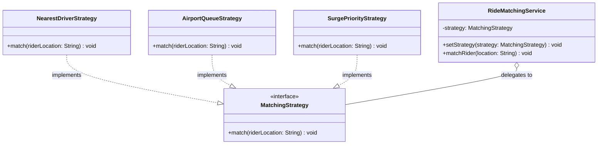
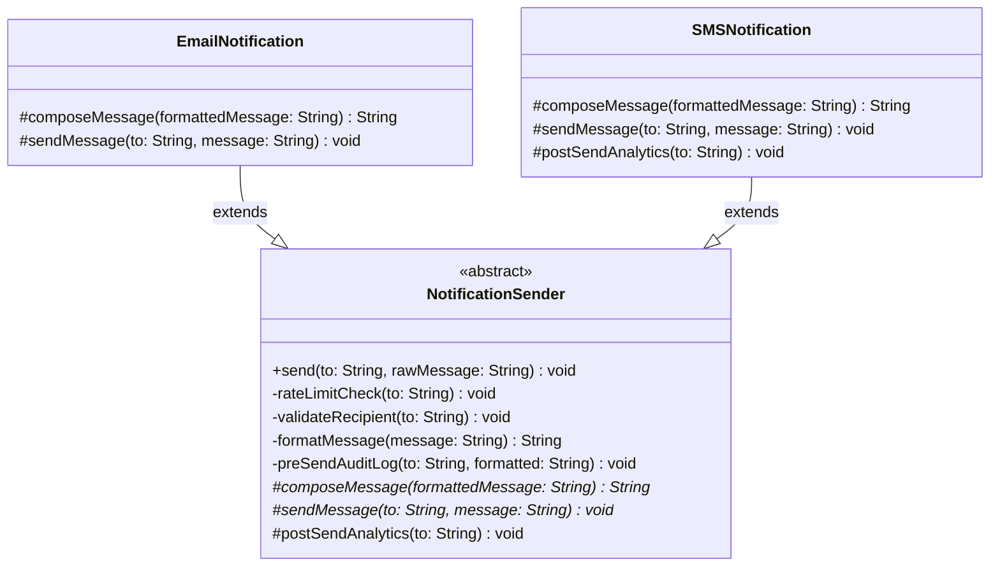
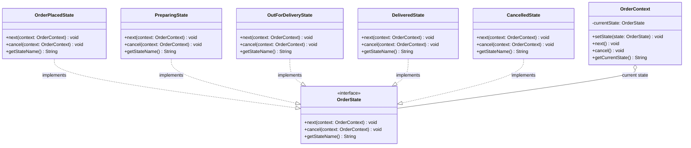

# Behavioural Design Patterns — Strategy, Template Method and State

Behavioural patterns are about how objects interact and divide up the work: who decides what, who calls whom, and how behaviour changes over time. They simplify complicated communication between objects while keeping them loosely coupled. Think of a TV remote that lets you step through channels one by one without knowing how the channels are stored: that kind of controlled interaction is what behavioural patterns help you design.

This chapter covers the eleven GoF behavioural patterns in four lessons. This first lesson covers the three patterns that answer one question, *how do I vary behaviour?*: **Strategy** (swap the whole algorithm), **Template Method** (fix the algorithm's outline and vary some steps) and **State** (let behaviour change with the object's state). The next three lessons cover [requests and undo](/synapse/low-level-design/design-patterns/behavioural-requests-and-undo) (Command, Chain of Responsibility, Memento), [object communication](/synapse/low-level-design/design-patterns/behavioural-object-communication) (Observer, Mediator) and [traversal](/synapse/low-level-design/design-patterns/behavioural-traversal) (Iterator, Visitor).

<div style="border-left:4px solid #195045;background:rgba(25,80,69,0.08);padding:0.6rem 1rem;border-radius:0 0.5rem 0.5rem 0;margin:1.25rem 0">

💡 **The core idea.**

- **Strategy** puts each variant of an algorithm in its own class behind one interface; the object that uses it holds one in a field and can swap it at run time. It is composition.
- **Template Method** puts the fixed outline of an algorithm in a base-class method and leaves some steps to subclasses. It is inheritance.
- **State** gives each state of an object its own class; the object delegates to its current state, and the states decide the transitions.

</div>

This builds on [Structural Design Patterns](/synapse/low-level-design/design-patterns/structural-design-patterns) and on the abstract classes and template method from [Abstraction & Interfaces](/synapse/low-level-design/oop/abstraction-interfaces-static-members-inner-classes). Every output below was produced by running the code on Java 21 and Python 3.11.

**You'll be able to:** replace a conditional that picks an algorithm with interchangeable strategies, and keep strategies safe to share; write a template method whose fixed steps really can't be changed by subclasses; model an object's lifecycle with the State pattern, and say what adding a new state costs; tell State from Strategy by who chooses the behaviour and whether the variants know about each other.

<div style="border-left:4px solid #15448e;background:rgba(21,68,142,0.08);padding:0.6rem 1rem;border-radius:0 0.5rem 0.5rem 0;margin:1.25rem 0">

📘 **How to read the Intuition boxes.** Each one is built in three moves:

1. **The mechanism** — where the varying behaviour lives, and who decides which variant runs.
2. **A concrete bite** — a specific, runnable program where that decision is made in the wrong place.
3. **The earned rule** — the decision heuristic, now justified rather than asserted, plus its cost.

</div>

---

## Table of contents

1. [Strategy pattern](#1-strategy-pattern)
2. [Template Method pattern](#2-template-method-pattern)
3. [State pattern](#3-state-pattern)
4. [State or Strategy?](#4-state-or-strategy)
5. [Mental-model summary](#5-mental-model-summary)
6. [Gotcha checklist](#6-gotcha-checklist)
7. [Check yourself](#-check-yourself)
8. [Sources](#-sources)

---

## 1. Strategy pattern

A navigation app can plan a route for driving, walking or cycling, and the algorithm depends on the mode chosen. Instead of hard-coding every algorithm inside one class, each one can be defined separately and chosen while the app runs. That is what the Strategy pattern does: it lets a class choose its behaviour at run time by putting related algorithms into interchangeable objects.

<div style="border-left:4px solid #15448e;background:rgba(21,68,142,0.08);padding:0.6rem 1rem;border-radius:0 0.5rem 0.5rem 0;margin:1.25rem 0">

📘 **Definition.** "Define a family of algorithms, encapsulate each one, and make them interchangeable. Strategy lets the algorithm vary independently from clients that use it" <abbr title="Gamma, Helm, Johnson and Vlissides, Design Patterns, 1994, Strategy: Intent">[1]</abbr>.

</div>

Each algorithm (each *strategy*) lives in its own class, behind a common interface, and the object that uses it (the *context*) can switch between them without changing its own class. That keeps related algorithms organised, and makes the code flexible and easy to extend.

<div style="border-left:4px solid #195045;background:rgba(25,80,69,0.08);padding:0.6rem 1rem;border-radius:0 0.5rem 0.5rem 0;margin:1.25rem 0">

💡 **Insight.** A ride-hailing app matches riders with drivers, and the matching algorithm depends on the situation: the nearest driver, priority for surge zones, or first in line at an airport queue.

</div>

In this example, the ride-matching service is the **context**; the matching algorithms (nearest, surge priority, airport queue) are the **strategies**; and the strategy interface lets the service switch between them as conditions change, without its own code changing.

### Understanding the problem

Here is a ride-matching service with every algorithm in one method:

```java run
// ⚠️ ANTI-PATTERN — every algorithm is a branch of one method. Do not copy it.
class RideMatchingService {
    public void matchRider(String riderLocation, String matchingType) {
        if (matchingType.equals("NEAREST")) {
            System.out.println("Matching rider at " + riderLocation + " with nearest driver.");
        } else if (matchingType.equals("SURGE_PRIORITY")) {
            System.out.println("Matching rider at " + riderLocation + " based on surge pricing priority.");
        } else if (matchingType.equals("AIRPORT_QUEUE")) {
            System.out.println("Matching rider at " + riderLocation + " from airport queue.");
        } else {
            System.out.println("Invalid matching strategy provided.");
        }
    }
}

public class Main {
    public static void main(String[] args) {
        RideMatchingService service = new RideMatchingService();
        service.matchRider("Downtown", "NEAREST");
        service.matchRider("City Center", "SURGE_PRIORITY");
        service.matchRider("Airport Terminal 1", "AIRPORT_QUEUE");
    }
}
```

```python run
# ⚠️ ANTI-PATTERN — every algorithm is a branch of one method. Do not copy it.
class RideMatchingService:
    def match_rider(self, rider_location: str, matching_type: str) -> None:
        if matching_type == "NEAREST":
            print(f"Matching rider at {rider_location} with nearest driver.")
        elif matching_type == "SURGE_PRIORITY":
            print(f"Matching rider at {rider_location} based on surge pricing priority.")
        elif matching_type == "AIRPORT_QUEUE":
            print(f"Matching rider at {rider_location} from airport queue.")
        else:
            print("Invalid matching strategy provided.")


service = RideMatchingService()
service.match_rider("Downtown", "NEAREST")
service.match_rider("City Center", "SURGE_PRIORITY")
service.match_rider("Airport Terminal 1", "AIRPORT_QUEUE")
```

**Output:**
```
Matching rider at Downtown with nearest driver.
Matching rider at City Center based on surge pricing priority.
Matching rider at Airport Terminal 1 from airport queue.
```

**Problems with this approach.**

| Issue | Explanation |
| --- | --- |
| Violates the Open/Closed Principle | Adding a strategy, such as VIP matching, means modifying `RideMatchingService`, so the strategies and the core class are tightly coupled. |
| The code gets messy | Every new condition adds a branch, and the method gets harder to read and maintain. |
| Hard to test or reuse | No single matching algorithm can be tested or reused on its own; they are all inside one method. |
| No separation of concerns | The class both coordinates (the service) and implements (the algorithms), which makes it less flexible. |

### The solution

The Strategy pattern removes the conditional by giving each matching algorithm its own class. The service delegates to whichever strategy it currently holds:

```java run
// Strategy interface
interface MatchingStrategy {
    void match(String riderLocation);
}

// Concrete strategies
class NearestDriverStrategy implements MatchingStrategy {
    public void match(String riderLocation) {
        System.out.println("Matching with the nearest available driver to " + riderLocation);
    }
}

class AirportQueueStrategy implements MatchingStrategy {
    public void match(String riderLocation) {
        System.out.println("Matching using FIFO airport queue for " + riderLocation);
    }
}

class SurgePriorityStrategy implements MatchingStrategy {
    public void match(String riderLocation) {
        System.out.println("Matching rider using surge pricing priority near " + riderLocation);
    }
}

// Context: delegates matching to its current strategy.
class RideMatchingService {
    private MatchingStrategy strategy;

    RideMatchingService(MatchingStrategy strategy) { // constructor injection
        this.strategy = strategy;
    }

    void setStrategy(MatchingStrategy strategy) { // swap at run time
        this.strategy = strategy;
    }

    void matchRider(String location) {
        strategy.match(location);
    }
}

public class Main {
    public static void main(String[] args) {
        RideMatchingService airport = new RideMatchingService(new AirportQueueStrategy());
        airport.matchRider("Terminal 1");

        RideMatchingService city = new RideMatchingService(new NearestDriverStrategy());
        city.matchRider("Downtown");
        city.setStrategy(new SurgePriorityStrategy()); // surge starts downtown
        city.matchRider("Downtown");
    }
}
```

```python run
from abc import ABC, abstractmethod


# Strategy interface
class MatchingStrategy(ABC):
    @abstractmethod
    def match(self, rider_location: str) -> None: ...


# Concrete strategies
class NearestDriverStrategy(MatchingStrategy):
    def match(self, rider_location: str) -> None:
        print(f"Matching with the nearest available driver to {rider_location}")


class AirportQueueStrategy(MatchingStrategy):
    def match(self, rider_location: str) -> None:
        print(f"Matching using FIFO airport queue for {rider_location}")


class SurgePriorityStrategy(MatchingStrategy):
    def match(self, rider_location: str) -> None:
        print(f"Matching rider using surge pricing priority near {rider_location}")


# Context: delegates matching to its current strategy.
class RideMatchingService:
    def __init__(self, strategy: MatchingStrategy) -> None:
        self._strategy = strategy

    def set_strategy(self, strategy: MatchingStrategy) -> None:
        self._strategy = strategy

    def match_rider(self, location: str) -> None:
        self._strategy.match(location)


airport = RideMatchingService(AirportQueueStrategy())
airport.match_rider("Terminal 1")

city = RideMatchingService(NearestDriverStrategy())
city.match_rider("Downtown")
city.set_strategy(SurgePriorityStrategy())  # surge starts downtown
city.match_rider("Downtown")
```

**Output:**
```
Matching using FIFO airport queue for Terminal 1
Matching with the nearest available driver to Downtown
Matching rider using surge pricing priority near Downtown
```

In Python, functions are objects, so a plain function or lambda is often enough as a strategy: `RideMatchingService(lambda loc: print(...))`. The class-based form above mirrors the Java structure one-to-one, which helps when a strategy needs configuration or several methods.

**How this solves the earlier problems.**

| Problem in the old approach | How the Strategy pattern solves it |
| --- | --- |
| Violates the Open/Closed Principle | A new strategy is a new class implementing `MatchingStrategy`; the service doesn't change. |
| The code gets messy | The `if`/`else` chain is gone; each behaviour is its own class. |
| Hard to test or reuse | Each strategy can be tested on its own, and reused by other services. |
| No separation of concerns | `RideMatchingService` only coordinates; the algorithms live in the strategy classes. |



**Analysis.** The downtown service switched from nearest-driver to surge matching with one `setStrategy` call, and its own code never mentions either algorithm. Who picks the strategy is decided outside the context: by the code that creates the service, or by whatever detects that surge has started. The strategies don't know about each other.

**Intuition.**
*Mechanism.* The context holds a reference to a strategy object and forwards the work to it. The strategy is chosen from outside, and can be replaced at any time. Because a strategy is an object, it can also hold data, and that data travels with the object, not with the context that happens to use it.

*Concrete bite.* An airport queue strategy really does hold data: the queue of drivers waiting at that airport. Here one strategy instance is shared by two terminals' services, because "it's the same algorithm":

```java run
import java.util.ArrayDeque;
import java.util.Deque;
import java.util.List;

interface MatchingStrategy {
    String match(String riderLocation);
}

// A strategy with state: the drivers waiting in its queue.
class AirportQueueStrategy implements MatchingStrategy {
    private final Deque<String> queue;

    AirportQueueStrategy(List<String> waitingDrivers) {
        this.queue = new ArrayDeque<>(waitingDrivers);
    }

    public String match(String riderLocation) {
        return riderLocation + " -> " + queue.poll();
    }
}

class RideMatchingService {
    private final MatchingStrategy strategy;
    RideMatchingService(MatchingStrategy strategy) { this.strategy = strategy; }
    String matchRider(String location) { return strategy.match(location); }
}

public class Main {
    public static void main(String[] args) {
        // ⚠️ ANTI-PATTERN — one stateful strategy shared by two contexts. Do not copy it.
        AirportQueueStrategy terminal1Queue = new AirportQueueStrategy(List.of("T1-driver-A", "T1-driver-B"));
        RideMatchingService terminal1 = new RideMatchingService(terminal1Queue);
        RideMatchingService terminal2 = new RideMatchingService(terminal1Queue); // "same algorithm"

        System.out.println(terminal1.matchRider("Terminal 1 rider"));
        System.out.println(terminal2.matchRider("Terminal 2 rider"));
        System.out.println(terminal1.matchRider("Terminal 1 rider"));
    }
}
```

```python run
from collections import deque


# A strategy with state: the drivers waiting in its queue.
class AirportQueueStrategy:
    def __init__(self, waiting_drivers: list[str]) -> None:
        self._queue = deque(waiting_drivers)

    def match(self, rider_location: str) -> str:
        return f"{rider_location} -> {self._queue.popleft() if self._queue else None}"


class RideMatchingService:
    def __init__(self, strategy) -> None:
        self._strategy = strategy

    def match_rider(self, location: str) -> str:
        return self._strategy.match(location)


# ⚠️ ANTI-PATTERN — one stateful strategy shared by two contexts. Do not copy it.
terminal1_queue = AirportQueueStrategy(["T1-driver-A", "T1-driver-B"])
terminal1 = RideMatchingService(terminal1_queue)
terminal2 = RideMatchingService(terminal1_queue)  # "same algorithm"

print(terminal1.match_rider("Terminal 1 rider"))
print(terminal2.match_rider("Terminal 2 rider"))
print(terminal1.match_rider("Terminal 1 rider").replace("None", "null"))
```

**Output:**
```
Terminal 1 rider -> T1-driver-A
Terminal 2 rider -> T1-driver-B
Terminal 1 rider -> null
```

Terminal 2's rider was given a driver waiting at Terminal 1, and the next Terminal 1 rider found the queue empty. The *algorithm* was the same for both terminals, but the *data* wasn't, and sharing the object shared the data.

<div style="border-left:4px solid #195045;background:rgba(25,80,69,0.08);padding:0.6rem 1rem;border-radius:0 0.5rem 0.5rem 0;margin:1.25rem 0">

💡 **Earned rule.** Replace a conditional that picks an algorithm with strategies when the algorithms keep growing or need testing on their own. Keep strategies stateless where you can, so one instance can be shared freely; when a strategy must hold state (a queue, a counter, a cache), give each context its own instance.

The cost is a class per algorithm, and a client that must know which strategies exist. For two fixed variants that never change, an `if` is simpler.

</div>

**Suitable scenarios for the Strategy pattern.**

- **Several interchangeable algorithms:** a system supports different behaviours that are swapped by context or configuration.
- **The Open/Closed Principle:** new behaviours must be added without modifying existing business logic.
- **Removing conditionals:** large `if`/`else` or `switch` blocks that select a behaviour can be split into classes.
- **Testing behaviours on their own:** each strategy can be tested in isolation from the context.
- **Choosing behaviour at run time:** from user input, configuration or the environment.

**Pros of the Strategy pattern.**

- **Open/Closed Principle:** new strategies don't require changes to existing code.
- **Easy to add behaviours:** each behaviour is self-contained.
- **Run-time changes:** behaviour can be swapped while the program runs.
- **Composition over inheritance:** behaviour is plugged in, not inherited, which keeps the design flexible.

**Cons of the Strategy pattern.**

- **Many small classes:** one class per strategy adds code.
- **Clients must know the strategies:** the code that picks one must know which exist and when to use each.
- **Overhead of interfaces:** extra structure that simple logic may not need.
- **More complex than `if`/`else`** in very simple cases.

---

## 2. Template Method pattern

Baking a cake from a recipe, the steps are fixed: mix the ingredients, preheat the oven, bake, cool. The details, such as the ingredients or the flavour, vary from cake to cake. The Template Method pattern works the same way: a base class defines the fixed structure of an algorithm, and subclasses fill in some of its steps.

<div style="border-left:4px solid #15448e;background:rgba(21,68,142,0.08);padding:0.6rem 1rem;border-radius:0 0.5rem 0.5rem 0;margin:1.25rem 0">

📘 **Definition.** "Define the skeleton of an algorithm in an operation, deferring some steps to subclasses. Template Method lets subclasses redefine certain steps of an algorithm without changing the algorithm's structure" <abbr title="Gamma, Helm, Johnson and Vlissides, Design Patterns, 1994, Template Method: Intent">[1]</abbr>.

</div>

The invariant parts of the algorithm stay in one place and can't be changed, while the variable parts can be customised. The recipe is the template: it fixes the steps, and each kind of cake supplies its own ingredients.

**The four parts of a template method.**

- **The template method:** a method in the base class, usually `final`, that defines the skeleton of the algorithm by calling the steps in order. Making it `final` stops subclasses changing the structure.
- **Primitive operations:** abstract methods that subclasses must implement. They are the variable parts of the algorithm.
- **Concrete operations:** methods with behaviour common to every subclass, defined once in the base class. Making them `private` or `final` stops subclasses changing them.
- **Hooks:** optional methods with default behaviour in the base class. Subclasses may override them, but don't have to.

### Understanding the problem

A notification service sends messages by email and by SMS. Each class does the whole job itself:

```java run
// ⚠️ ANTI-PATTERN — the common steps are copied into every channel. Do not copy it.
class EmailNotification {
    public void send(String to, String message) {
        System.out.println("Checking rate limits for: " + to);
        System.out.println("Validating email recipient: " + to);
        String formatted = message.trim();
        System.out.println("Logging before send: " + formatted + " to " + to);
        String composedMessage = "<html><body><p>" + formatted + "</p></body></html>";
        System.out.println("Sending EMAIL to " + to + " with content:\n" + composedMessage);
        System.out.println("Analytics updated for: " + to);
    }
}

class SMSNotification {
    public void send(String to, String message) {
        System.out.println("Checking rate limits for: " + to);
        System.out.println("Validating phone number: " + to);
        String formatted = message.trim();
        System.out.println("Logging before send: " + formatted + " to " + to);
        String composedMessage = "[SMS] " + formatted;
        System.out.println("Sending SMS to " + to + " with message: " + composedMessage);
        System.out.println("Custom SMS analytics for: " + to);
    }
}

public class Main {
    public static void main(String[] args) {
        new EmailNotification().send("example@example.com", "Your order has been placed!");
        System.out.println();
        new SMSNotification().send("1234567890", "Your OTP is 1234.");
    }
}
```

```python run
# ⚠️ ANTI-PATTERN — the common steps are copied into every channel. Do not copy it.
class EmailNotification:
    def send(self, to: str, message: str) -> None:
        print(f"Checking rate limits for: {to}")
        print(f"Validating email recipient: {to}")
        formatted = message.strip()
        print(f"Logging before send: {formatted} to {to}")
        composed_message = f"<html><body><p>{formatted}</p></body></html>"
        print(f"Sending EMAIL to {to} with content:\n{composed_message}")
        print(f"Analytics updated for: {to}")


class SMSNotification:
    def send(self, to: str, message: str) -> None:
        print(f"Checking rate limits for: {to}")
        print(f"Validating phone number: {to}")
        formatted = message.strip()
        print(f"Logging before send: {formatted} to {to}")
        composed_message = f"[SMS] {formatted}"
        print(f"Sending SMS to {to} with message: {composed_message}")
        print(f"Custom SMS analytics for: {to}")


EmailNotification().send("example@example.com", "Your order has been placed!")
print()
SMSNotification().send("1234567890", "Your OTP is 1234.")
```

**Output:**
```
Checking rate limits for: example@example.com
Validating email recipient: example@example.com
Logging before send: Your order has been placed! to example@example.com
Sending EMAIL to example@example.com with content:
<html><body><p>Your order has been placed!</p></body></html>
Analytics updated for: example@example.com

Checking rate limits for: 1234567890
Validating phone number: 1234567890
Logging before send: Your OTP is 1234. to 1234567890
Sending SMS to 1234567890 with message: [SMS] Your OTP is 1234.
Custom SMS analytics for: 1234567890
```

**Issues in this code.**

- **Duplication:** both classes contain nearly identical code for rate limiting, formatting, logging and analytics, which breaks DRY and makes the code harder to maintain.
- **Hard-coded behaviour:** the whole procedure is inside each `send()`, so a new channel, such as push notifications, means copying all of it again.
- **Not extensible:** changing the rate-limit, logging or analytics logic means editing every channel class, with a risk of missing one.
- **Maintenance overhead:** every new channel adds another class full of the same code.

### The solution

The Template Method pattern moves the shared procedure into a base class. Its `send()` is the template method: it runs the common steps, and calls abstract methods for the steps that differ by channel:

```java run
// The base class: the template method and the common steps.
abstract class NotificationSender {

    // Template method: final, so subclasses can't change the order of the steps.
    public final void send(String to, String rawMessage) {
        rateLimitCheck(to);
        validateRecipient(to);
        String formatted = formatMessage(rawMessage);
        preSendAuditLog(to, formatted);

        String composedMessage = composeMessage(formatted); // varies by channel
        sendMessage(to, composedMessage);                   // varies by channel

        postSendAnalytics(to);                              // hook: optional override
    }

    // Concrete operations: private, so no subclass can change or skip them.
    private void rateLimitCheck(String to) {
        System.out.println("Checking rate limits for: " + to);
    }

    private void validateRecipient(String to) {
        System.out.println("Validating recipient: " + to);
    }

    private String formatMessage(String message) {
        return message.trim(); // could also escape HTML, process emoji, and so on
    }

    private void preSendAuditLog(String to, String formatted) {
        System.out.println("Logging before send: " + formatted + " to " + to);
    }

    // Primitive operations: every subclass must implement these.
    protected abstract String composeMessage(String formattedMessage);

    protected abstract void sendMessage(String to, String message);

    // Hook: a default that subclasses may override.
    protected void postSendAnalytics(String to) {
        System.out.println("Analytics updated for: " + to);
    }
}

class EmailNotification extends NotificationSender {
    protected String composeMessage(String formattedMessage) {
        return "<html><body><p>" + formattedMessage + "</p></body></html>";
    }

    protected void sendMessage(String to, String message) {
        System.out.println("Sending EMAIL to " + to + " with content:\n" + message);
    }
}

class SMSNotification extends NotificationSender {
    protected String composeMessage(String formattedMessage) {
        return "[SMS] " + formattedMessage;
    }

    protected void sendMessage(String to, String message) {
        System.out.println("Sending SMS to " + to + " with message: " + message);
    }

    @Override
    protected void postSendAnalytics(String to) { // overrides the hook
        System.out.println("Custom SMS analytics for: " + to);
    }
}

public class Main {
    public static void main(String[] args) {
        NotificationSender emailSender = new EmailNotification();
        emailSender.send("john@example.com", "Welcome to the platform!");
        System.out.println();
        NotificationSender smsSender = new SMSNotification();
        smsSender.send("9876543210", "Your OTP is 4567.");
    }
}
```

```python run
from abc import ABC, abstractmethod
from typing import final


# The base class: the template method and the common steps.
class NotificationSender(ABC):

    # Template method. Python has no enforced `final`: @final is only checked by
    # static type checkers, so nothing at run time stops a subclass overriding send().
    @final
    def send(self, to: str, raw_message: str) -> None:
        self.__rate_limit_check(to)
        self.__validate_recipient(to)
        formatted = self.__format_message(raw_message)
        self.__pre_send_audit_log(to, formatted)

        composed_message = self.compose_message(formatted)  # varies by channel
        self.send_message(to, composed_message)             # varies by channel

        self.post_send_analytics(to)                        # hook: optional override

    # Concrete operations: double underscores mangle the names, so subclasses
    # can't accidentally override them.
    def __rate_limit_check(self, to: str) -> None:
        print(f"Checking rate limits for: {to}")

    def __validate_recipient(self, to: str) -> None:
        print(f"Validating recipient: {to}")

    def __format_message(self, message: str) -> str:
        return message.strip()

    def __pre_send_audit_log(self, to: str, formatted: str) -> None:
        print(f"Logging before send: {formatted} to {to}")

    # Primitive operations: every subclass must implement these.
    @abstractmethod
    def compose_message(self, formatted_message: str) -> str: ...

    @abstractmethod
    def send_message(self, to: str, message: str) -> None: ...

    # Hook: a default that subclasses may override.
    def post_send_analytics(self, to: str) -> None:
        print(f"Analytics updated for: {to}")


class EmailNotification(NotificationSender):
    def compose_message(self, formatted_message: str) -> str:
        return f"<html><body><p>{formatted_message}</p></body></html>"

    def send_message(self, to: str, message: str) -> None:
        print(f"Sending EMAIL to {to} with content:\n{message}")


class SMSNotification(NotificationSender):
    def compose_message(self, formatted_message: str) -> str:
        return f"[SMS] {formatted_message}"

    def send_message(self, to: str, message: str) -> None:
        print(f"Sending SMS to {to} with message: {message}")

    def post_send_analytics(self, to: str) -> None:  # overrides the hook
        print(f"Custom SMS analytics for: {to}")


email_sender = EmailNotification()
email_sender.send("john@example.com", "Welcome to the platform!")
print()
sms_sender = SMSNotification()
sms_sender.send("9876543210", "Your OTP is 4567.")
```

**Output:**
```
Checking rate limits for: john@example.com
Validating recipient: john@example.com
Logging before send: Welcome to the platform! to john@example.com
Sending EMAIL to john@example.com with content:
<html><body><p>Welcome to the platform!</p></body></html>
Analytics updated for: john@example.com

Checking rate limits for: 9876543210
Validating recipient: 9876543210
Logging before send: Your OTP is 4567. to 9876543210
Sending SMS to 9876543210 with message: [SMS] Your OTP is 4567.
Custom SMS analytics for: 9876543210
```

**The four parts in this code.**

- **Template method:** `send()` defines the skeleton. It calls the common steps (`rateLimitCheck`, `validateRecipient`, `formatMessage`, `preSendAuditLog`) and delegates the channel-specific ones to subclasses.
- **Primitive operations:** `composeMessage()` and `sendMessage()` are abstract, so `EmailNotification` and `SMSNotification` must implement them.
- **Concrete operations:** `rateLimitCheck`, `validateRecipient`, `formatMessage` and `preSendAuditLog` hold the logic shared by every channel, and are private, so no subclass can change them.
- **Hook:** `postSendAnalytics` has a default, which `SMSNotification` overrides with custom analytics and `EmailNotification` keeps.

**How this solves the issues.**

| Issue | Solution with Template Method |
| --- | --- |
| Duplication | The common steps (rate limiting, validation, logging) live once, in the base class. |
| Hard-coded behaviour | Channel-specific behaviour is in subclasses, which keeps the code flexible. |
| Not extensible | A new channel, such as `PushNotification`, extends `NotificationSender` and implements two methods. |
| Maintenance overhead | Changing rate limiting or logging means editing one place, the base class. |



**Analysis.** Both channels ran the same six steps in the same order, but neither subclass contains a single line of the shared logic. In the diagram, the private (`-`) operations are the fixed part, the italic abstract operations (`*`) are the parts each subclass must supply, and the protected (`#`) `postSendAnalytics` is the hook. `send()` is `final` in the Java code; UML would show that as the property `{leaf}`, which Mermaid can't draw.

**Intuition.**
*Mechanism.* The template method calls its steps through `this`, so each call goes to the subclass's version if there is one. That is how the variable steps get customised, and it is also how the fixed steps get customised, by accident or on purpose, unless the base class prevents it. Only `private` and `final` (in Python, name mangling, plus a static `@final` check) keep a step fixed.

*Concrete bite.* Here the rate-limit step was left `protected` and overridable, and someone wrote an OTP sender that "must never be delayed":

```java run
import java.util.HashMap;
import java.util.Map;

abstract class NotificationSender {
    private static final int LIMIT = 2; // at most two messages per recipient
    private final Map<String, Integer> sentTo = new HashMap<>();

    public final void send(String to, String message) {
        if (!rateLimitCheck(to)) {
            System.out.println("Rate limit reached for " + to + "; not sent");
            return;
        }
        sendMessage(to, message);
    }

    // Meant to be fixed, but left protected and overridable.
    protected boolean rateLimitCheck(String to) {
        return sentTo.merge(to, 1, Integer::sum) <= LIMIT;
    }

    protected abstract void sendMessage(String to, String message);
}

class SMSNotification extends NotificationSender {
    protected void sendMessage(String to, String message) {
        System.out.println("SMS to " + to + ": " + message);
    }
}

// ⚠️ ANTI-PATTERN — a subclass overrides a step the template meant to keep fixed. Do not copy it.
class FastOtpNotification extends SMSNotification {
    @Override
    protected boolean rateLimitCheck(String to) {
        return true; // "OTPs must never be delayed"
    }
}

public class Main {
    public static void main(String[] args) {
        NotificationSender[] senders = {new SMSNotification(), new FastOtpNotification()};
        for (NotificationSender sender : senders) {
            System.out.println(sender.getClass().getSimpleName() + ":");
            for (int i = 1; i <= 3; i++) {
                sender.send("98765", "OTP " + i);
            }
        }
    }
}
```

```python run
from abc import ABC, abstractmethod


class NotificationSender(ABC):
    LIMIT = 2  # at most two messages per recipient

    def __init__(self) -> None:
        self._sent_to: dict[str, int] = {}

    def send(self, to: str, message: str) -> None:
        if not self.rate_limit_check(to):
            print(f"Rate limit reached for {to}; not sent")
            return
        self.send_message(to, message)

    # Meant to be fixed, but left public and overridable.
    def rate_limit_check(self, to: str) -> bool:
        self._sent_to[to] = self._sent_to.get(to, 0) + 1
        return self._sent_to[to] <= self.LIMIT

    @abstractmethod
    def send_message(self, to: str, message: str) -> None: ...


class SMSNotification(NotificationSender):
    def send_message(self, to: str, message: str) -> None:
        print(f"SMS to {to}: {message}")


# ⚠️ ANTI-PATTERN — a subclass overrides a step the template meant to keep fixed. Do not copy it.
class FastOtpNotification(SMSNotification):
    def rate_limit_check(self, to: str) -> bool:
        return True  # "OTPs must never be delayed"


for sender in [SMSNotification(), FastOtpNotification()]:
    print(f"{type(sender).__name__}:")
    for i in range(1, 4):
        sender.send("98765", f"OTP {i}")
```

**Output:**
```
SMSNotification:
SMS to 98765: OTP 1
SMS to 98765: OTP 2
Rate limit reached for 98765; not sent
FastOtpNotification:
SMS to 98765: OTP 1
SMS to 98765: OTP 2
SMS to 98765: OTP 3
```

`send()` was `final`, so its structure looked protected, yet the rate limit, the step that protects users from message floods, was switched off by a three-line subclass. A template is only as fixed as the steps it calls: here the skeleton was locked, but one of its bones was replaceable.

<div style="border-left:4px solid #195045;background:rgba(25,80,69,0.08);padding:0.6rem 1rem;border-radius:0 0.5rem 0.5rem 0;margin:1.25rem 0">

💡 **Earned rule.** Use Template Method when several classes follow the same procedure and differ in a few steps. Make the template method `final`, make every step that must not vary `private` (or `final`), make the varying steps `abstract`, and offer hooks only where variation is genuinely allowed. In Python, mark the template `@final` and give the fixed steps double-underscore names.

The cost is inheritance: each variant is a subclass, tied to the base class's structure, and a class can only have one base. When the varying part is the whole algorithm, or must be swapped at run time, use Strategy instead.

</div>

**When to use the Template Method pattern.**

- Several classes follow the same algorithm, but differ in a few steps.
- You want to avoid duplicating the common steps.
- The steps must run in a fixed order.
- You want to allow optional customisations, through hooks.
- You need a structured flow that subclasses follow, while filling in specific details.

**Pros of the Template Method pattern.**

- **Reuse:** common steps are shared, and every subclass follows the same algorithm without duplicating code.
- **Open/Closed Principle:** new variants are new subclasses, with no change to the base class.
- **A consistent flow:** the order of the steps is fixed and predictable for every subclass.
- **Optional customisation:** hooks let subclasses adjust behaviour without changing the structure.

**Cons of the Template Method pattern.**

- **Based on inheritance:** behaviour is tied to the base class, which limits flexibility.
- **Tight coupling:** a change to the base class can affect every subclass.
- **A poor fit when the whole algorithm varies:** then Strategy is the better choice.
- **Many subclasses:** if many steps vary independently, the number of subclasses grows.

**Real-world uses of Template Method.**

1. **Payment flows.** A payment platform runs domestic and international payments through the same sequence (validate the payment method, process the payment, update the account), while the details, such as validating a UPI ID or a card, differ by subclass.
2. **Game engines.** Engines such as Unity and Unreal fix the shape of the game loop (handle input, update physics, render), and let each game customise steps such as AI decisions or rendering.
3. **Frameworks and libraries.** Java's `HttpServlet.service()` is a template method: it dispatches each request to `doGet`, `doPost` and so on, which subclasses override. `java.util.AbstractList` implements most list operations in terms of two primitive operations, `get` and `size`, that subclasses supply. Django's class-based views dispatch to `get()` and `post()` in the same way.

---

## 3. State pattern

A vending machine behaves differently depending on what has happened: when you have inserted enough money it gives you a snack, and when you haven't, it asks for more. Behaviour that changes with an object's state is what the State pattern organises.

<div style="border-left:4px solid #15448e;background:rgba(21,68,142,0.08);padding:0.6rem 1rem;border-radius:0 0.5rem 0.5rem 0;margin:1.25rem 0">

📘 **Definition.** "Allow an object to alter its behavior when its internal state changes. The object will appear to change its class" <abbr title="Gamma, Helm, Johnson and Vlissides, Design Patterns, 1994, State: Intent">[1]</abbr>.

</div>

The State pattern puts the behaviour for each state into its own class, and the object (the *context*) delegates each operation to its current state object. Each state class is independent of the others' internals, and the transitions between states are explicit.

**Real-life analogy.** In a food delivery app, an order moves through several stages: placed, being prepared, a delivery partner assigned, picked up, out for delivery, and finally delivered. At each stage the app behaves differently: when the order has just been placed you can cancel it; while it is being prepared you can track its progress; once a partner is assigned you can see their details; and so on until delivery.

<div style="border-left:4px solid #195045;background:rgba(25,80,69,0.08);padding:0.6rem 1rem;border-radius:0 0.5rem 0.5rem 0;margin:1.25rem 0">

💡 **Insight.** Each stage is a distinct state, and the app's behaviour depends on which state the order is in. With the State pattern, each state class controls the behaviour for its stage, and decides which state comes next.

</div>

### Understanding the problem

Here is an order whose state is a string, with every operation switching on it:

```java run
class Order {
    private String state = "ORDER_PLACED";

    // Cancellation is allowed only before the order leaves the restaurant.
    public void cancelOrder() {
        if (state.equals("ORDER_PLACED") || state.equals("PREPARING")) {
            state = "CANCELLED";
            System.out.println("Order has been cancelled.");
        } else {
            System.out.println("Cannot cancel the order now.");
        }
    }

    public void nextState() {
        switch (state) {
            case "ORDER_PLACED": state = "PREPARING"; break;
            case "PREPARING": state = "OUT_FOR_DELIVERY"; break;
            case "OUT_FOR_DELIVERY": state = "DELIVERED"; break;
            default:
                System.out.println("No next state from: " + state);
                return;
        }
        System.out.println("Order moved to: " + state);
    }

    public String getState() {
        return state;
    }
}

public class Main {
    public static void main(String[] args) {
        Order order = new Order();
        System.out.println("Initial State: " + order.getState());
        order.nextState(); // ORDER_PLACED -> PREPARING
        order.nextState(); // PREPARING -> OUT_FOR_DELIVERY
        order.nextState(); // OUT_FOR_DELIVERY -> DELIVERED
        order.cancelOrder(); // must be refused
        System.out.println("Final State: " + order.getState());
    }
}
```

```python run
class Order:
    def __init__(self) -> None:
        self._state = "ORDER_PLACED"

    # Cancellation is allowed only before the order leaves the restaurant.
    def cancel_order(self) -> None:
        if self._state in ("ORDER_PLACED", "PREPARING"):
            self._state = "CANCELLED"
            print("Order has been cancelled.")
        else:
            print("Cannot cancel the order now.")

    def next_state(self) -> None:
        transitions = {
            "ORDER_PLACED": "PREPARING",
            "PREPARING": "OUT_FOR_DELIVERY",
            "OUT_FOR_DELIVERY": "DELIVERED",
        }
        if self._state not in transitions:
            print(f"No next state from: {self._state}")
            return
        self._state = transitions[self._state]
        print(f"Order moved to: {self._state}")

    @property
    def state(self) -> str:
        return self._state


order = Order()
print(f"Initial State: {order.state}")
order.next_state()  # ORDER_PLACED -> PREPARING
order.next_state()  # PREPARING -> OUT_FOR_DELIVERY
order.next_state()  # OUT_FOR_DELIVERY -> DELIVERED
order.cancel_order()  # must be refused
print(f"Final State: {order.state}")
```

**Output:**
```
Initial State: ORDER_PLACED
Order moved to: PREPARING
Order moved to: OUT_FOR_DELIVERY
Order moved to: DELIVERED
Cannot cancel the order now.
Final State: DELIVERED
```

The code works, but it has serious problems.

**Issues in the code.**

- **Transitions are hard-coded:** they live in a `switch` in `nextState()`, which gets unwieldy as states are added.
- **Poor encapsulation:** the transition logic and the cancellation rules are all inside `Order`, which mixes several responsibilities in one class.
- **Duplication:** every new operation repeats a check of the state string, and every new state must be added to every such check.
- **Fragile to change:** adding a state or changing a behaviour means editing `Order` each time, which is error-prone.

### The solution

With the State pattern, each state is a class that implements every operation for that state, and decides the next state:

```java run
// The context: holds the current state and delegates to it.
class OrderContext {
    private OrderState currentState = new OrderPlacedState(); // the initial state

    void setState(OrderState state) {
        this.currentState = state;
    }

    void next() {
        currentState.next(this);
    }

    void cancel() {
        currentState.cancel(this);
    }

    String getCurrentState() {
        return currentState.getStateName();
    }
}

// Every state must answer every operation.
interface OrderState {
    void next(OrderContext context);
    void cancel(OrderContext context);
    String getStateName();
}

class OrderPlacedState implements OrderState {
    public void next(OrderContext context) {
        context.setState(new PreparingState());
        System.out.println("Order is now being prepared.");
    }

    public void cancel(OrderContext context) {
        context.setState(new CancelledState());
        System.out.println("Order has been cancelled.");
    }

    public String getStateName() { return "ORDER_PLACED"; }
}

class PreparingState implements OrderState {
    public void next(OrderContext context) {
        context.setState(new OutForDeliveryState());
        System.out.println("Order is out for delivery.");
    }

    public void cancel(OrderContext context) {
        context.setState(new CancelledState());
        System.out.println("Order has been cancelled.");
    }

    public String getStateName() { return "PREPARING"; }
}

class OutForDeliveryState implements OrderState {
    public void next(OrderContext context) {
        context.setState(new DeliveredState());
        System.out.println("Order has been delivered.");
    }

    public void cancel(OrderContext context) {
        System.out.println("Cannot cancel. Order is out for delivery.");
    }

    public String getStateName() { return "OUT_FOR_DELIVERY"; }
}

class DeliveredState implements OrderState {
    public void next(OrderContext context) {
        System.out.println("Order is already delivered.");
    }

    public void cancel(OrderContext context) {
        System.out.println("Cannot cancel a delivered order.");
    }

    public String getStateName() { return "DELIVERED"; }
}

class CancelledState implements OrderState {
    public void next(OrderContext context) {
        System.out.println("Cancelled order cannot move to next state.");
    }

    public void cancel(OrderContext context) {
        System.out.println("Order is already cancelled.");
    }

    public String getStateName() { return "CANCELLED"; }
}

public class Main {
    public static void main(String[] args) {
        OrderContext order = new OrderContext();
        System.out.println("Current State: " + order.getCurrentState());
        order.next();   // ORDER_PLACED -> PREPARING
        order.next();   // PREPARING -> OUT_FOR_DELIVERY
        order.cancel(); // refused: out for delivery
        order.next();   // OUT_FOR_DELIVERY -> DELIVERED
        order.cancel(); // refused: delivered
        System.out.println("Final State: " + order.getCurrentState());
    }
}
```

```python run
from __future__ import annotations

from abc import ABC, abstractmethod


# Every state must answer every operation.
class OrderState(ABC):
    @abstractmethod
    def next(self, context: OrderContext) -> None: ...

    @abstractmethod
    def cancel(self, context: OrderContext) -> None: ...

    @abstractmethod
    def state_name(self) -> str: ...


class OrderPlacedState(OrderState):
    def next(self, context: OrderContext) -> None:
        context.set_state(PreparingState())
        print("Order is now being prepared.")

    def cancel(self, context: OrderContext) -> None:
        context.set_state(CancelledState())
        print("Order has been cancelled.")

    def state_name(self) -> str:
        return "ORDER_PLACED"


class PreparingState(OrderState):
    def next(self, context: OrderContext) -> None:
        context.set_state(OutForDeliveryState())
        print("Order is out for delivery.")

    def cancel(self, context: OrderContext) -> None:
        context.set_state(CancelledState())
        print("Order has been cancelled.")

    def state_name(self) -> str:
        return "PREPARING"


class OutForDeliveryState(OrderState):
    def next(self, context: OrderContext) -> None:
        context.set_state(DeliveredState())
        print("Order has been delivered.")

    def cancel(self, context: OrderContext) -> None:
        print("Cannot cancel. Order is out for delivery.")

    def state_name(self) -> str:
        return "OUT_FOR_DELIVERY"


class DeliveredState(OrderState):
    def next(self, context: OrderContext) -> None:
        print("Order is already delivered.")

    def cancel(self, context: OrderContext) -> None:
        print("Cannot cancel a delivered order.")

    def state_name(self) -> str:
        return "DELIVERED"


class CancelledState(OrderState):
    def next(self, context: OrderContext) -> None:
        print("Cancelled order cannot move to next state.")

    def cancel(self, context: OrderContext) -> None:
        print("Order is already cancelled.")

    def state_name(self) -> str:
        return "CANCELLED"


# The context: holds the current state and delegates to it.
class OrderContext:
    def __init__(self) -> None:
        self._current_state: OrderState = OrderPlacedState()

    def set_state(self, state: OrderState) -> None:
        self._current_state = state

    def next(self) -> None:
        self._current_state.next(self)

    def cancel(self) -> None:
        self._current_state.cancel(self)

    @property
    def current_state(self) -> str:
        return self._current_state.state_name()


order = OrderContext()
print(f"Current State: {order.current_state}")
order.next()    # ORDER_PLACED -> PREPARING
order.next()    # PREPARING -> OUT_FOR_DELIVERY
order.cancel()  # refused: out for delivery
order.next()    # OUT_FOR_DELIVERY -> DELIVERED
order.cancel()  # refused: delivered
print(f"Final State: {order.current_state}")
```

**Output:**
```
Current State: ORDER_PLACED
Order is now being prepared.
Order is out for delivery.
Cannot cancel. Order is out for delivery.
Order has been delivered.
Cannot cancel a delivered order.
Final State: DELIVERED
```

**How this solves the issues.**

| Issue | Solution with the State pattern |
| --- | --- |
| Transitions are hard-coded | Each state class decides its own transitions, so `OrderContext` doesn't change when they do. |
| Poor encapsulation | Each state's behaviour is in its own class, which keeps responsibilities separate. |
| Duplication | There are no repeated checks of a state string; each class simply implements its own behaviour. |
| Fragile to change | A new state is a new class implementing `OrderState`; only the states that transition into it need to change. |



**Analysis.** `OrderContext` contains no `if` and no `switch`: each call goes to the current state object, which does the right thing and, when appropriate, replaces itself with the next state. The rules for each stage are in one place, its class. The class diagram shows the shape: one context holding one current state, and one class per state, all implementing the same interface.

**Intuition.**
*Mechanism.* In the string version, a state is a value that every method checks; in the State pattern, a state is an object that every method is sent to. The interface lists every operation, so every state class must say what it does for each one. Adding a state means writing one class, and editing only the states that can transition into it.

*Concrete bite.* The business adds a new stage, "partner assigned", between preparing and out-for-delivery, and the rule is that customers may cancel until the order is picked up. In the string version, a developer adds the new state to `nextState()`, the method they were looking at:

```java run
// ⚠️ ANTI-PATTERN — a new state added to one switch but not to the other checks. Do not copy it.
class Order {
    private String state = "ORDER_PLACED";

    public void cancelOrder() { // not updated for the new state
        if (state.equals("ORDER_PLACED") || state.equals("PREPARING")) {
            state = "CANCELLED";
            System.out.println("Order has been cancelled.");
        } else {
            System.out.println("Cannot cancel the order now.");
        }
    }

    public void nextState() {
        switch (state) {
            case "ORDER_PLACED": state = "PREPARING"; break;
            case "PREPARING": state = "PARTNER_ASSIGNED"; break;      // new
            case "PARTNER_ASSIGNED": state = "OUT_FOR_DELIVERY"; break; // new
            case "OUT_FOR_DELIVERY": state = "DELIVERED"; break;
            default:
                System.out.println("No next state from: " + state);
                return;
        }
        System.out.println("Order moved to: " + state);
    }
}

public class Main {
    public static void main(String[] args) {
        Order order = new Order();
        order.nextState(); // PREPARING
        order.nextState(); // PARTNER_ASSIGNED: not picked up yet, so cancelling should be allowed
        order.cancelOrder();
    }
}
```

```python run
# ⚠️ ANTI-PATTERN — a new state added to one table but not to the other checks. Do not copy it.
class Order:
    def __init__(self) -> None:
        self._state = "ORDER_PLACED"

    def cancel_order(self) -> None:  # not updated for the new state
        if self._state in ("ORDER_PLACED", "PREPARING"):
            self._state = "CANCELLED"
            print("Order has been cancelled.")
        else:
            print("Cannot cancel the order now.")

    def next_state(self) -> None:
        transitions = {
            "ORDER_PLACED": "PREPARING",
            "PREPARING": "PARTNER_ASSIGNED",         # new
            "PARTNER_ASSIGNED": "OUT_FOR_DELIVERY",  # new
            "OUT_FOR_DELIVERY": "DELIVERED",
        }
        if self._state not in transitions:
            print(f"No next state from: {self._state}")
            return
        self._state = transitions[self._state]
        print(f"Order moved to: {self._state}")


order = Order()
order.next_state()  # PREPARING
order.next_state()  # PARTNER_ASSIGNED: not picked up yet, so cancelling should be allowed
order.cancel_order()
```

**Output:**
```
Order moved to: PREPARING
Order moved to: PARTNER_ASSIGNED
Cannot cancel the order now.
```

The customer was refused a cancellation the business allows. Nothing failed: the new state silently fell into the `else` branch of a method nobody remembered to update, and in a real codebase there would be many such methods. With the State pattern, `PartnerAssignedState` can't compile until it implements `cancel()`, so the developer is forced to decide what cancelling means in the new state, and the only existing class to edit is `PreparingState`, whose `next()` must now lead to it.

<div style="border-left:4px solid #195045;background:rgba(25,80,69,0.08);padding:0.6rem 1rem;border-radius:0 0.5rem 0.5rem 0;margin:1.25rem 0">

💡 **Earned rule.** When an object has several states and more than one or two operations whose behaviour depends on the state, give each state its own class behind an interface that lists every operation. Then the compiler checks that every state answers every operation.

The cost is a class per state, and transitions spread across those classes, so the full state diagram is no longer visible in one place; draw it, or keep a test that walks every transition. For two states and one operation, a boolean and an `if` are simpler.

</div>

**When to use the State pattern.**

- **Behaviour depends on internal state:** an object must act differently depending on its condition or phase.
- **Well-defined, finite transitions:** the states and the moves between them are clear and limited in number.
- **Avoiding large conditionals:** you want to remove bulky `if`/`else` or `switch` blocks that check the current state.
- **Explicit transitions:** it matters that moves between states are clear and maintainable.
- **Distinct behaviour per state:** each state has its own rules, which are better kept in separate classes.

**Pros of the State pattern.**

- **Clear separation of state behaviour:** each state's behaviour is in its own class, easy to manage and change without affecting the rest.
- **Easy to add states:** a new state is a new class implementing the interface, plus edits to the states that lead to it.
- **Open/Closed Principle (mostly):** existing states that don't transition to the new one are untouched.
- **No large conditionals:** each state class handles its own logic, which improves readability.

**Cons of the State pattern.**

- **More classes:** each state needs its own class, which adds to the size of the design.
- **More set-up:** defining the interface and several state classes takes more initial work than a simple `switch`.
- **Transitions must be managed carefully:** the context and the states share the job of moving between states, which needs care to keep consistent.
- **Requires familiarity:** developers who don't know the pattern have a learning curve.

**Real-life examples.**

1. **Food delivery orders.** An order goes through placed, preparing, out for delivery, delivered or cancelled. Each state allows different actions: a newly placed order can be cancelled; one out for delivery can't, but offers live tracking. Each state can be a class implementing `OrderState`.
2. **Ride-hailing trips.** A ride moves through requested, driver assigned, accepted, in progress, completed or cancelled. While a ride is requested the rider can cancel; once it is in progress, cancelling is replaced by real-time tracking.
3. **ATMs.** An ATM moves between idle, card inserted, PIN entered, transaction in progress, transaction completed and out of service. Each state allows only the actions that make sense, so you can't, for example, enter a PIN after the transaction has finished.

---

## 4. State or Strategy?

State and Strategy have the same class diagram: a context holds a reference to an interface, and several classes implement it. They are easy to confuse, but they answer different questions.

| Aspect | State pattern | Strategy pattern |
| --- | --- | --- |
| Intent | Change behaviour as the object's internal state changes | Choose an algorithm for a task, from outside, at run time |
| Who switches | The state objects themselves, as part of their behaviour (`context.setState(...)`) | The client or configuration (`setStrategy(...)`) |
| Do the variants know each other? | Yes: a state knows which states can follow it | No: strategies are independent and unaware of each other |
| What differs between variants | What the object is allowed to do, and what happens next | How a task is done; different strategies often produce the same kind of result in different ways |
| Typical uses | Lifecycles, workflows, state machines | Algorithm selection, pricing rules, formatting, matching |

A quick test: if the variant changes *by itself* as a result of calls on the object (an order moves from "preparing" to "out for delivery"), it is State. If someone *outside* picks the variant and it stays until they pick another (the app switches to surge matching), it is Strategy.

---

## 5. Mental-model summary

| Principle | Consequence |
|---|---|
| Strategy: the algorithm is an object in a field | Swap it at run time; new algorithms are new classes |
| Strategies can hold state | Share stateless strategies; give each context its own stateful one |
| Template Method: the outline in a `final` base-class method | Subclasses fill in abstract steps and optional hooks |
| A step is fixed only if it is `private` or `final` | Overridable "fixed" steps can be switched off by any subclass |
| State: one class per state, the context delegates | Every state must answer every operation; states decide transitions |
| A new state touches only the states that lead to it | No hunting through every `switch` for a missing case |
| State vs Strategy | Who switches (the states vs the client), and whether variants know each other |

## 6. Gotcha checklist

<div style="border-left:4px solid #da5233;background:rgba(218,82,51,0.08);padding:0.6rem 1rem;border-radius:0 0.5rem 0.5rem 0;margin:1.25rem 0">

| Symptom | Likely cause | Fix |
|---|---|---|
| One context sees another context's data | a stateful strategy instance is shared | stateless strategies, or one instance per context |
| A one-method strategy class in Python | Java structure copied without need | pass a function |
| A subclass skips a step that should always run | the step is overridable in the base class | make it `private`/`final`; in Python, mangle the name and use `@final` |
| The order of steps differs between subclasses | the template method isn't `final` | make the template method `final` |
| A new state behaves wrongly in some operations | state stored as a string or enum and checked in many places | one class per state behind an interface |
| States can't be followed in the code | transitions spread over many classes | draw the state diagram; test every transition |
| Unsure whether it's State or Strategy | same class diagram | who switches, and do the variants know each other? |

</div>

---

## ✅ Check yourself

One check per objective. Answer before you open anything.

```quiz
{"prompt": "Two terminals' RideMatchingService objects share one AirportQueueStrategy that holds a queue of drivers. What goes wrong?", "options": ["Riders at one terminal are given drivers queued at the other", "Nothing: strategies are always safe to share", "The program fails to compile"], "answer": "Riders at one terminal are given drivers queued at the other"}
```

```quiz
{"prompt": "A base class has a final send() template method that calls a protected, non-final rateLimitCheck(). What can a subclass do?", "options": ["Override rateLimitCheck() and switch off rate limiting, even though send() is final", "Nothing: a final template method protects every step it calls", "Override send() as long as it calls super.send()"], "answer": "Override rateLimitCheck() and switch off rate limiting, even though send() is final"}
```

```quiz
{"prompt": "With the State pattern, you add a PartnerAssignedState between PreparingState and OutForDeliveryState. Which existing class must change?", "options": ["PreparingState, so that its next() leads to the new state", "Every state class", "None of them"], "answer": "PreparingState, so that its next() leads to the new state"}
```

```quiz
{"prompt": "An order moves itself from PREPARING to OUT_FOR_DELIVERY when next() is called; a checkout lets the user pick a discount rule that stays until they pick another. Which patterns are these?", "options": ["The order is State; the discount rule is Strategy", "Both are Strategy", "The order is Strategy; the discount rule is State"], "answer": "The order is State; the discount rule is Strategy"}
```

<details>
<summary>A document workflow has Draft, In Review, Approved and Published states. Publishing always runs the same steps (validate, render, upload, notify), but rendering differs for PDF and HTML, and the upload target (S3 or a CMS) is chosen per customer in configuration. Which of the three patterns would you use where?</summary>

**State** for the workflow: `DraftState`, `InReviewState`, `ApprovedState` and `PublishedState` each implement operations such as `submit()`, `approve()`, `publish()` and `edit()`, and decide the transitions (only `ApprovedState.publish()` actually publishes). **Template Method** for publishing: a `Publisher` base class with a `final publish()` that runs validate, render and notify in order, with `render()` abstract (`PdfPublisher`, `HtmlPublisher`) and validation and notification private. **Strategy** for the upload target: an `UploadTarget` interface (`S3Target`, `CmsTarget`) injected into the publisher from configuration, because it is chosen from outside and independently of the format. If the upload targets hold connections, give each publisher its own instance.

</details>

---

## 📚 Sources

1. Erich Gamma, Richard Helm, Ralph Johnson and John Vlissides, *Design Patterns: Elements of Reusable Object-Oriented Software* (Addison-Wesley, 1994), ch. 5 "Behavioral Patterns": State, Strategy, Template Method.
2. Joshua Bloch, *Effective Java*, 3rd edition (Addison-Wesley, 2018), Item 19 "Design and document for inheritance or else prohibit it".
3. Python 3 documentation, `typing.final` and private name mangling — <https://docs.python.org/3/library/typing.html#typing.final>

---

<div style="border-left:4px solid #6d28d9;background:rgba(109,40,217,0.08);padding:0.6rem 1rem;border-radius:0 0.5rem 0.5rem 0;margin:1.25rem 0">

🧪 **Predict, then check.**

1. In the Strategy bite in section 1, give `terminal2` its own `AirportQueueStrategy` with the driver "T2-driver-A". Predict the three lines.
2. In the Java Template Method solution in section 2, add `@Override protected void rateLimitCheck(String to) {}` to `SMSNotification`. Predict what the compiler says. Then delete `@Override` and predict whether "Checking rate limits" still prints for the SMS.
3. In the Python Template Method solution, define `def _NotificationSender__rate_limit_check(self, to): pass` in `SMSNotification`. Predict whether the rate-limit line still prints, and why.
4. In the State solution in section 3, call `cancel()` straight after creating the order, then `next()`. Predict both lines.

</div>

## Your Turn

Before you move on, check your understanding with the coach — explain the idea, apply it, weigh the trade-offs, then defend your reasoning.

<div class="concept-coach"></div>
