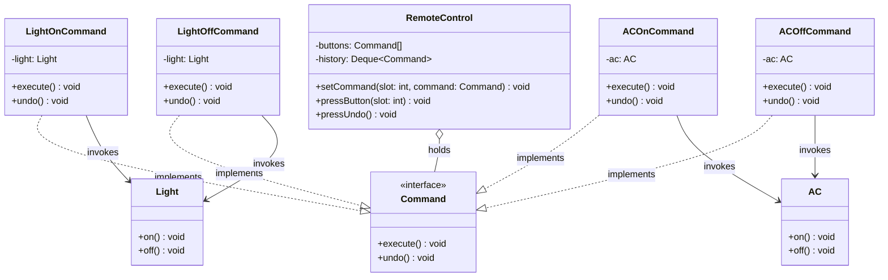
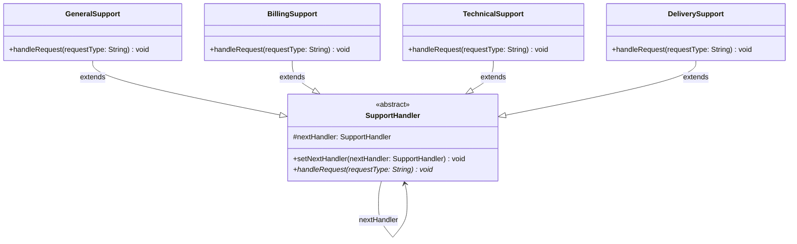
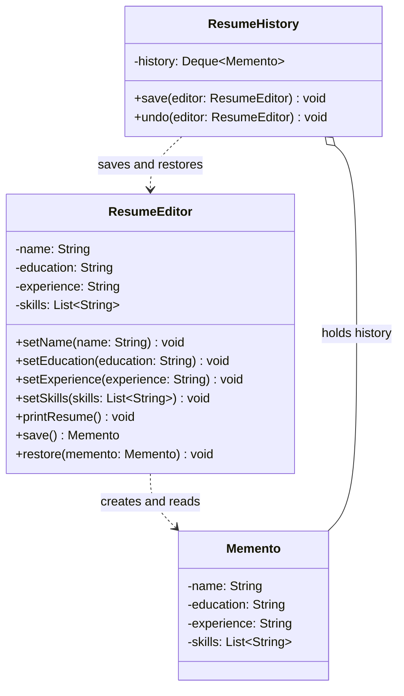

# Behavioural Patterns: Requests and Undo — Command, Chain of Responsibility and Memento

Press a button on a remote, and the light goes on. Press undo, and it goes off. Raise a support ticket, and it ends up with the right team. Edit your resume, change your mind, and get yesterday's version back. Each of these needs the same trick: something that is normally a passing method call, a request or a piece of state, has to become an *object* that can be stored, handed on, or put back later.

This lesson covers the three patterns that do that. **Command** turns a request into an object, so it can be queued, logged and undone. **Chain of Responsibility** passes a request along a line of handlers until one of them deals with it. **Memento** captures an object's state in an opaque snapshot, so it can be restored without exposing the object's internals. It is the second of four lessons on behavioural patterns, after [Strategy, Template Method and State](/synapse/low-level-design/design-patterns/behavioural-design-patterns).

<div style="border-left:4px solid #195045;background:rgba(25,80,69,0.08);padding:0.6rem 1rem;border-radius:0 0.5rem 0.5rem 0;margin:1.25rem 0">

💡 **The core idea.**

- A **command** object wraps one action: which receiver, which operation, which arguments. The code that triggers it (the invoker) doesn't know what it does, so commands can be assigned to buttons, stored in a history and undone.
- A **chain of responsibility** links handlers so that each either handles a request or passes it on. The sender knows only the first handler, and the order of the chain is part of the design.
- A **memento** is a snapshot of an object's state that only that object can read. A caretaker stores mementos without looking inside them, and hands one back to restore.

</div>

This builds on [Behavioural Design Patterns](/synapse/low-level-design/design-patterns/behavioural-design-patterns) and on the copying rules in [Relationships & Object Behaviour](/synapse/low-level-design/oop/relationships-and-object-behaviour), which a memento depends on. Every output below was produced by running the code on Java 21 and Python 3.11.

**You'll be able to:** wrap requests as command objects with `execute()` and `undo()`, keep a history, and make undo restore the state each command actually changed; build a chain of handlers in which the order is a deliberate choice and unhandled requests are always reported; take and restore mementos without exposing an object's fields, at the right moment and with mutable state copied; choose between undo by inverse commands and undo by snapshots.

<div style="border-left:4px solid #15448e;background:rgba(21,68,142,0.08);padding:0.6rem 1rem;border-radius:0 0.5rem 0.5rem 0;margin:1.25rem 0">

📘 **How to read the Intuition boxes.** Each one is built in three moves:

1. **The mechanism** — what has been turned into an object, and who holds it.
2. **A concrete bite** — a specific, runnable program where the request or the snapshot is handled at the wrong moment, or by the wrong object.
3. **The earned rule** — the decision heuristic, now justified rather than asserted, plus its cost.

</div>

---

## Table of contents

1. [Command pattern](#1-command-pattern)
2. [Chain of Responsibility pattern](#2-chain-of-responsibility-pattern)
3. [Memento pattern](#3-memento-pattern)
4. [Undo with commands or with mementos?](#4-undo-with-commands-or-with-mementos)
5. [Mental-model summary](#5-mental-model-summary)
6. [Gotcha checklist](#6-gotcha-checklist)
7. [Check yourself](#-check-yourself)
8. [Sources](#-sources)

---

## 1. Command pattern

A remote control sends commands to devices: turn on the lights, adjust the volume. The person holding it doesn't need to know how the devices work, only which buttons to press. The Command pattern brings that separation into code: a request becomes an object, which decouples the code that *issues* the request from the code that *performs* it.

<div style="border-left:4px solid #15448e;background:rgba(21,68,142,0.08);padding:0.6rem 1rem;border-radius:0 0.5rem 0.5rem 0;margin:1.25rem 0">

📘 **Definition.** "Encapsulate a request as an object, thereby letting you parameterize clients with different requests, queue or log requests, and support undoable operations" <abbr title="Gamma, Helm, Johnson and Vlissides, Design Patterns, 1994, Command: Intent">[1]</abbr>.

</div>

Because a request is an object, it can be executed later, stored, logged or undone, and features such as undo, redo, logging and macros can be added without changing the business logic.

<div style="border-left:4px solid #195045;background:rgba(25,80,69,0.08);padding:0.6rem 1rem;border-radius:0 0.5rem 0.5rem 0;margin:1.25rem 0">

💡 **Insight.** With a remote you turn the lights or the air conditioner (AC) on and off. You don't need to know how the circuits work or how the AC receives the signal; you press "On" or "Off", and the remote sends the command.

</div>

The Command pattern decouples the sender of a request (the remote) from its receiver (the light or the AC) in the same way.

**The four parts of the pattern.**

- **Client:** creates the command objects and connects them to their receivers.
- **Invoker:** asks a command to execute, without knowing what it does (the remote).
- **Command:** binds a receiver to an action, behind an interface such as `execute()` and `undo()`.
- **Receiver:** knows how to actually perform the action (the light, the AC).

### Understanding the problem

Here is a remote control that knows every device and every action, and remembers the last action for undo:

```java run
class Light {
    public void on() { System.out.println("Light turned ON"); }
    public void off() { System.out.println("Light turned OFF"); }
}

class AC {
    public void on() { System.out.println("AC turned ON"); }
    public void off() { System.out.println("AC turned OFF"); }
}

// ⚠️ ANTI-PATTERN — the remote hard-codes every device, action and undo. Do not copy it.
class NaiveRemoteControl {
    private final Light light;
    private final AC ac;
    private String lastAction = "";

    NaiveRemoteControl(Light light, AC ac) {
        this.light = light;
        this.ac = ac;
    }

    public void pressLightOn() { light.on(); lastAction = "LIGHT_ON"; }
    public void pressLightOff() { light.off(); lastAction = "LIGHT_OFF"; }
    public void pressACOn() { ac.on(); lastAction = "AC_ON"; }
    public void pressACOff() { ac.off(); lastAction = "AC_OFF"; }

    public void pressUndo() {
        switch (lastAction) {
            case "LIGHT_ON": light.off(); lastAction = "LIGHT_OFF"; break;
            case "LIGHT_OFF": light.on(); lastAction = "LIGHT_ON"; break;
            case "AC_ON": ac.off(); lastAction = "AC_OFF"; break;
            case "AC_OFF": ac.on(); lastAction = "AC_ON"; break;
            default: System.out.println("No action to undo.");
        }
    }
}

public class Main {
    public static void main(String[] args) {
        NaiveRemoteControl remote = new NaiveRemoteControl(new Light(), new AC());
        remote.pressLightOn();
        remote.pressACOn();
        remote.pressLightOff();
        remote.pressUndo(); // meant: undo "light off", so the light comes back on
        remote.pressUndo(); // meant: undo "AC on", so the AC goes off
    }
}
```

```python run
class Light:
    def on(self) -> None: print("Light turned ON")
    def off(self) -> None: print("Light turned OFF")


class AC:
    def on(self) -> None: print("AC turned ON")
    def off(self) -> None: print("AC turned OFF")


# ⚠️ ANTI-PATTERN — the remote hard-codes every device, action and undo. Do not copy it.
class NaiveRemoteControl:
    def __init__(self, light: Light, ac: AC) -> None:
        self._light = light
        self._ac = ac
        self._last_action = ""

    def press_light_on(self) -> None: self._light.on(); self._last_action = "LIGHT_ON"
    def press_light_off(self) -> None: self._light.off(); self._last_action = "LIGHT_OFF"
    def press_ac_on(self) -> None: self._ac.on(); self._last_action = "AC_ON"
    def press_ac_off(self) -> None: self._ac.off(); self._last_action = "AC_OFF"

    def press_undo(self) -> None:
        undo = {
            "LIGHT_ON": (self._light.off, "LIGHT_OFF"),
            "LIGHT_OFF": (self._light.on, "LIGHT_ON"),
            "AC_ON": (self._ac.off, "AC_OFF"),
            "AC_OFF": (self._ac.on, "AC_ON"),
        }
        if self._last_action not in undo:
            print("No action to undo.")
            return
        action, self._last_action = undo[self._last_action]
        action()


remote = NaiveRemoteControl(Light(), AC())
remote.press_light_on()
remote.press_ac_on()
remote.press_light_off()
remote.press_undo()  # meant: undo "light off", so the light comes back on
remote.press_undo()  # meant: undo "AC on", so the AC goes off
```

**Output:**
```
Light turned ON
AC turned ON
Light turned OFF
Light turned ON
Light turned OFF
```

The second undo turned the light off again instead of turning the AC off: the remote remembers only one action, so "undo" undid the previous undo.

**Issues in the code.**

1. **Tight coupling:** `NaiveRemoteControl` calls `Light` and `AC` directly, so every new device means changing the remote, which violates the Open/Closed Principle.
2. **No flexibility:** the actions are hard-coded methods; a new action or sequence of actions means editing the remote.
3. **Undo is tangled with the actions:** `pressUndo` must know the inverse of every action, which makes anything more complex than one level of undo very hard.
4. **Hard-coded commands:** `pressLightOn`, `pressACOn` and the rest are fixed into the class, so buttons can't be reassigned.
5. **No command history:** there is no record of what has been done, only of the last action, so undo can't go back more than one step.

### The solution

With the Command pattern, each action is an object with `execute()` and `undo()`. The remote holds commands in slots and a history of executed commands, and knows nothing about devices:

```java run
import java.util.ArrayDeque;
import java.util.Deque;

// Receivers
class Light {
    public void on() { System.out.println("Light turned ON"); }
    public void off() { System.out.println("Light turned OFF"); }
}

class AC {
    public void on() { System.out.println("AC turned ON"); }
    public void off() { System.out.println("AC turned OFF"); }
}

// The command interface
interface Command {
    void execute();
    void undo();
}

// Concrete commands: each binds one receiver to one action.
class LightOnCommand implements Command {
    private final Light light;
    LightOnCommand(Light light) { this.light = light; }
    public void execute() { light.on(); }
    public void undo() { light.off(); }
}

class LightOffCommand implements Command {
    private final Light light;
    LightOffCommand(Light light) { this.light = light; }
    public void execute() { light.off(); }
    public void undo() { light.on(); }
}

class ACOnCommand implements Command {
    private final AC ac;
    ACOnCommand(AC ac) { this.ac = ac; }
    public void execute() { ac.on(); }
    public void undo() { ac.off(); }
}

class ACOffCommand implements Command {
    private final AC ac;
    ACOffCommand(AC ac) { this.ac = ac; }
    public void execute() { ac.off(); }
    public void undo() { ac.on(); }
}

// The invoker: slots of commands, and a history for undo.
class RemoteControl {
    private final Command[] buttons = new Command[4];
    private final Deque<Command> history = new ArrayDeque<>(); // used as a stack

    void setCommand(int slot, Command command) {
        buttons[slot] = command;
    }

    void pressButton(int slot) {
        if (buttons[slot] == null) {
            System.out.println("No command assigned to slot " + slot);
            return;
        }
        buttons[slot].execute();
        history.push(buttons[slot]);
    }

    void pressUndo() {
        if (history.isEmpty()) {
            System.out.println("No commands to undo.");
            return;
        }
        history.pop().undo();
    }
}

public class Main {
    public static void main(String[] args) {
        Light light = new Light();
        AC ac = new AC();

        RemoteControl remote = new RemoteControl();
        remote.setCommand(0, new LightOnCommand(light));
        remote.setCommand(1, new LightOffCommand(light));
        remote.setCommand(2, new ACOnCommand(ac));
        remote.setCommand(3, new ACOffCommand(ac));

        remote.pressButton(0); // light on
        remote.pressButton(2); // AC on
        remote.pressButton(1); // light off
        remote.pressUndo();    // undo light off: light on
        remote.pressUndo();    // undo AC on: AC off
        remote.pressUndo();    // undo light on: light off
        remote.pressUndo();    // nothing left
    }
}
```

```python run
from abc import ABC, abstractmethod
from typing import Optional


# Receivers
class Light:
    def on(self) -> None: print("Light turned ON")
    def off(self) -> None: print("Light turned OFF")


class AC:
    def on(self) -> None: print("AC turned ON")
    def off(self) -> None: print("AC turned OFF")


# The command interface
class Command(ABC):
    @abstractmethod
    def execute(self) -> None: ...

    @abstractmethod
    def undo(self) -> None: ...


# Concrete commands: each binds one receiver to one action.
class LightOnCommand(Command):
    def __init__(self, light: Light) -> None: self._light = light
    def execute(self) -> None: self._light.on()
    def undo(self) -> None: self._light.off()


class LightOffCommand(Command):
    def __init__(self, light: Light) -> None: self._light = light
    def execute(self) -> None: self._light.off()
    def undo(self) -> None: self._light.on()


class ACOnCommand(Command):
    def __init__(self, ac: AC) -> None: self._ac = ac
    def execute(self) -> None: self._ac.on()
    def undo(self) -> None: self._ac.off()


class ACOffCommand(Command):
    def __init__(self, ac: AC) -> None: self._ac = ac
    def execute(self) -> None: self._ac.off()
    def undo(self) -> None: self._ac.on()


# The invoker: slots of commands, and a history for undo.
class RemoteControl:
    def __init__(self) -> None:
        self._buttons: list[Optional[Command]] = [None] * 4
        self._history: list[Command] = []  # used as a stack

    def set_command(self, slot: int, command: Command) -> None:
        self._buttons[slot] = command

    def press_button(self, slot: int) -> None:
        command = self._buttons[slot]
        if command is None:
            print(f"No command assigned to slot {slot}")
            return
        command.execute()
        self._history.append(command)

    def press_undo(self) -> None:
        if not self._history:
            print("No commands to undo.")
            return
        self._history.pop().undo()


light = Light()
ac = AC()

remote = RemoteControl()
remote.set_command(0, LightOnCommand(light))
remote.set_command(1, LightOffCommand(light))
remote.set_command(2, ACOnCommand(ac))
remote.set_command(3, ACOffCommand(ac))

remote.press_button(0)  # light on
remote.press_button(2)  # AC on
remote.press_button(1)  # light off
remote.press_undo()     # undo light off: light on
remote.press_undo()     # undo AC on: AC off
remote.press_undo()     # undo light on: light off
remote.press_undo()     # nothing left
```

**Output:**
```
Light turned ON
AC turned ON
Light turned OFF
Light turned ON
AC turned OFF
Light turned OFF
No commands to undo.
```

The history is a stack: Java's `ArrayDeque` (the `Stack` class is a legacy class whose own documentation recommends `Deque` instead), and a list in Python. In Python, a plain function could stand in for a command that only executes, but a command with `undo()` needs to remember its receiver and what it did, which a class expresses clearly.

**How the Command pattern resolves the issues.**

| Issue | How the Command pattern resolves it |
| --- | --- |
| Tight coupling | `RemoteControl` talks only to `Command` objects, never to devices. |
| No flexibility | A new device or action is a new `Command` class; the remote doesn't change. |
| Undo tangled with actions | Each command knows how to undo itself. |
| Hard-coded commands | Any command can be assigned to any slot at run time. |
| No command history | The remote keeps a stack of executed commands, so undo can go back any number of steps. |



**Analysis.** Three undos walked back through three actions, in reverse order, and a fourth reported that nothing was left. The remote's code never mentions a light or an AC; it only executes and undoes whatever commands it holds, in the order its history stack gives them back.

**Intuition.**
*Mechanism.* A command captures *what to do* as an object, when it is created; the invoker decides *when* to do it. Undo is then a question for each command: what must I do to put things back the way they were before I ran? Writing `undo()` as "the opposite action" is a guess about what the state was, and a guess is wrong whenever the action didn't change anything.

*Concrete bite.* The light is already off, and the user presses "off" anyway, then undo:

```java run
class Light {
    private boolean on = false;
    void on() { on = true; }
    void off() { on = false; }
    boolean isOn() { return on; }
}

interface Command {
    void execute();
    void undo();
}

// ⚠️ ANTI-PATTERN — undo assumes the opposite of the action is the old state. Do not copy it.
class InverseLightOffCommand implements Command {
    private final Light light;
    InverseLightOffCommand(Light light) { this.light = light; }
    public void execute() { light.off(); }
    public void undo() { light.on(); }
}

// Remembers the state it found, and restores exactly that.
class LightOffCommand implements Command {
    private final Light light;
    private boolean wasOn;
    LightOffCommand(Light light) { this.light = light; }

    public void execute() {
        wasOn = light.isOn();
        light.off();
    }

    public void undo() {
        if (wasOn) light.on(); else light.off();
    }
}

public class Main {
    public static void main(String[] args) {
        Light a = new Light(); // starts off
        Command guess = new InverseLightOffCommand(a);
        guess.execute();
        guess.undo();
        System.out.println("inverse undo: light on? " + a.isOn());

        Light b = new Light(); // starts off
        Command remember = new LightOffCommand(b);
        remember.execute();
        remember.undo();
        System.out.println("restoring undo: light on? " + b.isOn());
    }
}
```

```python run
class Light:
    def __init__(self) -> None:
        self.on_ = False

    def on(self) -> None: self.on_ = True
    def off(self) -> None: self.on_ = False


# ⚠️ ANTI-PATTERN — undo assumes the opposite of the action is the old state. Do not copy it.
class InverseLightOffCommand:
    def __init__(self, light: Light) -> None: self._light = light
    def execute(self) -> None: self._light.off()
    def undo(self) -> None: self._light.on()


# Remembers the state it found, and restores exactly that.
class LightOffCommand:
    def __init__(self, light: Light) -> None:
        self._light = light
        self._was_on = False

    def execute(self) -> None:
        self._was_on = self._light.on_
        self._light.off()

    def undo(self) -> None:
        self._light.on() if self._was_on else self._light.off()


a = Light()  # starts off
guess = InverseLightOffCommand(a)
guess.execute()
guess.undo()
print("inverse undo: light on?", str(a.on_).lower())

b = Light()  # starts off
remember = LightOffCommand(b)
remember.execute()
remember.undo()
print("restoring undo: light on?", str(b.on_).lower())
```

**Output:**
```
inverse undo: light on? true
restoring undo: light on? false
```

The light was off, "off" changed nothing, and "undo" turned it on: a state the user never had. The restoring command recorded what it found when it ran, and undo put back exactly that.

<div style="border-left:4px solid #195045;background:rgba(25,80,69,0.08);padding:0.6rem 1rem;border-radius:0 0.5rem 0.5rem 0;margin:1.25rem 0">

💡 **Earned rule.** Use Command when requests must be assigned, queued, logged, undone or combined into macros. Make each command record, in `execute()`, whatever state it is about to change, and make `undo()` restore that, not apply a guessed opposite. Push a command onto the history only after it has executed successfully.

The cost is a class per action (or a small generic command that takes a function), plus memory for each command's saved state for as long as the history keeps it. Cap the history if commands are frequent.

</div>

**Impact of not using the Command pattern.**

- **Invoker and receiver are tightly coupled:** changes or additions mean modifying both.
- **No reuse:** without an abstraction for actions, the same action can't be reused elsewhere.
- **Undo and redo are hard:** they become complex and error-prone when operations are tied to specific methods.
- **Batch actions are awkward:** a "night mode" that turns several devices off has to be coded by hand.
- **No plug-and-play:** commands can't be added or changed without touching other code.
- **Poor scalability:** as the system grows, managing actions without a structure gets steadily harder.

**When to use the Command pattern.**

- **Decoupling the sender from the receiver:** the code that triggers an action shouldn't know what it does.
- **Undo and redo:** you need to reverse or repeat actions.
- **Batch operations:** several actions must run together, such as applying night mode.
- **Plug-in architectures:** new commands must be added without changing the core system.
- **Macros or composite commands:** a group of commands runs in sequence as one.

**Pros of the Command pattern.**

- **Decouples sender and receiver:** the invoker and the receivers can change independently.
- **Supports undo and redo:** each command carries its own way back.
- **Extensible and reusable:** new commands are new classes, and commands can be reused anywhere.

**Cons of the Command pattern.**

- **More classes:** one small class per action can add up.
- **Overkill for simple tasks:** a direct method call is simpler when nothing needs to be stored or undone.
- **Undo needs careful design:** commands must save the right state, especially in long or composite chains.

---

## 2. Chain of Responsibility pattern

A customer support system has several levels of support: general enquiries, billing, technical issues, delivery problems. A ticket should reach the team that can deal with it, without the customer, or the code that receives the ticket, knowing which team that is. The Chain of Responsibility pattern lines up the handlers so that each either deals with the request or passes it to the next.

<div style="border-left:4px solid #15448e;background:rgba(21,68,142,0.08);padding:0.6rem 1rem;border-radius:0 0.5rem 0.5rem 0;margin:1.25rem 0">

📘 **Definition.** "Avoid coupling the sender of a request to its receiver by giving more than one object a chance to handle the request. Chain the receiving objects and pass the request along the chain until an object handles it" <abbr title="Gamma, Helm, Johnson and Vlissides, Design Patterns, 1994, Chain of Responsibility: Intent">[1]</abbr>.

</div>

**The parts of the pattern.**

- **Handler:** an abstract class or interface with a method for handling requests, and a reference to the next handler.
- **Concrete handler:** handles the request if it can, and otherwise forwards it to the next handler.
- **Client:** sends the request to the first handler, usually without knowing which handler will deal with it.

<div style="border-left:4px solid #195045;background:rgba(25,80,69,0.08);padding:0.6rem 1rem;border-radius:0 0.5rem 0.5rem 0;margin:1.25rem 0">

💡 **Insight.** A customer's request goes through a chain of support teams. Each team decides whether it can resolve the issue or should pass it on, so each handles only what it is best at, and the customer never needs to know about the chain.

</div>

**How it works.** The client sends a request to the first handler. If that handler can process it, it does; otherwise it forwards the request to the next one. This continues until the request is handled, or the end of the chain is reached. New handlers can be added to the chain without changing the existing ones.

### Understanding the problem

An e-commerce platform's support system receives tickets of several types: general enquiries, refunds, technical issues and delivery complaints. Here is a first version:

```java run
// ⚠️ ANTI-PATTERN — every team's rule is a branch of one method. Do not copy it.
class SupportService {
    public void handleRequest(String type) {
        if (type.equals("general")) {
            System.out.println("Handled by General Support");
        } else if (type.equals("refund")) {
            System.out.println("Handled by Billing Team");
        } else if (type.equals("technical")) {
            System.out.println("Handled by Technical Support");
        } else if (type.equals("delivery")) {
            System.out.println("Handled by Delivery Team");
        } else {
            System.out.println("No handler available");
        }
    }
}

public class Main {
    public static void main(String[] args) {
        SupportService supportService = new SupportService();
        supportService.handleRequest("general");
        supportService.handleRequest("refund");
        supportService.handleRequest("technical");
        supportService.handleRequest("delivery");
        supportService.handleRequest("unknown");
    }
}
```

```python run
# ⚠️ ANTI-PATTERN — every team's rule is a branch of one method. Do not copy it.
class SupportService:
    def handle_request(self, type_: str) -> None:
        if type_ == "general":
            print("Handled by General Support")
        elif type_ == "refund":
            print("Handled by Billing Team")
        elif type_ == "technical":
            print("Handled by Technical Support")
        elif type_ == "delivery":
            print("Handled by Delivery Team")
        else:
            print("No handler available")


support_service = SupportService()
for t in ["general", "refund", "technical", "delivery", "unknown"]:
    support_service.handle_request(t)
```

**Output:**
```
Handled by General Support
Handled by Billing Team
Handled by Technical Support
Handled by Delivery Team
No handler available
```

**Issues in this code.**

| Issue | Description |
| --- | --- |
| Violates the Open/Closed Principle | Every new type of request means modifying `handleRequest`. |
| Monolithic code | All the teams' logic is in one method, which is hard to maintain, test and extend; the teams are coupled to each other. |
| Inflexible | The order of processing can't change, and handlers can't be added, without editing the core logic. |

### The solution

With Chain of Responsibility, each team is a handler class. A handler deals with the requests it recognises and forwards the rest to the next handler:

```java run
abstract class SupportHandler {
    protected SupportHandler nextHandler;

    void setNextHandler(SupportHandler nextHandler) {
        this.nextHandler = nextHandler;
    }

    abstract void handleRequest(String requestType);
}

class GeneralSupport extends SupportHandler {
    void handleRequest(String requestType) {
        if (requestType.equalsIgnoreCase("general")) {
            System.out.println("GeneralSupport: Handling general query");
        } else if (nextHandler != null) {
            nextHandler.handleRequest(requestType);
        }
    }
}

class BillingSupport extends SupportHandler {
    void handleRequest(String requestType) {
        if (requestType.equalsIgnoreCase("refund")) {
            System.out.println("BillingSupport: Handling refund request");
        } else if (nextHandler != null) {
            nextHandler.handleRequest(requestType);
        }
    }
}

class TechnicalSupport extends SupportHandler {
    void handleRequest(String requestType) {
        if (requestType.equalsIgnoreCase("technical")) {
            System.out.println("TechnicalSupport: Handling technical issue");
        } else if (nextHandler != null) {
            nextHandler.handleRequest(requestType);
        }
    }
}

class DeliverySupport extends SupportHandler {
    void handleRequest(String requestType) {
        if (requestType.equalsIgnoreCase("delivery")) {
            System.out.println("DeliverySupport: Handling delivery issue");
        } else if (nextHandler != null) {
            nextHandler.handleRequest(requestType);
        } else {
            System.out.println("DeliverySupport: No handler found for request");
        }
    }
}

public class Main {
    public static void main(String[] args) {
        SupportHandler general = new GeneralSupport();
        SupportHandler billing = new BillingSupport();
        SupportHandler technical = new TechnicalSupport();
        SupportHandler delivery = new DeliverySupport();

        // The chain: general -> billing -> technical -> delivery
        general.setNextHandler(billing);
        billing.setNextHandler(technical);
        technical.setNextHandler(delivery);

        general.handleRequest("refund");
        general.handleRequest("delivery");
        general.handleRequest("unknown");
    }
}
```

```python run
from abc import ABC, abstractmethod
from typing import Optional


class SupportHandler(ABC):
    def __init__(self) -> None:
        self._next_handler: Optional[SupportHandler] = None

    def set_next_handler(self, next_handler: "SupportHandler") -> None:
        self._next_handler = next_handler

    @abstractmethod
    def handle_request(self, request_type: str) -> None: ...


class GeneralSupport(SupportHandler):
    def handle_request(self, request_type: str) -> None:
        if request_type.lower() == "general":
            print("GeneralSupport: Handling general query")
        elif self._next_handler is not None:
            self._next_handler.handle_request(request_type)


class BillingSupport(SupportHandler):
    def handle_request(self, request_type: str) -> None:
        if request_type.lower() == "refund":
            print("BillingSupport: Handling refund request")
        elif self._next_handler is not None:
            self._next_handler.handle_request(request_type)


class TechnicalSupport(SupportHandler):
    def handle_request(self, request_type: str) -> None:
        if request_type.lower() == "technical":
            print("TechnicalSupport: Handling technical issue")
        elif self._next_handler is not None:
            self._next_handler.handle_request(request_type)


class DeliverySupport(SupportHandler):
    def handle_request(self, request_type: str) -> None:
        if request_type.lower() == "delivery":
            print("DeliverySupport: Handling delivery issue")
        elif self._next_handler is not None:
            self._next_handler.handle_request(request_type)
        else:
            print("DeliverySupport: No handler found for request")


general = GeneralSupport()
billing = BillingSupport()
technical = TechnicalSupport()
delivery = DeliverySupport()

# The chain: general -> billing -> technical -> delivery
general.set_next_handler(billing)
billing.set_next_handler(technical)
technical.set_next_handler(delivery)

general.handle_request("refund")
general.handle_request("delivery")
general.handle_request("unknown")
```

**Output:**
```
BillingSupport: Handling refund request
DeliverySupport: Handling delivery issue
DeliverySupport: No handler found for request
```

**How Chain of Responsibility fixes the issues.**

| Issue | Solution in the refactored code |
| --- | --- |
| Violates the Open/Closed Principle | A new request type is a new handler class, linked into the chain; existing handlers don't change. |
| Monolithic code | Each handler class deals with one type of request, which makes the code modular and easier to maintain. |
| Inflexible | Handlers are added, removed or reordered by changing how the chain is linked. |



**Analysis.** The client sent every ticket to `general`, and each one travelled along the chain until a handler recognised it. The "unknown" ticket was reported by `DeliverySupport`, but only because `DeliverySupport` happens to be last and happens to be the one class with a final `else`. The other handlers silently do nothing when they can't handle a request and have no next handler.

**Intuition.**
*Mechanism.* A chain is a linked list of handlers, and the request walks it from the front. Two things are therefore part of the design, not details: the *order*, because the first handler that accepts a request wins; and *the end of the chain*, because something must happen to a request that no handler accepts.

*Concrete bite.* Someone moves the delivery team to the front of the chain, so delivery complaints are handled faster, and keeps the handler classes unchanged:

```java run
abstract class SupportHandler {
    protected SupportHandler nextHandler;
    void setNextHandler(SupportHandler nextHandler) { this.nextHandler = nextHandler; }
    abstract void handleRequest(String requestType);
}

class GeneralSupport extends SupportHandler {
    void handleRequest(String requestType) {
        if (requestType.equalsIgnoreCase("general")) System.out.println("GeneralSupport: Handling general query");
        else if (nextHandler != null) nextHandler.handleRequest(requestType);
    }
}

class TechnicalSupport extends SupportHandler {
    void handleRequest(String requestType) {
        if (requestType.equalsIgnoreCase("technical")) System.out.println("TechnicalSupport: Handling technical issue");
        else if (nextHandler != null) nextHandler.handleRequest(requestType);
    }
}

class DeliverySupport extends SupportHandler {
    void handleRequest(String requestType) {
        if (requestType.equalsIgnoreCase("delivery")) System.out.println("DeliverySupport: Handling delivery issue");
        else if (nextHandler != null) nextHandler.handleRequest(requestType);
        else System.out.println("DeliverySupport: No handler found for request");
    }
}

// The fix: the base class owns forwarding and the end of the chain.
abstract class Handler {
    private Handler next;
    Handler linkTo(Handler next) { this.next = next; return next; }

    final void handle(String request) {
        if (canHandle(request)) process(request);
        else if (next != null) next.handle(request);
        else System.out.println("Unhandled request: " + request); // whatever the order
    }

    abstract boolean canHandle(String request);
    abstract void process(String request);
}

class Delivery extends Handler {
    boolean canHandle(String r) { return r.equals("delivery"); }
    void process(String r) { System.out.println("Delivery: handling " + r); }
}

class General extends Handler {
    boolean canHandle(String r) { return r.equals("general"); }
    void process(String r) { System.out.println("General: handling " + r); }
}

public class Main {
    public static void main(String[] args) {
        // ⚠️ ANTI-PATTERN — the reordered chain silently drops what nobody handles. Do not copy it.
        SupportHandler delivery = new DeliverySupport();
        SupportHandler general = new GeneralSupport();
        SupportHandler technical = new TechnicalSupport();
        delivery.setNextHandler(general);
        general.setNextHandler(technical);

        System.out.println("reordered chain:");
        delivery.handleRequest("unknown");
        System.out.println("(nothing was printed for the unknown ticket)");

        System.out.println("base class owns the end of the chain:");
        Handler first = new Delivery();
        first.linkTo(new General());
        first.handle("unknown");
    }
}
```

```python run
from abc import ABC, abstractmethod
from typing import Optional


class SupportHandler(ABC):
    def __init__(self) -> None:
        self._next: Optional[SupportHandler] = None

    def set_next_handler(self, nxt: "SupportHandler") -> None:
        self._next = nxt

    @abstractmethod
    def handle_request(self, request_type: str) -> None: ...


class GeneralSupport(SupportHandler):
    def handle_request(self, request_type: str) -> None:
        if request_type == "general":
            print("GeneralSupport: Handling general query")
        elif self._next is not None:
            self._next.handle_request(request_type)


class TechnicalSupport(SupportHandler):
    def handle_request(self, request_type: str) -> None:
        if request_type == "technical":
            print("TechnicalSupport: Handling technical issue")
        elif self._next is not None:
            self._next.handle_request(request_type)


class DeliverySupport(SupportHandler):
    def handle_request(self, request_type: str) -> None:
        if request_type == "delivery":
            print("DeliverySupport: Handling delivery issue")
        elif self._next is not None:
            self._next.handle_request(request_type)
        else:
            print("DeliverySupport: No handler found for request")


# The fix: the base class owns forwarding and the end of the chain.
class Handler(ABC):
    def __init__(self) -> None:
        self._next: Optional[Handler] = None

    def link_to(self, nxt: "Handler") -> "Handler":
        self._next = nxt
        return nxt

    def handle(self, request: str) -> None:
        if self.can_handle(request):
            self.process(request)
        elif self._next is not None:
            self._next.handle(request)
        else:
            print(f"Unhandled request: {request}")  # whatever the order

    @abstractmethod
    def can_handle(self, request: str) -> bool: ...

    @abstractmethod
    def process(self, request: str) -> None: ...


class Delivery(Handler):
    def can_handle(self, r: str) -> bool: return r == "delivery"
    def process(self, r: str) -> None: print(f"Delivery: handling {r}")


class General(Handler):
    def can_handle(self, r: str) -> bool: return r == "general"
    def process(self, r: str) -> None: print(f"General: handling {r}")


# ⚠️ ANTI-PATTERN — the reordered chain silently drops what nobody handles. Do not copy it.
delivery = DeliverySupport()
general = GeneralSupport()
technical = TechnicalSupport()
delivery.set_next_handler(general)
general.set_next_handler(technical)

print("reordered chain:")
delivery.handle_request("unknown")
print("(nothing was printed for the unknown ticket)")

print("base class owns the end of the chain:")
first = Delivery()
first.link_to(General())
first.handle("unknown")
```

**Output:**
```
reordered chain:
(nothing was printed for the unknown ticket)
base class owns the end of the chain:
Unhandled request: unknown
```

After the reorder, the unknown ticket reached `TechnicalSupport`, which has no next handler and no final `else`, so it vanished: no error, no log, and a customer whose ticket nobody will ever see. The only "not handled" message lived in one concrete handler, so it only worked while that handler was last. In the fixed version, the base class's `handle()` (a template method) owns forwarding and the end of the chain, so every handler reports unhandled requests, in any order.

<div style="border-left:4px solid #195045;background:rgba(25,80,69,0.08);padding:0.6rem 1rem;border-radius:0 0.5rem 0.5rem 0;margin:1.25rem 0">

💡 **Earned rule.** Use Chain of Responsibility when several handlers may deal with a request and the right one is decided at run time. Put the forwarding and the end-of-chain behaviour (report, log, or throw) in the base class, so concrete handlers only say what they can handle and how. Build the chain in one place, and treat its order as a documented decision.

The cost is indirection: following a request means walking the chain, and long chains add a little overhead to every request. If each request type maps to exactly one handler and the order never matters, a map from type to handler is simpler.

</div>

**When to use Chain of Responsibility.**

- **Several objects could handle a request, and which one isn't known in advance:** the request travels along the chain until one handles it.
- **Senders and receivers should be decoupled:** the sender only knows the first handler.
- **The chain should be configurable:** handlers can be added, removed or reordered, depending on conditions.

It suits systems that need that flexibility, such as support ticket routing, event handling, or any sequence of checks that depends on varying conditions.

**Pros of Chain of Responsibility.**

- **Less coupling between sender and receiver:** the sender doesn't need to know which handler will deal with the request.
- **Easy to add or remove handlers:** handler classes stay unchanged; only the chain's wiring changes.
- **Single Responsibility and Open/Closed Principles:** each handler does one job, and new handlers don't modify existing ones.
- **Configurable order:** the chain can be arranged differently for different situations.

**Cons of Chain of Responsibility.**

- **Performance with long chains:** a request may pass through many handlers before one deals with it.
- **Harder debugging:** the path a request takes is decided at run time, which is harder to trace.
- **Requests may go unhandled:** without an end-of-chain fallback, a request nobody handles simply disappears.
- **Order matters:** a wrongly ordered chain sends requests to the wrong handler, or drops them.

**Real-life examples.**

1. **Sign-up checks.** Signing up may involve validating the email, checking the user's age, confirming acceptance of the terms, and verifying a CAPTCHA. Each check can be a handler that passes the request on if it succeeds, or stops it if it fails.
2. **Support ticket routing.** Tickets go through general enquiries, billing, technical and delivery teams, each checking whether the ticket is for them. A new department is a new handler.
3. **Servlet filters and UI events.** In a Java web application, each servlet `Filter` can handle a request, or pass it on with `chain.doFilter(...)`. In a web page, a click event "bubbles" from the clicked element up through its parents until one of them handles it and stops it.

---

## 3. Memento pattern

In a document editor you make changes, and want to be able to undo them and get back to an earlier version. The editor shouldn't expose its internal structure to make that possible. Instead it stores a *memento*, a snapshot of its state at a point in time, which can later restore it, while the details stay hidden.

<div style="border-left:4px solid #15448e;background:rgba(21,68,142,0.08);padding:0.6rem 1rem;border-radius:0 0.5rem 0.5rem 0;margin:1.25rem 0">

📘 **Definition.** "Without violating encapsulation, capture and externalize an object's internal state so that the object can be restored to this state later" <abbr title="Gamma, Helm, Johnson and Vlissides, Design Patterns, 1994, Memento: Intent">[1]</abbr>.

</div>

It is especially useful for undo, redo and rollback.

**The three parts of the pattern.**

- **Originator:** the object whose state is saved and restored.
- **Memento:** an object holding a snapshot of the originator's state.
- **Caretaker:** the object that asks for mementos and keeps them, without changing or examining their contents.

<div style="border-left:4px solid #195045;background:rgba(25,80,69,0.08);padding:0.6rem 1rem;border-radius:0 0.5rem 0.5rem 0;margin:1.25rem 0">

💡 **Insight.** A text editor's undo works like this: as you type, the application captures snapshots of the document. Each snapshot (memento) is kept by an external caretaker, such as a history stack, and the editor (originator) can return to any of them without revealing how it stores the text.

</div>

The key strength of the pattern is that only the originator creates its snapshots and reads them back, so its encapsulation is preserved even though its state can be recovered.

### Understanding the problem

A resume editor lets a user change their name, education, experience and skills, and should let them undo changes. Here is a first attempt:

```java run
import java.util.ArrayList;
import java.util.List;

// The originator, with every field open to other classes.
class ResumeEditor {
    String name;
    String education;
    String experience;
    List<String> skills;
}

// ⚠️ ANTI-PATTERN — a snapshot with public fields that reaches into the editor. Do not copy it.
class ResumeSnapshot {
    public String name;
    public String education;
    public String experience;
    public List<String> skills;

    ResumeSnapshot(ResumeEditor editor) {
        this.name = editor.name;
        this.education = editor.education;
        this.experience = editor.experience;
        this.skills = new ArrayList<>(editor.skills); // a copy of the list
    }

    void restore(ResumeEditor editor) {
        editor.name = this.name;
        editor.education = this.education;
        editor.experience = this.experience;
        editor.skills = new ArrayList<>(this.skills);
    }
}

public class Main {
    public static void main(String[] args) {
        ResumeEditor editor = new ResumeEditor();
        editor.name = "Alice";
        editor.education = "B.Tech in CS";
        editor.experience = "2 years at ABC Corp";
        editor.skills = new ArrayList<>(List.of("Java", "SQL"));

        ResumeSnapshot snapshot = new ResumeSnapshot(editor); // before the changes

        editor.name = "Alice Johnson";
        editor.skills.add("Spring Boot");
        System.out.println("After changes:");
        System.out.println("Name: " + editor.name);
        System.out.println("Skills: " + editor.skills);

        snapshot.restore(editor);
        System.out.println("After undo:");
        System.out.println("Name: " + editor.name);
        System.out.println("Skills: " + editor.skills);
    }
}
```

```python run
# The originator, with every field open to other classes.
class ResumeEditor:
    def __init__(self) -> None:
        self.name = ""
        self.education = ""
        self.experience = ""
        self.skills: list[str] = []


# ⚠️ ANTI-PATTERN — a snapshot with public fields that reaches into the editor. Do not copy it.
class ResumeSnapshot:
    def __init__(self, editor: ResumeEditor) -> None:
        self.name = editor.name
        self.education = editor.education
        self.experience = editor.experience
        self.skills = list(editor.skills)  # a copy of the list

    def restore(self, editor: ResumeEditor) -> None:
        editor.name = self.name
        editor.education = self.education
        editor.experience = self.experience
        editor.skills = list(self.skills)


editor = ResumeEditor()
editor.name = "Alice"
editor.education = "B.Tech in CS"
editor.experience = "2 years at ABC Corp"
editor.skills = ["Java", "SQL"]

snapshot = ResumeSnapshot(editor)  # before the changes

editor.name = "Alice Johnson"
editor.skills.append("Spring Boot")
print("After changes:")
print("Name:", editor.name)
print("Skills: [" + ", ".join(editor.skills) + "]")

snapshot.restore(editor)
print("After undo:")
print("Name:", editor.name)
print("Skills: [" + ", ".join(editor.skills) + "]")
```

**Output:**
```
After changes:
Name: Alice Johnson
Skills: [Java, SQL, Spring Boot]
After undo:
Name: Alice
Skills: [Java, SQL]
```

**Issues in this code.**

- **No caretaker:** `main()` handles the snapshot by hand; nothing manages several saved states.
- **No undo stack:** only one snapshot is supported, so there is only one level of undo.
- **Breaks encapsulation:** the snapshot's fields are public, and so are the editor's, which exposes the internal details.
- **Tight coupling:** `ResumeSnapshot` reaches into `ResumeEditor`'s fields directly; if the editor's fields change, the snapshot class must change too.
- **No abstraction:** how snapshots are created and restored is visible to, and changeable by, any code.

### The solution

With the Memento pattern, the editor itself creates and reads its mementos, the memento is immutable and opaque to everyone else, and a caretaker keeps the history:

```java run
import java.util.ArrayDeque;
import java.util.Deque;
import java.util.List;

// The originator: its fields are private, and only it creates and reads mementos.
class ResumeEditor {
    private String name;
    private String education;
    private String experience;
    private List<String> skills = List.of();

    void setName(String name) { this.name = name; }
    void setEducation(String education) { this.education = education; }
    void setExperience(String experience) { this.experience = experience; }
    void setSkills(List<String> skills) { this.skills = List.copyOf(skills); }

    void printResume() {
        System.out.println("Experience: " + experience + " | Skills: " + skills);
    }

    Memento save() {
        return new Memento(name, education, experience, skills);
    }

    void restore(Memento memento) {
        this.name = memento.name;
        this.education = memento.education;
        this.experience = memento.experience;
        this.skills = memento.skills;
    }

    // The memento: immutable, and its fields are private to ResumeEditor's code.
    static final class Memento {
        private final String name;
        private final String education;
        private final String experience;
        private final List<String> skills; // an immutable list

        private Memento(String name, String education, String experience, List<String> skills) {
            this.name = name;
            this.education = education;
            this.experience = experience;
            this.skills = skills;
        }
    }
}

// The caretaker: keeps mementos without looking inside them.
class ResumeHistory {
    private final Deque<ResumeEditor.Memento> history = new ArrayDeque<>();

    void save(ResumeEditor editor) {
        history.push(editor.save());
    }

    void undo(ResumeEditor editor) {
        if (!history.isEmpty()) {
            editor.restore(history.pop());
        }
    }
}

public class Main {
    public static void main(String[] args) {
        ResumeEditor editor = new ResumeEditor();
        ResumeHistory history = new ResumeHistory();

        editor.setName("Alice");
        editor.setEducation("B.Tech CSE");
        editor.setExperience("Fresher");
        editor.setSkills(List.of("Java", "DSA"));

        history.save(editor); // snapshot BEFORE the change
        editor.setExperience("SDE Intern at a tech company");
        editor.setSkills(List.of("Java", "DSA", "LLD"));

        history.save(editor); // snapshot BEFORE the next change
        editor.setSkills(List.of("Java", "DSA", "LLD", "Spring Boot"));

        editor.printResume();
        history.undo(editor);
        editor.printResume();
        history.undo(editor);
        editor.printResume();
    }
}
```

```python run
class ResumeEditor:
    class _Memento:
        # Opaque to everyone but ResumeEditor: the leading underscore marks the class as
        # private by convention, and the fields are read only by ResumeEditor.restore().
        __slots__ = ("name", "education", "experience", "skills")

        def __init__(self, name: str, education: str, experience: str, skills: tuple[str, ...]) -> None:
            self.name = name
            self.education = education
            self.experience = experience
            self.skills = skills  # an immutable tuple

    def __init__(self) -> None:
        self._name = ""
        self._education = ""
        self._experience = ""
        self._skills: tuple[str, ...] = ()

    def set_name(self, name: str) -> None: self._name = name
    def set_education(self, education: str) -> None: self._education = education
    def set_experience(self, experience: str) -> None: self._experience = experience
    def set_skills(self, skills: list[str]) -> None: self._skills = tuple(skills)

    def print_resume(self) -> None:
        print(f"Experience: {self._experience} | Skills: [{', '.join(self._skills)}]")

    def save(self) -> "ResumeEditor._Memento":
        return ResumeEditor._Memento(self._name, self._education, self._experience, self._skills)

    def restore(self, memento: "ResumeEditor._Memento") -> None:
        self._name = memento.name
        self._education = memento.education
        self._experience = memento.experience
        self._skills = memento.skills


# The caretaker: keeps mementos without looking inside them.
class ResumeHistory:
    def __init__(self) -> None:
        self._history: list[ResumeEditor._Memento] = []

    def save(self, editor: ResumeEditor) -> None:
        self._history.append(editor.save())

    def undo(self, editor: ResumeEditor) -> None:
        if self._history:
            editor.restore(self._history.pop())


editor = ResumeEditor()
history = ResumeHistory()

editor.set_name("Alice")
editor.set_education("B.Tech CSE")
editor.set_experience("Fresher")
editor.set_skills(["Java", "DSA"])

history.save(editor)  # snapshot BEFORE the change
editor.set_experience("SDE Intern at a tech company")
editor.set_skills(["Java", "DSA", "LLD"])

history.save(editor)  # snapshot BEFORE the next change
editor.set_skills(["Java", "DSA", "LLD", "Spring Boot"])

editor.print_resume()
history.undo(editor)
editor.print_resume()
history.undo(editor)
editor.print_resume()
```

**Output:**
```
Experience: SDE Intern at a tech company | Skills: [Java, DSA, LLD, Spring Boot]
Experience: SDE Intern at a tech company | Skills: [Java, DSA, LLD]
Experience: Fresher | Skills: [Java, DSA]
```

**How the Memento pattern solves the issues.**

| Issue | How the Memento pattern fixes it |
| --- | --- |
| No caretaker | `ResumeHistory` manages all mementos and performs undo. |
| Only one level of undo | A stack of mementos allows any number of undo steps. |
| Public fields | The editor's fields are private, and the memento's fields are private, final and readable only by `ResumeEditor`. |
| Tight coupling | The memento is created and read by the editor itself, so no other class depends on the editor's fields. |
| Snapshot logic spread around | Saving and restoring live inside `ResumeEditor`, which improves cohesion. |

The pattern gives the job of creating snapshots to the owner of the state, the originator. It has full access to its own fields, so it is the one object that can make a complete, accurate snapshot, without exposing them. In Java, the nested class's `private` fields are accessible to `ResumeEditor` but not to `ResumeHistory`; in Python, the privacy is a convention marked by the leading underscore.



**Analysis.** Each undo stepped back exactly one change: first the added "Spring Boot", then the internship. `ResumeHistory` stored and returned mementos without ever reading a field, and the mementos can't be changed after they are made, because their fields are final and the skills list is immutable (a tuple in Python).

**Intuition.**
*Mechanism.* A memento records the state *at the moment it is taken*. Undo restores the most recent memento, so for undo to move backwards, the most recent memento must hold the state from *before* the latest change. When to call `save()` is therefore the whole design: before each change, never after.

*Concrete bite.* Here the same editor and caretaker are used the way many first attempts use them: make a change, then save:

```java run
import java.util.ArrayDeque;
import java.util.Deque;

class Editor {
    private String text = "";
    void setText(String text) { this.text = text; }
    String getText() { return text; }
    Memento save() { return new Memento(text); }
    void restore(Memento m) { this.text = m.text; }

    static final class Memento {
        private final String text;
        private Memento(String text) { this.text = text; }
    }
}

class History {
    private final Deque<Editor.Memento> stack = new ArrayDeque<>();
    void save(Editor e) { stack.push(e.save()); }
    void undo(Editor e) { if (!stack.isEmpty()) e.restore(stack.pop()); }
}

public class Main {
    public static void main(String[] args) {
        // ⚠️ ANTI-PATTERN — saving AFTER each change. Do not copy it.
        Editor late = new Editor();
        History lateHistory = new History();
        late.setText("draft 1"); lateHistory.save(late);
        late.setText("draft 2"); lateHistory.save(late);
        lateHistory.undo(late);
        System.out.println("save after, one undo:  " + late.getText());

        // Saving BEFORE each change.
        Editor early = new Editor();
        History earlyHistory = new History();
        earlyHistory.save(early); early.setText("draft 1");
        earlyHistory.save(early); early.setText("draft 2");
        earlyHistory.undo(early);
        System.out.println("save before, one undo: " + early.getText());
    }
}
```

```python run
class Editor:
    class _Memento:
        def __init__(self, text: str) -> None:
            self.text = text

    def __init__(self) -> None:
        self._text = ""

    def set_text(self, text: str) -> None: self._text = text
    def get_text(self) -> str: return self._text
    def save(self) -> "Editor._Memento": return Editor._Memento(self._text)
    def restore(self, m: "Editor._Memento") -> None: self._text = m.text


class History:
    def __init__(self) -> None:
        self._stack: list[Editor._Memento] = []

    def save(self, e: Editor) -> None: self._stack.append(e.save())

    def undo(self, e: Editor) -> None:
        if self._stack:
            e.restore(self._stack.pop())


# ⚠️ ANTI-PATTERN — saving AFTER each change. Do not copy it.
late = Editor()
late_history = History()
late.set_text("draft 1"); late_history.save(late)
late.set_text("draft 2"); late_history.save(late)
late_history.undo(late)
print("save after, one undo: ", late.get_text())

# Saving BEFORE each change.
early = Editor()
early_history = History()
early_history.save(early); early.set_text("draft 1")
early_history.save(early); early.set_text("draft 2")
early_history.undo(early)
print("save before, one undo:", early.get_text())
```

**Output:**
```
save after, one undo:  draft 2
save before, one undo: draft 1
```

With saving after each change, the first undo "restored" the state the editor was already in, so the user pressed undo and nothing happened; they would need a second press to get anywhere. Saving before each change made the first undo do what the user expects.

<div style="border-left:4px solid #195045;background:rgba(25,80,69,0.08);padding:0.6rem 1rem;border-radius:0 0.5rem 0.5rem 0;margin:1.25rem 0">

💡 **Earned rule.** Use Memento when an object's state must be restorable and its fields must stay private. Let the originator create and read its own mementos, make mementos immutable (copy or freeze every mutable field when saving), and take a memento *before* each change, ideally inside the operation that makes the change, so callers can't get the timing wrong.

The cost is memory: every memento holds a full copy of the state. For large objects or frequent changes, cap the history, or store only the parts that changed.

</div>

**When to use the Memento pattern.**

- **Undo and redo:** you need to save states and go back to them.
- **Encapsulation matters:** the object's state must be saved without exposing its private fields.
- **Non-trivial history:** you need several checkpoints or rollbacks, managed in a structured way.

**Pros of the Memento pattern.**

- **Preserves encapsulation:** the originator saves and restores its own state without exposing its structure.
- **Simple undo and redo:** stored snapshots make both straightforward.
- **Clear separation of concerns:** the originator handles its state, and the caretaker handles the history.

**Cons of the Memento pattern.**

- **Memory use:** many or large snapshots can use a lot of memory.
- **Caretaker complexity:** the caretaker must manage when mementos are created, stored and discarded.
- **Old mementos need pruning:** without limits, the history keeps growing.

**Real-life use cases.**

1. **Text editors.** Each edit can store the document's previous state as a memento; undo restores the most recent one, and redo moves forward again, without any other code touching the document's internals.
2. **Graphics and design tools.** Drawing applications save a snapshot of the canvas or a component after each significant operation (drawing, colouring, transforming), so users can step back to any earlier state, which keeps editing non-destructive.

---

## 4. Undo with commands or with mementos?

Both patterns in this lesson can implement undo, in different ways:

| | Undo with Command | Undo with Memento |
| --- | --- | --- |
| What is stored | each action, plus the small piece of state it changed | a full snapshot of the object's state |
| How undo works | the command reverses its own effect | the originator is reset to the snapshot |
| Memory per step | small | the size of the whole state |
| Good when | actions are small and well defined (toggle a light, move a shape) | the state is small, or changes are hard to reverse (a complex edit, a reformat) |
| Risk | an `undo()` that guesses wrong (section 1) | a snapshot taken at the wrong time, or sharing mutable data (section 3) |

They also combine well: a command can take a memento of its receiver in `execute()`, and restore it in `undo()`. That gives every command a correct undo, at the cost of a snapshot per command.

---

## 5. Mental-model summary

| Principle | Consequence |
|---|---|
| Command: a request as an object (receiver + action) | It can be assigned to buttons, queued, logged and undone |
| The invoker knows only `execute()` and `undo()` | New devices and actions don't change the invoker |
| Undo must restore what the command found | Record the old state in `execute()`; never guess an inverse |
| Chain of Responsibility: handlers linked in a list | The sender knows only the first handler; the first that accepts wins |
| The order and the end of the chain are design decisions | Put forwarding and the "unhandled" fallback in the base class |
| Memento: an opaque, immutable snapshot | Only the originator creates and reads it; the caretaker just stores it |
| Take a memento before each change | Otherwise the first undo does nothing |

## 6. Gotcha checklist

<div style="border-left:4px solid #da5233;background:rgba(218,82,51,0.08);padding:0.6rem 1rem;border-radius:0 0.5rem 0.5rem 0;margin:1.25rem 0">

| Symptom | Likely cause | Fix |
|---|---|---|
| The second undo redoes the first undo | only the last action is remembered | a stack of executed commands |
| Undo produces a state the user never had | `undo()` applies a guessed opposite | record the previous state in `execute()` and restore it |
| `java.util.Stack` in new code | legacy class used for a stack | `ArrayDeque` through the `Deque` interface |
| A request silently disappears | no end-of-chain fallback, or it lives in one handler | base class forwards and reports unhandled requests |
| Requests reach the wrong handler | the chain's order was changed casually | build the chain in one place; document its order |
| The first undo does nothing | the memento was taken after the change | take it before each change, inside the operation |
| Restoring a memento brings back a later state | the memento shares a mutable list with the originator | copy or freeze mutable fields when saving |
| Undo history uses too much memory | a full snapshot per change, forever | cap the history, or store deltas |

</div>

---

## ✅ Check yourself

One check per objective. Answer before you open anything.

```quiz
{"prompt": "The light is off. A LightOffCommand's undo() simply calls light.on(). The user presses off, then undo. What state is the light in, and what should undo do instead?", "options": ["On, which is wrong; the command should record the previous state in execute() and restore it", "Off, which is correct", "On, which is correct because undo always does the opposite"], "answer": "On, which is wrong; the command should record the previous state in execute() and restore it"}
```

```quiz
{"prompt": "In a support chain, only the DeliverySupport handler prints 'No handler found'. Someone moves it to the front of the chain. What happens to a ticket nobody can handle?", "options": ["It is silently dropped by whichever handler is now last", "DeliverySupport still reports it", "The program throws an exception"], "answer": "It is silently dropped by whichever handler is now last"}
```

```quiz
{"prompt": "An editor calls history.save(editor) after each change. The text goes from 'draft 1' to 'draft 2', and the user presses undo once. What does the editor show?", "options": ["draft 2, because the latest memento holds the current state", "draft 1", "An empty document"], "answer": "draft 2, because the latest memento holds the current state"}
```

```quiz
{"prompt": "A drawing app's 'apply filter' rewrites every pixel of a large image, and can't be reversed mathematically. Which undo approach fits this operation best?", "options": ["A memento: snapshot the image before applying the filter", "A command whose undo() applies the inverse filter", "No undo is possible"], "answer": "A memento: snapshot the image before applying the filter"}
```

<details>
<summary>An online spreadsheet needs undo and redo for cell edits, a toolbar whose buttons can be reconfigured, and validation of every edit by a series of checks (type, range, permissions) that varies by sheet. Which patterns from this lesson fit, and how do they fit together?</summary>

**Command** for each edit: an `EditCellCommand` records the cell's old value in `execute()` and restores it in `undo()`; executed commands go on an undo stack, undone ones on a redo stack (cleared when a new edit is made). Toolbar buttons hold commands, so they can be reassigned. **Chain of Responsibility** for validation: `TypeCheck`, `RangeCheck` and `PermissionCheck` handlers, assembled per sheet, each rejecting the edit or passing it on, with the base class reporting the outcome at the end of the chain; the command executes only if the chain approves. **Memento** fits operations that are hard to reverse, such as "sort range" or "paste 10,000 cells": the command snapshots the affected range before running, and restores it on undo.

</details>

---

## 📚 Sources

1. Erich Gamma, Richard Helm, Ralph Johnson and John Vlissides, *Design Patterns: Elements of Reusable Object-Oriented Software* (Addison-Wesley, 1994), ch. 5 "Behavioral Patterns": Chain of Responsibility, Command, Memento.
2. `java.util.Stack` and `java.util.ArrayDeque`, Java SE 21 API — <https://docs.oracle.com/en/java/javase/21/docs/api/java.base/java/util/Stack.html>

---

<div style="border-left:4px solid #6d28d9;background:rgba(109,40,217,0.08);padding:0.6rem 1rem;border-radius:0 0.5rem 0.5rem 0;margin:1.25rem 0">

🧪 **Predict, then check.**

1. In the Command solution in section 1, press button 3 (AC off) before anything else, then undo. Predict both lines.
2. In the same program, call `remote.setCommand(1, new LightOnCommand(light))` before pressing any buttons. Predict what pressing button 1 and then undo print.
3. In the Chain of Responsibility solution in section 2, replace `technical.setNextHandler(delivery)` with `technical.setNextHandler(general)`, so the chain loops back to its start. Predict what an "unknown" request does.
4. In the Memento solution in section 3, call `history.undo(editor)` a third time, followed by `editor.printResume()`. Predict what is printed.

</div>

## Your Turn

Before you move on, check your understanding with the coach — explain the idea, apply it, weigh the trade-offs, then defend your reasoning.

<div class="concept-coach"></div>
