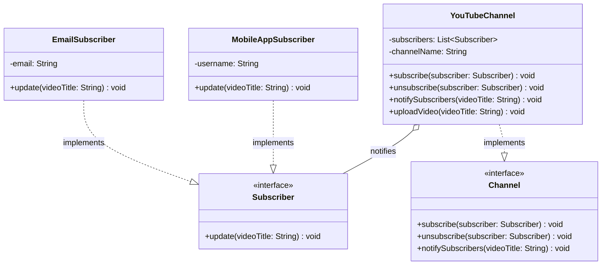
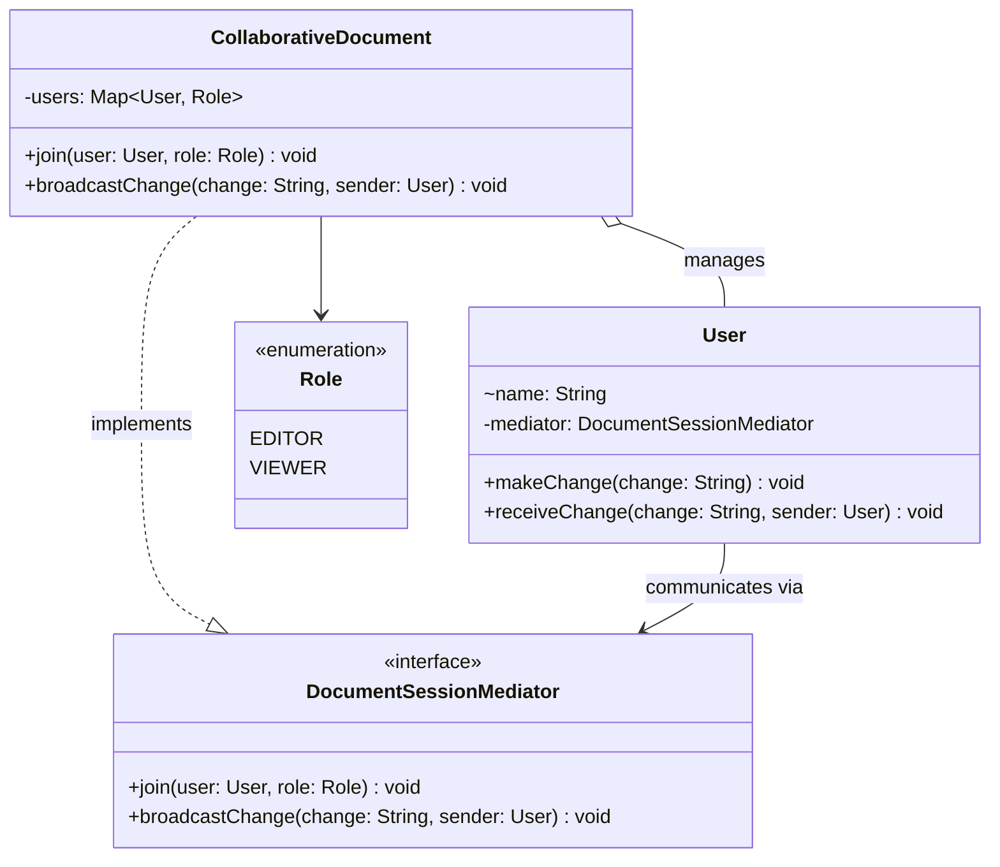

# Behavioural Patterns: Object Communication — Observer and Mediator

A video goes up, and every subscriber hears about it. A collaborator edits a shared document, and everyone else sees the change, except the viewers, who may only read. In both cases several objects need to react to each other, and the naive design wires them together directly: the channel knows every way of notifying users, and every user holds a list of every other user. Each new kind of listener, or each new person, means more wiring, and every missing wire is a silent bug.

This lesson covers the two patterns that cut those wires. **Observer** lets any number of objects subscribe to one subject and be notified when it changes, without the subject knowing what they are. **Mediator** puts one object in the middle of a group, so the members talk only to it, and the rules about who hears what live in one place. It is the third of four lessons on behavioural patterns, after [requests and undo](/synapse/low-level-design/design-patterns/behavioural-requests-and-undo).

<div style="border-left:4px solid #195045;background:rgba(25,80,69,0.08);padding:0.6rem 1rem;border-radius:0 0.5rem 0.5rem 0;margin:1.25rem 0">

💡 **The core idea.**

- **Observer** is one-to-many: a subject keeps a list of observers behind an interface, and calls each of them when something happens. The subject doesn't know what the observers do, and observers can join and leave at run time.
- **Mediator** is many-to-many, made into many-to-one: the members of a group hold a reference to the mediator, never to each other, and the mediator decides who receives each message.
- Both remove direct dependencies, and both move a responsibility into one place, which then has to be robust: the subject's notification loop, or the mediator's rules.

</div>

This builds on [Behavioural Design Patterns](/synapse/low-level-design/design-patterns/behavioural-design-patterns) and on the Iterator consequences in [Introduction to Design Patterns](/synapse/low-level-design/design-patterns/introduction-design-patterns), which matter for Observer's notification loop. Every output below was produced by running the code on Java 21 and Python 3.11.

**You'll be able to:** replace hard-coded notifications with a subject and observers, and keep the notification loop correct when observers subscribe or unsubscribe during it; replace direct links between peers with a mediator that routes messages and enforces rules such as roles; choose between Observer and Mediator for a given interaction.

<div style="border-left:4px solid #15448e;background:rgba(21,68,142,0.08);padding:0.6rem 1rem;border-radius:0 0.5rem 0.5rem 0;margin:1.25rem 0">

📘 **How to read the Intuition boxes.** Each one is built in three moves:

1. **The mechanism** — who holds references to whom, and who decides which objects get a message.
2. **A concrete bite** — a specific, runnable program where a message is delivered twice, skipped, or never sent.
3. **The earned rule** — the decision heuristic, now justified rather than asserted, plus its cost.

</div>

---

## Table of contents

1. [Observer pattern](#1-observer-pattern)
2. [Mediator pattern](#2-mediator-pattern)
3. [Observer or Mediator?](#3-observer-or-mediator)
4. [Mental-model summary](#4-mental-model-summary)
5. [Gotcha checklist](#5-gotcha-checklist)
6. [Check yourself](#-check-yourself)
7. [Sources](#-sources)

---

## 1. Observer pattern

<div style="border-left:4px solid #15448e;background:rgba(21,68,142,0.08);padding:0.6rem 1rem;border-radius:0 0.5rem 0.5rem 0;margin:1.25rem 0">

📘 **Definition.** "Define a one-to-many dependency between objects so that when one object changes state, all its dependents are notified and updated automatically" <abbr title="Gamma, Helm, Johnson and Vlissides, Design Patterns, 1994, Observer: Intent">[1]</abbr>.

</div>

The object being watched is the **subject**. It keeps a list of its dependents, the **observers**, and notifies them of changes, usually by calling a method on each. Objects interested in another object's changes don't need to keep checking it; they are told as soon as something happens, which is efficient and keeps them loosely coupled.

<div style="border-left:4px solid #195045;background:rgba(25,80,69,0.08);padding:0.6rem 1rem;border-radius:0 0.5rem 0.5rem 0;margin:1.25rem 0">

💡 **Insight.** Once you subscribe to a YouTube channel and turn on notifications, you don't have to keep visiting the channel to check for new videos. As soon as a video is uploaded, you are notified.

</div>

The channel is the **subject**, the subscribers are the **observers**, and the notification is the update the subject triggers automatically.

### Understanding the problem

A video platform must notify subscribers when a creator uploads a video. Here is a first version:

```java run
// ⚠️ ANTI-PATTERN — the channel hard-codes who is notified, and how. Do not copy it.
class YouTubeChannel {
    public void uploadNewVideo(String videoTitle) {
        System.out.println("Uploading: " + videoTitle);

        // Notify users by hand
        System.out.println("Sending email to user1@example.com");
        System.out.println("Pushing in-app notification to user3@example.com");
    }
}

public class Main {
    public static void main(String[] args) {
        new YouTubeChannel().uploadNewVideo("Design Patterns in Java");
    }
}
```

```python run
# ⚠️ ANTI-PATTERN — the channel hard-codes who is notified, and how. Do not copy it.
class YouTubeChannel:
    def upload_new_video(self, video_title: str) -> None:
        print(f"Uploading: {video_title}")

        # Notify users by hand
        print("Sending email to user1@example.com")
        print("Pushing in-app notification to user3@example.com")


YouTubeChannel().upload_new_video("Design Patterns in Java")
```

**Output:**
```
Uploading: Design Patterns in Java
Sending email to user1@example.com
Pushing in-app notification to user3@example.com
```

**What's wrong with this approach?**

- **Tight coupling:** `YouTubeChannel` decides how users are notified. Adding SMS or push notifications means editing the channel.
- **No reuse:** the email and in-app logic is hard-coded here, and can't be reused elsewhere without copying it.
- **Doesn't scale:** with hundreds of users and several kinds of notification, this class fills up with notification code.
- **Violates the Single Responsibility Principle:** the class handles uploads *and* notifications.

### The solution

With the Observer pattern, each kind of notification is an observer class behind a `Subscriber` interface, and the channel keeps a list of subscribers that can change at run time:

```java run
import java.util.ArrayList;
import java.util.List;

// Observer interface
interface Subscriber {
    void update(String videoTitle);
}

// Concrete observers
class EmailSubscriber implements Subscriber {
    private final String email;
    EmailSubscriber(String email) { this.email = email; }

    public void update(String videoTitle) {
        System.out.println("Email sent to " + email + ": New video uploaded - " + videoTitle);
    }
}

class MobileAppSubscriber implements Subscriber {
    private final String username;
    MobileAppSubscriber(String username) { this.username = username; }

    public void update(String videoTitle) {
        System.out.println("In-app notification for " + username + ": New video - " + videoTitle);
    }
}

// Subject interface
interface Channel {
    void subscribe(Subscriber subscriber);
    void unsubscribe(Subscriber subscriber);
    void notifySubscribers(String videoTitle);
}

// Concrete subject
class YouTubeChannel implements Channel {
    private final List<Subscriber> subscribers = new ArrayList<>();
    private final String channelName;

    YouTubeChannel(String channelName) { this.channelName = channelName; }

    public void subscribe(Subscriber subscriber) { subscribers.add(subscriber); }

    public void unsubscribe(Subscriber subscriber) { subscribers.remove(subscriber); }

    public void notifySubscribers(String videoTitle) {
        for (Subscriber subscriber : List.copyOf(subscribers)) { // a snapshot: see the bite below
            subscriber.update(videoTitle);
        }
    }

    public void uploadVideo(String videoTitle) {
        System.out.println(channelName + " uploaded: " + videoTitle);
        notifySubscribers(videoTitle);
    }
}

public class Main {
    public static void main(String[] args) {
        YouTubeChannel channel = new YouTubeChannel("techchannel");
        Subscriber alex = new MobileAppSubscriber("alex");
        channel.subscribe(alex);
        channel.subscribe(new EmailSubscriber("rahul@example.com"));

        channel.uploadVideo("observer-pattern");

        channel.unsubscribe(alex);
        channel.uploadVideo("mediator-pattern");
    }
}
```

```python run
from abc import ABC, abstractmethod


# Observer interface
class Subscriber(ABC):
    @abstractmethod
    def update(self, video_title: str) -> None: ...


# Concrete observers
class EmailSubscriber(Subscriber):
    def __init__(self, email: str) -> None:
        self._email = email

    def update(self, video_title: str) -> None:
        print(f"Email sent to {self._email}: New video uploaded - {video_title}")


class MobileAppSubscriber(Subscriber):
    def __init__(self, username: str) -> None:
        self._username = username

    def update(self, video_title: str) -> None:
        print(f"In-app notification for {self._username}: New video - {video_title}")


# Concrete subject
class YouTubeChannel:
    def __init__(self, channel_name: str) -> None:
        self._channel_name = channel_name
        self._subscribers: list[Subscriber] = []

    def subscribe(self, subscriber: Subscriber) -> None:
        self._subscribers.append(subscriber)

    def unsubscribe(self, subscriber: Subscriber) -> None:
        self._subscribers.remove(subscriber)

    def notify_subscribers(self, video_title: str) -> None:
        for subscriber in list(self._subscribers):  # a snapshot: see the bite below
            subscriber.update(video_title)

    def upload_video(self, video_title: str) -> None:
        print(f"{self._channel_name} uploaded: {video_title}")
        self.notify_subscribers(video_title)


channel = YouTubeChannel("techchannel")
alex = MobileAppSubscriber("alex")
channel.subscribe(alex)
channel.subscribe(EmailSubscriber("rahul@example.com"))

channel.upload_video("observer-pattern")

channel.unsubscribe(alex)
channel.upload_video("mediator-pattern")
```

**Output:**
```
techchannel uploaded: observer-pattern
In-app notification for alex: New video - observer-pattern
Email sent to rahul@example.com: New video uploaded - observer-pattern
techchannel uploaded: mediator-pattern
Email sent to rahul@example.com: New video uploaded - mediator-pattern
```

**How this solves the problem.**

| Problem in the old approach | How the Observer pattern solves it |
| --- | --- |
| The channel is tightly coupled to notification logic | Each subscriber handles its own notification in `update()`. |
| New notification types mean editing the channel | A new subscriber class is enough; the channel doesn't change. |
| Notification logic can't be reused | It lives in reusable subscriber classes. |
| Upload and notification in one class (SRP) | Uploads stay in `YouTubeChannel`; notification logic is outside it. |
| Hard to manage many subscribers | `subscribe()` and `unsubscribe()` manage the list at run time. |



**Analysis.** The channel notified both subscribers for the first video, and only Rahul for the second, after Alex unsubscribed, without a single line of notification code in the channel itself. The subscribers are notified in the order they subscribed, because the list keeps that order, but observers shouldn't rely on it: the pattern doesn't promise one. The loop iterates over a *copy* of the list, for the reason the next program shows.

**Intuition.**
*Mechanism.* Notifying is a loop over the subject's list of observers, and each `update()` call runs arbitrary observer code *inside* that loop. If that code changes the list (an observer unsubscribes itself, or subscribes another), the subject is modifying a collection while iterating over it.

*Concrete bite.* A "notify me about the next video only" subscriber unsubscribes itself as soon as it is notified, and the channel loops over its live list:

```java run
import java.util.ArrayList;
import java.util.ConcurrentModificationException;
import java.util.List;

interface Subscriber {
    void update(String videoTitle);
}

// ⚠️ ANTI-PATTERN — notifies by iterating over the live list. Do not copy it.
class YouTubeChannel {
    final List<Subscriber> subscribers = new ArrayList<>();

    void notifySubscribers(String videoTitle) {
        for (Subscriber s : subscribers) {
            s.update(videoTitle);
        }
    }
}

class OneTimeSubscriber implements Subscriber {
    private final String name;
    private final YouTubeChannel channel;
    OneTimeSubscriber(String name, YouTubeChannel channel) { this.name = name; this.channel = channel; }

    public void update(String videoTitle) {
        System.out.println(name + " notified (one time only)");
        channel.subscribers.remove(this); // leaves during the notification
    }
}

class RegularSubscriber implements Subscriber {
    private final String name;
    RegularSubscriber(String name) { this.name = name; }
    public void update(String videoTitle) { System.out.println(name + " notified"); }
}

public class Main {
    public static void main(String[] args) {
        YouTubeChannel channel = new YouTubeChannel();
        channel.subscribers.add(new OneTimeSubscriber("ana", channel));
        channel.subscribers.add(new RegularSubscriber("ben"));
        channel.subscribers.add(new RegularSubscriber("cy"));
        try {
            channel.notifySubscribers("new video");
        } catch (ConcurrentModificationException e) {
            System.out.println("notification loop crashed: " + e.getClass().getSimpleName());
        }
    }
}
```

```python run
# ⚠️ ANTI-PATTERN — notifies by iterating over the live list. Do not copy it.
class YouTubeChannel:
    def __init__(self) -> None:
        self.subscribers: list = []

    def notify_subscribers(self, video_title: str) -> None:
        for s in self.subscribers:
            s.update(video_title)


class OneTimeSubscriber:
    def __init__(self, name: str, channel: YouTubeChannel) -> None:
        self._name = name
        self._channel = channel

    def update(self, video_title: str) -> None:
        print(f"{self._name} notified (one time only)")
        self._channel.subscribers.remove(self)  # leaves during the notification


class RegularSubscriber:
    def __init__(self, name: str) -> None:
        self._name = name

    def update(self, video_title: str) -> None:
        print(f"{self._name} notified")


channel = YouTubeChannel()
channel.subscribers.append(OneTimeSubscriber("ana", channel))
channel.subscribers.append(RegularSubscriber("ben"))
channel.subscribers.append(RegularSubscriber("cy"))
channel.notify_subscribers("new video")
print("notification loop finished")
```

**Output (Java):**
```
ana notified (one time only)
notification loop crashed: ConcurrentModificationException
```

**Output (Python):**
```
ana notified (one time only)
cy notified
notification loop finished
```

Neither language notified Ben. Java's fail-fast iterator stopped the whole loop, so Ben *and* Cy missed the video. Python's list iterator just moved to the next index, and since removing Ana shifted Ben into the slot it had already visited, Ben was skipped without any error. Iterating over a snapshot (`List.copyOf(subscribers)`, `list(subscribers)`) or using a list built for this, such as Java's `CopyOnWriteArrayList`, makes the loop immune to changes made by the observers it calls.

<div style="border-left:4px solid #195045;background:rgba(25,80,69,0.08);padding:0.6rem 1rem;border-radius:0 0.5rem 0.5rem 0;margin:1.25rem 0">

💡 **Earned rule.** Use Observer when one object's changes must reach a varying set of others that the object shouldn't know about. Notify over a snapshot of the observer list, don't let one observer's exception stop the rest (catch and log per observer), and make sure observers unsubscribe when they are no longer needed.

The cost is indirection: the flow of control is no longer visible in the code, and a forgotten subscriber keeps an object alive and keeps receiving calls. For a single, fixed listener, a direct call is clearer.

</div>

**When to use the Observer pattern.**

- **Propagating state changes:** a change in one object must reach several dependent objects at once, without direct coupling.
- **Decoupling core components:** the subject shouldn't know how many observers there are, or what they do.
- **Subscriptions that change at run time:** plugins, UI listeners or notification modules are attached and detached while the program runs.

**Where the Observer pattern falls short.**

- **Very many observers:** when a celebrity with ten million followers posts, a loop that notifies each follower in turn is too slow. Event queues, publish–subscribe systems and broadcast infrastructure are built for that scale.
- **Strict control over delivery:** where notifications must be buffered, retried or delivered in a guaranteed order, as in financial systems or real-time analytics, a message broker such as Kafka or RabbitMQ provides what the in-process pattern doesn't.

In short, the Observer pattern works well inside a process with a modest number of observers; at large scale, the same idea is implemented with event-driven infrastructure.

**Pros of the Observer pattern.**

- **Loose coupling:** subject and observers interact only through an interface.
- **Open for extension:** new kinds of observer don't require changes to the subject.
- **Dynamic subscription:** observers can be attached and detached at run time.
- **Reuse:** observer classes can be reused with other subjects.

**Cons of the Observer pattern.**

- **No guaranteed order:** if the order of notifications matters, the pattern itself doesn't provide one.
- **Slow at scale:** notifying many observers synchronously can hurt performance.
- **Memory leaks:** observers that are never unsubscribed stay referenced by the subject.
- **Harder debugging:** effects happen indirectly, which makes it harder to trace where an update came from.
- **Immediate delivery only:** every observer is called straight away; delayed or controlled delivery isn't built in.

**Real-life use cases.**

- **UI event handling:** buttons, sliders and text fields notify listeners of clicks and typing.
- **News and blog subscriptions:** subscribers are notified when new content is published.
- **Stock tickers:** charts, alerts and watchlists subscribe to price changes.
- **File watchers:** IDEs and sync tools are notified when files change.
- **Social media:** followers are notified when someone they follow posts.

Java's own `java.util.Observable` class, an early built-in version of this pattern, has been deprecated since Java 9; its documentation points to `java.beans` property-change listeners and other event mechanisms instead <abbr title="Java SE 21 API, java.util.Observable (deprecated since 9)">[2]</abbr>.

---

## 2. Mediator pattern

A user interface has buttons, text fields and labels that need to react to each other. Instead of each component talking to the others directly, they all talk to one central object, which coordinates them. That decouples the components, and is the essence of the Mediator pattern.

<div style="border-left:4px solid #15448e;background:rgba(21,68,142,0.08);padding:0.6rem 1rem;border-radius:0 0.5rem 0.5rem 0;margin:1.25rem 0">

📘 **Definition.** "Define an object that encapsulates how a set of objects interact. Mediator promotes loose coupling by keeping objects from referring to each other explicitly, and it lets you vary their interaction independently" <abbr title="Gamma, Helm, Johnson and Vlissides, Design Patterns, 1994, Mediator: Intent">[1]</abbr>.

</div>

The members of the group, often called *colleagues*, communicate through the mediator instead of directly, which simplifies and organises their interaction.

<div style="border-left:4px solid #195045;background:rgba(25,80,69,0.08);padding:0.6rem 1rem;border-radius:0 0.5rem 0.5rem 0;margin:1.25rem 0">

💡 **Insight.** At an airport, planes talk to the air traffic control (ATC) tower, not to each other. ATC coordinates their movements and keeps them at safe distances, so each plane only needs to talk to one place.

</div>

### Understanding the problem

A collaborative document editor lets users edit a shared document, and each user can give others access. In this first version, each user keeps a list of the collaborators it notifies:

```java run
import java.util.ArrayList;
import java.util.List;

// ⚠️ ANTI-PATTERN — every user holds and notifies the other users directly. Do not copy it.
class User {
    private final String name;
    private final List<User> others = new ArrayList<>(); // users this user notifies

    User(String name) { this.name = name; }

    void addCollaborator(User user) { others.add(user); }

    void makeChange(String change) {
        System.out.println(name + " made a change: " + change);
        for (User u : others) {
            u.receiveChange(change, this);
        }
    }

    void receiveChange(String change, User from) {
        System.out.println(name + " received: \"" + change + "\" from " + from.name);
    }
}

public class Main {
    public static void main(String[] args) {
        User alice = new User("Alice");
        User bob = new User("Bob");
        User charlie = new User("Charlie");

        // Alice gives access to Bob and Charlie
        alice.addCollaborator(bob);
        alice.addCollaborator(charlie);

        alice.makeChange("Updated the document title");
        bob.makeChange("Added a new section to the document");
    }
}
```

```python run
# ⚠️ ANTI-PATTERN — every user holds and notifies the other users directly. Do not copy it.
class User:
    def __init__(self, name: str) -> None:
        self.name = name
        self._others: list["User"] = []  # users this user notifies

    def add_collaborator(self, user: "User") -> None:
        self._others.append(user)

    def make_change(self, change: str) -> None:
        print(f"{self.name} made a change: {change}")
        for u in self._others:
            u.receive_change(change, self)

    def receive_change(self, change: str, sender: "User") -> None:
        print(f'{self.name} received: "{change}" from {sender.name}')


alice = User("Alice")
bob = User("Bob")
charlie = User("Charlie")

# Alice gives access to Bob and Charlie
alice.add_collaborator(bob)
alice.add_collaborator(charlie)

alice.make_change("Updated the document title")
bob.make_change("Added a new section to the document")
```

**Output:**
```
Alice made a change: Updated the document title
Bob received: "Updated the document title" from Alice
Charlie received: "Updated the document title" from Alice
Bob made a change: Added a new section to the document
```

**How the code works.** `addCollaborator(user)` adds a user to this user's list of collaborators. `makeChange(change)` applies a change and calls `receiveChange` on every collaborator in the list. `receiveChange(change, from)` prints who made which change. Bob's change reached nobody: Alice gave Bob access, but nobody added Alice or Charlie to *Bob's* list, so Bob's edits are invisible to everyone else.

**Issues with this approach.**

- **Tight coupling between users:** each user holds references to every user it collaborates with, which is hard to manage as people join and leave.
- **Adding and removing users breaks things:** every change of membership means updating many lists, and missing one breaks the collaboration silently, as Bob's change showed.
- **Roles are hard to add:** editor, viewer and admin roles have nowhere natural to live; adding them means changing every user, which violates the Open/Closed Principle.
- **Permissions, state and notifications are scattered:** read-only access, or role-dependent notifications, would have to be checked in every user.
- **No separation of concerns:** `User` manages collaborators, makes changes *and* notifies others, which goes against the Single Responsibility Principle.
- **Doesn't scale:** the number of links grows with the square of the number of users.

### The solution

With the Mediator pattern, the document session is the mediator. Users only know the mediator, and the mediator decides who receives each change. Because every change passes through it, it is also the natural place for rules, here a viewer role that may read but not edit:

```java run
import java.util.LinkedHashMap;
import java.util.Map;

enum Role { EDITOR, VIEWER }

// Mediator interface
interface DocumentSessionMediator {
    void join(User user, Role role);
    void broadcastChange(String change, User sender);
}

// Concrete mediator: routes every change, and enforces the rules.
class CollaborativeDocument implements DocumentSessionMediator {
    private final Map<User, Role> users = new LinkedHashMap<>();

    public void join(User user, Role role) {
        users.put(user, role);
    }

    public void broadcastChange(String change, User sender) {
        if (users.get(sender) != Role.EDITOR) {
            System.out.println("  rejected: " + sender.name + " is a viewer");
            return;
        }
        for (User user : users.keySet()) {
            if (user != sender) {
                user.receiveChange(change, sender);
            }
        }
    }
}

// Colleague: knows only the mediator.
class User {
    final String name;
    private final DocumentSessionMediator mediator;

    User(String name, DocumentSessionMediator mediator) {
        this.name = name;
        this.mediator = mediator;
    }

    void makeChange(String change) {
        System.out.println(name + " submits a change: " + change);
        mediator.broadcastChange(change, this);
    }

    void receiveChange(String change, User sender) {
        System.out.println("  " + name + " saw change from " + sender.name + ": \"" + change + "\"");
    }
}

public class Main {
    public static void main(String[] args) {
        CollaborativeDocument doc = new CollaborativeDocument();
        User alice = new User("Alice", doc);
        User bob = new User("Bob", doc);
        User charlie = new User("Charlie", doc);

        doc.join(alice, Role.EDITOR);
        doc.join(bob, Role.EDITOR);
        doc.join(charlie, Role.VIEWER);

        alice.makeChange("Added project title");
        bob.makeChange("Corrected grammar in paragraph 2");
        charlie.makeChange("Deleted the conclusion");
    }
}
```

```python run
from abc import ABC, abstractmethod
from enum import Enum


class Role(Enum):
    EDITOR = 1
    VIEWER = 2


# Mediator interface
class DocumentSessionMediator(ABC):
    @abstractmethod
    def join(self, user: "User", role: Role) -> None: ...

    @abstractmethod
    def broadcast_change(self, change: str, sender: "User") -> None: ...


# Concrete mediator: routes every change, and enforces the rules.
class CollaborativeDocument(DocumentSessionMediator):
    def __init__(self) -> None:
        self._users: dict["User", Role] = {}  # keeps insertion order

    def join(self, user: "User", role: Role) -> None:
        self._users[user] = role

    def broadcast_change(self, change: str, sender: "User") -> None:
        if self._users.get(sender) is not Role.EDITOR:
            print(f"  rejected: {sender.name} is a viewer")
            return
        for user in self._users:
            if user is not sender:
                user.receive_change(change, sender)


# Colleague: knows only the mediator.
class User:
    def __init__(self, name: str, mediator: DocumentSessionMediator) -> None:
        self.name = name
        self._mediator = mediator

    def make_change(self, change: str) -> None:
        print(f"{self.name} submits a change: {change}")
        self._mediator.broadcast_change(change, self)

    def receive_change(self, change: str, sender: "User") -> None:
        print(f'  {self.name} saw change from {sender.name}: "{change}"')


doc = CollaborativeDocument()
alice = User("Alice", doc)
bob = User("Bob", doc)
charlie = User("Charlie", doc)

doc.join(alice, Role.EDITOR)
doc.join(bob, Role.EDITOR)
doc.join(charlie, Role.VIEWER)

alice.make_change("Added project title")
bob.make_change("Corrected grammar in paragraph 2")
charlie.make_change("Deleted the conclusion")
```

**Output:**
```
Alice submits a change: Added project title
  Bob saw change from Alice: "Added project title"
  Charlie saw change from Alice: "Added project title"
Bob submits a change: Corrected grammar in paragraph 2
  Alice saw change from Bob: "Corrected grammar in paragraph 2"
  Charlie saw change from Bob: "Corrected grammar in paragraph 2"
Charlie submits a change: Deleted the conclusion
  rejected: Charlie is a viewer
```

**Explanation of the changes.**

- **Mediator interface (`DocumentSessionMediator`):** declares how users join and how changes are broadcast.
- **Concrete mediator (`CollaborativeDocument`):** keeps the users and their roles, broadcasts each editor's change to everyone except the sender, and rejects changes from viewers.
- **`User`:** talks only to the mediator, never to other users.

**How the Mediator pattern solves the issues.**

| Issue | How it is solved |
| --- | --- |
| Tight coupling between users | Users hold no references to each other; they talk only through `CollaborativeDocument`. |
| Adding and removing users breaks things | Membership is one call to the mediator, so nobody can be half-connected. |
| Roles are hard to add | Roles live in the mediator, as the viewer rule shows; users didn't change. |
| Permissions and notifications are scattered | The mediator is the single place that decides who may send and who receives. |
| No separation of concerns | `User` only makes and receives changes; the mediator handles all communication. |
| Doesn't scale | Each user has one link, to the mediator, however many users there are. |



**Analysis.** Every editor's change reached every other user, including Bob's, which no one saw in the first version. The viewer rule took four lines in one class, and no `User` code changed to support it. In the diagram, the users point only at the mediator; the mediator is the only object that knows the whole group.

**Intuition.**
*Mechanism.* With direct links, the group's communication structure is spread across every member: n users need up to n × (n − 1) one-way links, each added by hand. With a mediator, each member has exactly one link, and the structure lives in one object, where it can be complete by construction.

*Concrete bite.* Four users connect directly, which needs twelve one-way links, and one of them is forgotten. Compare that with four joins to a mediator:

```java run
import java.util.ArrayList;
import java.util.LinkedHashMap;
import java.util.List;
import java.util.Map;

class Peer {
    final String name;
    final List<Peer> others = new ArrayList<>();
    Peer(String name) { this.name = name; }

    List<String> broadcast() { // who sees this peer's change
        List<String> seen = new ArrayList<>();
        for (Peer p : others) seen.add(p.name);
        return seen;
    }
}

class Session {
    private final Map<String, Boolean> members = new LinkedHashMap<>();
    void join(String name) { members.put(name, true); }

    List<String> broadcast(String sender) {
        List<String> seen = new ArrayList<>();
        for (String m : members.keySet()) if (!m.equals(sender)) seen.add(m);
        return seen;
    }
}

public class Main {
    public static void main(String[] args) {
        // ⚠️ ANTI-PATTERN — a full mesh of direct links, wired by hand. Do not copy it.
        Peer alice = new Peer("Alice"), bob = new Peer("Bob"), charlie = new Peer("Charlie"), dave = new Peer("Dave");
        Peer[] all = {alice, bob, charlie, dave};
        int links = 0;
        for (Peer from : all) {
            for (Peer to : all) {
                if (from == to) continue;
                if (from == dave && to == alice) continue; // the one link someone forgot
                from.others.add(to);
                links++;
            }
        }
        System.out.println("direct links added: " + links + " of 12");
        System.out.println("Dave's change seen by: " + dave.broadcast());

        Session doc = new Session();
        for (Peer p : all) doc.join(p.name);
        System.out.println("mediator joins: 4");
        System.out.println("Dave's change seen by: " + doc.broadcast("Dave"));
    }
}
```

```python run
class Peer:
    def __init__(self, name: str) -> None:
        self.name = name
        self.others: list["Peer"] = []

    def broadcast(self) -> list[str]:  # who sees this peer's change
        return [p.name for p in self.others]


class Session:
    def __init__(self) -> None:
        self._members: list[str] = []

    def join(self, name: str) -> None:
        self._members.append(name)

    def broadcast(self, sender: str) -> list[str]:
        return [m for m in self._members if m != sender]


# ⚠️ ANTI-PATTERN — a full mesh of direct links, wired by hand. Do not copy it.
alice, bob, charlie, dave = Peer("Alice"), Peer("Bob"), Peer("Charlie"), Peer("Dave")
everyone = [alice, bob, charlie, dave]
links = 0
for frm in everyone:
    for to in everyone:
        if frm is to:
            continue
        if frm is dave and to is alice:  # the one link someone forgot
            continue
        frm.others.append(to)
        links += 1
print(f"direct links added: {links} of 12")
print("Dave's change seen by: [" + ", ".join(dave.broadcast()) + "]")

doc = Session()
for p in everyone:
    doc.join(p.name)
print("mediator joins: 4")
print("Dave's change seen by: [" + ", ".join(doc.broadcast("Dave")) + "]")
```

**Output:**
```
direct links added: 11 of 12
Dave's change seen by: [Bob, Charlie]
mediator joins: 4
Dave's change seen by: [Alice, Bob, Charlie]
```

Eleven of twelve links is 92% correct, and it means Alice never sees anything Dave writes, with nothing to tell either of them. With ten users the mesh needs ninety links. With the mediator, joining is one call per user, and broadcasting reaches everyone else by construction.

<div style="border-left:4px solid #195045;background:rgba(25,80,69,0.08);padding:0.6rem 1rem;border-radius:0 0.5rem 0.5rem 0;margin:1.25rem 0">

💡 **Earned rule.** When the members of a group would each need references to several others, and the rules about who may talk to whom are likely to change (roles, permissions, filtering), give the group a mediator: members hold only the mediator, and the mediator owns membership and routing.

The cost is that the mediator collects all the interaction logic, and can grow into a hard-to-change "god object". Keep it to coordination, and keep each member's own behaviour in the member.

</div>

**When to use the Mediator pattern.**

- **Several users or services interact, but should stay decoupled:** they communicate without knowing about each other.
- **Rules or permissions must be managed centrally:** access control and roles are enforced in one place, consistently.
- **Messages must be broadcast, filtered or transformed:** the mediator can do it without the members changing.

**Pros of the Mediator pattern.**

- **Members don't know about each other:** they talk only to the mediator, which reduces dependencies.
- **Central management of roles and access:** rules are enforced consistently, in one class.
- **Easier to test and extend:** interaction logic is in one place; members can be added without touching others.
- **Clean separation:** each member's business logic is separate from the logic of how members interact.

**Cons of the Mediator pattern.**

- **The mediator can become complex:** as the system grows, it may take on too many responsibilities.
- **A single point of failure:** if the mediator fails, all communication in the group fails.
- **An extra layer of abstraction:** for a simple pair of objects, a direct call is easier to follow.

**Real-life use cases.**

1. **Airline systems.** Booking, customer service, flight status and payment services exchange updates through a mediator instead of calling each other: when a flight's status changes, the mediator makes sure booking, customer service and payments all hear about it.
2. **Auction systems.** Bidders don't contact each other; the auctioneer receives each bid and announces it to all participants, which keeps everyone's view of the auction consistent.

---

## 3. Observer or Mediator?

Both patterns stop objects referring to each other directly, and a mediator often uses observer-style notification internally. The difference is in the shape of the communication and where the rules live.

| | Observer | Mediator |
| --- | --- | --- |
| Shape | one subject to many observers | many colleagues through one mediator |
| Direction | from the subject outwards | any member to any members |
| Who decides who receives a message | the observers, by subscribing | the mediator, by its rules |
| Do the parties know each other? | the subject knows only the observer interface | colleagues know only the mediator |
| Typical uses | events, change notifications, UI listeners | chat rooms, collaborative sessions, coordinating UI controls, air traffic control |

A quick test: if the question is "who wants to hear about changes to *this* object?", use Observer. If the question is "how should *these* objects interact, and under what rules?", use Mediator.

---

## 4. Mental-model summary

| Principle | Consequence |
|---|---|
| Observer: a subject notifies a list of observers through an interface | New kinds of observer don't change the subject; subscriptions change at run time |
| Observer code runs inside the subject's notification loop | Iterate over a snapshot; isolate failures per observer |
| Forgotten observers stay referenced | Unsubscribe when done, or the subject keeps them alive |
| Mediator: colleagues talk only to the mediator | One link per member instead of up to n × (n − 1) |
| The mediator owns membership and routing | Rules such as roles live in one place, and apply to everyone |
| Observer vs Mediator | Who decides who receives a message: the subscribers, or the mediator's rules |

## 5. Gotcha checklist

<div style="border-left:4px solid #da5233;background:rgba(218,82,51,0.08);padding:0.6rem 1rem;border-radius:0 0.5rem 0.5rem 0;margin:1.25rem 0">

| Symptom | Likely cause | Fix |
|---|---|---|
| `ConcurrentModificationException` while notifying | an observer (un)subscribed during the loop over the live list | iterate over a copy, or use `CopyOnWriteArrayList` |
| An observer silently misses a notification (Python) | the list changed during the loop | iterate over `list(subscribers)` |
| One failing observer stops all the others | an exception escapes the notification loop | catch and log each observer's failure |
| Memory grows; removed screens keep reacting | observers never unsubscribed | unsubscribe on close; consider weak references |
| A user's edits reach some people but not others | direct links wired by hand, one missing | a mediator that owns membership |
| Role checks duplicated in every component | rules spread across the colleagues | put the rules in the mediator |
| The mediator does everything | business logic moved into it | keep only coordination in the mediator |

</div>

---

## ✅ Check yourself

One check per objective. Answer before you open anything.

```quiz
{"prompt": "A subject notifies observers with for (Subscriber s : subscribers), and one observer unsubscribes itself inside update(). What happens in Java, and what is the fix?", "options": ["ConcurrentModificationException stops the loop; iterate over a copy such as List.copyOf(subscribers)", "Nothing: the removal takes effect after the loop", "The removed observer is notified twice; remove the unsubscribe call"], "answer": "ConcurrentModificationException stops the loop; iterate over a copy such as List.copyOf(subscribers)"}
```

```quiz
{"prompt": "Ten users of a shared document each keep a list of the other users they notify. A new rule says viewers may not edit. Which design makes the rule one change in one place?", "options": ["A mediator that all users talk through, which checks the sender's role", "Adding a role check to every user's makeChange()", "Making every user an observer of every other user"], "answer": "A mediator that all users talk through, which checks the sender's role"}
```

```quiz
{"prompt": "A dashboard wants to know whenever a stock's price changes; separately, a form's 'country' field must update the 'state' list and enable the 'submit' button. Which pattern fits each?", "options": ["Observer for the price changes; Mediator for coordinating the form fields", "Mediator for the price changes; Observer for the form fields", "Observer for both, with no need for a mediator"], "answer": "Observer for the price changes; Mediator for coordinating the form fields"}
```

<details>
<summary>A ride-hailing app must tell the rider, the driver and an analytics service whenever a trip's status changes; riders and drivers can also chat, but a driver's messages must be blocked once the trip ends, and phone numbers must be masked in every message. Which pattern goes where?</summary>

**Observer** for trip status: the `Trip` is the subject, and the rider app, the driver app and the analytics service subscribe to it; the trip notifies them over a snapshot of its subscribers, and the analytics service failing must not stop the apps being notified. **Mediator** for chat: a `TripChat` mediator that rider and driver send messages through; it owns the rules (block the driver once the trip has ended, mask phone numbers) and delivers each message to the other party. The chat mediator can itself observe the trip, so it learns when the trip ends without the trip knowing about chat.

</details>

---

## 📚 Sources

1. Erich Gamma, Richard Helm, Ralph Johnson and John Vlissides, *Design Patterns: Elements of Reusable Object-Oriented Software* (Addison-Wesley, 1994), ch. 5 "Behavioral Patterns": Mediator, Observer.
2. `java.util.Observable` (deprecated since Java 9) and `java.util.concurrent.CopyOnWriteArrayList`, Java SE 21 API — <https://docs.oracle.com/en/java/javase/21/docs/api/java.base/java/util/Observable.html>

---

<div style="border-left:4px solid #6d28d9;background:rgba(109,40,217,0.08);padding:0.6rem 1rem;border-radius:0 0.5rem 0.5rem 0;margin:1.25rem 0">

🧪 **Predict, then check.**

1. In the Observer bite in section 1, change the loop to iterate over `List.copyOf(subscribers)` (Python: `list(self.subscribers)`). Predict which subscribers are notified, in each language.
2. In the Observer solution, subscribe the same `EmailSubscriber` object twice before the first upload. Predict how many emails Rahul gets.
3. In the Mediator solution in section 2, call `doc.join(charlie, Role.EDITOR)` again after the first two changes, then let Charlie make the change. Predict what happens.
4. In the Mediator bite, also skip the link from Alice to Dave. Predict the two "seen by" lines.

</div>

## Your Turn

Before you move on, check your understanding with the coach — explain the idea, apply it, weigh the trade-offs, then defend your reasoning.

<div class="concept-coach"></div>
