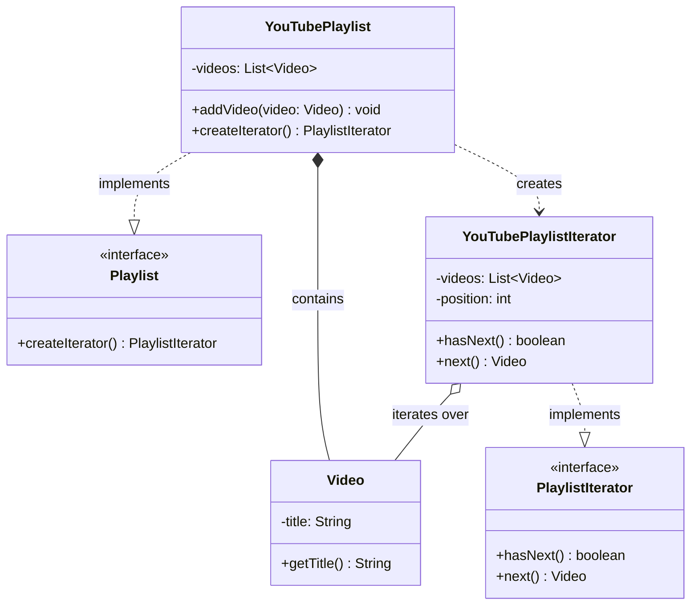
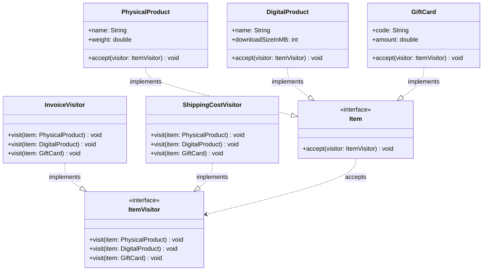

# Behavioural Patterns: Traversal — Iterator and Visitor

A playlist stores its videos in a list today, and might store them in a tree tomorrow; the code that plays them shouldn't care. A shopping cart holds physical products, digital products and gift cards, and new operations keep arriving: invoices, shipping costs, tax, a loyalty report. In the first case the *structure* must stay hidden while its elements are visited one by one. In the second, the *operations* must be added without editing every element class each time.

This lesson covers the two patterns for walking a structure. **Iterator** provides access to the elements of a collection one at a time, without exposing how they are stored. **Visitor** moves an operation over a structure's elements into its own class, so new operations can be added without changing the element classes. It is the last of four lessons on behavioural patterns, after [object communication](/synapse/low-level-design/design-patterns/behavioural-object-communication).

<div style="border-left:4px solid #195045;background:rgba(25,80,69,0.08);padding:0.6rem 1rem;border-radius:0 0.5rem 0.5rem 0;margin:1.25rem 0">

💡 **The core idea.**

- An **iterator** is a separate object that remembers a position in a collection and hands out the next element on request. The collection creates a fresh one for each traversal, so several traversals can run independently.
- A **visitor** is an object with one method per element type. Each element "accepts" a visitor by calling the method for its own type, which gives the right behaviour for *both* the element's type and the visitor's type: **double dispatch**.
- Iterator varies *how* you walk a structure; Visitor varies *what you do* at each element.

</div>

This builds on [Behavioural Design Patterns](/synapse/low-level-design/design-patterns/behavioural-design-patterns) and on the Composite pattern in [Structural Design Patterns](/synapse/low-level-design/design-patterns/structural-design-patterns), whose trees are often walked with iterators or visitors. The Java language rules for `Iterable` and `Iterator` are in the Java guide's [The Collections Framework](/synapse/programming-languages/java/core-libraries/the-collections-framework). Every output below was produced by running the code on Java 21 and Python 3.11.

**You'll be able to:** give a collection an iterator that hides its storage, follows the language's iterator contract, and supports several independent traversals; add operations over a fixed set of element types with a visitor, and explain double dispatch, including why calling `visit()` directly goes wrong in Java; choose between a visitor and ordinary polymorphism, depending on whether element types or operations change more often.

<div style="border-left:4px solid #15448e;background:rgba(21,68,142,0.08);padding:0.6rem 1rem;border-radius:0 0.5rem 0.5rem 0;margin:1.25rem 0">

📘 **How to read the Intuition boxes.** Each one is built in three moves:

1. **The mechanism** — which object holds the traversal state, or which call chooses the method that runs.
2. **A concrete bite** — a specific, runnable program where that state is shared, or that choice is made from the wrong type.
3. **The earned rule** — the decision heuristic, now justified rather than asserted, plus its cost.

</div>

---

## Table of contents

1. [Iterator pattern](#1-iterator-pattern)
2. [Visitor pattern](#2-visitor-pattern)
3. [Visitor or polymorphism?](#3-visitor-or-polymorphism)
4. [Mental-model summary](#4-mental-model-summary)
5. [Gotcha checklist](#5-gotcha-checklist)
6. [Check yourself](#-check-yourself)
7. [Sources](#-sources)

---

## 1. Iterator pattern

<div style="border-left:4px solid #15448e;background:rgba(21,68,142,0.08);padding:0.6rem 1rem;border-radius:0 0.5rem 0.5rem 0;margin:1.25rem 0">

📘 **Definition.** "Provide a way to access the elements of an aggregate object sequentially without exposing its underlying representation" <abbr title="Gamma, Helm, Johnson and Vlissides, Design Patterns, 1994, Iterator: Intent">[1]</abbr>.

</div>

The job of traversing a collection is given to a separate object, the *iterator*. Whether the collection is an array, a list, a tree or something custom, the client walks it the same way, one element at a time, without knowing how the data is stored.

<div style="border-left:4px solid #195045;background:rgba(25,80,69,0.08);padding:0.6rem 1rem;border-radius:0 0.5rem 0.5rem 0;margin:1.25rem 0">

💡 **Insight.** On a vending machine's screen you press "Next" to scroll through the options one by one. You don't know how the snacks are arranged inside; the machine controls the order.

</div>

An iterator is that "Next" button: it gives you one item at a time, and hides everything behind it.

### Understanding the problem

A playlist stores videos, and the client prints their titles:

```java run
import java.util.ArrayList;
import java.util.List;

class Video {
    private final String title;
    Video(String title) { this.title = title; }
    String getTitle() { return title; }
}

// ⚠️ ANTI-PATTERN — the playlist hands out its internal list. Do not copy it.
class YouTubePlaylist {
    private final List<Video> videos = new ArrayList<>();

    void addVideo(Video video) { videos.add(video); }

    List<Video> getVideos() { return videos; }
}

public class Main {
    public static void main(String[] args) {
        YouTubePlaylist playlist = new YouTubePlaylist();
        playlist.addVideo(new Video("LLD Tutorial"));
        playlist.addVideo(new Video("System Design Basics"));

        for (Video v : playlist.getVideos()) {
            System.out.println(v.getTitle());
        }
        playlist.getVideos().clear(); // any client can do this too
        System.out.println("videos left: " + playlist.getVideos().size());
    }
}
```

```python run
class Video:
    def __init__(self, title: str) -> None:
        self.title = title


# ⚠️ ANTI-PATTERN — the playlist hands out its internal list. Do not copy it.
class YouTubePlaylist:
    def __init__(self) -> None:
        self._videos: list[Video] = []

    def add_video(self, video: Video) -> None:
        self._videos.append(video)

    def get_videos(self) -> list[Video]:
        return self._videos


playlist = YouTubePlaylist()
playlist.add_video(Video("LLD Tutorial"))
playlist.add_video(Video("System Design Basics"))

for v in playlist.get_videos():
    print(v.title)
playlist.get_videos().clear()  # any client can do this too
print("videos left:", len(playlist.get_videos()))
```

**Output:**
```
LLD Tutorial
System Design Basics
videos left: 0
```

**What are the issues?**

- **Exposes the internal structure:** `getVideos()` returns the playlist's own list, so clients can read it and change it, as the `clear()` call did.
- **Couples clients to the storage:** client code is written against a `List`; if the playlist switches to another structure, the clients must change.
- **No control over traversal:** the traversal happens outside the class, so custom orders (reverse, filtered, skipping) can't be offered without changing client code.
- **Hard to run independent traversals:** two parts of the program walking the playlist at the same time must each manage their own index by hand.

### The solution

The Iterator pattern gives traversal its own object, with `hasNext()` and `next()`. A first step creates the iterator from the playlist's list:

```java run
import java.util.ArrayList;
import java.util.List;
import java.util.NoSuchElementException;

class Video {
    private final String title;
    Video(String title) { this.title = title; }
    String getTitle() { return title; }
}

class YouTubePlaylist {
    private final List<Video> videos = new ArrayList<>();
    void addVideo(Video video) { videos.add(video); }
    List<Video> getVideos() { return videos; } // still exposed
}

// Iterator interface
interface PlaylistIterator {
    boolean hasNext();
    Video next();
}

// Concrete iterator: keeps its own position.
class YouTubePlaylistIterator implements PlaylistIterator {
    private final List<Video> videos;
    private int position = 0;

    YouTubePlaylistIterator(List<Video> videos) { this.videos = videos; }

    public boolean hasNext() { return position < videos.size(); }

    public Video next() {
        if (!hasNext()) throw new NoSuchElementException();
        return videos.get(position++);
    }
}

public class Main {
    public static void main(String[] args) {
        YouTubePlaylist playlist = new YouTubePlaylist();
        playlist.addVideo(new Video("LLD Tutorial"));
        playlist.addVideo(new Video("System Design Basics"));

        // The client still builds the iterator from the internal list (not ideal).
        PlaylistIterator iterator = new YouTubePlaylistIterator(playlist.getVideos());
        while (iterator.hasNext()) {
            System.out.println(iterator.next().getTitle());
        }
    }
}
```

```python run
class Video:
    def __init__(self, title: str) -> None:
        self.title = title


class YouTubePlaylist:
    def __init__(self) -> None:
        self._videos: list[Video] = []

    def add_video(self, video: Video) -> None:
        self._videos.append(video)

    def get_videos(self) -> list[Video]:  # still exposed
        return self._videos


# Concrete iterator: keeps its own position.
class YouTubePlaylistIterator:
    def __init__(self, videos: list[Video]) -> None:
        self._videos = videos
        self._position = 0

    def has_next(self) -> bool:
        return self._position < len(self._videos)

    def next(self) -> Video:
        if not self.has_next():
            raise StopIteration
        video = self._videos[self._position]
        self._position += 1
        return video


playlist = YouTubePlaylist()
playlist.add_video(Video("LLD Tutorial"))
playlist.add_video(Video("System Design Basics"))

# The client still builds the iterator from the internal list (not ideal).
iterator = YouTubePlaylistIterator(playlist.get_videos())
while iterator.has_next():
    print(iterator.next().title)
```

**Output:**
```
LLD Tutorial
System Design Basics
```

**How this helps.**

| Problem | How the Iterator pattern solves it |
| --- | --- |
| Traversal works on the internal structure | Elements are reached one at a time through an iterator. |
| No standard way to iterate | Every traversal uses the same interface, `hasNext()` and `next()`. |
| Traversal state spread through client code | The position is kept inside the iterator. |
| Hard to customise traversal | Different iterator classes can walk in different orders (reverse, filtered, skipping). |
| Clients coupled to the collection type | Clients depend only on the iterator interface. |

**One issue remains.** The client still calls `getVideos()` and creates the iterator itself, so the list is still exposed. The refined version lets the collection create its own iterators, and keeps the list private:

```java run
import java.util.ArrayList;
import java.util.List;
import java.util.NoSuchElementException;

class Video {
    private final String title;
    Video(String title) { this.title = title; }
    String getTitle() { return title; }
}

// The aggregate interface: anything that can create an iterator over itself.
interface Playlist {
    PlaylistIterator createIterator();
}

interface PlaylistIterator {
    boolean hasNext();
    Video next();
}

class YouTubePlaylist implements Playlist {
    private final List<Video> videos = new ArrayList<>(); // never handed out

    void addVideo(Video video) { videos.add(video); }

    public PlaylistIterator createIterator() {
        return new YouTubePlaylistIterator(videos); // a fresh iterator each time
    }
}

class YouTubePlaylistIterator implements PlaylistIterator {
    private final List<Video> videos;
    private int position = 0;

    YouTubePlaylistIterator(List<Video> videos) { this.videos = videos; }

    public boolean hasNext() { return position < videos.size(); }

    public Video next() {
        if (!hasNext()) throw new NoSuchElementException("no more videos");
        return videos.get(position++);
    }
}

public class Main {
    public static void main(String[] args) {
        YouTubePlaylist playlist = new YouTubePlaylist();
        playlist.addVideo(new Video("LLD Tutorial"));
        playlist.addVideo(new Video("System Design Basics"));

        PlaylistIterator iterator = playlist.createIterator();
        while (iterator.hasNext()) {
            System.out.println(iterator.next().getTitle());
        }
        try {
            iterator.next();
        } catch (NoSuchElementException e) {
            System.out.println("past the end: " + e.getMessage());
        }
    }
}
```

```python run
class Video:
    def __init__(self, title: str) -> None:
        self.title = title


# Python builds the pattern into the language: __iter__ creates an iterator,
# and __next__ returns the next element or raises StopIteration.
class YouTubePlaylistIterator:
    def __init__(self, videos: list[Video]) -> None:
        self._videos = videos
        self._position = 0

    def __iter__(self) -> "YouTubePlaylistIterator":
        return self

    def __next__(self) -> Video:
        if self._position >= len(self._videos):
            raise StopIteration
        video = self._videos[self._position]
        self._position += 1
        return video


class YouTubePlaylist:
    def __init__(self) -> None:
        self._videos: list[Video] = []  # never handed out

    def add_video(self, video: Video) -> None:
        self._videos.append(video)

    def __iter__(self) -> YouTubePlaylistIterator:
        return YouTubePlaylistIterator(self._videos)  # a fresh iterator each time


playlist = YouTubePlaylist()
playlist.add_video(Video("LLD Tutorial"))
playlist.add_video(Video("System Design Basics"))

for video in playlist:  # calls __iter__, then __next__ until StopIteration
    print(video.title)

iterator = iter(playlist)
for _ in iterator:
    pass
try:
    next(iterator)
except StopIteration:
    print("past the end: no more videos")
```

**Output:**
```
LLD Tutorial
System Design Basics
past the end: no more videos
```

**Key improvements.**

- `YouTubePlaylist` no longer exposes how it stores its videos.
- The client doesn't manage or know about the internal structure.
- The `Playlist` interface lets other collections, such as a `MusicPlaylist`, be iterated the same way.
- `next()` past the end fails loudly, as Java's `Iterator` contract requires (`NoSuchElementException`) and as Python's protocol requires (`StopIteration`), instead of returning `null`.

In real Java code, the collection would implement `java.lang.Iterable<Video>` and return a `java.util.Iterator<Video>`, which lets clients use the enhanced `for` loop. In Python, `for video in playlist` already uses the pattern: `__iter__` plays the role of `createIterator()`, and `__next__` combines `hasNext()` and `next()`.



**Analysis.** The client printed every title without ever seeing the list, and asking for one element too many raised a clear error instead of returning `null`. The position lives in `YouTubePlaylistIterator`, not in the playlist, and `createIterator()` returns a new iterator on every call.

**Intuition.**
*Mechanism.* The iterator object holds the traversal state: the position. Whoever owns that object owns the traversal. If each traversal gets its own iterator, traversals are independent; if the state lives anywhere shared, every traversal that uses it moves the same position.

*Concrete bite.* A common shortcut is to make the collection its own iterator, with the position as a field of the collection:

```java run
import java.util.Iterator;
import java.util.List;

// ⚠️ ANTI-PATTERN — the playlist is its own iterator, so every loop shares one position. Do not copy it.
class SelfIteratingPlaylist implements Iterable<String>, Iterator<String> {
    private final List<String> videos;
    private int position = 0;

    SelfIteratingPlaylist(List<String> videos) { this.videos = videos; }

    public Iterator<String> iterator() { return this; }
    public boolean hasNext() { return position < videos.size(); }
    public String next() { return videos.get(position++); }
}

// A fresh iterator, with its own position, for every traversal.
class Playlist implements Iterable<String> {
    private final List<String> videos;

    Playlist(List<String> videos) { this.videos = videos; }

    public Iterator<String> iterator() {
        return new Iterator<>() {
            private int position = 0;
            public boolean hasNext() { return position < videos.size(); }
            public String next() { return videos.get(position++); }
        };
    }
}

public class Main {
    static int count(Iterable<String> playlist) {
        int n = 0;
        for (String ignored : playlist) n++;
        return n;
    }

    public static void main(String[] args) {
        List<String> titles = List.of("LLD Tutorial", "System Design Basics");

        SelfIteratingPlaylist shared = new SelfIteratingPlaylist(titles);
        System.out.println("self-iterating, first pass: " + count(shared) + " videos");
        System.out.println("self-iterating, second pass: " + count(shared) + " videos");

        Playlist fresh = new Playlist(titles);
        System.out.println("fresh iterator, first pass: " + count(fresh) + " videos");
        System.out.println("fresh iterator, second pass: " + count(fresh) + " videos");
    }
}
```

```python run
# ⚠️ ANTI-PATTERN — the playlist is its own iterator, so every loop shares one position. Do not copy it.
class SelfIteratingPlaylist:
    def __init__(self, videos: list[str]) -> None:
        self._videos = videos
        self._position = 0

    def __iter__(self) -> "SelfIteratingPlaylist":
        return self

    def __next__(self) -> str:
        if self._position >= len(self._videos):
            raise StopIteration
        self._position += 1
        return self._videos[self._position - 1]


# A fresh iterator, with its own position, for every traversal.
class Playlist:
    def __init__(self, videos: list[str]) -> None:
        self._videos = videos

    def __iter__(self):
        return iter(self._videos)


def count(playlist) -> int:
    return sum(1 for _ in playlist)


titles = ["LLD Tutorial", "System Design Basics"]

shared = SelfIteratingPlaylist(titles)
print(f"self-iterating, first pass: {count(shared)} videos")
print(f"self-iterating, second pass: {count(shared)} videos")

fresh = Playlist(titles)
print(f"fresh iterator, first pass: {count(fresh)} videos")
print(f"fresh iterator, second pass: {count(fresh)} videos")
```

**Output:**
```
self-iterating, first pass: 2 videos
self-iterating, second pass: 0 videos
fresh iterator, first pass: 2 videos
fresh iterator, second pass: 2 videos
```

The second loop over the self-iterating playlist found nothing: the first loop had left the shared position at the end, and nothing reset it. Two loops running at the same time, such as one that plays videos while another builds a thumbnail strip, would each skip the elements the other consumed. Python makes the same distinction explicit: a list is an *iterable*, which creates a new iterator each time, while an iterator, such as the object returned by `iter(...)` or a generator, can be used only once.

<div style="border-left:4px solid #195045;background:rgba(25,80,69,0.08);padding:0.6rem 1rem;border-radius:0 0.5rem 0.5rem 0;margin:1.25rem 0">

💡 **Earned rule.** Keep the traversal state in the iterator, never in the collection: make the collection `Iterable` (Python: give it `__iter__`) and return a new iterator from every call. Follow the language's contract, throwing `NoSuchElementException` or raising `StopIteration` at the end, so the collection works with `for` loops and library code.

The cost is a small extra class (or an inner class, or a Python generator) per kind of traversal. For a collection that is just a list with no rules, returning an iterator over an unmodifiable view, or simply implementing `Iterable` by delegating to the list, is enough.

</div>

**When to use the Iterator pattern.**

- **You want to traverse a collection without exposing its structure:** clients shouldn't know whether it is an `ArrayList`, a tree or something custom.
- **You need several ways to traverse it:** forward, reverse, or every second element, each as its own iterator, without changing the collection.
- **You want one way to traverse different collections:** videos, songs or documents are walked through the same interface.
- **You want to decouple traversal from storage:** how elements are stored and how they are visited can change independently.

### Real-world examples

Both standard libraries are built on this pattern. In Java, every collection implements `Iterable` and returns an `Iterator` from `iterator()`; Java streams traverse with a `Spliterator` (a "splittable iterator"), which can also split the work between threads for a parallel stream. In Python, every collection supports `iter()`, and generators produce elements lazily, one at a time:

```java run
import java.util.ArrayList;
import java.util.Iterator;
import java.util.List;

public class Main {
    public static void main(String[] args) {
        List<String> fruits = new ArrayList<>(List.of("Apple", "Banana"));
        Iterator<String> iterator = fruits.iterator();
        while (iterator.hasNext()) {
            System.out.println(iterator.next());
        }

        List<Integer> nums = List.of(10, 20, 30, 40);
        nums.stream().map(n -> n / 10).forEach(System.out::println);  // a Spliterator underneath
        nums.parallelStream().forEachOrdered(System.out::println);      // may split across threads; output stays ordered
    }
}
```

```python run
fruits = ["Apple", "Banana"]
iterator = iter(fruits)
while True:
    try:
        print(next(iterator))
    except StopIteration:
        break

nums = [10, 20, 30, 40]
for n in (n // 10 for n in nums):  # a generator: elements are produced one at a time
    print(n)
for n in nums:
    print(n)
```

**Output:**
```
Apple
Banana
1
2
3
4
10
20
30
40
```

In none of these does the client know how the collection is stored: it only asks for the next element. `forEachOrdered` keeps the parallel stream's output in order; `forEach` on a parallel stream may print in any order.

**Pros of the Iterator pattern.**

- **Hides the internal structure:** a collection can be traversed without knowing how it is built.
- **One way to traverse:** the same methods (`hasNext`, `next`) for every kind of collection.
- **Several traversal strategies:** forward, reverse or filtered iterators are easy to add.
- **SRP and OCP:** traversal is its own responsibility, and new iterators don't change the collection.

**Cons of the Iterator pattern.**

- **Extra classes:** custom iterators need some boilerplate (much less with Python generators).
- **Overkill for simple data:** for a small list, an ordinary `for` loop is enough.
- **Manual loops:** with an explicit iterator, the client must drive the loop itself, unless the language's `for` loop does it.

---

## 2. Visitor pattern

A tax calculator "visits" different kinds of products, books, electronics and clothes, and calculates the tax for each one differently. The products stay the same; the calculation is the part that varies, and new calculations keep being added. That is the essence of the Visitor pattern.

<div style="border-left:4px solid #15448e;background:rgba(21,68,142,0.08);padding:0.6rem 1rem;border-radius:0 0.5rem 0.5rem 0;margin:1.25rem 0">

📘 **Definition.** "Represent an operation to be performed on the elements of an object structure. Visitor lets you define a new operation without changing the classes of the elements on which it operates" <abbr title="Gamma, Helm, Johnson and Vlissides, Design Patterns, 1994, Visitor: Intent">[1]</abbr>.

</div>

The logic of an operation moves out of the element classes into a separate class, the *visitor*. That decouples operations from the objects they work on, so new operations can be added without changing those classes, in line with the Open/Closed Principle.

**Real-life analogy.** A shopping mall has many shops, each selling different products. Instead of every shop writing its own discount calculation, a "discount visitor" goes round the shops and applies the right discount rule in each. New kinds of discount are new visitors; the shops don't change.

### Understanding the problem

An e-commerce checkout handles physical products, digital products and gift cards, and each needs different operations: shipping costs, discounts and invoices. Here is a first version:

```java run
import java.util.List;

class PhysicalProduct {
    void printInvoice() { System.out.println("Printing invoice for Physical Product..."); }

    double calculateShippingCost() {
        System.out.println("Calculating shipping cost for Physical Product...");
        return 10.0;
    }
}

class DigitalProduct {
    void printInvoice() { System.out.println("Printing invoice for Digital Product..."); }
    // no shipping cost for a digital product
}

class GiftCard {
    void printInvoice() { System.out.println("Printing invoice for Gift Card..."); }

    double calculateDiscount() {
        System.out.println("Calculating discount for Gift Card...");
        return 5.0;
    }
}

// ⚠️ ANTI-PATTERN — every operation on the cart is a chain of instanceof checks. Do not copy it.
public class Main {
    public static void main(String[] args) {
        List<Object> cart = List.of(new PhysicalProduct(), new DigitalProduct(), new GiftCard());

        for (Object item : cart) {
            if (item instanceof PhysicalProduct physicalProduct) {
                physicalProduct.printInvoice();
                System.out.println("Shipping cost: " + physicalProduct.calculateShippingCost());
            } else if (item instanceof DigitalProduct digitalProduct) {
                digitalProduct.printInvoice();
                System.out.println("No shipping cost for Digital Product.");
            } else if (item instanceof GiftCard giftCard) {
                giftCard.printInvoice();
                System.out.println("Discount applied: " + giftCard.calculateDiscount());
            }
        }
    }
}
```

```python run
class PhysicalProduct:
    def print_invoice(self) -> None:
        print("Printing invoice for Physical Product...")

    def calculate_shipping_cost(self) -> float:
        print("Calculating shipping cost for Physical Product...")
        return 10.0


class DigitalProduct:
    def print_invoice(self) -> None:
        print("Printing invoice for Digital Product...")
    # no shipping cost for a digital product


class GiftCard:
    def print_invoice(self) -> None:
        print("Printing invoice for Gift Card...")

    def calculate_discount(self) -> float:
        print("Calculating discount for Gift Card...")
        return 5.0


# ⚠️ ANTI-PATTERN — every operation on the cart is a chain of isinstance checks. Do not copy it.
cart = [PhysicalProduct(), DigitalProduct(), GiftCard()]

for item in cart:
    if isinstance(item, PhysicalProduct):
        item.print_invoice()
        print("Shipping cost:", item.calculate_shipping_cost())
    elif isinstance(item, DigitalProduct):
        item.print_invoice()
        print("No shipping cost for Digital Product.")
    elif isinstance(item, GiftCard):
        item.print_invoice()
        print("Discount applied:", item.calculate_discount())
```

**Output:**
```
Printing invoice for Physical Product...
Calculating shipping cost for Physical Product...
Shipping cost: 10.0
Printing invoice for Digital Product...
No shipping cost for Digital Product.
Printing invoice for Gift Card...
Calculating discount for Gift Card...
Discount applied: 5.0
```

**Issues with the code.**

- **Doesn't follow the Single Responsibility Principle:** each product class mixes what the product *is* with operations such as invoicing, shipping and discounts.
- **Type checks in the client:** the client tests `instanceof` for every product type, so a new product type means editing the client, which violates the Open/Closed Principle.
- **Not flexible:** a new product type, such as `SubscriptionProduct`, means changing every place that loops over the cart.
- **Tight coupling:** every new operation means adding a method to each product class.

### The solution

The Visitor pattern has two parts:

- **Element:** the objects the operations act on. Each concrete element (`PhysicalProduct`, `DigitalProduct`, `GiftCard`) implements an interface, `Item`, with an `accept(visitor)` method.
- **Visitor:** an object that implements one operation for every element type, with one `visit` method per type.

A new operation is then a new visitor class, and the product classes don't change:

```java run
import java.util.List;

// Element interface
interface Item {
    void accept(ItemVisitor visitor);
}

// Concrete elements: each calls the visit method for its own type.
class PhysicalProduct implements Item {
    final String name;
    final double weight;
    PhysicalProduct(String name, double weight) { this.name = name; this.weight = weight; }
    public void accept(ItemVisitor visitor) { visitor.visit(this); }
}

class DigitalProduct implements Item {
    final String name;
    final int downloadSizeInMB;
    DigitalProduct(String name, int downloadSizeInMB) { this.name = name; this.downloadSizeInMB = downloadSizeInMB; }
    public void accept(ItemVisitor visitor) { visitor.visit(this); }
}

class GiftCard implements Item {
    final String code;
    final double amount;
    GiftCard(String code, double amount) { this.code = code; this.amount = amount; }
    public void accept(ItemVisitor visitor) { visitor.visit(this); }
}

// Visitor interface: one method per element type.
interface ItemVisitor {
    void visit(PhysicalProduct item);
    void visit(DigitalProduct item);
    void visit(GiftCard item);
}

// Concrete visitors: one operation each.
class InvoiceVisitor implements ItemVisitor {
    public void visit(PhysicalProduct item) { System.out.println("Invoice: " + item.name + " - Shipping to customer"); }
    public void visit(DigitalProduct item) { System.out.println("Invoice: " + item.name + " - Email with download link"); }
    public void visit(GiftCard item) { System.out.println("Invoice: Gift Card - Code: " + item.code); }
}

class ShippingCostVisitor implements ItemVisitor {
    public void visit(PhysicalProduct item) { System.out.println("Shipping cost for " + item.name + ": Rs. " + (item.weight * 10)); }
    public void visit(DigitalProduct item) { System.out.println(item.name + " is digital -- No shipping cost."); }
    public void visit(GiftCard item) { System.out.println("GiftCard delivery via email -- No shipping cost."); }
}

public class Main {
    public static void main(String[] args) {
        List<Item> items = List.of(
                new PhysicalProduct("Shoes", 1.2),
                new DigitalProduct("Ebook", 100),
                new GiftCard("GIFT500", 500));

        ItemVisitor invoiceGenerator = new InvoiceVisitor();
        ItemVisitor shippingCalculator = new ShippingCostVisitor();

        for (Item item : items) {
            item.accept(invoiceGenerator);
            item.accept(shippingCalculator);
        }
    }
}
```

```python run
from abc import ABC, abstractmethod


# Element interface
class Item(ABC):
    @abstractmethod
    def accept(self, visitor: "ItemVisitor") -> None: ...


# Concrete elements: each calls the visit method for its own type.
class PhysicalProduct(Item):
    def __init__(self, name: str, weight: float) -> None:
        self.name = name
        self.weight = weight

    def accept(self, visitor: "ItemVisitor") -> None:
        visitor.visit_physical_product(self)


class DigitalProduct(Item):
    def __init__(self, name: str, download_size_mb: int) -> None:
        self.name = name
        self.download_size_mb = download_size_mb

    def accept(self, visitor: "ItemVisitor") -> None:
        visitor.visit_digital_product(self)


class GiftCard(Item):
    def __init__(self, code: str, amount: float) -> None:
        self.code = code
        self.amount = amount

    def accept(self, visitor: "ItemVisitor") -> None:
        visitor.visit_gift_card(self)


# Visitor interface: one method per element type. Python has no method overloading
# (a second `def visit` would replace the first), so each type gets its own name.
class ItemVisitor(ABC):
    @abstractmethod
    def visit_physical_product(self, item: PhysicalProduct) -> None: ...

    @abstractmethod
    def visit_digital_product(self, item: DigitalProduct) -> None: ...

    @abstractmethod
    def visit_gift_card(self, item: GiftCard) -> None: ...


# Concrete visitors: one operation each.
class InvoiceVisitor(ItemVisitor):
    def visit_physical_product(self, item: PhysicalProduct) -> None:
        print(f"Invoice: {item.name} - Shipping to customer")

    def visit_digital_product(self, item: DigitalProduct) -> None:
        print(f"Invoice: {item.name} - Email with download link")

    def visit_gift_card(self, item: GiftCard) -> None:
        print(f"Invoice: Gift Card - Code: {item.code}")


class ShippingCostVisitor(ItemVisitor):
    def visit_physical_product(self, item: PhysicalProduct) -> None:
        print(f"Shipping cost for {item.name}: Rs. {item.weight * 10}")

    def visit_digital_product(self, item: DigitalProduct) -> None:
        print(f"{item.name} is digital -- No shipping cost.")

    def visit_gift_card(self, item: GiftCard) -> None:
        print("GiftCard delivery via email -- No shipping cost.")


items = [PhysicalProduct("Shoes", 1.2), DigitalProduct("Ebook", 100), GiftCard("GIFT500", 500)]

invoice_generator = InvoiceVisitor()
shipping_calculator = ShippingCostVisitor()

for item in items:
    item.accept(invoice_generator)
    item.accept(shipping_calculator)
```

**Output:**
```
Invoice: Shoes - Shipping to customer
Shipping cost for Shoes: Rs. 12.0
Invoice: Ebook - Email with download link
Ebook is digital -- No shipping cost.
Invoice: Gift Card - Code: GIFT500
GiftCard delivery via email -- No shipping cost.
```

**How the Visitor pattern solves the issues.**

| Issue | How it is solved |
| --- | --- |
| Doesn't follow SRP | Product classes only represent products; invoicing and shipping live in visitor classes. |
| Type checks in the client | The client calls `accept`, and the element picks the right `visit` method, so there is no `instanceof`. |
| Not flexible | A new operation, such as tax, is a new visitor; the product classes don't change. |
| Tight coupling | Operations are isolated in visitors, which can be added or changed without touching the products. |



### Double dispatch

**Double dispatch** means choosing which method runs from the run-time types of *two* objects, here the element and the visitor. Java and Python choose an overridden method from the run-time type of one object, the one the method is called on (*single dispatch*). The Visitor pattern gets double dispatch by making two calls in a row:

- **First dispatch:** the client calls `item.accept(visitor)`. That call is dispatched on the run-time type of `item`, so `PhysicalProduct.accept` runs for a physical product.
- **Second dispatch:** inside `PhysicalProduct.accept`, the call `visitor.visit(this)` has `this` of static type `PhysicalProduct`, so the compiler picks the overload `visit(PhysicalProduct)`. The call is then dispatched on the run-time type of `visitor`, so `InvoiceVisitor`'s or `ShippingCostVisitor`'s version runs.

Together, the two calls select the method for this element type *and* this visitor type, with no type checks. In Python there is no overloading, so each `accept` names its method directly (`visit_physical_product`), which achieves the same result.

**Analysis.** Each item ran two different operations, and neither the loop nor the product classes contain any logic about invoices or shipping. Adding a tax calculation would mean writing one `TaxVisitor` class, with three methods, and nothing else.

**Intuition.**
*Mechanism.* In Java, *overloaded* methods (same name, different parameter types) are chosen at compile time, from the *declared* types of the arguments. *Overridden* methods are chosen at run time, from the actual type of the object they are called on. The Visitor pattern relies on both: `accept` is overridden (run-time choice of element type), and inside it, `this` has a precise declared type, so the right `visit` overload is chosen at compile time.

*Concrete bite.* A developer adds a fallback `visit(Item)` "for any other item", then decides `accept` is unnecessary ceremony and calls `visit` directly:

```java run
import java.util.List;

interface Item {
    void accept(ShippingVisitor visitor);
}

class PhysicalProduct implements Item {
    final String name;
    final double weight;
    PhysicalProduct(String name, double weight) { this.name = name; this.weight = weight; }
    public void accept(ShippingVisitor visitor) { visitor.visit(this); }
}

class GiftCard implements Item {
    final String code;
    GiftCard(String code) { this.code = code; }
    public void accept(ShippingVisitor visitor) { visitor.visit(this); }
}

class ShippingVisitor {
    void visit(PhysicalProduct p) { System.out.println(p.name + ": Rs. " + (p.weight * 10) + " shipping"); }
    void visit(GiftCard g) { System.out.println(g.code + ": no shipping"); }
    void visit(Item other) { System.out.println("unknown item: no shipping rule"); } // fallback
}

public class Main {
    public static void main(String[] args) {
        List<Item> items = List.of(new PhysicalProduct("Shoes", 1.2), new GiftCard("GIFT500"));
        ShippingVisitor visitor = new ShippingVisitor();

        System.out.println("calling visitor.visit(item) directly:");
        // ⚠️ ANTI-PATTERN — calls visit() directly, so Java picks the overload from the declared type Item. Do not copy it.
        for (Item item : items) visitor.visit(item);

        System.out.println("calling item.accept(visitor):");
        for (Item item : items) item.accept(visitor);
    }
}
```

```python run
from functools import singledispatchmethod


class Item:
    def accept(self, visitor: "ShippingVisitor") -> None:
        visitor.visit(self)


class PhysicalProduct(Item):
    def __init__(self, name: str, weight: float) -> None:
        self.name = name
        self.weight = weight


class GiftCard(Item):
    def __init__(self, code: str) -> None:
        self.code = code


class ShippingVisitor:
    # singledispatchmethod chooses an implementation from the RUN-TIME type of the argument.
    @singledispatchmethod
    def visit(self, item: Item) -> None:  # fallback
        print("unknown item: no shipping rule")

    @visit.register
    def _(self, item: PhysicalProduct) -> None:
        print(f"{item.name}: Rs. {item.weight * 10} shipping")

    @visit.register
    def _(self, item: GiftCard) -> None:
        print(f"{item.code}: no shipping")


items: list[Item] = [PhysicalProduct("Shoes", 1.2), GiftCard("GIFT500")]
visitor = ShippingVisitor()

print("calling visitor.visit(item) directly:")
for item in items:
    visitor.visit(item)

print("calling item.accept(visitor):")
for item in items:
    item.accept(visitor)
```

**Output (Java):**
```
calling visitor.visit(item) directly:
unknown item: no shipping rule
unknown item: no shipping rule
calling item.accept(visitor):
Shoes: Rs. 12.0 shipping
GIFT500: no shipping
```

**Output (Python):**
```
calling visitor.visit(item) directly:
Shoes: Rs. 12.0 shipping
GIFT500: no shipping
calling item.accept(visitor):
Shoes: Rs. 12.0 shipping
GIFT500: no shipping
```

In Java, every item fell into the fallback, because the loop variable is declared as `Item`, and overloads are chosen from declared types. The shoes were never charged shipping, and nothing failed. Going through `accept` fixed it, because inside `PhysicalProduct.accept`, `this` is declared as a `PhysicalProduct`. Python's `functools.singledispatchmethod` dispatches on the argument's run-time type <abbr title="Python 3 documentation, functools.singledispatchmethod">[3]</abbr>, so both loops are correct there; in Java, `accept` is what supplies the run-time type.

<div style="border-left:4px solid #195045;background:rgba(25,80,69,0.08);padding:0.6rem 1rem;border-radius:0 0.5rem 0.5rem 0;margin:1.25rem 0">

💡 **Earned rule.** Use Visitor when the set of element types is stable and new operations keep arriving. Always call `element.accept(visitor)`, never `visitor.visit(element)` with a general type, and avoid catch-all `visit(Item)` overloads, which silently absorb every call made the wrong way.

The cost is on the other axis: adding an element type means adding a method to the visitor interface and to *every* visitor class. Visitors also need access to the elements' data, which can weaken their encapsulation. If element types change more often than operations, ordinary polymorphism is the better fit.

</div>

**When to use the Visitor pattern.**

- **A complex object structure needs several unrelated operations:** each operation becomes its own visitor class.
- **Operations must be added without modifying element classes:** new functionality is decoupled from the existing structure.
- **Each element type needs different logic for each operation:** the visitor gives each pair its own method.
- **But not when the structure changes often:** the pattern relies on a stable set of element types; every new type touches every visitor.

**Pros of the Visitor pattern.**

- **Open/Closed Principle for operations:** new operations don't modify existing element classes.
- **Clean separation:** element classes stay free of operation-specific logic.
- **Easy to add operations:** a new visitor class is all it takes.
- **Operations in one place:** everything about, say, shipping is in `ShippingCostVisitor`, not spread across the products.

**Cons of the Visitor pattern.**

- **New element types are expensive:** the visitor interface, and every visitor class, must change.
- **Overkill for simple structures:** with few element types and few operations, it adds complexity for little gain.
- **Double dispatch is unintuitive:** the two-step call, and Java's compile-time choice of overloads, confuse many developers.
- **Elements and visitors are coupled:** elements depend on the visitor interface, and every visitor depends on every element type; a change to the visitor interface forces a change in every visitor class.

**Real-life use cases.**

1. **E-commerce.** Physical products, digital products and gift cards accept visitors such as `ShippingCostVisitor` and `InvoiceVisitor`; a new operation, such as tax, is a new visitor.
2. **Compilers.** Compilers walk *abstract syntax trees* (ASTs), with node types for loops, variables, conditionals and so on, and run several passes over them (semantic analysis, optimisation, code generation). Each pass is a visitor; the node classes stay the same. Java's own compiler API offers this: `com.sun.source.tree.TreeVisitor`.
3. **Hierarchical data.** File systems and organisation charts are trees (often built with the Composite pattern). Visitors compute total storage, generate reports or search for files; new operations, such as backup, are new visitors.

---

## 3. Visitor or polymorphism?

Visitor and ordinary polymorphism put the same table of behaviour in different places. Imagine a grid with element types as rows and operations as columns:

| | Ordinary polymorphism (a method per operation on each element) | Visitor (a class per operation, a method per element type) |
| --- | --- | --- |
| Adding a new operation | edit every element class | add one visitor class |
| Adding a new element type | add one element class | edit the visitor interface and every visitor |
| Where an operation's logic lives | spread across the element classes | together in one visitor |
| Element encapsulation | data can stay private | visitors usually need access to the data |
| Good when | element types grow, operations are few and stable | element types are stable, operations keep growing |

This is sometimes called the *expression problem*: no single design makes both kinds of change cheap. Choose the one that matches the change you actually expect. A product catalogue that gains new product types every month suits polymorphism; a compiler, whose set of syntax node types is fixed by the language but which keeps gaining analysis passes, suits Visitor.

---

## 4. Mental-model summary

| Principle | Consequence |
|---|---|
| Iterator: traversal state lives in a separate object | The collection's storage stays hidden behind `hasNext()`/`next()` |
| A fresh iterator per traversal | Traversals are independent; a self-iterating collection works once |
| Follow the language's iterator contract | `NoSuchElementException` / `StopIteration` at the end; works with `for` loops |
| Visitor: one class per operation, one method per element type | New operations are new classes; element classes don't change |
| `accept` + `visit(this)` is double dispatch | The method is chosen from both run-time types |
| Java overloads are chosen from declared types | Calling `visit(item)` directly picks the wrong overload |
| Visitor vs polymorphism | Pick by which grows faster: operations, or element types |

## 5. Gotcha checklist

<div style="border-left:4px solid #da5233;background:rgba(218,82,51,0.08);padding:0.6rem 1rem;border-radius:0 0.5rem 0.5rem 0;margin:1.25rem 0">

| Symptom | Likely cause | Fix |
|---|---|---|
| Clients can clear or reorder a collection's contents | the collection returns its internal list | return an iterator, or an unmodifiable view |
| The second loop over a collection finds nothing | the collection is its own iterator | return a new iterator from each `iterator()`/`__iter__` call |
| `NullPointerException` after the last element | `next()` returns `null` at the end | throw `NoSuchElementException` (Python: raise `StopIteration`) |
| A Python generator yields nothing the second time | generators and iterators are single-use | iterate over the iterable, or recreate the generator |
| Every element hits the visitor's fallback method | `visitor.visit(item)` called with a general declared type | call `item.accept(visitor)` |
| A new element type breaks every visitor | expected cost of Visitor | use Visitor only when element types are stable |
| Element fields made public for visitors | visitors need the data | expose read-only accessors, or keep visitors in the same package |

</div>

---

## ✅ Check yourself

One check per objective. Answer before you open anything.

```quiz
{"prompt": "A Playlist class implements both Iterable and Iterator, and its iterator() method returns this. What happens the second time you loop over the same playlist?", "options": ["The loop finds no elements, because the shared position is already at the end", "It loops over all the elements again", "It throws ConcurrentModificationException"], "answer": "The loop finds no elements, because the shared position is already at the end"}
```

```quiz
{"prompt": "A Java visitor has visit(PhysicalProduct), visit(GiftCard) and visit(Item). The loop is for (Item item : items) visitor.visit(item). Which method runs for a PhysicalProduct?", "options": ["visit(Item), because overloads are chosen from the declared type at compile time", "visit(PhysicalProduct), because Java checks the run-time type", "It doesn't compile"], "answer": "visit(Item), because overloads are chosen from the declared type at compile time"}
```

```quiz
{"prompt": "A shapes library gains a new shape type almost every week, but has only two operations, area and draw, which rarely change. Which design fits?", "options": ["Ordinary polymorphism: area() and draw() methods on each shape class", "Visitor: an AreaVisitor and a DrawVisitor", "A chain of instanceof checks in one function"], "answer": "Ordinary polymorphism: area() and draw() methods on each shape class"}
```

<details>
<summary>A file-system browser shows a tree of folders and files. It needs to list a folder's entries in several orders (by name, by size, newest first), and the team keeps adding whole-tree operations: total size, find duplicates, export to JSON, compute a checksum. Folders and files are the only node types. Which pattern fits each requirement?</summary>

**Iterator** for listing: a folder offers several iterators (`byName()`, `bySize()`, `newestFirst()`), each a fresh object over the folder's entries, so the browser never touches the folder's internal storage and two views can traverse the same folder independently. **Visitor** for the whole-tree operations: the node types are fixed (folder and file, typically a Composite), while operations keep arriving, so each operation (`TotalSizeVisitor`, `DuplicateFinder`, `JsonExporter`, `ChecksumVisitor`) is a class with `visitFolder` and `visitFile`, and nodes implement `accept`. A folder's `accept` visits itself and then calls `accept` on each child, so one call walks the whole tree. If a new node type such as a symbolic link appeared, every visitor would need a new method: that is the trade the team is choosing.

</details>

---

## 📚 Sources

1. Erich Gamma, Richard Helm, Ralph Johnson and John Vlissides, *Design Patterns: Elements of Reusable Object-Oriented Software* (Addison-Wesley, 1994), ch. 5 "Behavioral Patterns": Iterator, Visitor.
2. *The Java Language Specification, Java SE 21*, §15.12 "Method Invocation Expressions" (compile-time choice of overloads, run-time dispatch of overrides); `java.util.Iterator` and `java.util.Spliterator`, Java SE 21 API — <https://docs.oracle.com/javase/specs/jls/se21/html/jls-15.html#jls-15.12>
3. Python 3 documentation, the iterator protocol and `functools.singledispatchmethod` — <https://docs.python.org/3/library/functools.html#functools.singledispatchmethod>

---

<div style="border-left:4px solid #6d28d9;background:rgba(109,40,217,0.08);padding:0.6rem 1rem;border-radius:0 0.5rem 0.5rem 0;margin:1.25rem 0">

🧪 **Predict, then check.**

1. In the refined Iterator solution in section 1, create two iterators from the same playlist, advance the first one once, then print the next title from each. Predict both titles.
2. In the Python Iterator bite, change `Playlist.__iter__` to `return self._videos.__iter__()` and `SelfIteratingPlaylist` to reset `_position` to 0 inside `__iter__`. Predict all four counts.
3. In the Java Visitor bite, delete the fallback `visit(Item other)` method. Predict what the compiler says about the direct-call loop.
4. In the Visitor solution, add a `TaxVisitor` that prints 18% of a physical product's weight × 10, and nothing for the others. Predict which existing classes you had to edit.

</div>

## Your Turn

Before you move on, check your understanding with the coach — explain the idea, apply it, weigh the trade-offs, then defend your reasoning.

<div class="concept-coach"></div>
