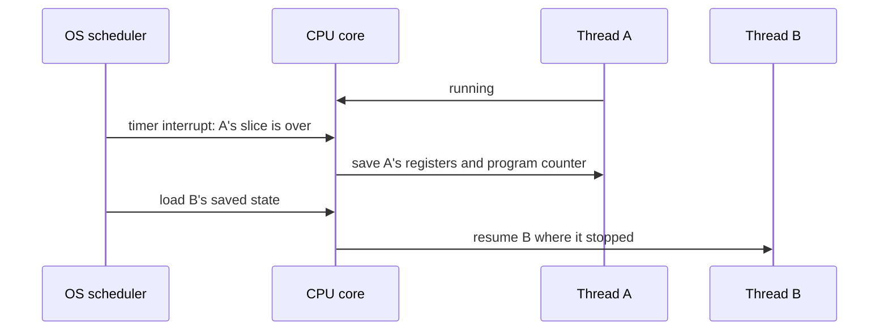
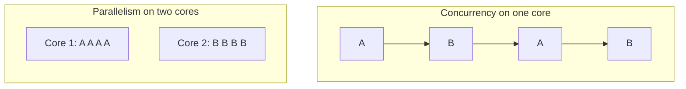

# Multithreading & Concurrency Basics — Processes, Threads and Your First Threads

An order is placed. The app must send an SMS, send an email and work out a delivery estimate. Each call waits on a slow service. If the app makes the calls one after another, their waiting times add up. If it makes them at the same time, the whole job takes about as long as the slowest call. That difference is why threads exist.

This lesson builds the vocabulary first: programs, processes, threads, cores, and the difference between **concurrency** and **parallelism**. Then it uses Java's thread API to run the three notifications side by side, get a result back, and read what each thread is doing.

<div style="border-left:4px solid #195045;background:rgba(25,80,69,0.08);padding:0.6rem 1rem;border-radius:0 0.5rem 0.5rem 0;margin:1.25rem 0">

💡 **The core idea.**

- A **process** is a running program with its own memory. A **thread** is a path of execution inside a process; the threads of one process share its memory.
- **Concurrency** is making progress on several tasks over the same period. **Parallelism** is running them at the same instant, which needs several cores.
- In Java, a `Thread` runs a `Runnable`; `start()` launches it and `join()` waits for it. A `Callable` returns a result through a `Future`.

</div>

This is the first lesson of the concurrency chapter. The chapter is about design. The Java language details (thread states, the memory model, the full thread API) are taught in the Java guide's [Concurrency: the Basics](/synapse/programming-languages/java/advanced/concurrency-the-basics), and this chapter links there instead of repeating them. [Thread Pools & Executors](/synapse/low-level-design/multithreading-concurrency/thread-pools-and-executors) comes next, then [thread safety](/synapse/low-level-design/multithreading-concurrency/thread-safety-and-synchronization), [locks and semaphores](/synapse/low-level-design/multithreading-concurrency/locks-and-semaphores), [deadlock](/synapse/low-level-design/multithreading-concurrency/deadlock) and [producer-consumer](/synapse/low-level-design/multithreading-concurrency/producer-consumer). Every output below was produced by running the code on Java 21 and Python 3.11, on a 4-core machine. Thread scheduling varies, so some outputs are **labeled illustrative**; each shows one real captured run.

**You'll be able to:** say what a process and a thread own, and why threads in the same process can share data without copying it; tell concurrency from parallelism, and predict when threads speed up CPU-bound work in Java but not in CPython; start threads, wait for them, and spot `run()` called instead of `start()`; predict what an uncaught exception in a thread and a daemon thread do to the rest of the program; get a result and an error back from a thread with `Callable` and `Future`; read a thread dump's states when a system hangs.

<div style="border-left:4px solid #15448e;background:rgba(21,68,142,0.08);padding:0.6rem 1rem;border-radius:0 0.5rem 0.5rem 0;margin:1.25rem 0">

📘 **How to read the Intuition boxes.** Each one is built in three moves:

1. **The mechanism** — what the operating system, the JVM or the Python interpreter *do*.
2. **A concrete bite** — a specific, runnable program where the mechanism produces a surprise.
3. **The earned rule** — the decision heuristic, now justified rather than asserted, plus its cost.

</div>

---

## Table of contents

- [Multithreading \& Concurrency Basics — Processes, Threads and Your First Threads](#multithreading--concurrency-basics--processes-threads-and-your-first-threads)
  - [Table of contents](#table-of-contents)
  - [1. Program, process, thread](#1-program-process-thread)
  - [2. Cores, hyperthreading and context switching](#2-cores-hyperthreading-and-context-switching)
  - [3. Concurrency vs parallelism](#3-concurrency-vs-parallelism)
  - [4. Creating threads: `Thread`, `Runnable`, `start` and `join`](#4-creating-threads-thread-runnable-start-and-join)
  - [5. When a thread fails, and daemon threads](#5-when-a-thread-fails-and-daemon-threads)
  - [6. Getting a result back: `Callable` and `Future`](#6-getting-a-result-back-callable-and-future)
  - [7. Thread states, briefly](#7-thread-states-briefly)
  - [8. Threads or processes?](#8-threads-or-processes)
  - [9. Mental-model summary](#9-mental-model-summary)
  - [10. Gotcha checklist](#10-gotcha-checklist)
  - [✅ Check yourself](#-check-yourself)
  - [📚 Sources](#-sources)
  - [Your Turn](#your-turn)

---

## 1. Program, process, thread

Three words that are easy to blur:

- A **program** is instructions on disk: `chrome.exe`, a `.jar`, a `.py` file. It does nothing until it runs.
- A **process** is a running copy of a program. The operating system (OS) gives each process its own private memory, its own open files, and at least one thread. The same program can be running as several processes at once: if you start the same script in two terminals, you get two separate processes that don't share memory.
- A **thread** is one path of execution inside a process. It has its own call stack and its own position in the code. The OS schedules threads, not processes, onto the CPU. All the threads in a process share its memory (the heap, where objects live) and its open files.

A bakery shows the same three ideas. The recipe book is the program: instructions that do nothing on their own. Baking one cake from it is a process. The bakers working on that cake at the same time, one mixing while another heats the oven, are its threads, and they share one kitchen.

```d2
program: "Program\n(on disk)" { shape: rectangle }
process: "Process\n(one running copy)" {
  heap: "Shared heap\nobjects, static fields" { shape: cylinder }
  t1: "Thread main\nown stack" { shape: rectangle }
  t2: "Thread worker-1\nown stack" { shape: rectangle }
  t1 -> heap: "reads/writes"
  t2 -> heap: "reads/writes"
}
program -> process: "run"
```

A program can check this for itself. The code below prints its process id (pid) from two different threads. The pid is the same; only the thread name differs.

```java run
import java.io.IOException;
import java.nio.file.Files;
import java.nio.file.Path;
import java.util.HashSet;
import java.util.Set;

public class Main {
    public static void main(String[] args) throws Exception {
        System.out.println("logical CPUs (availableProcessors): " + Runtime.getRuntime().availableProcessors());
        System.out.println("physical cores: " + physicalCores());
    }

    // Java has no standard API for this, so ask the operating system.
    static String physicalCores() throws IOException, InterruptedException {
        String os = System.getProperty("os.name").toLowerCase();
        if (os.contains("mac")) {
            return run("sysctl", "-n", "hw.physicalcpu");
        }
        if (os.contains("win")) {
            return run("powershell", "-NoProfile", "-Command",
                    "(Get-CimInstance Win32_Processor | Measure-Object -Property NumberOfCores -Sum).Sum");
        }
        // Linux: count distinct (physical id, core id) pairs in /proc/cpuinfo.
        Set<String> cores = new HashSet<>();
        String physicalId = "0";
        for (String line : Files.readAllLines(Path.of("/proc/cpuinfo"))) {
            if (line.startsWith("physical id")) physicalId = line.split(":")[1].trim();
            if (line.startsWith("core id")) cores.add(physicalId + "/" + line.split(":")[1].trim());
        }
        return String.valueOf(cores.size());
    }

    static String run(String... command) throws IOException, InterruptedException {
        Process p = new ProcessBuilder(command).redirectErrorStream(true).start();
        String out = new String(p.getInputStream().readAllBytes()).trim();
        p.waitFor();
        return out;
    }
}
```

```python run
import os
import platform
import subprocess

def run(*command):
    # stdout=subprocess.PIPE and stderr=subprocess.STDOUT
    # perfectly mirrors Java's redirectErrorStream(true)
    result = subprocess.run(command, stdout=subprocess.PIPE, stderr=subprocess.STDOUT, text=True)
    return result.stdout.strip()

def physical_cores():
    os_name = platform.system().lower()

    if os_name == "darwin":  # macOS
        return run("sysctl", "-n", "hw.physicalcpu")

    if os_name == "windows":
        return run("powershell", "-NoProfile", "-Command",
                   "(Get-CimInstance Win32_Processor | Measure-Object -Property NumberOfCores -Sum).Sum")

    # Linux: count distinct (physical id, core id) pairs in /proc/cpuinfo.
    cores = set()
    physical_id = "0"

    with open("/proc/cpuinfo", "r") as f:
        for line in f:
            if line.startswith("physical id"):
                physical_id = line.split(":")[1].strip()
            elif line.startswith("core id"):
                core_id = line.split(":")[1].strip()
                cores.add(f"{physical_id}/{core_id}")

    return str(len(cores))

def main():
    print(f"logical CPUs (availableProcessors): {os.cpu_count()}")
    print(f"physical cores: {physical_cores()}")

if __name__ == "__main__":
    main()
```

**Output** *(illustrative — the pid and core count vary per run and machine; this is one real Java run):*
```
logical CPUs (availableProcessors): 18
physical cores: 14
```

**Analysis.** Both lines report the same `pid`, so `main` and `worker-1` live in one process. Python prints the same shape, with `MainThread` as the first thread's name. Because they are in one process, both threads see the same objects: a list built by one is readable by the other with no copying.

**Intuition.**
*Mechanism.* The JVM's heap "is shared among all Java Virtual Machine threads", while each thread gets its own stack <abbr title="The Java Virtual Machine Specification, Java SE 21, §2.5.2 and §2.5.3">[1]</abbr>. A Java `Thread` built with `new Thread(…)` is a **platform thread**, normally one OS thread underneath <abbr title="Java SE 21 API, java.lang.Thread">[2]</abbr>.

*Concrete bite.* Shared memory is both useful and risky. Passing data between threads costs nothing, but two threads *changing* the same data at the same time can corrupt it: [Thread Safety & Synchronization](/synapse/low-level-design/multithreading-concurrency/thread-safety-and-synchronization) shows a counter losing most of its updates.

<div style="border-left:4px solid #195045;background:rgba(25,80,69,0.08);padding:0.6rem 1rem;border-radius:0 0.5rem 0.5rem 0;margin:1.25rem 0">

💡 **Earned rule.** Picture each thread with its own stack, sharing one heap with every other thread in the process. Any object that two threads can reach needs a plan: which thread may change it, and when.

The cost is that you can no longer understand one thread by reading its code alone. The benefit is cheap communication between threads, which is why most concurrent servers run many threads inside one process.

</div>

---

## 2. Cores, hyperthreading and context switching

A **core** is a physical unit that executes instructions. One core runs one thread's instructions at a time, so a 4-core CPU can run 4 threads at the same instant.

A program can ask how many cores it has: `Runtime.getRuntime().availableProcessors()` in Java, or `os.cpu_count()` in Python. Both return the number of cores that the operating system reports, which includes logical cores (explained under hyperthreading, below). The machine used for this lesson reports 4; that is the `cores available: 4` line printed by the first program in section 1.

**Hyperthreading** is Intel's name for **simultaneous multithreading** (SMT). One physical core keeps two sets of thread state (registers, program counter), so the OS sees two *logical* cores. Both threads feed instructions into the core's one set of execution units. When one thread stalls, for example waiting on memory, the other keeps the units busy.

```d2
cpu: "One physical core with SMT" {
  a: "Logical core A\nregisters, program counter" { shape: rectangle }
  b: "Logical core B\nregisters, program counter" { shape: rectangle }
  units: "Shared: execution units, caches" { shape: rectangle }
  a -> units
  b -> units
}
```

<div style="border-left:4px solid #da5233;background:rgba(218,82,51,0.08);padding:0.6rem 1rem;border-radius:0 0.5rem 0.5rem 0;margin:1.25rem 0">

⚠️ **Watch out.** Two logical cores are not two physical cores. They share one core's execution units and caches, so the gain depends on the workload and is usually well below 2×. Core counts reported by the OS include logical cores.

</div>

There are almost always more threads than cores. The OS **scheduler** shares the cores by **context switching**:

1. A thread runs until its time slice ends, it blocks (on I/O, a lock or `sleep`), or a higher-priority thread needs the core.
2. The OS saves the thread's state: registers, program counter, stack pointer.
3. It loads another thread's saved state.
4. That thread resumes exactly where it stopped.



A switch is not free. Beyond saving and loading registers, the new thread finds the caches full of the old thread's data. With far more busy threads than cores, a CPU spends a growing share of its time switching instead of working.

<div style="border-left:4px solid #195045;background:rgba(25,80,69,0.08);padding:0.6rem 1rem;border-radius:0 0.5rem 0.5rem 0;margin:1.25rem 0">

💡 **Earned rule.** For work that keeps a core busy, having more runnable threads than cores gains nothing. For work that mostly waits (on the network or the disk), more threads than cores is useful, because a waiting thread does not need a core.

The cost of too many threads is memory for their stacks and time lost to switching. [Thread Pools & Executors](/synapse/low-level-design/multithreading-concurrency/thread-pools-and-executors) turns this into a sizing rule.

</div>

---

## 3. Concurrency vs parallelism

- **Concurrency** is about *structure*: several tasks are in progress over the same period. On one core, the scheduler interleaves them.
- **Parallelism** is about *execution*: several tasks run at the same instant, on different cores.

A concurrent program runs in parallel when there are enough cores. A single core can still run a concurrent program, by switching between its tasks.



Concurrency already pays off when tasks *wait*. Here are the three order notifications, run one after another:

```java run
public class Main {
    static void sendSms() throws InterruptedException {
        Thread.sleep(200);  // pretend the SMS gateway takes 200 ms
        System.out.println("SMS sent");
    }

    static void sendEmail() throws InterruptedException {
        Thread.sleep(300);  // the mail server takes 300 ms
        System.out.println("Email sent");
    }

    static void sendEta() throws InterruptedException {
        Thread.sleep(500);  // the routing service takes 500 ms
        System.out.println("ETA sent: 25 minutes");
    }

    public static void main(String[] args) throws InterruptedException {
        long start = System.nanoTime();
        sendSms();
        sendEmail();
        sendEta();
        long ms = (System.nanoTime() - start) / 1_000_000;
        System.out.println("total ~" + Math.round(ms / 100.0) * 100 + " ms");
    }
}
```

```python run
import time


def send_sms() -> None:
    time.sleep(0.2)  # pretend the SMS gateway takes 200 ms
    print("SMS sent")


def send_email() -> None:
    time.sleep(0.3)  # the mail server takes 300 ms
    print("Email sent")


def send_eta() -> None:
    time.sleep(0.5)  # the routing service takes 500 ms
    print("ETA sent: 25 minutes")


start = time.perf_counter()
send_sms()
send_email()
send_eta()
ms = (time.perf_counter() - start) * 1000
print(f"total ~{round(ms / 100) * 100} ms")
```

**Output:**
```
SMS sent
Email sent
ETA sent: 25 minutes
total ~1000 ms
```

The waits add up: 200 + 300 + 500 = 1,000 ms. Section 4 runs the same three calls at the same time and finishes in about 500 ms, the length of the slowest one. That speed-up needs no extra cores. A sleeping thread uses no CPU, so even a single core could overlap the three waits.

CPU-bound work, which keeps the processor busy instead of waiting, is different. It only gets faster if threads run in *parallel*. This program counts prime numbers twice: once on one thread, and once with the range split across four threads:

```java run
public class Main {
    // Deliberately slow, CPU-only work: count the primes in [from, to).
    static int countPrimes(int from, int to) {
        int count = 0;
        for (int n = Math.max(from, 2); n < to; n++) {
            boolean prime = true;
            for (int d = 2; (long) d * d <= n; d++) {
                if (n % d == 0) { prime = false; break; }
            }
            if (prime) count++;
        }
        return count;
    }

    public static void main(String[] args) throws InterruptedException {
        int limit = 4_000_000, parts = 4, chunk = limit / parts;

        long start = System.nanoTime();
        int sequential = countPrimes(0, limit);
        long seqMs = (System.nanoTime() - start) / 1_000_000;

        int[] counts = new int[parts];
        Thread[] threads = new Thread[parts];
        start = System.nanoTime();
        for (int i = 0; i < parts; i++) {
            int part = i;
            threads[i] = new Thread(() -> counts[part] = countPrimes(part * chunk, (part + 1) * chunk));
            threads[i].start();
        }
        for (Thread t : threads) t.join();
        long parMs = (System.nanoTime() - start) / 1_000_000;

        int threaded = 0;
        for (int c : counts) threaded += c;
        System.out.println("primes: " + sequential + " sequential, " + threaded + " with 4 threads");
        System.out.println("1 thread:  " + seqMs + " ms");
        System.out.println("4 threads: " + parMs + " ms");
    }
}
```

```python run
import threading
import time


# Deliberately slow, CPU-only work: count the primes in [start, stop).
def count_primes(start: int, stop: int) -> int:
    count = 0
    for n in range(max(start, 2), stop):
        d = 2
        while d * d <= n:
            if n % d == 0:
                break
            d += 1
        else:
            count += 1
    return count


limit, parts = 200_000, 4
chunk = limit // parts

t0 = time.perf_counter()
sequential = count_primes(0, limit)
seq_ms = (time.perf_counter() - t0) * 1000

counts = [0] * parts


def work(part: int) -> None:
    counts[part] = count_primes(part * chunk, (part + 1) * chunk)


threads = [threading.Thread(target=work, args=(i,)) for i in range(parts)]
t0 = time.perf_counter()
for t in threads:
    t.start()
for t in threads:
    t.join()
par_ms = (time.perf_counter() - t0) * 1000

print(f"primes: {sequential} sequential, {sum(counts)} with 4 threads")
print(f"1 thread:  {seq_ms:.0f} ms")
print(f"4 threads: {par_ms:.0f} ms")
```

**Output (Java)** *(illustrative — timings vary per run; this is one real run on 4 cores):*
```
primes: 283146 sequential, 283146 with 4 threads
1 thread:  925 ms
4 threads: 327 ms
```

**Output (Python)** *(illustrative — this is one real run on the same machine, with a smaller range because CPython is slower):*
```
primes: 17984 sequential, 17984 with 4 threads
1 thread:  267 ms
4 threads: 313 ms
```

**Analysis.** Both languages find the same primes either way. Java's four threads took about a third of the time of one, because they ran on four cores at once. Python's four threads were no faster than one; this run was slightly slower.

**Intuition.**
*Mechanism.* In CPython, a lock called the **Global Interpreter Lock** (GIL) lets only one thread execute Python bytecode at a time <abbr title="Python 3 documentation, threading — Thread-based parallelism">[3]</abbr>. Threads still interleave, and a thread that sleeps or waits on I/O releases the GIL, so I/O-bound work overlaps well. CPU-bound Python code gets concurrency without parallelism.

*Concrete bite.* The Python timings above show it. Splitting pure-Python computation across threads adds the cost of switching between them, but no extra cores to run on. For CPU parallelism, Python uses separate processes (`multiprocessing`, or `ProcessPoolExecutor`), each with its own interpreter and GIL.

<div style="border-left:4px solid #15448e;background:rgba(21,68,142,0.08);padding:0.6rem 1rem;border-radius:0 0.5rem 0.5rem 0;margin:1.25rem 0">

📘 **Python's threading model in this chapter.** The Python examples mirror the Java designs so you can compare the coordination tools. They show the same *correctness* behaviour. They are not a claim that the *performance* matches: CPU-bound Python threads do not run in parallel.

</div>

<div style="border-left:4px solid #195045;background:rgba(25,80,69,0.08);padding:0.6rem 1rem;border-radius:0 0.5rem 0.5rem 0;margin:1.25rem 0">

💡 **Earned rule.** Ask what the threads will spend their time doing. If they mostly wait for I/O, threads help in both languages, even on one core. If they mostly compute, threads help in Java up to the number of cores; in CPython, use processes instead.

Getting this wrong gives you threads that add complexity but no speed.

</div>

---

## 4. Creating threads: `Thread`, `Runnable`, `start` and `join`

A `Thread` runs a **task**: the code in a `run()` method. There are three ways to supply it, and they behave the same:

```java run
// Style 1: the task IS a thread (subclass Thread, override run).
class SmsThread extends Thread {
    @Override
    public void run() {
        System.out.println("SMS sent on " + getName());
    }
}

// Style 2: the task is a Runnable, handed to a Thread.
class EmailTask implements Runnable {
    @Override
    public void run() {
        System.out.println("Email sent on " + Thread.currentThread().getName());
    }
}

public class Main {
    public static void main(String[] args) throws InterruptedException {
        Thread sms = new SmsThread();
        sms.setName("sms-thread");

        Thread email = new Thread(new EmailTask(), "email-thread");

        // Style 3: a lambda is a Runnable, so no class is needed at all.
        Thread eta = new Thread(() -> System.out.println("ETA sent on " + Thread.currentThread().getName()),
                "eta-thread");

        for (Thread t : new Thread[] {sms, email, eta}) {
            t.start();
            t.join();  // one at a time, so the output order is fixed
        }
    }
}
```

```python run
import threading


# Style 1: the task IS a thread (subclass Thread, override run).
class SmsThread(threading.Thread):
    def run(self) -> None:
        print(f"SMS sent on {self.name}")


# Style 2: the task is a callable, handed to a Thread.
def send_email() -> None:
    print(f"Email sent on {threading.current_thread().name}")


sms = SmsThread(name="sms-thread")
email = threading.Thread(target=send_email, name="email-thread")
# Style 3: a lambda works too.
eta = threading.Thread(target=lambda: print(f"ETA sent on {threading.current_thread().name}"),
                       name="eta-thread")

for t in (sms, email, eta):
    t.start()
    t.join()  # one at a time, so the output order is fixed
```

**Output:**
```
SMS sent on sms-thread
Email sent on email-thread
ETA sent on eta-thread
```

Subclassing `Thread` ties the task to one way of running it: the code can only ever run as that thread. A `Runnable` describes only the task, so the same code can later be handed to a thread pool instead. A lambda works as a `Runnable` because `Runnable` has a single method. Prefer the `Runnable` styles.

Now the notifications, side by side. `start()` launches each thread and returns at once; `join()` waits for a thread to finish:

```java run
public class Main {
    static void pause(long ms) {
        try {
            Thread.sleep(ms);
        } catch (InterruptedException e) {
            Thread.currentThread().interrupt();
        }
    }

    public static void main(String[] args) throws InterruptedException {
        long start = System.nanoTime();

        Thread sms = new Thread(() -> { pause(200); System.out.println("SMS sent"); });
        Thread email = new Thread(() -> { pause(300); System.out.println("Email sent"); });
        Thread eta = new Thread(() -> { pause(500); System.out.println("ETA sent: 25 minutes"); });

        sms.start();
        email.start();
        eta.start();
        System.out.println("all three started");

        sms.join();
        email.join();
        eta.join();
        long ms = (System.nanoTime() - start) / 1_000_000;
        System.out.println("total ~" + Math.round(ms / 100.0) * 100 + " ms");
    }
}
```

```python run
import threading
import time


def send(label: str, seconds: float) -> None:
    time.sleep(seconds)
    print(label)


start = time.perf_counter()

sms = threading.Thread(target=send, args=("SMS sent", 0.2))
email = threading.Thread(target=send, args=("Email sent", 0.3))
eta = threading.Thread(target=send, args=("ETA sent: 25 minutes", 0.5))

sms.start()
email.start()
eta.start()
print("all three started")

sms.join()
email.join()
eta.join()
ms = (time.perf_counter() - start) * 1000
print(f"total ~{round(ms / 100) * 100} ms")
```

**Output:**
```
all three started
SMS sent
Email sent
ETA sent: 25 minutes
total ~500 ms
```

**Analysis.** `all three started` printed first: `start()` did not wait for any task. The three tasks then slept at the same time, so they finished in order of their delays, and the total was about 500 ms instead of 1,000. The three `join()` calls made `main` wait for all of them before printing the total.

**Intuition.**
*Mechanism.* `start()` asks the JVM to create a new thread, and that thread calls `run()`. The scheduler decides when each thread runs. The order between threads is not guaranteed unless you coordinate them. Here, the different sleep lengths fixed the order of the three lines, and `join()` made `main` print its total last.

*Concrete bite.* `run()` and `start()` are different methods. Calling `t.run()` is an ordinary method call on the *current* thread, and no new thread is created. The program still produces the right output, just one task after another, which is why this mistake often survives code review. The Java guide [runs this mistake](/synapse/programming-languages/java/advanced/concurrency-the-basics), and also shows what happens when a thread is started twice.

Python has one extra trap. `Thread.run()` throws away the thread's target after running it, so calling `start()` on the same object afterwards fails. Create a new `Thread` instead.

<div style="border-left:4px solid #195045;background:rgba(25,80,69,0.08);padding:0.6rem 1rem;border-radius:0 0.5rem 0.5rem 0;margin:1.25rem 0">

💡 **Earned rule.** Write the task as a `Runnable` (usually a lambda), call `start()` exactly once per thread, and `join()` every thread whose work you depend on.

The cost is that you now own the coordination: what runs when, and who waits for whom. In real code you will rarely create threads by hand; [executors](/synapse/low-level-design/multithreading-concurrency/thread-pools-and-executors) do it for you.

</div>

---

## 5. When a thread fails, and daemon threads

Starting a thread and never checking on it is called **fire-and-forget**. Two behaviours decide whether that is safe: what happens when the thread throws, and whether the program waits for it.

```java run
public class Main {
    public static void main(String[] args) throws InterruptedException {
        Thread sms = new Thread(() -> {
            throw new IllegalStateException("SMS gateway down");
        }, "sms-thread");

        sms.start();
        sms.join();
        System.out.println("main is still running: order #42 confirmed");
    }
}
```

```python run
import threading


def send_sms() -> None:
    raise RuntimeError("SMS gateway down")


# Print just the thread name and the error, instead of the full traceback.
threading.excepthook = lambda args: print(
    f"Exception in thread {args.thread.name}: {args.exc_type.__name__}: {args.exc_value}")

sms = threading.Thread(target=send_sms, name="sms-thread")
sms.start()
sms.join()
print("main is still running: order #42 confirmed")
```

**Output (Java):**
```
Exception in thread "sms-thread" java.lang.IllegalStateException: SMS gateway down
	at Main.lambda$main$0(Main.java:4)
	at java.base/java.lang.Thread.run(Thread.java:1583)
main is still running: order #42 confirmed
```

**Output (Python)** *(the hook above shortens the default traceback to one line):*
```
Exception in thread sms-thread: RuntimeError: SMS gateway down
main is still running: order #42 confirmed
```

**Analysis.** The SMS thread died with an exception. The JVM printed its stack trace, and `main` carried on and confirmed the order. Nothing told `main` that the SMS never went out. In Python the default hook prints a traceback for the failed thread, and the main thread also continues.

**Intuition.**
*Mechanism.* An uncaught exception ends only the thread it was thrown in. The JVM passes it to the thread's **uncaught exception handler**, which by default prints it to standard error <abbr title="Java SE 21 API, java.lang.Thread.UncaughtExceptionHandler">[2]</abbr>. Other threads, and the process, keep running.

*Concrete bite.* This contradicts a common claim, that "a crash in one thread brings down the others". An *exception* stays inside its thread. That is exactly the danger: the failure is easy to miss. What does stop every thread is a failure of the whole *process*, such as a call to `System.exit`, running out of memory, or a crash in native code.

The second behaviour is **daemon threads**. The JVM exits when every non-daemon thread has finished <abbr title="Java SE 21 API, java.lang.Thread, daemon threads">[2]</abbr>. A daemon thread does not keep the program alive:

```java run
public class Main {
    public static void main(String[] args) throws InterruptedException {
        Thread audit = new Thread(() -> {
            try {
                Thread.sleep(500);
            } catch (InterruptedException e) {
                return;
            }
            System.out.println("audit log written");  // never printed
        }, "audit-thread");
        audit.setDaemon(true);  // "don't keep the program alive for me"
        audit.start();

        Thread.sleep(100);
        System.out.println("main done");
    }
}
```

```python run
import threading
import time


def write_audit_log() -> None:
    time.sleep(0.5)
    print("audit log written")  # never printed


audit = threading.Thread(target=write_audit_log, name="audit-thread", daemon=True)
audit.start()

time.sleep(0.1)
print("main done")
```

**Output:**
```
main done
```

`main` finished after 100 ms, and the program exited without waiting for the audit task, which needed 500 ms. The audit line never printed. Python's `daemon=True` behaves the same <abbr title="Python 3 documentation, threading — Thread objects, daemon">[3]</abbr>. A normal (non-daemon) thread would have kept the program running until the audit log was written.

<div style="border-left:4px solid #195045;background:rgba(25,80,69,0.08);padding:0.6rem 1rem;border-radius:0 0.5rem 0.5rem 0;margin:1.25rem 0">

💡 **Earned rule.** Use fire-and-forget only for work whose failure you can afford to miss. For anything else, keep a handle to the task (a `Future`, explained in the next section) and check it, or catch and log errors inside the task. Make a thread a daemon only if it is acceptable to lose its work when the program exits.

Checking costs a few extra lines of code. Not checking costs silent data loss: an SMS that was never sent, an audit line that was never written.

</div>

---

## 6. Getting a result back: `Callable` and `Future`

`Runnable.run()` returns `void` and cannot throw checked exceptions. A **`Callable<V>`** is the task that returns a `V` and may throw <abbr title="Java SE 21 API, java.util.concurrent.Callable">[4]</abbr>. You hand it to an `ExecutorService`, which gives back a **`Future<V>`**: a handle to a result that may not exist yet <abbr title="Java SE 21 API, java.util.concurrent.Future">[5]</abbr>.

```java run
import java.util.concurrent.*;

public class Main {
    public static void main(String[] args) throws InterruptedException {
        ExecutorService executor = Executors.newFixedThreadPool(2);

        Callable<String> calculateEta = () -> {
            Thread.sleep(300);
            return "25 minutes";
        };
        Callable<String> brokenEta = () -> {
            throw new IllegalStateException("routing service down");
        };

        Future<String> eta = executor.submit(calculateEta);
        Future<String> broken = executor.submit(brokenEta);
        System.out.println("submitted; isDone = " + eta.isDone());

        try {
            System.out.println("ETA: " + eta.get());  // blocks until the result is ready
            System.out.println("isDone = " + eta.isDone());
            broken.get();
        } catch (ExecutionException e) {
            System.out.println("get() threw " + e.getClass().getSimpleName());
            System.out.println("cause: " + e.getCause());
        } finally {
            executor.shutdown();
        }
    }
}
```

```python run
import time
from concurrent.futures import ThreadPoolExecutor


def calculate_eta() -> str:
    time.sleep(0.3)
    return "25 minutes"


def broken_eta() -> str:
    raise RuntimeError("routing service down")


with ThreadPoolExecutor(max_workers=2) as executor:
    eta = executor.submit(calculate_eta)
    broken = executor.submit(broken_eta)
    print("submitted; done =", eta.done())

    try:
        print("ETA:", eta.result())  # blocks until the result is ready
        print("done =", eta.done())
        broken.result()
    except RuntimeError as e:
        print("result() raised", type(e).__name__)
        print("message:", e)
```

**Output (Java):**
```
submitted; isDone = false
ETA: 25 minutes
isDone = true
get() threw ExecutionException
cause: java.lang.IllegalStateException: routing service down
```

**Output (Python):**
```
submitted; done = False
ETA: 25 minutes
done = True
result() raised RuntimeError
message: routing service down
```

**Analysis.** `submit()` returned at once, before the task was done. `get()` then made `main` wait until the ETA was ready, and returned `"25 minutes"`. The broken task's exception did not disappear, the way the SMS thread's exception did in section 5. The `Future` stored it, and `get()` threw it to the caller.

**Intuition.**
*Mechanism.* A `Future` holds either a value or the exception the task threw. Java's `get()` wraps the exception in an `ExecutionException`; the original is its `getCause()` <abbr title="Java SE 21 API, java.util.concurrent.ExecutionException">[6]</abbr>. Python's `result()` re-raises the original exception directly <abbr title="Python 3 documentation, concurrent.futures — Future objects">[7]</abbr>.

*Concrete bite.* `get()` waits for the task to finish. Calling it straight after each `submit()` turns concurrent code back into sequential code. Submit all the tasks first, do any other work, and call `get()` only when you need the value.

You can also run a `Callable` on a plain `Thread` by wrapping it in a `FutureTask`, which is both a `Runnable` and a `Future` <abbr title="Java SE 21 API, java.util.concurrent.FutureTask">[8]</abbr>. In practice an executor does that wrapping for you. Python has no `FutureTask`: `executor.submit()` already returns a `Future` for any callable.

<div style="border-left:4px solid #195045;background:rgba(25,80,69,0.08);padding:0.6rem 1rem;border-radius:0 0.5rem 0.5rem 0;margin:1.25rem 0">

💡 **Earned rule.** When the caller needs a result or needs to know about a failure, use a `Callable` and keep its `Future`. Call `get()` late, and handle `ExecutionException` (its cause is the real error).

The cost is that `get()` waits, and without a timeout it can wait forever. `get(timeout, unit)` sets a limit on the wait.

</div>

---

## 7. Thread states, briefly

A Java thread is always in one of six states, the constants of `Thread.State` <abbr title="Java SE 21 API, java.lang.Thread.State">[9]</abbr>: `NEW`, `RUNNABLE`, `BLOCKED` (waiting for a monitor another thread holds), `WAITING` (no time limit, as in `join()`), `TIMED_WAITING` (as in `sleep(ms)`) and `TERMINATED`. There is no separate `RUNNING` state: `RUNNABLE` covers both running on a core and ready to run.

In design work, the states matter most when a system hangs. A thread dump (`jstack <pid>` or `jcmd <pid> Thread.print`) lists every thread's state: `BLOCKED` threads wait for a lock, `WAITING` threads wait for another thread to act. The Java guide's [Concurrency: the Basics, section 2](/synapse/programming-languages/java/advanced/concurrency-the-basics) puts a thread into each state and draws the transitions. Python's `threading` has no state enum; `is_alive()` only tells you whether a thread has started and not yet finished.

---

## 8. Threads or processes?

| | Process | Thread |
|---|---|---|
| Memory | its own address space, isolated | shares its process's heap |
| Talking to others | inter-process communication: pipes, sockets, shared files | read and write the same objects |
| Cost to create and switch | higher | lower |
| A bug that corrupts memory | stays in that process | can corrupt data every thread uses |
| A crash of the whole process | other processes survive | every thread dies with it |

Two real systems, each choosing deliberately:

- **Chrome** runs tabs in separate renderer **processes**, not threads, so a misbehaving page can crash its own tab without taking down the browser, and a sandboxed renderer cannot read another site's memory <abbr title="The Chromium Projects, Multi-process Architecture">[10]</abbr>.
- **PostgreSQL** serves each client connection with its own server **process** <abbr title="PostgreSQL documentation, How Connections Are Established">[11]</abbr>. Most Java web servers serve each request on a **thread** from a pool.

Choose **threads** when tasks share data, communicate often, and are part of one program's logic: handling requests in a server, keeping a UI responsive while work runs in the background. Choose **processes** when you need isolation:

- **Fault isolation:** one task crashing or leaking memory must not take the others down.
- **Security boundaries:** untrusted code (a web page, a plugin) must not read the rest of memory.
- **Resource limits:** the OS can cap a process's memory and CPU.
- **Different runtimes:** a Python worker beside a Java service.
- **CPU parallelism in CPython**, because of the GIL (see section 3, *Concurrency vs parallelism*).

<div style="border-left:4px solid #195045;background:rgba(25,80,69,0.08);padding:0.6rem 1rem;border-radius:0 0.5rem 0.5rem 0;margin:1.25rem 0">

💡 **Earned rule.** Default to threads inside one process for work that shares data. Reach for separate processes when a failure, a memory leak or a security breach in one task must not reach the others.

The cost of processes is slower communication, because data must be copied between them. The cost of threads is that they are not protected from each other: because they share memory, a bug in one thread can corrupt data that all of them use.

</div>

---

## 9. Mental-model summary

| Principle | Consequence |
|---|---|
| A process owns its memory; its threads share the heap, and each thread has its own stack | Passing data between threads is free; changing shared data needs coordination |
| One core runs one thread at a time; SMT shares one core between two logical cores | Core counts include logical cores; SMT gains are well below 2× |
| The scheduler shares cores by context switching | With many more busy threads than cores, time is wasted on switching |
| Concurrency is overlapping tasks; parallelism is running them at the same instant | Waiting tasks overlap even on one core; CPU-bound tasks need cores |
| CPython's GIL runs one thread's bytecode at a time | CPU-bound Python threads don't speed up; use processes |
| `start()` creates a thread; `run()` is a plain call; `join()` waits | `run()` instead of `start()` silently runs sequentially |
| An uncaught exception ends only its own thread | `main` carries on, unaware; check results or catch inside the task |
| The JVM exits when all non-daemon threads finish | A daemon thread's unfinished work is dropped at exit |
| `Callable` + `Future` return a value or the task's exception | Java wraps it in `ExecutionException`; Python re-raises it |
| Six states: `NEW`, `RUNNABLE`, `BLOCKED`, `WAITING`, `TIMED_WAITING`, `TERMINATED` | There is no `RUNNING` state; a thread dump shows what each thread waits for |

## 10. Gotcha checklist

<div style="border-left:4px solid #da5233;background:rgba(218,82,51,0.08);padding:0.6rem 1rem;border-radius:0 0.5rem 0.5rem 0;margin:1.25rem 0">

| Symptom | Likely cause | Fix |
|---|---|---|
| The task ran on `main`; the thread is still `NEW` | `run()` was called instead of `start()` | call `start()` |
| `IllegalThreadStateException` from `start()` | the same `Thread` was started twice | create a new `Thread`, or use an executor |
| Python: `AttributeError: … '_target'` after `run()` then `start()` | `run()` used up the thread's target | create a fresh `Thread` |
| Threads made CPU-bound Python code no faster | the GIL runs one thread's bytecode at a time | use `ProcessPoolExecutor` or `multiprocessing` |
| A stack trace appears, but the program carries on as if all is well | an uncaught exception ended only its own thread | catch inside the task, or keep and check a `Future` |
| Work in a background thread is silently missing at exit | it was a daemon thread | make it non-daemon, or `join()` it before exit |
| `get()` throws `ExecutionException` | the task threw | handle `e.getCause()`, the real error |
| A "concurrent" program takes as long as the sequential one | `get()` or `join()` right after each `start()`/`submit()` | start everything first, wait last |
| A thread dump shows threads `BLOCKED` for a long time | they wait for a lock another thread holds | find the holder; see [Deadlock](/synapse/low-level-design/multithreading-concurrency/deadlock) |

</div>

---

## ✅ Check yourself

One check per objective. Answer before you open anything.

```quiz
{"prompt": "Two threads in the same process each hold a reference to the same ArrayList. Can one thread see elements the other added?", "options": ["Yes: threads of one process share the heap", "No: each thread has its own copy of every object", "Only if the list is passed through a pipe"], "answer": "Yes: threads of one process share the heap"}
```

```quiz
{"prompt": "A CPU-bound pure-Python function is split across 4 threads on a 4-core machine (CPython 3.11). Roughly how does the run time compare with 1 thread?", "options": ["About the same, or a little slower", "About 4 times faster", "About 2 times faster"], "answer": "About the same, or a little slower"}
```

```quiz
{"prompt": "Thread t = new Thread(() -> System.out.println(Thread.currentThread().getName()), \"w\"); t.run(); What does it print?", "options": ["w", "main", "Nothing: the thread was never started"], "answer": "main"}
```

```quiz
{"prompt": "A non-daemon worker thread throws an uncaught RuntimeException while main is still running. What happens?", "options": ["The worker's stack trace is printed and main keeps running", "The whole program exits with an error", "main receives the exception at its next line"], "answer": "The worker's stack trace is printed and main keeps running"}
```

```quiz
{"prompt": "A Callable submitted to an ExecutorService throws IllegalStateException. What does future.get() do?", "options": ["Throws ExecutionException whose cause is the IllegalStateException", "Returns null", "Throws the IllegalStateException directly"], "answer": "Throws ExecutionException whose cause is the IllegalStateException"}
```

```quiz
{"prompt": "Thread B is inside a 5-second Thread.sleep(). What does B.getState() return?", "options": ["TIMED_WAITING", "WAITING", "BLOCKED"], "answer": "TIMED_WAITING"}
```

<details>
<summary>The 🧪 box below: sequential vs threaded totals, the effect of one <code>join()</code> moved, and a daemon thread's last line.</summary>

1. One after another: 400 + 400 + 400 = about 1,200 ms. With three threads started together and joined at the end: about 400 ms, because the waits overlap.
2. If each `join()` comes straight after its `start()`, each thread finishes before the next starts. The total goes back to about 1,000 ms: the code uses threads, but the tasks still run one after another.
3. The line prints only if the daemon finishes before `main` does. With `main` ending after 100 ms and the daemon sleeping 500 ms, it never prints. Make the thread non-daemon, or `join()` it, and it does.

</details>

---

## 📚 Sources

1. *The Java Virtual Machine Specification, Java SE 21*, §2.5.2 "Java Virtual Machine Stacks" and §2.5.3 "Heap" — <https://docs.oracle.com/javase/specs/jvms/se21/html/jvms-2.html#jvms-2.5>
2. `java.lang.Thread`, Java SE 21 API (platform threads, daemon threads, `start()`, `join()`, `interrupt()`, `UncaughtExceptionHandler`) — <https://docs.oracle.com/en/java/javase/21/docs/api/java.base/java/lang/Thread.html>
3. Python 3 documentation, `threading` — Thread-based parallelism (the GIL note; daemon threads) — <https://docs.python.org/3/library/threading.html>
4. `java.util.concurrent.Callable`, Java SE 21 API — <https://docs.oracle.com/en/java/javase/21/docs/api/java.base/java/util/concurrent/Callable.html>
5. `java.util.concurrent.Future`, Java SE 21 API — <https://docs.oracle.com/en/java/javase/21/docs/api/java.base/java/util/concurrent/Future.html>
6. `java.util.concurrent.ExecutionException`, Java SE 21 API — <https://docs.oracle.com/en/java/javase/21/docs/api/java.base/java/util/concurrent/ExecutionException.html>
7. Python 3 documentation, `concurrent.futures` — Future objects — <https://docs.python.org/3/library/concurrent.futures.html#future-objects>
8. `java.util.concurrent.FutureTask`, Java SE 21 API — <https://docs.oracle.com/en/java/javase/21/docs/api/java.base/java/util/concurrent/FutureTask.html>
9. `java.lang.Thread.State`, Java SE 21 API — <https://docs.oracle.com/en/java/javase/21/docs/api/java.base/java/lang/Thread.State.html>
10. The Chromium Projects, "Multi-process Architecture" — <https://www.chromium.org/developers/design-documents/multi-process-architecture/>
11. PostgreSQL documentation, "How Connections Are Established" — <https://www.postgresql.org/docs/current/connect-estab.html>

---

<div style="border-left:4px solid #6d28d9;background:rgba(109,40,217,0.08);padding:0.6rem 1rem;border-radius:0 0.5rem 0.5rem 0;margin:1.25rem 0">

🧪 **Predict, then check.**

1. Change all three delays in the notification programs from sections 3 and 4 to 400 ms. Predict the sequential and the threaded totals, then run both.
2. In the threaded version from section 4, move each `join()` to directly after its `start()`. Predict the total.
3. In the daemon program from section 5, predict whether `audit log written` prints. Then remove `setDaemon(true)` (or `daemon=True`) and predict again.

</div>

## Your Turn

Before you move on, check your understanding with the coach — explain the idea, apply it, weigh the trade-offs, then defend your reasoning.

<div class="concept-coach"></div>
