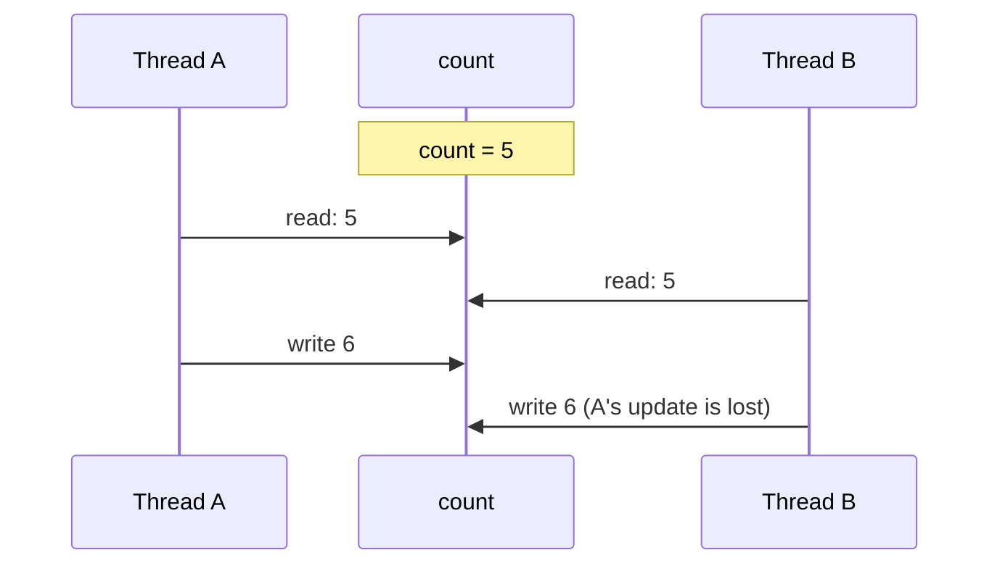

# Thread Safety & Synchronization — Keeping Shared State Correct

A flash sale opens. Five users press "Book" for the last seat at the same moment, and five tickets are sold for one seat. Nothing crashed, and every line of code did exactly what it says. The bug is in the order in which the threads' steps happened to run. It only shows up under heavy load, which is exactly when it is most expensive.

This lesson shows the two shapes such bugs take and the tools that prevent them: `synchronized`, `volatile`, atomic variables and concurrent collections. It ends with the question that matters most in low-level design: which state should be shared between threads at all.

<div style="border-left:4px solid #195045;background:rgba(25,80,69,0.08);padding:0.6rem 1rem;border-radius:0 0.5rem 0.5rem 0;margin:1.25rem 0">

💡 **The core idea.**

- A **race condition** is a bug where the result depends on the order in which threads happen to run. Its two common shapes are the **lost update** (`count++`) and **check-then-act** (`if (seats > 0) seats--`).
- **`synchronized`** lets only one thread at a time run a block of code, *and* makes that block's writes visible to the next thread that takes the same lock. **`volatile`** only makes writes visible. **Atomic** classes update a single variable safely without a lock.
- Often the best fix is not to share the state at all: keep it inside one thread, or make it immutable.

</div>

This builds on [Multithreading & Concurrency Basics](/synapse/low-level-design/multithreading-concurrency/basics-of-multithreading-concurrency), which showed that the threads of one process share its memory. This lesson is about design; the Java guide's [Concurrency: the Basics](/synapse/programming-languages/java/advanced/concurrency-the-basics) and [The Java Memory Model & Performance](/synapse/programming-languages/java/advanced/the-java-memory-model-and-performance) cover the language mechanics. Thread scheduling varies from run to run, so outputs that depend on it are **labeled illustrative**. Each shows one real run, and lists the values other runs printed. Every output was produced on Java 21 and Python 3.11.

**You'll be able to:** say what makes a class thread-safe; explain why an unsynchronized `count++` loses updates and why check-then-act oversells; fix both with `synchronized`, and name the lock a `synchronized` method takes; say what `volatile` guarantees and what it doesn't; use `AtomicInteger` and a compare-and-set loop; pick a thread-safe collection; choose between confinement, immutability and locking.

<div style="border-left:4px solid #15448e;background:rgba(21,68,142,0.08);padding:0.6rem 1rem;border-radius:0 0.5rem 0.5rem 0;margin:1.25rem 0">

📘 **How to read the Intuition boxes.** Each one is built in three moves:

1. **The mechanism** — what the JVM, the CPU or the interpreter *do*.
2. **A concrete bite** — a specific, runnable failure, shown so the trap is visible.
3. **The earned rule** — the decision heuristic, now justified rather than asserted, plus its cost.

</div>

---

## Table of contents

1. [What thread-safe means](#1-what-thread-safe-means)
2. [Race conditions: lost updates and check-then-act](#2-race-conditions-lost-updates-and-check-then-act)
3. [`synchronized` and monitor locks](#3-synchronized-and-monitor-locks)
4. [Visibility and `volatile`](#4-visibility-and-volatile)
5. [Atomic variables and compare-and-set](#5-atomic-variables-and-compare-and-set)
6. [Thread-safe collections](#6-thread-safe-collections)
7. [Designing thread-safe classes](#7-designing-thread-safe-classes)
8. [Mental-model summary](#8-mental-model-summary)
9. [Gotcha checklist](#9-gotcha-checklist)
10. [Check yourself](#-check-yourself)
11. [Sources](#-sources)

---

## 1. What thread-safe means

A class is **thread-safe** if it behaves correctly when used from several threads at once, however the scheduler interleaves them, with no extra coordination from the callers <abbr title="Brian Goetz et al., Java Concurrency in Practice, 2006, §2.1">[1]</abbr>. "Correctly" means it never breaks its own rules: a counter counts every increment, and a show never sells more seats than it has.

Two terms come up throughout this lesson:

- **Atomicity:** a group of steps happens as one indivisible step, so no other thread can see it half done.
- **Visibility:** when one thread writes a value, the other threads actually see the new value.

A thread-safe class needs both for every piece of state that more than one thread can reach.

---

## 2. Race conditions: lost updates and check-then-act

Four buyers increment one purchase counter 100,000 times each:

```java run
// ⚠️ ANTI-PATTERN — shared counter with no synchronization. Do not copy it.
class PurchaseCounter {
    private int count = 0;

    void increment() {
        count++;  // read, add 1, write back: three steps
    }

    int get() {
        return count;
    }
}

public class Main {
    public static void main(String[] args) throws InterruptedException {
        PurchaseCounter counter = new PurchaseCounter();
        Thread[] buyers = new Thread[4];
        for (int i = 0; i < 4; i++) {
            buyers[i] = new Thread(() -> {
                for (int j = 0; j < 100_000; j++) counter.increment();
            });
            buyers[i].start();
        }
        for (Thread t : buyers) t.join();
        System.out.println("expected 400000, got " + counter.get());
    }
}
```

```python run
# ⚠️ ANTI-PATTERN — shared counter with no synchronization. Do not copy it.
import threading
import time


class PurchaseCounter:
    def __init__(self) -> None:
        self.count = 0

    def increment(self) -> None:
        current = self.count       # read
        time.sleep(0)              # let another thread run here, as a preemptive scheduler may
        self.count = current + 1   # write back


counter = PurchaseCounter()


def buy() -> None:
    for _ in range(10_000):
        counter.increment()


buyers = [threading.Thread(target=buy) for _ in range(4)]
for t in buyers:
    t.start()
for t in buyers:
    t.join()
print("expected 40000, got", counter.count)
```

**Output** *(illustrative — the count is wrong and **changes every run**; three more Java runs printed `168973`, `178746`, `273705`):*
```
expected 400000, got 127284
```

**Output (Python)** *(illustrative — three more runs printed `10002`, `10000`, `10006`):*
```
expected 40000, got 10004
```

**Analysis.** Java lost about two-thirds of the 400,000 increments, and a different number each run. `count++` is three steps: read `count`, add one, write it back. When two threads both read `5`, both write `6`, and one increment disappears.



The Python version puts `time.sleep(0)` between the read and the write. That forces a switch to another thread at the worst possible moment, which a real scheduler is allowed to do at any time, so almost every update is lost. Without the `sleep(0)`, three runs of 4 million unprotected `+=` on CPython 3.11 all gave the right answer. That was luck, not safety. The GIL only switches threads at certain points in the bytecode, and Python makes no promise that `+=` is atomic. Since Python 3.13 there are also "free-threaded" builds of CPython that have no GIL at all <abbr title="PEP 703: Making the Global Interpreter Lock Optional in CPython">[2]</abbr>.

The second shape is **check-then-act**: a thread tests a condition and then acts on it, but another thread changes the condition in between. Here, five users try to book one seat:

```java run
// ⚠️ ANTI-PATTERN — check-then-act with no lock. Do not copy it.
class Show {
    private int seatsLeft = 1;
    private int booked = 0;

    boolean book(String user) throws InterruptedException {
        if (seatsLeft > 0) {          // check
            Thread.sleep(50);         // take payment
            seatsLeft--;              // act
            booked++;
            return true;
        }
        return false;
    }

    String summary() {
        return "seats left = " + seatsLeft + ", tickets sold = " + booked;
    }
}

public class Main {
    public static void main(String[] args) throws InterruptedException {
        Show show = new Show();
        Thread[] users = new Thread[5];
        for (int i = 0; i < 5; i++) {
            String user = "user-" + (i + 1);
            users[i] = new Thread(() -> {
                try {
                    if (show.book(user)) System.out.println(user + " got a ticket");
                } catch (InterruptedException e) {
                    Thread.currentThread().interrupt();
                }
            });
            users[i].start();
        }
        for (Thread t : users) t.join();
        System.out.println(show.summary());
    }
}
```

```python run
# ⚠️ ANTI-PATTERN — check-then-act with no lock. Do not copy it.
import threading
import time


class Show:
    def __init__(self) -> None:
        self.seats_left = 1
        self.booked = 0

    def book(self, user: str) -> bool:
        if self.seats_left > 0:   # check
            time.sleep(0.05)      # take payment
            self.seats_left -= 1  # act
            self.booked += 1
            return True
        return False


show = Show()


def try_booking(user: str) -> None:
    if show.book(user):
        print(f"{user} got a ticket\n", end="")


users = [threading.Thread(target=try_booking, args=(f"user-{i}",)) for i in range(1, 6)]
for t in users:
    t.start()
for t in users:
    t.join()
print(f"seats left = {show.seats_left}, tickets sold = {show.booked}")
```

**Output** *(illustrative — the order of the ticket lines varies per run; the totals were the same in every run):*
```
user-1 got a ticket
user-3 got a ticket
user-4 got a ticket
user-5 got a ticket
user-2 got a ticket
seats left = -4, tickets sold = 5
```

**Analysis.** All five users saw `seatsLeft > 0` before any of them decremented it, so all five paid and booked. The show ended with `-4` seats. The 50 ms payment step makes the gap between the check and the act wider, but any gap at all, even a nanosecond, allows the same bug under load.

**Intuition.**
*Mechanism.* Both bugs are compound actions on shared state: an action made of several steps, either read-modify-write or check-then-act. Each step is fine on its own. The bug is that another thread can run *between* the steps.

*Concrete bite.* The same pattern hides in "add it if it isn't there yet" (`if (!map.containsKey(k)) map.put(k, v)`), in creating an object on first use (`if (instance == null) instance = new …`), and in every "if there is stock, take one" step of an inventory or booking system.

<div style="border-left:4px solid #195045;background:rgba(25,80,69,0.08);padding:0.6rem 1rem;border-radius:0 0.5rem 0.5rem 0;margin:1.25rem 0">

💡 **Earned rule.** Find every compound action on shared state (read-modify-write, check-then-act) and make each one atomic. Treat unsynchronized access to shared mutable state as a bug even when tests pass.

The cost is that you must be suspicious of all shared state. The benefit is avoiding bugs that tests miss and production finds.

</div>

---

## 3. `synchronized` and monitor locks

Every Java object has a built-in lock called a **monitor**, which only one thread at a time can hold <abbr title="The Java Language Specification, Java SE 21, §17.1">[3]</abbr>. `synchronized` takes that lock when a thread enters the block and releases it when the thread leaves, even if the code throws an exception. A thread that wants a lock another thread is holding waits, in the `BLOCKED` state.

The fix for the booking bug makes the check and the act a single step:

```java run
class Show {
    private int seatsLeft = 1;
    private int booked = 0;

    // One thread at a time runs check-and-act as a single step.
    synchronized boolean book(String user) throws InterruptedException {
        if (seatsLeft > 0) {
            Thread.sleep(50);  // take payment
            seatsLeft--;
            booked++;
            return true;
        }
        return false;
    }

    synchronized String summary() {
        return "seats left = " + seatsLeft + ", tickets sold = " + booked;
    }
}

public class Main {
    public static void main(String[] args) throws InterruptedException {
        Show show = new Show();
        Thread[] users = new Thread[5];
        for (int i = 0; i < 5; i++) {
            String user = "user-" + (i + 1);
            users[i] = new Thread(() -> {
                try {
                    if (!show.book(user)) System.out.println(user + ": sold out");
                } catch (InterruptedException e) {
                    Thread.currentThread().interrupt();
                }
            });
            users[i].start();
        }
        for (Thread t : users) t.join();
        System.out.println(show.summary());
    }
}
```

```python run
import threading
import time


class Show:
    def __init__(self) -> None:
        self._lock = threading.Lock()
        self.seats_left = 1
        self.booked = 0

    def book(self, user: str) -> bool:
        with self._lock:  # one thread at a time runs check-and-act
            if self.seats_left > 0:
                time.sleep(0.05)  # take payment
                self.seats_left -= 1
                self.booked += 1
                return True
            return False


show = Show()


def try_booking(user: str) -> None:
    if not show.book(user):
        print(f"{user}: sold out\n", end="")  # one write per line, so lines never interleave


users = [threading.Thread(target=try_booking, args=(f"user-{i}",)) for i in range(1, 6)]
for t in users:
    t.start()
for t in users:
    t.join()
print(f"seats left = {show.seats_left}, tickets sold = {show.booked}")
```

**Output** *(illustrative — the order of the sold-out lines varies per run):*
```
user-4: sold out
user-2: sold out
user-3: sold out
user-5: sold out
seats left = 0, tickets sold = 1
```

**Analysis.** One user got the seat; the other four were told it was sold out. The totals are now correct every run. Python has no `synchronized` keyword. Instead, `with self._lock:` takes a `threading.Lock` for the duration of the block and releases it on the way out, even after an exception.

**Intuition.**
*Mechanism.* Which lock does `synchronized` take?

| You write | Lock taken <abbr title="The Java Language Specification, Java SE 21, §8.4.3.6 and §14.19">[4]</abbr> |
|---|---|
| a `synchronized` instance method | the monitor of `this` |
| a `static synchronized` method | the monitor of the class's `Class` object |
| `synchronized (obj) { … }` | the monitor of `obj` |

Threads only keep each other out if they take the *same* lock. A `synchronized` block can lock just the lines that touch shared state. It often locks a private object created for the purpose, `private final Object lock = new Object()`, so that no outside code can take the same lock by accident.

*Concrete bite: the right keyword on the wrong lock.* Three ticket windows each have their own `BookingCounter` object, but the seat count is a `static` field, shared by all of them:

```java run
// ⚠️ ANTI-PATTERN — synchronized on `this` guards nothing shared across instances. Do not copy it.
class BookingCounter {
    static int seatsLeft = 1;   // shared by every counter
    static int sold = 0;

    synchronized boolean book() throws InterruptedException {  // locks THIS counter only
        if (seatsLeft > 0) {
            Thread.sleep(50);
            seatsLeft--;
            sold++;
            return true;
        }
        return false;
    }
}

public class Main {
    public static void main(String[] args) throws InterruptedException {
        Thread[] windows = new Thread[3];
        for (int i = 0; i < 3; i++) {
            BookingCounter counter = new BookingCounter();  // one counter per window
            windows[i] = new Thread(() -> {
                try {
                    counter.book();
                } catch (InterruptedException e) {
                    Thread.currentThread().interrupt();
                }
            });
            windows[i].start();
        }
        for (Thread t : windows) t.join();
        System.out.println("seats left = " + BookingCounter.seatsLeft + ", tickets sold = " + BookingCounter.sold);
    }
}
```

**Output** *(the same in three runs):*
```
seats left = -2, tickets sold = 3
```

Each `book()` call locked *its own* counter object, so the three windows never blocked each other, and the one seat was sold three times. The data belonged to the whole class, but each lock belonged to a single object. Guard `static` state with a `static synchronized` method or a `static final` lock object.

*Reentrancy.* A thread that already holds a monitor can take it again. That is what lets a `synchronized` method call another `synchronized` method on the same object <abbr title="The Java Language Specification, Java SE 21, §17.1">[3]</abbr>:

```java run
class Show {
    private int seatsLeft = 2;

    synchronized boolean book() {
        if (seatsLeft == 0) return false;
        seatsLeft--;
        return true;
    }

    // Holds the lock on `this`, then calls book(), which needs the same lock.
    synchronized boolean bookPair() {
        return book() && book();
    }
}

public class Main {
    public static void main(String[] args) {
        System.out.println("pair booked: " + new Show().bookPair());
    }
}
```

```python run
import threading

plain = threading.Lock()
plain.acquire()
# A second acquire by the SAME thread: a plain Lock does not know who holds it.
print("Lock, acquired again: ", plain.acquire(timeout=1))

reentrant = threading.RLock()
reentrant.acquire()
print("RLock, acquired again:", reentrant.acquire(timeout=1))
```

**Output (Java):**
```
pair booked: true
```

**Output (Python):**
```
Lock, acquired again:  False
RLock, acquired again: True
```

Java's monitors are reentrant, so `bookPair()` could call `book()` twice. Python's plain `Lock` is not reentrant: a second `acquire` by the same thread would wait forever, and with a 1-second timeout it returned `False`. Use `threading.RLock` when a method that holds a lock calls another method that takes the same lock <abbr title="Python 3 documentation, threading, RLock objects">[8]</abbr>.

<div style="border-left:4px solid #195045;background:rgba(25,80,69,0.08);padding:0.6rem 1rem;border-radius:0 0.5rem 0.5rem 0;margin:1.25rem 0">

💡 **Earned rule.** Guard each piece of shared state with exactly one lock, and use that lock for *every* read and write of it. Keep the locked section as short as you can while still correct, and never call code you don't control (callbacks, other objects' methods) while holding a lock.

The cost is waiting: threads queue up for the lock, and the locked section runs one thread at a time. Holding several locks at once risks [deadlock](/synapse/low-level-design/multithreading-concurrency/deadlock).

</div>

---

## 4. Visibility and `volatile`

Atomicity is only half the problem. The other half is **visibility**: a thread may never see a value that another thread wrote. A worker that loops `while (!stop)` on a plain `boolean` can keep looping long after `main` sets `stop = true`, because nothing forces the JIT compiler or the CPU to read the field again. The Java Memory Model only guarantees that one thread sees another thread's write when the two are connected by a **happens-before** relationship <abbr title="The Java Language Specification, Java SE 21, §17.4.5">[5]</abbr>. The common ones are: one thread releases a lock and another later takes the same lock; one thread writes a `volatile` field and another later reads it; `Thread.start()`; and `Thread.join()`.

The Java guide covers this in depth: [The Java Memory Model & Performance, §1](/synapse/programming-languages/java/advanced/the-java-memory-model-and-performance) runs the stop flag that never stops, fixes it with `volatile`, and shows that a `volatile int count; count++` still loses updates. In Python, use a `threading.Event` for a flag shared between threads. It is built for exactly this, and its `wait()` method lets a thread sleep until the flag is set <abbr title="Python 3 documentation, threading, Event objects">[8]</abbr>.

For design, this leads to two rules:

- `volatile` gives visibility, **not atomicity**. It suits a field that one thread writes and other threads only read, where the new value doesn't depend on the old one: a stop flag, or a reference to the current configuration.
- Anything read-modify-write, or any check-then-act, needs a lock or an atomic. Locks and atomics also guarantee visibility, so state that is always accessed under one lock doesn't need `volatile` as well.

<div style="border-left:4px solid #195045;background:rgba(25,80,69,0.08);padding:0.6rem 1rem;border-radius:0 0.5rem 0.5rem 0;margin:1.25rem 0">

💡 **Earned rule.** Every piece of state shared between threads needs a happens-before relationship, provided by a lock, `volatile`, an atomic, or a thread-safe class. Use `volatile` alone only for single-writer flags and references.

`volatile` costs very little. Using it where a lock is needed isn't a cost, though; it's a bug.

</div>

---

## 5. Atomic variables and compare-and-set

`java.util.concurrent.atomic` has classes such as `AtomicInteger`, `AtomicLong`, `AtomicBoolean` and `AtomicReference`. Each one makes updates to a single variable atomic, without a lock:

```java run
import java.util.concurrent.atomic.AtomicInteger;

public class Main {
    static final AtomicInteger likes = new AtomicInteger();

    public static void main(String[] args) throws InterruptedException {
        Thread[] threads = new Thread[4];
        for (int i = 0; i < 4; i++) {
            threads[i] = new Thread(() -> {
                for (int j = 0; j < 100_000; j++) likes.incrementAndGet();
            });
            threads[i].start();
        }
        for (Thread t : threads) t.join();
        System.out.println("expected 400000, got " + likes.get());
    }
}
```

```python run
import threading

# Python has no lock-free atomics in the standard library; a Lock gives the same safety.
lock = threading.Lock()
likes = 0


def like() -> None:
    global likes
    for _ in range(100_000):
        with lock:
            likes += 1


threads = [threading.Thread(target=like) for _ in range(4)]
for t in threads:
    t.start()
for t in threads:
    t.join()
print("expected 400000, got", likes)
```

**Output:**
```
expected 400000, got 400000
```

**Analysis.** All 400,000 increments counted. `incrementAndGet()` is one atomic step. Python's standard library has no lock-free atomic integers, so the Python version protects a plain `int` with a `Lock`. The result is just as correct; only the mechanism differs.

**Intuition.**
*Mechanism.* Atomic classes are built on **compare-and-set** (CAS), a single hardware instruction that means "set the value to *new*, but only if it still equals *expected*" <abbr title="Java SE 21 API, java.util.concurrent.atomic package summary">[6]</abbr>. If another thread changed the value in the meantime, the CAS fails and returns `false`, and the caller reads the value again and retries. No thread ever waits for a lock.

That retry loop lets you write your own atomic check-then-act. Here, ten users compete for three seats:

```java run
import java.util.concurrent.atomic.AtomicInteger;

class Show {
    private final AtomicInteger seatsLeft = new AtomicInteger(3);

    boolean book() {
        while (true) {
            int seen = seatsLeft.get();                    // 1. read
            if (seen == 0) return false;                   // sold out
            if (seatsLeft.compareAndSet(seen, seen - 1)) { // 2. write only if unchanged
                return true;
            }
            // 3. another thread changed it first: loop and re-read
        }
    }

    int seatsLeft() {
        return seatsLeft.get();
    }
}

public class Main {
    public static void main(String[] args) throws InterruptedException {
        Show show = new Show();
        AtomicInteger sold = new AtomicInteger();
        Thread[] users = new Thread[10];
        for (int i = 0; i < 10; i++) {
            users[i] = new Thread(() -> {
                if (show.book()) sold.incrementAndGet();
            });
            users[i].start();
        }
        for (Thread t : users) t.join();
        System.out.println("10 users, 3 seats: tickets sold = " + sold.get() + ", seats left = " + show.seatsLeft());
    }
}
```

**Output:**
```
10 users, 3 seats: tickets sold = 3, seats left = 0
```

**Analysis.** Exactly three seats sold. Each `book()` call read the count and gave up if it was `0`; otherwise it tried to replace the count with one less. If another user's CAS got there first, this one failed, and the loop read the new count and decided again. The check and the act became one atomic step, with no lock. (For simple cases like this, `seatsLeft.getAndUpdate(n -> n > 0 ? n - 1 : 0)` runs the same loop for you.)

*Concrete bite.* An atomic protects *one* variable. Updating two atomics one after the other is not atomic as a whole: another thread can see the first one updated and the second one not yet. Keeping `seatsLeft` and `sold` consistent with each other needs a lock around both, or one object holding both values in an `AtomicReference`.

<div style="border-left:4px solid #195045;background:rgba(25,80,69,0.08);padding:0.6rem 1rem;border-radius:0 0.5rem 0.5rem 0;margin:1.25rem 0">

💡 **Earned rule.** Use atomics for counters, flags, sequence numbers and single-variable state machines. Reach for a lock as soon as an invariant spans two or more variables.

When many threads update the same atomic at once, the cost is retries: many of them fail their CAS and loop. For a counter updated by many threads, `LongAdder` spreads the updates across several internal cells and is faster.

</div>

---

## 6. Thread-safe collections

`HashMap`, `ArrayList` and the other `java.util` collections are not thread-safe. Four threads counting page views in one map:

```java run
import java.util.*;
import java.util.concurrent.*;

public class Main {
    static int count(Map<String, Integer> views) throws InterruptedException {
        Thread[] threads = new Thread[4];
        for (int i = 0; i < 4; i++) {
            threads[i] = new Thread(() -> {
                for (int j = 0; j < 100_000; j++) views.merge("/home", 1, Integer::sum);
            });
            threads[i].start();
        }
        for (Thread t : threads) t.join();
        return views.get("/home");
    }

    public static void main(String[] args) throws InterruptedException {
        System.out.println("HashMap:           " + count(new HashMap<>()));
        System.out.println("ConcurrentHashMap: " + count(new ConcurrentHashMap<>()));
    }
}
```

```python run
import threading
import time
from collections import Counter

# ⚠️ ANTI-PATTERN first: a read-modify-write on a shared dict with no lock.
views: dict[str, int] = {}


def unsafe_view() -> None:
    for _ in range(10_000):
        current = views.get("/home", 0)
        time.sleep(0)  # let another thread run between the read and the write
        views["/home"] = current + 1


lock = threading.Lock()
safe_views: Counter[str] = Counter()


def safe_view() -> None:
    for _ in range(10_000):
        with lock:
            safe_views["/home"] += 1


for target, label, result in ((unsafe_view, "dict, no lock:   ", views),
                              (safe_view, "Counter + Lock:  ", safe_views)):
    threads = [threading.Thread(target=target) for _ in range(4)]
    for t in threads:
        t.start()
    for t in threads:
        t.join()
    print(label, result["/home"])
```

**Output** *(illustrative — the `HashMap` count changes every run; in one of three more runs, a thread also died with `ConcurrentModificationException`):*
```
HashMap:           124340
ConcurrentHashMap: 400000
```

**Output (Python)** *(illustrative — the unlocked count changes every run):*
```
dict, no lock:    10005
Counter + Lock:   40000
```

**Analysis.** The `HashMap` lost most of the views, and in one run its internal checks noticed the corruption and threw. `ConcurrentHashMap.merge()` counted every view: it updates each key atomically <abbr title="Java SE 21 API, java.util.concurrent.ConcurrentHashMap">[7]</abbr>. In Python, a single `dict` operation will not corrupt the dict. But reading a value and then writing it back takes two operations, and updates are lost between them, so the counter needs a lock.

| Need | Use |
|---|---|
| A shared map | `ConcurrentHashMap`, with `merge`, `compute`, `putIfAbsent` for compound updates |
| A list read far more than written (listeners, config) | `CopyOnWriteArrayList` |
| Handing work between threads | a `BlockingQueue` ([Producer-Consumer](/synapse/low-level-design/multithreading-concurrency/producer-consumer)) |
| Wrapping an existing collection | `Collections.synchronizedMap(…)`, but you must still lock it yourself while iterating |

*Concrete bite.* A thread-safe map does not make *your* compound actions safe. `if (!map.containsKey(k)) map.put(k, v)` on a `ConcurrentHashMap` is still a check-then-act race. Write `map.putIfAbsent(k, v)` or `map.computeIfAbsent(k, …)` instead, which do both steps atomically.

---

## 7. Designing thread-safe classes

Locks should be the last resort, not the first. There are three ways to make state safe, and the first two need no locks at all <abbr title="Brian Goetz et al., Java Concurrency in Practice, 2006, ch. 3">[1]</abbr>:

| Strategy | How | Example |
|---|---|---|
| **Don't share it** (confinement) | keep state inside one thread: local variables, one object per request | a request handler's local `StringBuilder` |
| **Don't change it** (immutability) | `final` fields, no setters, return new objects instead of mutating | a `record Money(long cents, String currency)` |
| **Coordinate access** (synchronization) | one lock per invariant, or atomics, or concurrent collections | `Show.book()` in §3 |

In a design interview, or on a real class diagram, state which strategy each class uses. A `ParkingLot` might hold an immutable list of `Floor`s (immutability), give each request its own `Ticket` builder (confinement), and guard each floor's free-spot count with a lock (synchronization). Write it in the class's documentation too, for example: "thread-safe: all access to `spots` is guarded by `lock`".

<div style="border-left:4px solid #195045;background:rgba(25,80,69,0.08);padding:0.6rem 1rem;border-radius:0 0.5rem 0.5rem 0;margin:1.25rem 0">

💡 **Earned rule.** Design so that as little state as possible is both shared and changeable. Share immutable objects freely, keep changeable state inside one thread, and protect whatever is left with one clearly named lock for each rule it must keep.

The cost of immutability is creating new objects instead of changing existing ones. That is cheap compared with a race condition in production.

</div>

---

## 8. Mental-model summary

| Principle | Consequence |
|---|---|
| A race is a result that depends on interleaving | Silent, nondeterministic, often invisible in tests |
| `count++` is read-modify-write | Unsynchronized, it loses updates |
| Check-then-act lets another thread act between the check and the act | Oversold seats, duplicate inserts, double initialisation |
| `synchronized` locks a monitor: `this`, the `Class`, or a named object | Only threads taking the *same* monitor exclude each other |
| Java monitors are reentrant; Python's `Lock` is not | Use `RLock` in Python for nested locking by one thread |
| Visibility needs a happens-before edge | A plain stop flag can be ignored forever; `volatile` or a lock fixes it |
| `volatile` gives visibility, not atomicity | `volatile int count; count++` still loses updates |
| Atomics use compare-and-set on one variable | Lock-free counters and single-variable check-then-act; not multi-variable invariants |
| `java.util` collections are not thread-safe | `ConcurrentHashMap` and friends; compound actions still need atomic methods |
| Confinement and immutability need no locks | Share as little mutable state as possible |

## 9. Gotcha checklist

<div style="border-left:4px solid #da5233;background:rgba(218,82,51,0.08);padding:0.6rem 1rem;border-radius:0 0.5rem 0.5rem 0;margin:1.25rem 0">

| Symptom | Likely cause | Fix |
|---|---|---|
| A shared counter is low, and different each run | unsynchronized `count++` | `AtomicInteger`, or `synchronized` around the update |
| More bookings than seats; negative stock | check-then-act without a lock | make check and act one atomic step |
| `synchronized` "didn't help" | threads lock different monitors (e.g. `this` guarding `static` data) | use one lock for each piece of state |
| A loop never sees a flag set by another thread | no happens-before edge | make the flag `volatile`, or use `Event` in Python |
| `volatile` counter still loses updates | `volatile` is not atomic | use an atomic or a lock |
| Python thread hangs re-acquiring a lock it holds | `threading.Lock` is not reentrant | `threading.RLock` |
| `HashMap` counts wrong, or `ConcurrentModificationException` | a `java.util` collection shared between threads | `ConcurrentHashMap` with `merge`/`compute` |
| Two atomics disagree with each other | each is atomic alone, not together | one lock around both, or one immutable object in an `AtomicReference` |
| "It never fails in tests" | races depend on timing and load | reason about every shared field; don't rely on tests alone |

</div>

---

## ✅ Check yourself

One check per objective. Answer before you open anything.

```quiz
{"prompt": "Which property must a thread-safe class keep, however its callers' threads interleave?", "options": ["Its own invariants, with no extra coordination from callers", "Only that it never throws", "That its methods run in the order they were called"], "answer": "Its own invariants, with no extra coordination from callers"}
```

```quiz
{"prompt": "Five threads run if (seatsLeft > 0) { pay(); seatsLeft--; } on a shared show with 1 seat, with no lock. What can seatsLeft end as?", "options": ["Below 0", "Always exactly 0", "Always 1"], "answer": "Below 0"}
```

```quiz
{"prompt": "A synchronized instance method updates a static field, and each thread calls it on its own instance. Is the static field protected?", "options": ["No: each call locks a different object", "Yes: synchronized always locks the class", "Yes, but only for reads"], "answer": "No: each call locks a different object"}
```

```quiz
{"prompt": "count is declared volatile int. Four threads each run count++ 100,000 times. What is printed?", "options": ["Usually less than 400000", "Always 400000", "It does not compile"], "answer": "Usually less than 400000"}
```

```quiz
{"prompt": "compareAndSet(5, 4) is called on an AtomicInteger whose value another thread just changed to 3. What happens?", "options": ["It returns false and the value stays 3", "It sets the value to 4", "It blocks until the value is 5 again"], "answer": "It returns false and the value stays 3"}
```

```quiz
{"prompt": "On a ConcurrentHashMap, which line safely adds a key only if it is absent?", "options": ["map.putIfAbsent(k, v)", "if (!map.containsKey(k)) map.put(k, v)", "if (map.get(k) == null) map.put(k, v)"], "answer": "map.putIfAbsent(k, v)"}
```

<details>
<summary>A <code>Show</code> class holds <code>seatsLeft</code> and a list of booked user names that must always match. Which strategy from §7 would you choose, and why not two atomics?</summary>

The invariant spans two pieces of state: the number of seats left and the list of bookings. Two separate atomics cannot keep them consistent, because a thread could see one updated and the other not.

Guard both with one lock: a `synchronized` `book()` that checks, decrements and appends in one step. Or make the pair immutable, a `record Booking(int seatsLeft, List<String> users)`, and swap whole snapshots with `AtomicReference.compareAndSet`.

</details>

---

## 📚 Sources

1. Brian Goetz et al., *Java Concurrency in Practice* (Addison-Wesley, 2006): §2.1 "What is thread safety?" and ch. 3 "Sharing Objects" (confinement, immutability).
2. PEP 703: Making the Global Interpreter Lock Optional in CPython — <https://peps.python.org/pep-0703/>
3. *The Java Language Specification, Java SE 21*, §17.1 "Synchronization" — <https://docs.oracle.com/javase/specs/jls/se21/html/jls-17.html#jls-17.1>
4. *The Java Language Specification, Java SE 21*, §8.4.3.6 "`synchronized` Methods" and §14.19 "The `synchronized` Statement" — <https://docs.oracle.com/javase/specs/jls/se21/html/jls-8.html#jls-8.4.3.6>
5. *The Java Language Specification, Java SE 21*, §17.4.5 "Happens-before Order" — <https://docs.oracle.com/javase/specs/jls/se21/html/jls-17.html#jls-17.4.5>
6. `java.util.concurrent.atomic`, Java SE 21 API, package summary — <https://docs.oracle.com/en/java/javase/21/docs/api/java.base/java/util/concurrent/atomic/package-summary.html>
7. `java.util.concurrent.ConcurrentHashMap`, Java SE 21 API — <https://docs.oracle.com/en/java/javase/21/docs/api/java.base/java/util/concurrent/ConcurrentHashMap.html>
8. Python 3 documentation, `threading` — Lock, RLock and Event objects — <https://docs.python.org/3/library/threading.html>

---

<div style="border-left:4px solid #6d28d9;background:rgba(109,40,217,0.08);padding:0.6rem 1rem;border-radius:0 0.5rem 0.5rem 0;margin:1.25rem 0">

🧪 **Predict, then check.**

1. In the §2 oversell program, set 3 seats and 5 users. Predict the final `seatsLeft`, then add `synchronized` and predict again.
2. In the §3 wrong-lock program, change `synchronized boolean book()` to `static synchronized boolean book()`. Predict the totals.
3. In the §5 compare-and-set program, set 20 users and 7 seats. Predict tickets sold and seats left.

</div>

## Your Turn

Before you move on, check your understanding with the coach — explain the idea, apply it, weigh the trade-offs, then defend your reasoning.

<div class="concept-coach"></div>
