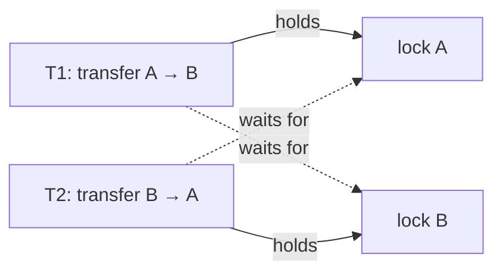
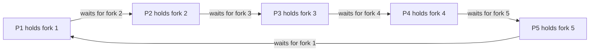

# Deadlock — Designing Out the Wait That Never Ends

Two customers send each other money at the same moment. One transfer locks account A and waits for B; the other locks B and waits for A. Neither will ever let go, and the payments service stops answering, with no exception and no error in the log.

That is a **deadlock**: threads blocked forever, each waiting for a resource another one holds. This lesson shows one, detects it from inside the program, and then designs it away. The Java mechanics, including reading a deadlock in a `jstack` thread dump, are covered in the Java guide's [Concurrency: Coordination](/synapse/programming-languages/java/advanced/concurrency-coordination).

<div style="border-left:4px solid #195045;background:rgba(25,80,69,0.08);padding:0.6rem 1rem;border-radius:0 0.5rem 0.5rem 0;margin:1.25rem 0">

💡 **The core idea.**

- A deadlock needs four conditions at once: mutual exclusion, hold and wait, no preemption, and a circular wait. Break any one and it cannot happen.
- In application code, the practical breaks are a **global lock order** (no cycle), **timeouts with back-off** (no indefinite hold and wait), and **holding one lock at a time**.
- Databases take the other route: they let deadlocks happen, detect them, and abort one transaction.

</div>

This builds on [Thread Safety & Synchronization](/synapse/low-level-design/multithreading-concurrency/thread-safety-and-synchronization) and [Locks & Semaphores](/synapse/low-level-design/multithreading-concurrency/locks-and-semaphores). Every output below was produced by running the code on Java 21 and Python 3.11.

**You'll be able to:** recognise a deadlock and confirm it from a running program; name the four conditions and which one each fix breaks; prevent deadlock with a global lock order; use `tryLock` with random back-off, and explain livelock; reduce deadlock risk by design, holding fewer locks for less time; explain how a database resolves deadlocks, including wait-die and wound-wait.

<div style="border-left:4px solid #15448e;background:rgba(21,68,142,0.08);padding:0.6rem 1rem;border-radius:0 0.5rem 0.5rem 0;margin:1.25rem 0">

📘 **How to read the Intuition boxes.** Each one is built in three moves:

1. **The mechanism** — what the threads and their locks *do*.
2. **A concrete bite** — a specific, runnable program where the mechanism produces a surprise.
3. **The earned rule** — the decision heuristic, now justified rather than asserted, plus its cost.

</div>

---

## Table of contents

1. [A deadlock, caught in the act](#1-a-deadlock-caught-in-the-act)
2. [The four conditions, and the dining philosophers](#2-the-four-conditions-and-the-dining-philosophers)
3. [Fix 1: a global lock order](#3-fix-1-a-global-lock-order)
4. [Fix 2: time out and back off](#4-fix-2-time-out-and-back-off)
5. [Fix 3: hold fewer locks, for less time](#5-fix-3-hold-fewer-locks-for-less-time)
6. [How databases handle deadlock](#6-how-databases-handle-deadlock)
7. [Mental-model summary](#7-mental-model-summary)
8. [Gotcha checklist](#8-gotcha-checklist)
9. [Check yourself](#-check-yourself)
10. [Sources](#-sources)

---

## 1. A deadlock, caught in the act

Each transfer locks the account it takes money from, then the account it pays into. T1 sends A to B while T2 sends B to A:

```java run
import java.lang.management.*;

// ⚠️ ANTI-PATTERN — each transfer locks its accounts in argument order. Do not copy it.
class Account {
    final String name;
    int balance;

    Account(String name, int balance) {
        this.name = name;
        this.balance = balance;
    }
}

public class Main {
    static void transfer(Account from, Account to, int amount) {
        synchronized (from) {
            System.out.println(Thread.currentThread().getName() + " locked " + from.name);
            sleep(100);  // widen the window, as a slow fraud check would
            synchronized (to) {
                from.balance -= amount;
                to.balance += amount;
            }
        }
    }

    static void sleep(long ms) {
        try {
            Thread.sleep(ms);
        } catch (InterruptedException e) {
            Thread.currentThread().interrupt();
        }
    }

    public static void main(String[] args) throws InterruptedException {
        Account a = new Account("A", 1000), b = new Account("B", 1000);
        Thread t1 = new Thread(() -> transfer(a, b, 100), "T1");  // A -> B
        Thread t2 = new Thread(() -> transfer(b, a, 200), "T2");  // B -> A
        t1.setDaemon(true);  // so the demo can exit; real deadlocked threads never finish
        t2.setDaemon(true);
        t1.start();
        t2.start();
        Thread.sleep(500);

        ThreadMXBean jvm = ManagementFactory.getThreadMXBean();
        long[] stuck = jvm.findDeadlockedThreads();
        System.out.println("deadlocked threads: " + (stuck == null ? 0 : stuck.length));
        if (stuck != null) {
            for (ThreadInfo info : jvm.getThreadInfo(stuck)) {
                System.out.println("  " + info.getThreadName() + " is " + info.getThreadState()
                        + ", waiting for a lock held by " + info.getLockOwnerName());
            }
        }
    }
}
```

```python run
# ⚠️ ANTI-PATTERN — each transfer locks its accounts in argument order. Do not copy it.
import threading
import time


class Account:
    def __init__(self, name: str, balance: int) -> None:
        self.name = name
        self.balance = balance
        self.lock = threading.Lock()


def transfer(src: Account, dst: Account, amount: int) -> None:
    with src.lock:
        print(f"{threading.current_thread().name} locked {src.name}\n", end="")
        time.sleep(0.1)  # widen the window, as a slow fraud check would
        with dst.lock:
            src.balance -= amount
            dst.balance += amount


a, b = Account("A", 1000), Account("B", 1000)
# daemon, so the demo can exit; real deadlocked threads never finish
t1 = threading.Thread(target=transfer, args=(a, b, 100), name="T1", daemon=True)
t2 = threading.Thread(target=transfer, args=(b, a, 200), name="T2", daemon=True)
t1.start()
t2.start()
t1.join(timeout=1)
t2.join(timeout=1)
print("still waiting after 1 s:", [t.name for t in (t1, t2) if t.is_alive()])
```

**Output (Java)** *(illustrative — the first two lines can appear in either order):*
```
T2 locked B
T1 locked A
deadlocked threads: 2
  T1 is BLOCKED, waiting for a lock held by T2
  T2 is BLOCKED, waiting for a lock held by T1
```

**Output (Python):**
```
T1 locked A
T2 locked B
still waiting after 1 s: ['T1', 'T2']
```

**Analysis.** T1 locked A and T2 locked B, each within the 100 ms window. Then each asked for the other's account and blocked. Java's `ThreadMXBean.findDeadlockedThreads()` found the cycle: T1 waits for T2, and T2 waits for T1 <abbr title="Java SE 21 API, java.lang.management.ThreadMXBean">[1]</abbr>. In Python, the joins timed out with both threads still alive. The threads are marked daemon only so the demo can exit. In a real service they would wait forever.



**Intuition.**
*Mechanism.* A thread blocked on a lock keeps every lock it already holds. If the "holds" and "waits for" arrows form a cycle, no thread in the cycle can ever move, and the JVM will not break the cycle for you.

*Concrete bite.* How often it happens depends on how much work sits between the two locks. Here, even with the 100 ms pause removed, all 10 runs deadlocked, because printing inside the first lock still leaves a window. With almost no work between the locks, the window shrinks: in the Java guide's two-lock version, [2 of 30 runs hung](/synapse/programming-languages/java/advanced/concurrency-coordination). A bug that shows up once in fifteen runs passes most test suites, then freezes production.

<div style="border-left:4px solid #195045;background:rgba(25,80,69,0.08);padding:0.6rem 1rem;border-radius:0 0.5rem 0.5rem 0;margin:1.25rem 0">

💡 **Earned rule.** Any code path that holds one lock while taking another can deadlock; find those paths in review. In a long-running service, expose `findDeadlockedThreads()` in a health check, so a deadlock pages someone instead of silently stopping work.

The cost of detection is that it only tells you after the fact; the threads stay stuck until the process restarts. Prevention (§3–§5) is the real fix. For reading a deadlock in a `jstack` thread dump, see the Java guide's [Concurrency: Coordination, §2](/synapse/programming-languages/java/advanced/concurrency-coordination).

</div>

---

## 2. The four conditions, and the dining philosophers

A deadlock can happen only when all four **Coffman conditions** hold at once <abbr title="Coffman, Elphick and Shoshani, System Deadlocks, ACM Computing Surveys 3(2), 1971">[2]</abbr>:

| Condition | Meaning | In the transfer | Broken by |
|---|---|---|---|
| **Mutual exclusion** | a resource has one holder at a time | each account lock | sharing (read locks, immutable data) |
| **Hold and wait** | a thread keeps what it has while waiting for more | T1 keeps A while waiting for B | timeouts that release (§4), one lock at a time (§5) |
| **No preemption** | nobody can take a resource from its holder | locks are released only voluntarily | aborting a holder (databases, §6) |
| **Circular wait** | a cycle of threads, each waiting for the next | T1 → B → T2 → A → T1 | a global lock order (§3) |

The classic picture is Dijkstra's **dining philosophers** <abbr title="Edsger W. Dijkstra, Hierarchical ordering of sequential processes, EWD310, 1971">[3]</abbr>. Five philosophers sit at a round table with one fork between each pair. To eat, a philosopher needs both neighbouring forks. If all five pick up their left fork at the same moment, each waits for a right fork that the neighbour holds, and nobody ever eats.



All four conditions hold: a fork has one holder, each philosopher holds one fork while waiting, nobody snatches a fork, and the waiting forms a ring. §3 breaks the ring.

---

## 3. Fix 1: a global lock order

If every thread takes locks in the same global order, a cycle cannot form: nobody holding a "higher" lock ever waits for a "lower" one. For accounts, order by account id, whichever way the money moves:

```java run
class Account {
    final int id;
    int balance;

    Account(int id, int balance) {
        this.id = id;
        this.balance = balance;
    }
}

public class Main {
    static void transfer(Account from, Account to, int amount) {
        // Always lock the lower id first, whichever direction the money moves.
        Account first = from.id < to.id ? from : to;
        Account second = from.id < to.id ? to : from;
        synchronized (first) {
            sleep(100);
            synchronized (second) {
                from.balance -= amount;
                to.balance += amount;
            }
        }
    }

    static void sleep(long ms) {
        try {
            Thread.sleep(ms);
        } catch (InterruptedException e) {
            Thread.currentThread().interrupt();
        }
    }

    public static void main(String[] args) throws InterruptedException {
        Account a = new Account(1, 1000), b = new Account(2, 1000);
        Thread t1 = new Thread(() -> transfer(a, b, 100));
        Thread t2 = new Thread(() -> transfer(b, a, 200));
        t1.start();
        t2.start();
        t1.join();
        t2.join();
        System.out.println("A = " + a.balance + ", B = " + b.balance + ", total = " + (a.balance + b.balance));
    }
}
```

```python run
import threading
import time


class Account:
    def __init__(self, account_id: int, balance: int) -> None:
        self.id = account_id
        self.balance = balance
        self.lock = threading.Lock()


def transfer(src: Account, dst: Account, amount: int) -> None:
    # Always lock the lower id first, whichever direction the money moves.
    first, second = sorted((src, dst), key=lambda acc: acc.id)
    with first.lock:
        time.sleep(0.1)
        with second.lock:
            src.balance -= amount
            dst.balance += amount


a, b = Account(1, 1000), Account(2, 1000)
t1 = threading.Thread(target=transfer, args=(a, b, 100))
t2 = threading.Thread(target=transfer, args=(b, a, 200))
t1.start()
t2.start()
t1.join()
t2.join()
print(f"A = {a.balance}, B = {b.balance}, total = {a.balance + b.balance}")
```

**Output:**
```
A = 1100, B = 900, total = 2000
```

**Analysis.** Both transfers completed, and the total is still 2,000. T2 moving money B → A still locked account 1 (A) first, so whichever thread got account 1 first finished both steps while the other waited. Waiting is fine; a cycle is not.

The same rule solves the philosophers: each picks up the *lower-numbered* of their two forks first. Philosopher 5's forks are 5 and 1, so they reach for fork 1 first, and the ring is broken:

```java run
public class Main {
    public static void main(String[] args) throws InterruptedException {
        int n = 5;
        Object[] forks = new Object[n];
        for (int i = 0; i < n; i++) forks[i] = new Object();
        int[] meals = new int[n];

        Thread[] philosophers = new Thread[n];
        for (int i = 0; i < n; i++) {
            int left = i, right = (i + 1) % n;
            // Resource ordering: pick up the lower-numbered fork first.
            Object first = forks[Math.min(left, right)];
            Object second = forks[Math.max(left, right)];
            int p = i;
            philosophers[i] = new Thread(() -> {
                for (int meal = 0; meal < 3; meal++) {
                    synchronized (first) {
                        synchronized (second) {
                            meals[p]++;  // eat
                        }
                    }
                }
            });
            philosophers[i].start();
        }
        for (Thread t : philosophers) t.join();
        System.out.println("meals eaten per philosopher: " + java.util.Arrays.toString(meals));
    }
}
```

```python run
import threading

n = 5
forks = [threading.Lock() for _ in range(n)]
meals = [0] * n


def dine(p: int) -> None:
    left, right = p, (p + 1) % n
    # Resource ordering: pick up the lower-numbered fork first.
    first, second = forks[min(left, right)], forks[max(left, right)]
    for _ in range(3):
        with first:
            with second:
                meals[p] += 1  # eat


philosophers = [threading.Thread(target=dine, args=(p,)) for p in range(n)]
for t in philosophers:
    t.start()
for t in philosophers:
    t.join()
print("meals eaten per philosopher:", meals)
```

**Output:**
```
meals eaten per philosopher: [3, 3, 3, 3, 3]
```

**Intuition.**
*Mechanism.* A global order turns "who waits for whom" into a line instead of a ring. Any key that every thread computes the same way works: a database id, an account number, a fixed rank per lock type.

*Concrete bite.* The order is a convention, and one method that breaks it reopens the risk. Two accounts with the *same* key (or locks compared by `hashCode`, which can collide) need a tie-breaker, such as a third global lock taken only for ties.

<div style="border-left:4px solid #195045;background:rgba(25,80,69,0.08);padding:0.6rem 1rem;border-radius:0 0.5rem 0.5rem 0;margin:1.25rem 0">

💡 **Earned rule.** When an operation must hold several locks, sort them by a stable, unique key and acquire them in that order, everywhere. Put the ordering in one helper method so no caller can get it wrong.

The cost is a rule that no compiler checks. Centralise it, document it on the class, and test it.

</div>

---

## 4. Fix 2: time out and back off

A thread that gives up and releases what it holds breaks **hold and wait**. With `tryLock(timeout)`, a transfer that cannot get its second lock releases the first, waits a random moment, and retries:

```java run
import java.util.concurrent.ThreadLocalRandom;
import java.util.concurrent.TimeUnit;
import java.util.concurrent.locks.ReentrantLock;

class Account {
    final String name;
    final ReentrantLock lock = new ReentrantLock();
    int balance;

    Account(String name, int balance) {
        this.name = name;
        this.balance = balance;
    }
}

public class Main {
    static int transfer(Account from, Account to, int amount) throws InterruptedException {
        for (int attempt = 1; ; attempt++) {
            if (from.lock.tryLock(50, TimeUnit.MILLISECONDS)) {
                try {
                    Thread.sleep(100);
                    if (to.lock.tryLock(50, TimeUnit.MILLISECONDS)) {
                        try {
                            from.balance -= amount;
                            to.balance += amount;
                            return attempt;
                        } finally {
                            to.lock.unlock();
                        }
                    }
                } finally {
                    from.lock.unlock();  // couldn't get both: let go of the first
                }
            }
            Thread.sleep(ThreadLocalRandom.current().nextInt(10, 100));  // random back-off
        }
    }

    public static void main(String[] args) throws InterruptedException {
        Account a = new Account("A", 1000), b = new Account("B", 1000);
        int[] attempts = new int[2];
        Thread t1 = new Thread(() -> {
            try { attempts[0] = transfer(a, b, 100); } catch (InterruptedException e) { }
        });
        Thread t2 = new Thread(() -> {
            try { attempts[1] = transfer(b, a, 200); } catch (InterruptedException e) { }
        });
        t1.start();
        t2.start();
        t1.join();
        t2.join();
        System.out.println("A = " + a.balance + ", B = " + b.balance
                + "; attempts: T1 = " + attempts[0] + ", T2 = " + attempts[1]);
    }
}
```

```python run
import random
import threading
import time


class Account:
    def __init__(self, name: str, balance: int) -> None:
        self.name = name
        self.balance = balance
        self.lock = threading.Lock()


def transfer(src: Account, dst: Account, amount: int, attempts: dict, key: str) -> None:
    attempt = 0
    while True:
        attempt += 1
        if src.lock.acquire(timeout=0.05):
            try:
                time.sleep(0.1)
                if dst.lock.acquire(timeout=0.05):
                    try:
                        src.balance -= amount
                        dst.balance += amount
                        attempts[key] = attempt
                        return
                    finally:
                        dst.lock.release()
            finally:
                src.lock.release()  # couldn't get both: let go of the first
        time.sleep(random.uniform(0.01, 0.1))  # random back-off


a, b = Account("A", 1000), Account("B", 1000)
attempts: dict[str, int] = {}
t1 = threading.Thread(target=transfer, args=(a, b, 100, attempts, "T1"))
t2 = threading.Thread(target=transfer, args=(b, a, 200, attempts, "T2"))
t1.start()
t2.start()
t1.join()
t2.join()
print(f"A = {a.balance}, B = {b.balance}; attempts: T1 = {attempts['T1']}, T2 = {attempts['T2']}")
```

**Output (Java)** *(illustrative — the attempt counts vary per run; the balances do not):*
```
A = 1100, B = 900; attempts: T1 = 2, T2 = 3
```

**Output (Python)** *(illustrative):*
```
A = 1100, B = 900; attempts: T1 = 2, T2 = 1
```

**Analysis.** Both transfers completed, after a few attempts. On a failed attempt, a thread held account A, could not get B within 50 ms, and let A go, which gave the other thread its chance.

**Intuition.**
*Mechanism.* Releasing on timeout means no thread waits forever while holding something. The random back-off matters as much as the timeout.

*Concrete bite: livelock.* Remove the randomness, and both threads can fail, back off for the same time, retry together and fail again, round after round. Neither is blocked, both are busy, and no transfer completes. That is a **livelock**. It needs the timing to line up: in 8 runs of this program with a fixed 50 ms back-off, both transfers still finished within 5 attempts. That is exactly why it slips through tests and appears at scale. Random back-off (often growing with each attempt, as exponential back-off) breaks the lockstep.

<div style="border-left:4px solid #195045;background:rgba(25,80,69,0.08);padding:0.6rem 1rem;border-radius:0 0.5rem 0.5rem 0;margin:1.25rem 0">

💡 **Earned rule.** Use `tryLock` with a timeout when a lock order is impractical, for example when the locks to take are only discovered along the way. Always release on failure, back off for a random time, and cap the number of retries.

The cost is wasted work on each failed attempt and a retry path to test. Prefer a lock order (§3) when you can define one.

</div>

---

## 5. Fix 3: hold fewer locks, for less time

The surest way to avoid a lock cycle is not to hold two locks at once. Design choices that get you there:

- **One lock for the whole operation.** If transfers between accounts are rare relative to other work, a single `ledgerLock` for transfers is simpler than per-account locks, and it cannot deadlock with itself.
- **Do the slow work outside the lock.** Validate, call the fraud service and format messages *before* taking any lock; hold locks only for the few lines that change shared state.
- **Make open calls.** Never call code you don't control while holding a lock: a listener callback, a method on another object that may take *its* own lock. Copy what you need under the lock, release it, then make the call <abbr title="Brian Goetz et al., Java Concurrency in Practice, 2006, §10.1.4">[4]</abbr>.
- **Avoid shared state.** Confinement and immutable data ([Thread Safety, §7](/synapse/low-level-design/multithreading-concurrency/thread-safety-and-synchronization)) need no locks at all.

| Design | Deadlock risk | Cost |
|---|---|---|
| Per-account locks, any order | high | — |
| Per-account locks, global order | none from these locks | an ordering rule everyone must follow |
| One coarse lock | none from this lock | less concurrency |
| `tryLock` with back-off | none, but livelock if not randomised | retries, wasted work |
| Single-writer thread (all transfers queued to one thread) | none | throughput limited to one thread |

<div style="border-left:4px solid #195045;background:rgba(25,80,69,0.08);padding:0.6rem 1rem;border-radius:0 0.5rem 0.5rem 0;margin:1.25rem 0">

💡 **Earned rule.** Start with the coarsest locking that meets your throughput needs, and split locks only when a measurement shows contention. Every additional lock is a new edge that can close a cycle.

The cost of coarse locks is less parallelism. The cost of fine-grained locks is a deadlock analysis for every pair.

</div>

---

## 6. How databases handle deadlock

Databases lock rows and tables for transactions they do not control, so they cannot impose a lock order. Most let deadlocks happen and then **detect** them: PostgreSQL, for example, checks for a cycle when a lock wait lasts longer than `deadlock_timeout`, aborts one of the transactions involved, and lets the others continue <abbr title="PostgreSQL documentation, Explicit Locking, Deadlocks">[5]</abbr>. The application sees an error and must retry the transaction. This breaks **no preemption**: the victim's locks are taken away.

Two classic *prevention* schemes use transaction timestamps (older = higher priority) to decide, at the moment of a conflict, who waits and who aborts <abbr title="Rosenkrantz, Stearns and Lewis, System Level Concurrency Control for Distributed Database Systems, ACM TODS 3(2), 1978">[6]</abbr>:

| Scheme | Older transaction requests a lock a younger one holds | Younger requests a lock an older one holds |
|---|---|---|
| **Wait-die** (non-preemptive) | the older one **waits** | the younger one **dies**: aborts, restarts later with its original timestamp |
| **Wound-wait** (preemptive) | the older one **wounds** the younger: forces it to abort | the younger one **waits** |

In both, waits only ever go in one direction of age, so no cycle can form. Keeping the original timestamp on restart means an aborted transaction grows older and eventually wins, so nobody starves.

<div style="border-left:4px solid #195045;background:rgba(25,80,69,0.08);padding:0.6rem 1rem;border-radius:0 0.5rem 0.5rem 0;margin:1.25rem 0">

💡 **Earned rule.** Treat a database deadlock error as a normal, retryable outcome: retry the whole transaction a bounded number of times. Reduce how often it happens by touching rows in a consistent order (by primary key) and keeping transactions short.

The cost is retry logic in the application. The benefit is that the database, not your thread pool, absorbs the deadlock.

</div>

---

## 7. Mental-model summary

| Principle | Consequence |
|---|---|
| A blocked thread keeps every lock it holds | A cycle of waits never resolves by itself |
| Deadlock needs mutual exclusion, hold and wait, no preemption, circular wait | Break any one and deadlock is impossible |
| A global lock order removes circular wait | Sort locks by a stable unique key, in one helper |
| `tryLock` with release on failure removes hold and wait | Needs random back-off, or it can livelock |
| Fewer, shorter locks leave fewer edges | Coarse locks and open calls cannot form cycles |
| `findDeadlockedThreads()` and `jstack` detect a deadlock after it happens | Good for health checks; not a fix |
| Databases detect deadlocks and abort a victim | Retry the transaction; touch rows in key order |
| Wait-die and wound-wait order waits by transaction age | No cycles; restarting with the old timestamp prevents starvation |

## 8. Gotcha checklist

<div style="border-left:4px solid #da5233;background:rgba(218,82,51,0.08);padding:0.6rem 1rem;border-radius:0 0.5rem 0.5rem 0;margin:1.25rem 0">

| Symptom | Likely cause | Fix |
|---|---|---|
| A service stops responding; no errors; CPU near idle | threads deadlocked on locks | thread dump or `findDeadlockedThreads()`; then fix the lock order |
| Hangs only under load, never in tests | lock acquisition order differs between code paths | one global order, in one helper method |
| Threads busy, CPU high, nothing completes | livelock: retries in lockstep | random (exponential) back-off, bounded retries |
| A deadlock involving a lock you never took directly | a callback or foreign method took its own lock while you held yours | open calls: release before calling out |
| Hang in a thread pool with no lock cycle in the dump | tasks waiting on tasks in the same pool ([Thread Pools, §7](/synapse/low-level-design/multithreading-concurrency/thread-pools-and-executors)) | separate pools, or don't block |
| Database error "deadlock detected" | two transactions locked rows in opposite orders | retry the transaction; update rows in primary-key order |

</div>

---

## ✅ Check yourself

One check per objective. Answer before you open anything.

```quiz
{"prompt": "Thread T1 holds lock A and waits for B; T2 holds B and waits for A. What will the JVM do?", "options": ["Nothing: both wait forever unless something outside intervenes", "Throw a DeadlockException in one thread", "Release the older lock after a timeout"], "answer": "Nothing: both wait forever unless something outside intervenes"}
```

```quiz
{"prompt": "Every transfer locks the account with the smaller id first. Which Coffman condition does that break?", "options": ["Circular wait", "Mutual exclusion", "No preemption"], "answer": "Circular wait"}
```

```quiz
{"prompt": "Five philosophers each pick up the lower-numbered of their two forks first. Can all five end up holding one fork and waiting?", "options": ["No: philosopher 5 reaches for fork 1, so the ring cannot close", "Yes, if they all start at the same moment", "Only if a fork is shared by three philosophers"], "answer": "No: philosopher 5 reaches for fork 1, so the ring cannot close"}
```

```quiz
{"prompt": "Two threads use tryLock with a fixed 50 ms back-off and keep failing together, forever. What is this called?", "options": ["Livelock", "Deadlock", "Starvation by priority"], "answer": "Livelock"}
```

```quiz
{"prompt": "Which design cannot deadlock on its own locks?", "options": ["One coarse lock taken for every transfer", "Per-account locks taken in argument order", "Per-account locks plus a callback to a listener while holding them"], "answer": "One coarse lock taken for every transfer"}
```

```quiz
{"prompt": "Under wait-die, a younger transaction requests a lock an older one holds. What happens?", "options": ["The younger one aborts and restarts later with its original timestamp", "The younger one waits", "The older one is aborted"], "answer": "The younger one aborts and restarts later with its original timestamp"}
```

<details>
<summary>A <code>transferAll(List&lt;Account&gt;)</code> moves money among any number of accounts in one atomic step. How do you lock them without deadlock?</summary>

Sort the accounts by their unique id, then lock them in that order, and release them in reverse. Every thread that locks any subset follows the same order, so no two threads can each hold an account the other is waiting for.

If the set is large or the operation is rare, one coarse `ledgerLock` around the whole call is simpler and just as safe; measure before choosing per-account locks.

</details>

---

## 📚 Sources

1. `java.lang.management.ThreadMXBean`, Java SE 21 API (`findDeadlockedThreads()`) — <https://docs.oracle.com/en/java/javase/21/docs/api/java.management/java/lang/management/ThreadMXBean.html>
2. E. G. Coffman, M. J. Elphick and A. Shoshani, "System Deadlocks", *ACM Computing Surveys* 3(2), 1971.
3. Edsger W. Dijkstra, "Hierarchical ordering of sequential processes", EWD310, 1971 — <https://www.cs.utexas.edu/~EWD/transcriptions/EWD03xx/EWD310.html>
4. Brian Goetz et al., *Java Concurrency in Practice* (Addison-Wesley, 2006), ch. 10 "Avoiding Liveness Hazards" (§10.1.4 "Open calls").
5. PostgreSQL documentation, "Explicit Locking", §13.3.4 "Deadlocks" — <https://www.postgresql.org/docs/current/explicit-locking.html#LOCKING-DEADLOCKS>
6. D. J. Rosenkrantz, R. E. Stearns and P. M. Lewis, "System Level Concurrency Control for Distributed Database Systems", *ACM Transactions on Database Systems* 3(2), 1978.

---

<div style="border-left:4px solid #6d28d9;background:rgba(109,40,217,0.08);padding:0.6rem 1rem;border-radius:0 0.5rem 0.5rem 0;margin:1.25rem 0">

🧪 **Predict, then check.**

1. In §1, remove the `Thread.sleep(100)` / `time.sleep(0.1)` inside `transfer`. Predict whether the program still deadlocks every run, then run it several times.
2. In §3, make both transfers go A → B. Predict the final balances.
3. In §4, replace the random back-off with a fixed 50 ms. Predict what can happen, and whether you will see it every run.

</div>

## Your Turn

Before you move on, check your understanding with the coach — explain the idea, apply it, weigh the trade-offs, then defend your reasoning.

<div class="concept-coach"></div>
